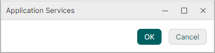
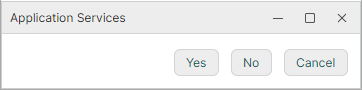

# IDialogService

`IDialogService` provides a platform-agnostic way to show modal dialogs. From your ViewModels, you can open and handle modal dialogs using dedicated _dialog ViewModels_. This keeps your ViewModels completely decoupled from Avalonia window types.


<!-- TODO
image
app-services-idialogservice 
-->

Main features include:

- ViewModel-driven dialogs — A dialog is defined entirely by a ViewModel. The ViewModel supplies the dialog title, content, and buttons.
- Simple dialogs — No need to define a dialog View if you only want to display plain text with a button set. Just create a dialog ViewModel by deriving it from `OkCancelDialogAwareViewModel` and assign a string to the ViewModel's `Content` property.
- Custom dialog Views — You can create a custom dialog View to render it as the dialog's inner content. This View is located automatically through the `ViewLocatorAttribute` applied to the dialog ViewModel. 
- Customizable button sets — The base dialog ViewModel class provides standard OK/Cancel buttons, but you can override `CreateButtons` to define any set of buttons with custom captions and placement.
- Validation support — Override the `CanOk` method in your dialog ViewModel to disable the default button until the input is valid.
- Nested modals — A dialog can open another modal dialog on top of itself. The nested dialog blocks its parent, not the whole application.
- Dialog result — After the dialog is closed, it returns the result specified by the `DialogResult` enumeration.

## Interface Definition

```csharp
public interface IDialogService
{
    // Show a modal dialog driven by a ViewModel.
    DialogResult ShowDialog<T>(T viewModel, string? caption = null)
        where T : IDialogAwareViewModel;
}
```

| Parameter | Type | Description |
|-----------|------|-------------|
| `viewModel` | `T` | The dialog ViewModel. It supplies the dialog content and buttons. The ViewModel is assigned to the dialog's Data Context. You can create your ViewModel by deriving it from the `OkCancelDialogAwareViewModel` class, which already implements the `IDialogAwareViewModel` interface. `OkCancelDialogAwareViewModel` hosts the OK and Cancel buttons, which can be replaced with a custom button set. |
| `caption` | `string?` | The dialog's caption. When set to `null`, the caption is taken from the dialog ViewModel's `Title` property (`IWindowAwareViewModel.Title`). |

**Returns:** `DialogResult` — the button the dialog was closed with, or `DialogResult.None` if the user dismissed the dialog through the window caption button.


## Dialog ViewModel Hierarchy

Your dialog ViewModel must implement the `IDialogAwareViewModel` interface. Typically you derive your dialog ViewModel from the `OkCancelDialogAwareViewModel` class, which already implements this interface. The `OkCancelDialogAwareViewModel` class contains the OK and Cancel buttons, which you can replace with custom buttons. 

The following scheme shows the base class hierarchy for dialog ViewModels:

```
IWindowAwareViewModel
    └── IDialogAwareViewModel
            └── WindowAwareViewModel (abstract class)
                    └── DialogAwareViewModel (abstract class)
                            └── OkCancelDialogAwareViewModel (abstract class)
```

| Class | Purpose |
|-------|---------|
| `WindowAwareViewModel` | The base class for ViewModels shown in a window. It tracks the window the ViewModel is attached to, closes it on a request, and creates the View declared by the `ViewLocatorAttribute` attribute. |
| `DialogAwareViewModel` | The base class for ViewModels shown as modal dialogs. This class adds support for dialog buttons. You can override the `CreateButtons` method to define a custom button set. |
| `OkCancelDialogAwareViewModel` | Provides the standard OK and Cancel buttons wired to the virtual `OkCancelDialogAwareViewModel.Ok` and `OkCancelDialogAwareViewModel.Cancel` methods. You can override the `CanOk` method to disable the OK button according to your dialog validation rules. |


## How to Use IDialogService

In your ViewModel, call the `IDialogService.ShowDialog` method to display a modal dialog. The method returns the dialog result (the button the user pressed).

### Access the Service

There are two ways to access an `IDialogService` object in a ViewModel:

- Through the `Service<T>()` helper method. This is a convenient approach to obtain registered application services shipped with the Eremex Controls library.
- Through constructor injection.

#### Service<T>() Helper

Implement a helper `Service<T>()` method in your ViewModel to get a requested service using the static `ApplicationServicesContext.GetRequiredService<T>()` method.

```csharp
using Eremex.AvaloniaUI.Controls.ApplicationServices;
using CommunityToolkit.Mvvm.Input;

public partial class MyViewModel : ObservableObject
{
    // Provides access to any registered service
    protected static T Service<T>() where T : class
        => ApplicationServicesContext.GetRequiredService<T>();

    [RelayCommand]
    private void ShowDialog()
    {
        // Create the dialog view model
        var dialogViewModel = new MyDialogViewModel("Dialog Title", "Dialog content");

        // Resolve the service and show the dialog
        var result = Service<IDialogService>()
            .ShowDialog(dialogViewModel, caption: null);
    }
}
```

In the App.axaml.cs file, ensure that Eremex application services are registered using `SimpleServiceProvider` and `ApplicationServicesContext` as follows:

```csharp
public class App : Application
{
    public override void OnFrameworkInitializationCompleted()
    {
        RegisterApplicationServices();
        //...
    }

    static void RegisterApplicationServices()
    {
        // Register built-in services.
        var serviceProvider = new SimpleServiceProvider();
        ApplicationServicesContext.RegisterApplicationServices(serviceProvider.AddSingleton);
        ApplicationServicesContext.SetCurrent(serviceProvider);
    }
}
```

#### Constructor Injection

Implement a constructor in your ViewModel with `IDialogService` as a parameter. When you instantiate the ViewModel, pass the service object to this constructor.

```csharp
public partial class MyViewModel
{
    private readonly IDialogService _dialogService;

    public MyViewModel(IDialogService dialogService)
    {
        _dialogService = dialogService;
    }

    [RelayCommand]
    private void ShowDialog()
    {
        var dialogViewModel = new MyDialogViewModel("Dialog Title", "Dialog content");
        var result = _dialogService.ShowDialog(dialogViewModel, caption: null);
        //...
    }
}
```

### Create a Dialog ViewModel

A dialog ViewModel supplies the dialog content and buttons. The simplest approach is to derive from `OkCancelDialogAwareViewModel`, which provides the OK and Cancel buttons out of the box.

!!! Tip

    `OkCancelDialogAwareViewModel` allows you to replace the OK and Cancel buttons with a custom button set. Each button can close the dialog with a specific result (a `DialogResult` value).

The following example shows how to show a dialog with the OK and Cancel buttons. A ViewModel is created by deriving from the `OkCancelDialogAwareViewModel` class. The strings passed to the ViewModel's constructor are used to initialize the dialog's title and content.

<!-- TODO image
app-services-idialogservice
 -->


```csharp
using Eremex.AvaloniaUI.Controls.ApplicationServices;

public class MyDialogViewModel : OkCancelDialogAwareViewModel
{
    public MyDialogViewModel(string title, string message) : base(title)
    {
        Content = message;
    }
}
```

To show this dialog, use the following code:

```csharp
var result = Service<IDialogService>()
    .ShowDialog(new MyDialogViewModel("Dialog Title", "Dialog content"));
```

### Custom Button Sets

Override the `CreateButtons` method in your dialog ViewModel to replace the standard button set. You can use the built-in button factories (`CreateOk`, `CreateCancel`, `CreateApply`) to create the standard OK, Cancel, and Apply buttons. Use the `CreateCustom` method to create custom buttons.

The following example shows a dialog with the Yes, No, and Cancel buttons. This dialog is represented by `DialogServiceYesNoCancelViewModel` derived from the `OkCancelDialogAwareViewModel` class. The `CreateButtons` method is overridden to create the custom button set. 

The Yes button is set as the default button. The default button's command is invoked when a user presses ENTER in the dialog. The built-in Cancel button has the `IsCancel` option enabled. This option activates this button's command when the ESC key is pressed.

<!-- TODO image
app-services-idialogservice
 -->



```csharp
using CommunityToolkit.Mvvm.Input;
using Eremex.AvaloniaUI.Controls.ApplicationServices;

/// <summary>
/// IDialogService with the Yes, No, and Cancel buttons.
/// </summary>
public partial class DialogServiceYesNoCancelViewModel : OkCancelDialogAwareViewModel
{
    public DialogServiceYesNoCancelViewModel(string title, string message) : base(title)
    {
        Content = message;
    }

    [RelayCommand]
    public void Yes(object parameter) => CloseWindow(DialogResult.Yes);

    [RelayCommand]
    public void No(object parameter) => CloseWindow(DialogResult.No);

    protected override IDialogButtonViewModel[] CreateButtons()
    {
        var buttons = new IDialogButtonViewModel[]
        {
            DialogButtonViewModel.CreateCustom(YesCommand, "Yes", classes: "accent"),
            DialogButtonViewModel.CreateCustom(NoCommand, "No"),
            DialogButtonViewModel.CreateCancel(CancelCommand),
        };
        (buttons[0] as DialogButtonViewModel).IsDefault = true;
        return buttons;
    }
}
```

To show this dialog, use the following code:

```csharp
var result = Service<IDialogService>().ShowDialog(new DialogServiceYesNoCancelViewModel("Warning", "Save the changes?"));
```


### Custom Captions and Placement

You can create custom buttons by overriding the `DialogAwareViewModel.CreateButtons` method and using the static `DialogButtonViewModel.CreateCustom` method within it. The `CreateCustom` method allows you specify a button caption and placement. 

The following example shows a dialog with the Yes, No, and Cancel buttons. The Yes and No buttons are placed to the left of the Cancel button using the _dockType_ parameter.

<!-- TODO image
app-services-idialogservice
 -->

```csharp
using CommunityToolkit.Mvvm.Input;
using Eremex.AvaloniaUI.Controls.ApplicationServices;

public partial class DialogServiceNoYesCancelViewModel : OkCancelDialogAwareViewModel
{
    public DialogServiceNoYesCancelViewModel(string title, string message) : base(title)
    {
        Content = message;
    }

    [RelayCommand]
    public void Yes(object parameter) => CloseWindow(DialogResult.Yes);

    [RelayCommand]
    public void No(object parameter) => CloseWindow(DialogResult.No);

    protected override IDialogButtonViewModel[] CreateButtons() => new[]
    {
        DialogButtonViewModel.CreateCancel(CancelCommand),
        DialogButtonViewModel.CreateCustom(NoCommand, "No", dockType: DockType.Left),
        DialogButtonViewModel.CreateCustom(YesCommand, "Yes", dockType: DockType.Left),
    };
}
```

To show this dialog, use the following code:

```csharp
var result = Service<IDialogService>().ShowDialog(new DialogServiceNoYesCancelViewModel("Info", "Custom button placement"));
```


### Custom Dialog Content and Validation

By default, a dialog displays a string assigned to the dialog ViewModel's `Content` property (`WindowAwareViewModel.Content`). You can also display custom content instead of a simple string.

To provide custom content for a dialog:

1. Create a View with controls to display in the dialog.

    Add a `UserControl` containing the controls you need. When required, bind its properties to the dialog ViewModel's properties so the two stay in sync.

2. Apply `ViewLocatorAttribute` to the dialog ViewModel.

    Decorate the dialog ViewModel with `ViewLocatorAttribute`, passing the type of the view you created. The attribute associates the view with the ViewModel. The dialog service uses it to create and display the view inside the dialog's client area (above the dialog's footer buttons).

When the `ViewLocatorAttribute` attribute is present, the base `WindowAwareViewModel` creates the view automatically when the dialog is opened. This view is assigned to the `Content` property. The ViewModel never needs to reference the view type directly.

!!! Tip 

    You can also manually set the `Content` property for the dialog ViewModel, without using the `ViewLocatorAttribute`.

3. (Optional) Control the availability of the dialog's OK button

    You can override the dialog ViewModel's CanOk method to disable/enable the OK button according to your requirements.

#### Example

The following example shows a dialog with a text field and OK/Cancel buttons. The text field comes from a custom view (_DialogServiceValidationView_). The `CanOk` method is overridden to keep the OK button disabled while the text field is empty.

<!-- TODO image
app-services-idialogservice
 -->

**ViewModel**

```csharp
using DemoCenter.Views.ApplicationServices;

using Eremex.AvaloniaUI.Controls.ApplicationServices;

namespace DemoCenter.ViewModels.ApplicationServices;

/// <summary>
/// IDialogService with validation: Ok stays disabled until the field is filled in.
/// The view is picked by <see cref="ViewLocatorAttribute"/>, so the view model does not
/// need to know how it is displayed.
/// </summary>
/// <remarks>
/// The property is written by hand: dialog view models derive from the Eremex base class
/// rather than the CommunityToolkit ObservableObject, so the [ObservableProperty] generator
/// does not apply to them.
/// </remarks>
[ViewLocator(typeof(DialogServiceValidationView))]
public class DialogServiceValidationViewModel : OkCancelDialogAwareViewModel
{
    private string userName = string.Empty;

    public DialogServiceValidationViewModel(string title) : base(title)
    {
    }

    public string UserName
    {
        get => userName;
        set
        {
            if (userName == value)
                return;

            userName = value;
            OnPropertyChanged(nameof(UserName));
            OkCommand.NotifyCanExecuteChanged();
        }
    }

    public override bool CanOk(object parameter) => !string.IsNullOrWhiteSpace(UserName);
}
```

**View**

```xml
<UserControl x:Class="DemoCenter.Views.ApplicationServices.DialogServiceValidationView"
             xmlns="https://github.com/avaloniaui"
             xmlns:x="http://schemas.microsoft.com/winfx/2006/xaml"
             xmlns:mxe="https://schemas.eremexcontrols.net/avalonia/editors"
             xmlns:vm="using:DemoCenter.ViewModels.ApplicationServices"
             x:CompileBindings="True"
             x:DataType="vm:DialogServiceValidationViewModel"
             MinWidth="380">

    <StackPanel Margin="20" Spacing="10">
        <TextBlock Text="The Ok button stays disabled until the field is filled in."
                   TextWrapping="Wrap" />
        <mxe:TextEditor EditorValue="{Binding UserName, Mode=TwoWay}" />
    </StackPanel>
</UserControl>
```

**Show Dialog**

To show this dialog, use the following code:

```csharp
var result = Service<IDialogService>().ShowDialog(new DialogServiceValidationViewModel("Custom dialog content and validation"));
```


### Nested Modal Dialogs

A dialog can open another modal dialog on top of itself. 

The following example shows a dialog with the "Nested dialog" button. A click on this button displays another dialog.

<!-- TODO image
app-services-idialogservice
 -->

```csharp
using CommunityToolkit.Mvvm.Input;
using Eremex.AvaloniaUI.Controls.ApplicationServices;

// The primary dialog ViewModel, which contains a button that invokes a nested dialog.
public partial class DialogServiceNestedViewModel : OkCancelDialogAwareViewModel
{
    private readonly IDialogService dialogService;

    public DialogServiceNestedViewModel(string title, IDialogService dialogService) : base(title)
    {
        this.dialogService = dialogService;
        Content = "Press \"Nested dialog\" to open a modal dialog on top of this one. "
            + "The nested dialog blocks this window only.";
    }

    [RelayCommand]
    public void ShowNested(object parameter)
    {
        var nested = new DialogServiceOkCancelViewModel(
            "Nested dialog",
            "This modal dialog is owned by the dialog underneath.");

        dialogService.ShowDialog(nested, caption: null);
    }

    protected override IDialogButtonViewModel[] CreateButtons() => new[]
    {
        DialogButtonViewModel.CreateCustom(ShowNestedCommand, "Nested dialog", dockType: DockType.Left),
        DialogButtonViewModel.CreateOk(OkCommand),
        DialogButtonViewModel.CreateCancel(CancelCommand),
    };
}

// The simplest nested dialog ViewModel
public class DialogServiceOkCancelViewModel : OkCancelDialogAwareViewModel
{
    public DialogServiceOkCancelViewModel(string title, string message) : base(title)
    {
        Content = message;
    }
}
```

To show this dialog, use the following code:

```csharp
var result = Service<IDialogService>().ShowDialog(new DialogServiceNestedViewModel("Dialog that shows a nested dialog", Service<IDialogService>()));
```


## Accent a Button

You can accent a specific button in the dialog to make it stand out visually. For instance, you can accent the default button to visually highlight it.


!!! Tip

    The default button is the one pressed when the user presses ENTER.

To accent a button, include "accent" in the button's `classes` parameter of the `CreateCustom` method.

In the following example, the Yes button is accented. The button's `IsDefault` property is enabled to mark this button as the dialog's default button.


<!-- TODO image
app-services-idialogservice
 -->

``` cs
    protected override IDialogButtonViewModel[] CreateButtons()
    {
        var buttons = new IDialogButtonViewModel[]
        {
            DialogButtonViewModel.CreateCustom(YesCommand, "Yes", classes: "accent"),
            DialogButtonViewModel.CreateCustom(NoCommand, "No"),
            DialogButtonViewModel.CreateCancel(CancelCommand),
        };
        (buttons[0] as DialogButtonViewModel).IsDefault = true;
        return buttons;
    }
```