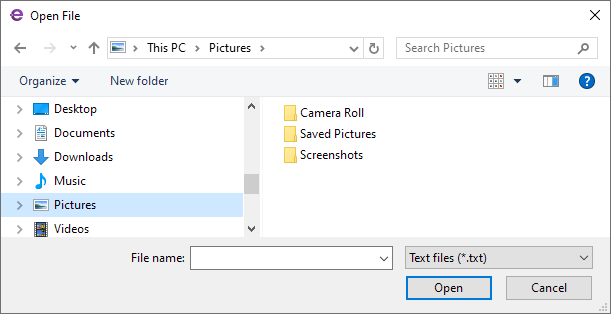
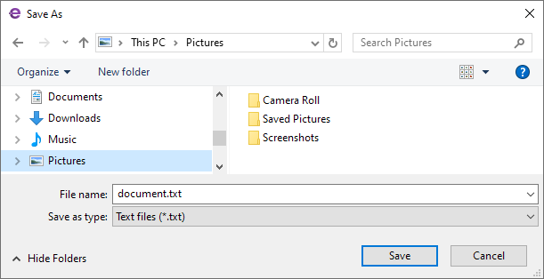

# IOpenFileDialogService and ISaveFileDialogService

[`IOpenFileDialogService`](../../API/Eremex.AvaloniaUI.Controls.ApplicationServices/IOpenFileDialogService.md) and [`ISaveFileDialogService`](../../API/Eremex.AvaloniaUI.Controls.ApplicationServices/ISaveFileDialogService.md) provide a platform-agnostic way to show the system's Open File and Save File dialogs from your ViewModels. The ViewModels remain completely decoupled from Avalonia window types.






Main features include:

- Platform Open File and Save File dialogs — The services show the file pickers provided by the operating system.
- Synchronous and asynchronous variants — Each service exposes a synchronous `Show` method and an asynchronous `ShowAsync` method. 
- Configurable file dialog options — The file dialogs allow you to customize the dialog's caption, file type filters, starting folder, suggested file name, default extension, overwrite prompt, and multiple selection mode.
- Automatic owner — The active application window resolved through the [`IWindowsManager`](../../API/Eremex.AvaloniaUI.Controls.ApplicationServices/IWindowsManager.md) service becomes the owner of the dialog.

## Interface Definitions

### IOpenFileDialogService

```csharp
public interface IOpenFileDialogService
{
    // Show an Open File dialog and block the calling thread until the user closes the dialog.
    string[] Show(IWindow? owner = null, OpenFileDialogOptions? options = null);

    // Show an Open File dialog without blocking the calling thread.
    Task<string[]> ShowAsync(IWindow? owner = null, OpenFileDialogOptions? options = null);
}
```

| Parameter | Type | Description |
|-----------|------|-------------|
| `owner` | `IWindow?` | The owner of the dialog. When this parameter is `null`, the active application window becomes the dialog's owner. |
| `options` | `OpenFileDialogOptions?` | The dialog configuration options, which include the caption, filters, start folder, multiple selection, and more. When this parameter is `null`, the default platform options apply. |

**Returns:**

- `Show` — Returns the selected file paths, or an empty array if the user cancelled the dialog or no owner window could be resolved.
- `ShowAsync` — Returns a task that completes when the dialog closes, carrying the selected file paths. Returns an empty array if the user cancelled the dialog.


### ISaveFileDialogService

```csharp
public interface ISaveFileDialogService
{
    // Show a Save File dialog and block the calling thread until the user closes the dialog.
    string? Show(IWindow? owner = null, SaveFileDialogOptions? options = null);

    // Show a Save File dialog without blocking the calling thread.
    Task<string?> ShowAsync(IWindow? owner = null, SaveFileDialogOptions? options = null);
}
```

| Parameter | Type | Description |
|-----------|------|-------------|
| `owner` | `IWindow?` | The owner of the dialog. When this parameter is `null`, the active application window becomes the dialog's owner. |
| `options` | `SaveFileDialogOptions?` | The dialog configuration options, which include the caption, filters, start folder, suggested file name. When this parameter is `null`, the default platform options apply. |

**Returns:**

- `Show` — Returns the selected path, or `null` if the user cancelled the dialog or no owner window could be resolved.
- `ShowAsync` — Returns a task that completes when the dialog closes, carrying the selected path, or `null` if the user cancelled the dialog.


### Dialog Owner

The `owner` parameter of the `Show` and `ShowAsync` methods is of type [`IWindow`](../../API/Eremex.AvaloniaUI.Controls.ApplicationServices/IWindow.md). The [`IWindow`](../../API/Eremex.AvaloniaUI.Controls.ApplicationServices/IWindow.md) interface is an abstraction of a window without tying your code to Avalonia window types. The service implementation converts it to the actual Avalonia `Window` internally. To obtain an [`IWindow`](../../API/Eremex.AvaloniaUI.Controls.ApplicationServices/IWindow.md) object that represents the currently active window in your code, you can use the [`IWindowsManager`](../../API/Eremex.AvaloniaUI.Controls.ApplicationServices/IWindowsManager.md) service.


## Options

### OpenFileDialogOptions

When you invoke the `Show` and `ShowAsync` methods of an [`IOpenFileDialogService`](../../API/Eremex.AvaloniaUI.Controls.ApplicationServices/IOpenFileDialogService.md), you can customize file dialog options using the `options` parameter. This parameter is of the [`OpenFileDialogOptions`](../../API/Eremex.AvaloniaUI.Controls.ApplicationServices/OpenFileDialogOptions.md) class.

```csharp
public class OpenFileDialogOptions
{
    public string? Title { get; set; }
    public bool? AllowMultiple { get; set; }
    public string? DefaultFolder { get; set; }
    public string? Filter { get; set; }
}
```

| Property | Description |
|----------|-------------|
| [`Title`](../../API/Eremex.AvaloniaUI.Controls.ApplicationServices/OpenFileDialogOptions/Title.md) | The dialog's caption. |
| [`AllowMultiple`](../../API/Eremex.AvaloniaUI.Controls.ApplicationServices/OpenFileDialogOptions/AllowMultiple.md) | `true` to allow a user to select multiple files at once. Defaults to `false`. |
| [`DefaultFolder`](../../API/Eremex.AvaloniaUI.Controls.ApplicationServices/OpenFileDialogOptions/DefaultFolder.md) | The full path of the folder the dialog shows initially. |
| [`Filter`](../../API/Eremex.AvaloniaUI.Controls.ApplicationServices/OpenFileDialogOptions/Filter.md) | The file type filters. When left unset, all files are shown. Example: `"Images\|*.png;*.jpg\|All files\|*.*"`. |

### SaveFileDialogOptions

```csharp
public class SaveFileDialogOptions
{
    public string? Title { get; set; }
    public string? Filter { get; set; }
    public IReadOnlyList<FileDialogFileType>? FilterFileTypes { get; set; }
    public string? DefaultFolder { get; set; }
    public FileDialogFolder? DefaultWellKnownFolder { get; set; }
    public string? DefaultExtension { get; set; }
    public string? InitialFileName { get; set; }
    public bool ShowOverwritePrompt { get; set; }
}
```

| Property | Description |
|----------|-------------|
| [`Title`](../../API/Eremex.AvaloniaUI.Controls.ApplicationServices/OpenFileDialogOptions/Title.md) | The dialog's caption. |
| [`Filter`](../../API/Eremex.AvaloniaUI.Controls.ApplicationServices/OpenFileDialogOptions/Filter.md) | The file type filters, as a string. Example: `"Images\|*.png;*.jpg\|All files\|*.*"`. This property is ignored when `FilterFileTypes` is used. |
| `FilterFileTypes` | The file type filters as a collection of [`FileDialogFileType`](../../API/Eremex.AvaloniaUI.Controls.ApplicationServices/FileDialogFileType.md) objects. Takes precedence over [`Filter`](../../API/Eremex.AvaloniaUI.Controls.ApplicationServices/OpenFileDialogOptions/Filter.md) when set. |
| [`DefaultFolder`](../../API/Eremex.AvaloniaUI.Controls.ApplicationServices/OpenFileDialogOptions/DefaultFolder.md) | The default folder, as a full path. Takes precedence over `DefaultWellKnownFolder`. |
| `DefaultWellKnownFolder` | The default folder, as a well-known folder: Desktop, Documents, Downloads, Music, Pictures, or Videos. This property is ignored when [`DefaultFolder`](../../API/Eremex.AvaloniaUI.Controls.ApplicationServices/OpenFileDialogOptions/DefaultFolder.md) is set. |
| `DefaultExtension` | The default file extension without dots or wildcards. Example: `"xml"`. |
| `InitialFileName` | The initial file name suggested in the dialog. |
| `ShowOverwritePrompt` | When this property is `true`, the dialog warns the user if the target file already exists. |


## How to Use the File Dialog Services

In your ViewModel, call `Show` or `ShowAsync` on the file dialog service. These methods' return values allow you to obtain the path or paths the user selected.

### Access the Service

There are two ways to access an [`IOpenFileDialogService`](../../API/Eremex.AvaloniaUI.Controls.ApplicationServices/IOpenFileDialogService.md) or [`ISaveFileDialogService`](../../API/Eremex.AvaloniaUI.Controls.ApplicationServices/ISaveFileDialogService.md) object in a ViewModel:

- Through the `Service<T>()` helper method. This is a convenient approach to obtain registered application services shipped with the Eremex Controls library.
- Through constructor injection.

#### Service<T>() Helper

Implement a helper `Service<T>()` method in your ViewModel to get a requested service using the static `ApplicationServicesContext.GetRequiredService<T>()` method.

```csharp
using Eremex.AvaloniaUI.Controls.ApplicationServices;
using CommunityToolkit.Mvvm.Input;

public partial class MyViewModel : ObservableObject
{
    // Provides access to any registered service
    protected static T Service<T>() where T : class
        => ApplicationServicesContext.GetRequiredService<T>();

    [RelayCommand]
    private async Task OpenFile()
    {
        var files = await Service<IOpenFileDialogService>().ShowAsync(
            options: new OpenFileDialogOptions
            {
                Title = "Open file",
                Filter = "Text files|*.txt|All files|*.*",
            });
    }
}
```

In the App.axaml.cs file, ensure that Eremex application services are registered using [`SimpleServiceProvider`](../../API/Eremex.AvaloniaUI.Controls.ApplicationServices/SimpleServiceProvider.md) and [`ApplicationServicesContext`](../../API/Eremex.AvaloniaUI.Controls.ApplicationServices/ApplicationServicesContext.md) as follows:

```csharp
public class App : Application
{
    public override void OnFrameworkInitializationCompleted()
    {
        RegisterApplicationServices();
        //...
    }

    static void RegisterApplicationServices()
    {
        // Register built-in services.
        var serviceProvider = new SimpleServiceProvider();
        ApplicationServicesContext.RegisterApplicationServices(serviceProvider.AddSingleton);
        ApplicationServicesContext.SetCurrent(serviceProvider);
    }
}
```

#### Constructor Injection

Implement a constructor in your ViewModel with the service as a parameter. When you instantiate the ViewModel, pass the service object to this constructor.

```csharp
public partial class MyViewModel
{
    private readonly IOpenFileDialogService _openFileDialogService;

    public MyViewModel(IOpenFileDialogService openFileDialogService)
    {
        _openFileDialogService = openFileDialogService;
    }

    [RelayCommand]
    private async Task OpenFile()
    {
        var files = await _openFileDialogService.ShowAsync(
            options: new OpenFileDialogOptions
            {
                Title = "Open file",
                Filter = "Text files|*.txt|All files|*.*",
            });
    }
}
```

### Example - Open a File Synchronously

```csharp
[RelayCommand]
private void OpenFileSync()
{
    var files = Service<IOpenFileDialogService>().Show(options: new OpenFileDialogOptions
    {
        Title = "Open File",
        Filter = "Images|*.png;*.jpg|All files|*.*"
    });
    
}
```

### Example - Open a File Asynchronously

```csharp
[RelayCommand]
private async Task OpenFileAsync()
{
    var files = await Service<IOpenFileDialogService>().ShowAsync(options: new OpenFileDialogOptions
    {
        Title = "Open File",
        Filter = "Text files|*.txt|All files|*.*"
    });
}
```

### Example - Open Multiple Files

Set the [`OpenFileDialogOptions.AllowMultiple`](../../API/Eremex.AvaloniaUI.Controls.ApplicationServices/OpenFileDialogOptions/AllowMultiple.md) property to `true` to allow a user to pick more than one file.

```csharp
[RelayCommand]
private void OpenMultipleFilesSync()
{
    var files = Service<IOpenFileDialogService>().Show(options: new OpenFileDialogOptions
    {
        Title = "Open File",
        AllowMultiple = true,
        Filter = "Text files|*.txt|All files|*.*"
    });
}
```

### Example - Save a File Synchronously

```csharp
[RelayCommand]
private void SaveFileSync()
{
    var path = Service<ISaveFileDialogService>().Show(options: new SaveFileDialogOptions
    {
        Title = "Save File",
        Filter = "Images|*.png;*.jpg|All files|*.*"
    });
    
}
```

### Example - Save a File Asynchronously

```csharp
[RelayCommand]
private async Task SaveFileAsync()
{
    var path = await Service<ISaveFileDialogService>().ShowAsync(options: new SaveFileDialogOptions
    {
        Title = "Save File",
        Filter = "Text files|*.txt|All files|*.*",
        DefaultExtension = "txt",
        InitialFileName = "document.txt",
        ShowOverwritePrompt = true,
    });

}
```

