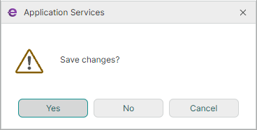

# IMessageBoxService

[`IMessageBoxService`](../../API/Eremex.AvaloniaUI.Controls.ApplicationServices/IMessageBoxService.md) provides a platform-agnostic way to show standard message boxes from your ViewModels. The ViewModels remain completely decoupled from Avalonia window types.



Main features include:

- Fixed button sets — Message boxes can display fixed button sets defined by the [`MessageBoxButtons`](../../API/Eremex.AvaloniaUI.Controls/MessageBoxButtons.md) enumeration (such as, Ok, Ok&vert;Cancel, Yes&vert;No&vert;Cancel, Yes&vert;No, Abort&vert;Retry&vert;Ignore, and Retry&vert;Cancel)
- Automatic owner resolving — The service can automatically resolve the owner window through the [`IWindowsManager`](../../API/Eremex.AvaloniaUI.Controls.ApplicationServices/IWindowsManager.md) service. You can also explicitly specify an owner for message boxes, when required.
- Get the message box result — After the message box is closed, it returns the result specified by the [`DialogResult`](../../API/Eremex.AvaloniaUI.Controls.ApplicationServices/DialogResult.md) enumeration.


## Interface Definition

```csharp
public interface IMessageBoxService
{
    // Show a message box with an explicit owner.
    DialogResult Show(IWindow? owner, string text, string caption, MessageBoxButtons buttons, MessageBoxIcon icon);
    
    // Show a message box with the default owner (the active window detected through the `IWindowsManager` service).
    DialogResult Show(string text, string caption, MessageBoxButtons buttons, MessageBoxIcon icon);
}
```


## Use IMessageBoxService

In your ViewModel, call the [`IMessageBoxService.Show`](../../API/Eremex.AvaloniaUI.Controls.ApplicationServices/IMessageBoxService/Show.md) method of the service object to display a message box. The method returns the message box result (the button the user pressed).

The [`IMessageBoxService.Show`](../../API/Eremex.AvaloniaUI.Controls.ApplicationServices/IMessageBoxService/Show.md) method without the _owner_ parameter assigns the active window as the message box's owner. The active window is obtained through the [`IWindowsManager`](../../API/Eremex.AvaloniaUI.Controls.ApplicationServices/IWindowsManager.md) service.

### Access the Service

There are two ways to access an [`IMessageBoxService`](../../API/Eremex.AvaloniaUI.Controls.ApplicationServices/IMessageBoxService.md) object in a ViewModel:

- Through the `Service<T>()` helper method. This is a convenient approach to obtain registered application services shipped with the Eremex Controls library.
- Through constructor injection.


#### Service<T>() Helper

Implement a helper `Service<T>()` method in your ViewModel to return a requested service using the static `ApplicationServicesContext.GetRequiredService<T>()` method.

``` cs
using Eremex.AvaloniaUI.Controls.ApplicationServices;
using CommunityToolkit.Mvvm.Input;

public partial class MyViewModel : ObservableObject
{

    // Provides access to any registered service
    protected static T Service<T>() where T : class
        => ApplicationServicesContext.GetRequiredService<T>();

    [RelayCommand]
    private void ShowInformation()
    {
        // Resolve the service directly from the Service<T>() method
        var result = Service<IMessageBoxService>()
            .Show("Save changes?", "Question",
                  MessageBoxButtons.Ok, MessageBoxIcon.Question);
    }
}
```

In the App.axaml.cs file, ensure that Eremex application services are registered using [`SimpleServiceProvider`](../../API/Eremex.AvaloniaUI.Controls.ApplicationServices/SimpleServiceProvider.md) and [`ApplicationServicesContext`](../../API/Eremex.AvaloniaUI.Controls.ApplicationServices/ApplicationServicesContext.md) as follows:

``` cs
public class App : Application
{
    public override void OnFrameworkInitializationCompleted()
    {
        RegisterApplicationServices();
        //...
    }

    static void RegisterApplicationServices()
    {
        // Register built-in services.
        var serviceProvider = new SimpleServiceProvider();
        ApplicationServicesContext.RegisterApplicationServices(serviceProvider.AddSingleton);
        ApplicationServicesContext.SetCurrent(serviceProvider);
    }

}
```

#### Constructor Injection

Implement a constructor in your ViewModel with [`IMessageBoxService`](../../API/Eremex.AvaloniaUI.Controls.ApplicationServices/IMessageBoxService.md) as a parameter. When you instantiate the ViewModel, pass the service object to this constructor.

``` cs
public partial class MyViewModel
{
    private readonly IMessageBoxService _messageBoxService;
    public MyViewModel(IMessageBoxService messageBoxService)
    {
        _messageBoxService = messageBoxService;
    }
    [RelayCommand]
    private void ShowMessage()
    {
        var result = _messageBoxService.Show(
            "Save changes?", "Question", MessageBoxButtons.Ok, MessageBoxIcon.Question
        );
        //...
    }
}
```


For message boxes with custom button captions, use [`IChoiceDialogService`](../../API/Eremex.AvaloniaUI.Controls.ApplicationServices/IChoiceDialogService.md) instead. For full custom dialogs, use [`IDialogService`](../../API/Eremex.AvaloniaUI.Controls.ApplicationServices/IDialogService.md).