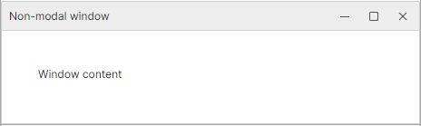

# IWindowService

[`IWindowService`](../../API/Eremex.AvaloniaUI.Controls.ApplicationServices/IWindowService.md) provides a platform-agnostic way to show non-modal windows from your ViewModels. The ViewModels remain completely decoupled from Avalonia window types.

<!-- TODO
image
app-services-iwindowservice
-->

Main features include:

- Displaying non-modal windows.
- ViewModel-driven windows — A window shown is defined by a custom ViewModel. You can specify the content of the target window using the ViewModel's `Content` property, or using the [`ViewLocatorAttribute`](../../API/Eremex.AvaloniaUI.Controls.ApplicationServices/ViewLocatorAttribute.md) applied to the window's ViewModel.
- Automatic owner — The active application window becomes the target window's owner. The active window is automatically resolved through the [`IWindowsManager`](../../API/Eremex.AvaloniaUI.Controls.ApplicationServices/IWindowsManager.md) service.


## Interface Definition

```csharp
public interface IWindowService
{
    // Show a non-modal window driven by a ViewModel.
    void Show<T>(T viewModel, string? caption = null)
        where T : IWindowAwareViewModel;
}
```

| Parameter | Type | Description |
|-----------|------|-------------|
| `viewModel` | `T` | The ViewModel of the target window to display. The `viewModel` object must implement the [`IWindowAwareViewModel`](../../API/Eremex.AvaloniaUI.Controls.ApplicationServices/IWindowAwareViewModel.md) interface. You can derive your window's ViewModel from the [`WindowAwareViewModel`](../../API/Eremex.AvaloniaUI.Controls.ApplicationServices/WindowAwareViewModel.md) class, which already implements this interface and adds the view-location infrastructure. |
| `caption` | `string?` | The window caption. When set to `null`, the caption is taken from the ViewModel's `Title` property ([`IWindowAwareViewModel.Title`](../../API/Eremex.AvaloniaUI.Controls.ApplicationServices/IWindowAwareViewModel/Title.md)). |

The [`Show`](../../API/Eremex.AvaloniaUI.Controls.ApplicationServices/WindowService/Show.md) method returns immediately after showing the window and does not wait for it to close.

**Exceptions:**

- `ArgumentNullException` — If the `viewModel` parameter is `null`.


## How to Use IWindowService

1. Create a ViewModel for the target non-modal window. For example, you can derive it from the [`WindowAwareViewModel`](../../API/Eremex.AvaloniaUI.Controls.ApplicationServices/WindowAwareViewModel.md) class.
2. Specify the target window's content using one of the following approaches:
    
    - Define a View (`UserControl`) that represents the target window's content. Set the [`ViewLocatorAttribute`](../../API/Eremex.AvaloniaUI.Controls.ApplicationServices/ViewLocatorAttribute.md) for the ViewModel to link this ViewModel to the created View.
    - Set the [`Content`](../../API/Eremex.AvaloniaUI.Controls.ApplicationServices/WindowAwareViewModel/Content.md) property of the window's ViewModel ([`WindowAwareViewModel.Content`](../../API/Eremex.AvaloniaUI.Controls.ApplicationServices/WindowAwareViewModel/Content.md)) explicitly.

3. In the ViewModel in which you need to display the target window, call the [`IWindowService.Show`](../../API/Eremex.AvaloniaUI.Controls.ApplicationServices/IWindowService/Show.md) method. Pass the target window's ViewModel to the `Show` method. The `Show` method returns immediately, and the window shown stays open until a user closes it.

### Access the Service

There are two ways to access an [`IWindowService`](../../API/Eremex.AvaloniaUI.Controls.ApplicationServices/IWindowService.md) object in your ViewModel:

- Through the `Service<T>()` helper method. This is a convenient approach to obtain registered application services shipped with the Eremex Controls library.
- Through constructor injection.

#### Service<T>() Helper

Implement a helper `Service<T>()` method in your ViewModel to get a requested service using the static `ApplicationServicesContext.GetRequiredService<T>()` method.

```csharp
using Eremex.AvaloniaUI.Controls.ApplicationServices;
using CommunityToolkit.Mvvm.Input;

public partial class MyViewModel : ObservableObject
{
    // Provides access to any registered service
    protected static T Service<T>() where T : class
        => ApplicationServicesContext.GetRequiredService<T>();

    [RelayCommand]
    private void ShowWindow()
    {
        // Resolve the service and show the window
        Service<IWindowService>().Show(
            new MyWindowViewModel("Non-modal window"));
    }
}
```

In the App.axaml.cs file, ensure that Eremex application services are registered using [`SimpleServiceProvider`](../../API/Eremex.AvaloniaUI.Controls.ApplicationServices/SimpleServiceProvider.md) and [`ApplicationServicesContext`](../../API/Eremex.AvaloniaUI.Controls.ApplicationServices/ApplicationServicesContext.md) as follows:

```csharp
public class App : Application
{
    public override void OnFrameworkInitializationCompleted()
    {
        RegisterApplicationServices();
        //...
    }

    static void RegisterApplicationServices()
    {
        // Register built-in services.
        var serviceProvider = new SimpleServiceProvider();
        ApplicationServicesContext.RegisterApplicationServices(serviceProvider.AddSingleton);
        ApplicationServicesContext.SetCurrent(serviceProvider);
    }
}
```

#### Constructor Injection

Implement a constructor in your ViewModel with [`IWindowService`](../../API/Eremex.AvaloniaUI.Controls.ApplicationServices/IWindowService.md) as a parameter. When you instantiate the ViewModel, pass the service object to this constructor.

```csharp
public partial class MyViewModel
{
    private readonly IWindowService _windowService;

    public MyViewModel(IWindowService windowService)
    {
        _windowService = windowService;
    }

    [RelayCommand]
    private void ShowWindow()
    {
        _windowService.Show(new MyWindowViewModel("Non-modal window"));
    }
}
```

### Create a Window's ViewModel

You need to create a ViewModel for the non-modal window to show. The ViewModel must implement the [`IWindowAwareViewModel`](../../API/Eremex.AvaloniaUI.Controls.ApplicationServices/IWindowAwareViewModel.md) interface. The simplest approach is to derive the ViewModel from the [`WindowAwareViewModel`](../../API/Eremex.AvaloniaUI.Controls.ApplicationServices/WindowAwareViewModel.md) class, which already implements the [`IWindowAwareViewModel`](../../API/Eremex.AvaloniaUI.Controls.ApplicationServices/IWindowAwareViewModel.md) interface and handles view location.


#### Define the Window's Content Using ViewLocatorAttribute

1. Create a View (`UserControl`) with the controls you need to display in the target window.
2. Decorate the window's ViewModel with [`ViewLocatorAttribute`](../../API/Eremex.AvaloniaUI.Controls.ApplicationServices/ViewLocatorAttribute.md), passing the type of the View.

When the [`IWindowService.Show`](../../API/Eremex.AvaloniaUI.Controls.ApplicationServices/IWindowService/Show.md) method is called, the ViewModel creates an Avalonia window, instantiates the specified View (`UserControl`), and places it as the window's content. The ViewModel never needs to reference the View type directly.


#### Example

The following example uses the [`IWindowService`](../../API/Eremex.AvaloniaUI.Controls.ApplicationServices/IWindowService.md) service to show a non-modal window whose content is specified by a custom View.
See the complete code in the [Controls Demo](../../index.md#demo-application) application.




**Non-modal window's ViewModel**

```csharp
using Eremex.AvaloniaUI.Controls.ApplicationServices;

[ViewLocator(typeof(WindowServiceWindowView))]
public class WindowServiceWindowViewModel : WindowAwareViewModel
{
    private string statusText;

    public string StatusText
    {
        get => statusText;
        private set
        {
            if (statusText == value)
                return;

            statusText = value;
            OnPropertyChanged(nameof(StatusText));
        }
    }
}
```

**Non-modal window's content (View)**

```xml
<UserControl x:Class="DemoCenter.Views.ApplicationServices.WindowServiceWindowView"
             xmlns="https://github.com/avaloniaui"
             xmlns:x="http://schemas.microsoft.com/winfx/2006/xaml"
             xmlns:vm="using:DemoCenter.ViewModels.ApplicationServices"
             x:CompileBindings="True"
             x:DataType="vm:WindowServiceWindowViewModel"
             MinWidth="420">

    <StackPanel Margin="20" Spacing="12">
        <TextBlock Text="Window content"
                   TextWrapping="Wrap" />
        
    </StackPanel>
</UserControl>
```

**Show the window**

```csharp
[RelayCommand]
private void ShowWindow()
{
    string windowTitle = "Non-modal window";
    Service<IWindowService>().Show(new WindowServiceWindowViewModel(windowTitle));
}
```

#### Define the Window's Content Directly

Use the ViewModel's `Content` property ([`WindowAwareViewModel.Content`](../../API/Eremex.AvaloniaUI.Controls.ApplicationServices/WindowAwareViewModel/Content.md)) to supply the window's content explicitly.


```csharp
using Eremex.AvaloniaUI.Controls.ApplicationServices;

public class MyWindowViewModel : WindowAwareViewModel
{
    public MyWindowViewModel(string title) : base(title)
    {
        Content = "Window content";
    }
}
```

To show this window, use the following code:

```csharp
Service<IWindowService>().Show(new MyWindowViewModel("Non-modal window"));
```

### Window's Title

You can specify the window title using one of the following approaches:

1. Set the `caption` parameter of the [`IWindowService.Show`](../../API/Eremex.AvaloniaUI.Controls.ApplicationServices/IWindowService/Show.md) method.
2. Set the `Title` property of the window's ViewModel. This property is in effect if the `caption` parameter of the [`IWindowService.Show`](../../API/Eremex.AvaloniaUI.Controls.ApplicationServices/IWindowService/Show.md) method is `null`.


### Owner Window

The owner is determined automatically through the [`IWindowsManager`](../../API/Eremex.AvaloniaUI.Controls.ApplicationServices/IWindowsManager.md) service. The active application window returned by this service becomes the target window's owner.

