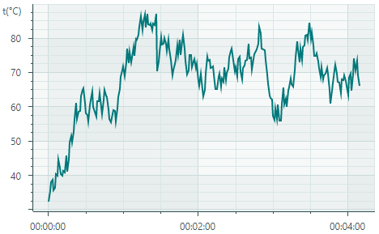
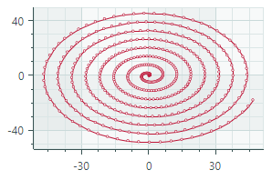
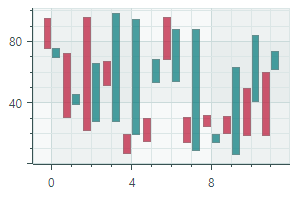
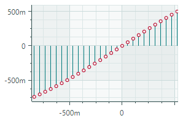
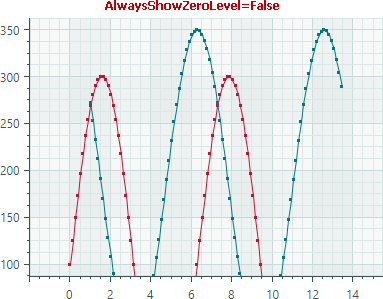
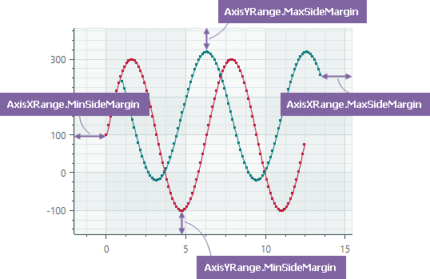
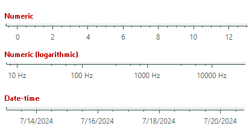
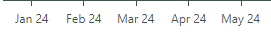
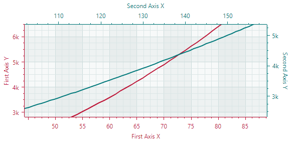

# Cartesian Chart


The `CartesianChart` control allows you to create diagrams using the Cartesian coordinate system. 


The control's main features include:
 
- An unlimited number of data series
- Supported diagram types (views): Line, Scatter Line, Point (with SVG marker support), Area, Step Line, Bar, Candlestick, and more.
- Multiple axes support
- Swapping X and Y axes
- Reversing axes
- Multiple axis types: Numeric, Date-Time, Time Span, Qualitative, and Logarithmic
- Scrolling and zooming all axes at the same time
- Scrolling and zooming individual axes
- [Crosshair](crosshair.md)
- High-performance when displaying large data
- Real-time data visualization
- Strips and constant lines
- Empty points (gaps)
- Using the MVVM design pattern to provide data and customize chart options
- Displaying rapidly changing real-time data. Use a special data adapter to implement a moving viewport


## Get Started

- [Get Started with Charts](get-started-with-charts.md)
- [Get Started with Charts - MVVM Pattern](get-started-with-charts-mvvm.md)

## Chart Control's Elements

The main elements of the chart control are series and axes. 

**Series** — Provides data and specifies how to visualize this data. You can plot as many series as you need within the same chart control. See [Series](#series) for more information.

**Axes** — A typical cartesian chart displays two axes: the X-axis and Y-axis. You can also add additional axes to the chart when it plots two or more series. Each series can be associated with its own axis. See [Axes](#axes).


## Series 

A series provides data to plot by the chart control, and specifies the series view (visual presentation of this data).

The `CartesianSeries` class encapsulates a series for the `CartesianChart` control. To add series to the chart, use the `CartesianChart.Series` collection. You can also populate the chart with series using the MVVM design pattern. Use the `CartesianChart.SeriesSource` and `CartesianChart.SeriesTemplate` properties for this purpose. See the following link for more information: [Get Started with Charts - MVVM Pattern](get-started-with-charts-mvvm.md).


The following code defines one series in the `CartesianChart.Series` collection.

``` xml
<mxc:CartesianChart>
    <mxc:CartesianChart.Series>
        <mxc:CartesianSeries DataAdapter="{Binding Series.DataAdapter}">
            <mxc:CartesianLineSeriesView Color="{Binding Series.Color}" Thickness="2" />
        </mxc:CartesianSeries>
    </mxc:CartesianChart.Series>
    <!-- ... -->
</mxc:CartesianChart>
```




### Series Data

You can supply data for a chart control's series using _Data Adapters_. 

``` xml
<mxc:CartesianSeries DataAdapter="{Binding Series.DataAdapter}">
    <!-- ... -->
</mxc:CartesianSeries>
```

A Data Adapter is an object that implements the `ISeriesDataAdapter` interface. Typically you do not need to implement this interface manually. Eremex Charts ship with multiple Data Adapters for various data types (numeric, date-time, and qualitative). Choose a Data Adapter based on your requirements. 

Below you'll find Data Adapters grouped by the type of the _X_ values:

Numeric _X_ Values:

- `SortedNumericDataAdapter`
- `FormulaDataAdapter`
- `ScatterDataAdapter`
- `NumericRangeDataAdapter`

Date and Time _X_ Values:

- `SortedDateTimeDataAdapter`
- `DateTimeRangeDataAdapter`
- `SortedTimeSpanDataAdapter`
- `TimeSpanRangeDataAdapter`
- `CandlestickDataAdapter` (for the [Candlestick Series View](cartesian-series-views/candlestick-series-view.md))
- `SummaryCandlestickDataAdapter` (for the [Candlestick Series View](cartesian-series-views/candlestick-series-view.md))

Qualitative _X_ Values:

- `QualitativeDataAdapter`
- `QualitativeRangeDataAdapter` 


#### Empty Points (Gaps)

CartesianChart supports empty points. These are data points with undefined values. The chart control leaves visible gaps in a series when it encounters empty points.


To specify an empty data point, set the data point's value to _double.NaN_, _double.PositiveInfinity_, or _double.NegativeInfinity_.

<!-- TODO

Example - simple data adapter with empty points
-->


<!-- TODO

Describe these Data Adapters in more detail
 -->

<!-- TODO
The following example implements a Data Adapter 


The following example implements a Data Adapter 
(numeric data adapter)


``` cs
public partial class CartesianStripsAndConstantLinesViewModel : ChartsPageViewModel
{
    [ObservableProperty] SeriesViewModel series = new() { Color = Color.FromArgb(255, 0, 120, 122), DataAdapter = CreateAdapter() };
    [ObservableProperty] ObservableCollection<ConstantLineViewModel> constantLines = new();
    
    static ISeriesDataAdapter CreateAdapter()
    {
        const int pointsCount = 250;
        
        var random = new Random(0);
        var arguments = new List<TimeSpan>(pointsCount);
        var values = new List<double>(pointsCount);
        double startTemperature = 30;
        for (int i = 0; i < pointsCount; i++) {
            arguments.Add(TimeSpan.FromSeconds(i));
            double temperature = startTemperature + (random.NextDouble() - 0.5) * 10;
            if (temperature > 90)
                temperature -= 20;
            if (temperature < 20)
                temperature += 10;
            values.Add(temperature);
            startTemperature = temperature;
        }
        
        return new SortedTimeSpanDataAdapter(arguments, values);
    }
}
```

 -->

### Series Visibility

Use the `Series.Visible` property to hide a series.

``` cs
chart1.Series[0].Visible = !chart1.Series[0].Visible;
```

### Series Views 
`CartesianChart` supports multiple series views (diagram types):

<style>

th {
    visibility: collapse;
}
td, th, tr {
   border: none!important;
   vertical-align: top;
}
</style>

| <div style="width:400px"></div> | <div style="width:400px"></div> | 
| --- | --- |
| [Line Series View](cartesian-series-views/line-series-vew.md) (`CartesianLineSeriesView` object)<br>Plots points connected with lines.<br> | [Scatter Line Series View](cartesian-series-views/scatter-line-series-view.md) (`CartesianScatterLineSeriesView` object)<br>Connects points in the order in which they appear in the data series.<br> |
| [Point Series View](cartesian-series-views/point-series-view.md) (`CartesianPointSeriesView` object)<br>Plots individual points.<br> | [Area Series View](cartesian-series-views/area-series-view.md) (`CartesianAreaSeriesView` object)<br>Connects points with lines and paints filled areas.<br> | 
| [Step Line Series View](cartesian-series-views/step-line-series-view.md) (`CartesianStepLineSeriesView` object)<br>Connects points with horizontal and vertical line segments.<br> | [Step Area Series View](cartesian-series-views/step-area-series-view.md) (`CartesianStepAreaSeriesView` object)<br>Connects points with horizontal and vertical line segments, and paints filled areas.<br> |
| [Range Area Series View](cartesian-series-views/range-area-series-view.md) (`CartesianRangeAreaSeriesView` object)<br>Fills the area between the two Y-values of a data series.<br> | [Stacked Area Series View](cartesian-series-views/stacked-area-series-view.md) (`CartesianStackedAreaSeriesView` object)<br>These Views render filled areas stacked on each other to show absolute relationships between data series. <br> |
| [Full-Stacked Area Series View](cartesian-series-views/full-stacked-area-series-view.md) (`CartesianFullStackedAreaSeriesView` object)<br>These Views render filled areas stacked on each other to show proportional relationships between data series.<br> | [Bar Series View](cartesian-series-views/side-by-side-bar-series-view.md) (`CartesianSideBySideBarSeriesView` object)<br>Visualizes data as a set of rectangular bars.<br> |
| [Range Bar Series View](cartesian-series-views/side-by-side-range-bar-series-view.md) (`CartesianSideBySideRangeBarSeriesView` object)<br>Draws rectangular bars between the two Y-values of a data series.<br> | [Candlestick Series View](cartesian-series-views/candlestick-series-view.md)<br>(`CartesianCandlestickSeriesView` object)<br>A financial chart that describes price movements of an asset. For each data point, the chart displays a set of four values, the Open, Close, High and Low prices. <br> |
| [Lollipop Series View](cartesian-series-views/lollipop-series-view.md) (`CartesianLollipopSeriesView` object)<br>Presents data as points (markers) connected with a horizontal or vertical axis by thin lines.<br> |  |

To specify a view for a series, define a corresponding **...SeriesView** object as the content of the `CartesianSeries` object. In code behind, use the `CartesianSeries.View` property to specify a series view. 

The following sample assigns the 'Line Series View' to a series.
``` xml
<mxc:CartesianSeries DataAdapter="{Binding Series.DataAdapter}">
    <mxc:CartesianLineSeriesView Color="{Binding Series.Color}" Thickness="2" />
</mxc:CartesianSeries>
```


## Axes

The `CartesianChart` control automatically creates cartesian axes (the X-axis and Y-axis) if you do not define them manually. If you need to customize axes in XAML, define `AxisX` and/or `AxisY` objects in the `CartesianChart.AxesX`/`CartesianChart.AxesY` collections, and then modify settings of these axes.

``` xml
<mxc:CartesianChart>
    <!-- ... -->

    <mxc:CartesianChart.AxesX>
        <mxc:AxisX ShowTitle="False">
        </mxc:AxisX>
    </mxc:CartesianChart.AxesX>

    <mxc:CartesianChart.AxesY>
        <mxc:AxisY Title="t(°C)" TitlePosition="WithLabels">
            <mxc:AxisYRange AlwaysShowZeroLevel="False" />
        </mxc:AxisY>
    </mxc:CartesianChart.AxesY>
</mxc:CartesianChart>
```

### Swap the X and Y Axes

The default orientation of the axes in the Cartesian Chart control is horizontal for the _X_ axes, and vertical for the _Y_ axes. Use the `CartesianChart.SwapAxes` property to transpose the axes. This property is supported for all series view types.

The following images demonstrate how the `SwapAxes` property changes the layout of axes for linear and bar diagrams.


### Reverse the Axis Direction

Use the `Axis.Reverse` property to invert the direction of the _X_ and _Y_ axis.

- `false` (default) — Values increase from left to right for the _X_ axis, and from bottom to top for the _Y_ axis.
- `true` — Values increase from right to left for the _X_ axis, and from top to bottom for the _Y_ axis.


``` xml
<mxc:CartesianChart.AxesY>
    <mxc:AxisY Title="Axis Y" Reverse="True"/>
</mxc:CartesianChart.AxesY>
```

### Axis Value Range

Place `AxisXRange`/`AxisYRange` objects as the content of the `AxisX`/`AxisY` objects to specify range settings of the axes. The `AxisXRange`/`AxisYRange` objects allow you to customize the total value range, visible value range, visibility of the zero level, etc.

``` xml
<mxc:CartesianChart.AxesX>
    <mxc:AxisX ShowTitle="False" >
        <mxc:AxisXRange MinSideMargin="0.15" MaxSideMargin="0.15"/>
    </mxc:AxisX>
</mxc:CartesianChart.AxesX>
<mxc:CartesianChart.AxesY>
    <mxc:AxisY Title="Amplitude (dB SPL)">
        <mxc:AxisYRange AlwaysShowZeroLevel="False" />
    </mxc:AxisY>
</mxc:CartesianChart.AxesY>
```

- `AutoCorrectWholeRange` (default is `true`) — Gets or sets whether the total axis range is calculated automatically based on the series data.

  To set a custom total axis range, disable the `AutoCorrectWholeRange` option and then use the `WholeMin` and `WholeMax` properties.

- `SynchronizeVisualRange` — Gets or sets whether the visible axis range is set to the total axis range when the latter is changed.
- `AlwaysShowZeroLevel`  (for `AxisYRange` objects only) (default is `true`) — Gets or sets whether the total axis range is automatically adjusted to include the zero level. See `WholeMax`.

- `WholeMax` — Gets or sets the maximum value of the total axis range. The `WholeMin` property specifies the minimum value.
    
    Disable the `AutoCorrectWholeRange` property to use the `WholeMin` and `WholeMax` properties. 
    
    If the `AlwaysShowZeroLevel` option is enabled (default behavior), the zero level is forcibly included in the total axis range.

    #### Example - Show and Hide the Zero Level

    Consider the following example in which the `WholeMin` and `WholeMax` properties define custom bounds for the total axis range. The range automatically includes the zero level because the `AlwaysShowZeroLevel` property is enabled.

    ``` xml
    <mxc:CartesianChart.AxesY>
        <mxc:AxisY ShowTitle="False">
            <mxc:AxisYRange WholeMin="100" WholeMax="350" AutoCorrectWholeRange="False" AlwaysShowZeroLevel="True" />
        </mxc:AxisY>
    </mxc:CartesianChart.AxesY>
    ```
    


    Disable the `AlwaysShowZeroLevel` property to limit the total axis range by the `WholeMin` and `WholeMax` properties, while ignoring the zero level.

    ``` xml
    <mxc:AxisYRange WholeMin="100" WholeMax="350" AutoCorrectWholeRange="False" AlwaysShowZeroLevel="False" />
    ```

    
    

- `WholeMin` — Gets or sets the minimum value of the total axis range. See `WholeMax` for more information.
- `VisualMax` — Gets or sets the maximum value of the currently visible axis range. The `VisualMin` property specifies the minimum value.
- `VisualMin` — Gets or sets the minimum value of the currently visible axis range.

- `MaxSideMargin` — Gets or sets  the amount of empty space between the rightmost (or topmost) data point and the edge of the chart area, expressed as a fraction of the total data range. For example, a value of 0.1 adds a margin equal to 10% of the range.
    
    For the _Y_ axis, the `MaxSideMargin` property is not in effect when the `AlwaysShowZeroLevel` property is `true` and the zero level is displayed at the topmost edge. Set the `AlwaysShowZeroLevel` property to `false` to resolve the issue.

- `MinSideMargin` — Gets or sets  the amount of empty space between the leftmost (or bottommost) data point and the edge of the chart area, expressed as a fraction of the total data range. For example, a value of 0.1 adds a margin equal to 10% of the range.

    For the _Y_ axis, the `MinSideMargin` property is not in effect when the `AlwaysShowZeroLevel` property is `true` and the zero level is displayed at the bottommost edge. Set the `AlwaysShowZeroLevel` property to `false` to resolve the issue.

  

<!-- TODO
AlwaysShowZeroLevel - when to always show
SideMargin - wrong names
SideMargin - percentage, where 0 means no margin, 0.1 means 10% of the total range?

 -->

### Axis Scale

An axis scale defines the type of scale units and various axis display options. The image below demonstrates a few scale types:



To specify the scale settings for axes, use the `AxisX.ScaleOptions` and `AxisY.ScaleOptions` properties.

#### Customize Scale Settings for an _X_ Axis

Use the `AxisX.ScaleOptions` property to change the scale settings for an _X_ axis. 
This property is of the base `ScaleOptions` type. 

To modify the scale settings, set the `AxisX.ScaleOptions` property to one of the following objects based on the type of the _X_ values of the series: 

- `NumericScaleOptions` — Numeric data scale. Use this scale type if the _X_ values provided by the series are numeric values.
    ``` xml
    <mxc:AxisX Title="Frequency">
        <mxc:AxisX.ScaleOptions>
            <mxc:NumericScaleOptions 
                LogarithmicBase="{Binding AxisX.LogarithmicBase}"
                LabelFormatter="{Binding FrequencyFormatter}" />
        </mxc:AxisX.ScaleOptions>
    </mxc:AxisX>
    ```

<!-- TODO
Describe members of the NumericScaleOptions and other classes, such as 
GridSpacing, LabelFormatter
etc
  -->

- `DateTimeScaleOptions` — DateTime data scale. Use this scale type if the _X_ values provided by the series are `DateTime` values. The `DateTimeScaleOptions.MeasureUnit` property allows you to specify the time unit (axis unit) for the axis scale: `Millisecond`, `Second`, `Minute`, `Hour`, `Day`, `Week`, `Month`, `Quarter`, or `Year`

    ``` xml
    <mxc:AxisX ShowTitle="False">
        <mxc:AxisX.ScaleOptions>
            <mxc:DateTimeScaleOptions MeasureUnit="Day" />
        </mxc:AxisX.ScaleOptions>
    </mxc:AxisX>
    ```

- `TimeSpanScaleOptions`— TimeSpan data scale. Use this scale type if the _X_ values provided by the series are `TimeSpan` values. The `TimeSpanScaleOptions.MeasureUnit` property allows you to specify the time unit for the axis scale: `Millisecond`, `Second`, `Minute`, `Hour`, or `Day`.

    ``` xml
    <mxc:AxisX>
        <mxc:AxisX.ScaleOptions>
            <mxc:TimeSpanScaleOptions MeasureUnit="Minute" />
        </mxc:AxisX.ScaleOptions>
    </mxc:AxisX>
    ```

- `QualitativeScaleOptions` — Qualitative data scale. Use this scale type if the _X_ values provided by the series are qualitative values (text strings).

    ``` xml
    <mxc:AxisX >
        <mxc:AxisX.ScaleOptions>
            <mxc:QualitativeScaleOptions GridSpacing="1" />
        </mxc:AxisX.ScaleOptions>
    </mxc:AxisX>
    ```

#### Customize Scale Settings for an _Y_ Axis

Use the `AxisY.ScaleOptions` property to modify the scale settings of the _Y_ axis. This property is of the `NumericScaleOptions` type.

``` xml
<mxc:AxisY Title="Amplitude (dB SPL)">
    <mxc:AxisY.ScaleOptions>
        <mxc:NumericScaleOptions LabelFormatter="{Binding MyCustomLabelFormatter}"/>
    </mxc:AxisY.ScaleOptions>
</mxc:AxisY>
```

#### Format Axis Labels

The `ScaleOptions.LabelFormatter` property allows you to specify an object that formats axis display values in a custom manner. You can implement a custom label formatter based on a function/expression using the `Eremex.AvaloniaUI.Charts.FuncLabelFormatter` object.

The following example implements a custom label formatter for `DateTime` values.



``` xml
<mxc:AxisX Name="salesAxis" Title="Sales">
    <mxc:AxisX.ScaleOptions>
        <mxc:DateTimeScaleOptions MeasureUnit="Month" LabelFormatter="{Binding MonthFormatter}" />
    </mxc:AxisX.ScaleOptions>
</mxc:AxisX>
```

``` cs
public partial class MainWindowViewModel : ViewModelBase
{
    // ...
    [ObservableProperty] FuncLabelFormatter monthFormatter = new(o => String.Format("{0:MMM} {0:yy}", o));
}
```

See also: [Format Values in Crosshair Series Labels](crosshair.md#format-values-in-crosshair-series-labels)

### Multiple Axes

A typical cartesian chart has one _X_ and one _Y_ axis. You can add any number of additional _X_ and _Y_ axes when required. This is helpful when you display multiple series, and want to show its own _X_ and/or _Y_ axis for each series.



Do the following to link a series with an axis:

- Set the `Axis.Key` property of the axis to a unique ID (string).
- Set the series's `AxisXKey`/`AxisYKey` property to the value of the `Axis.Key` property.

 The following example adds an _X_ axis and binds it to the _lineSeries_ series.


``` xml
<mxc:CartesianSeries Name="lineSeries" DataAdapter="{Binding LineSeries.DataAdapter}"  
  AxisXKey="lineSeriesAxis">
    <mxc:CartesianLineSeriesView Color="{Binding LineSeries.Color}" />
</mxc:CartesianSeries>

<mxc:CartesianChart.AxesX>
    <!-- ... -->
    <mxc:AxisX Position="Far" Title="Expenses"
       Key="lineSeriesAxis">
        <mxc:AxisX.ScaleOptions>
            <mxc:NumericScaleOptions />
        </mxc:AxisX.ScaleOptions>
    </mxc:AxisX>
</mxc:CartesianChart.AxesX>
```

### Scroll and Zoom

Users can zoom and scroll the entire view and individual axes with the mouse. They can also zoom into a specific rectangle or a value range.

#### Scroll and zoom all axes simultaneously 


#### Scroll and zoom individual axes


#### Zoom into a specific region and axis value range


See the following topic for more information: [Scroll and Zoom in a Chart Control](scroll-and-zoom-in-a-chart-control.md)


### Axis Settings

The following list summarizes display and behavior settings of cartesian axes:

- `ConstantLines` and `ConstantLinesSource` — Allows you to paint constant lines for specific values. See [Constant Lines and Strips](#constant-lines-and-strips).
- `EnableScrolling` —  Allows a user to scroll an axis with a mouse drag operation.
- `EnableZooming` —  Allows a user to zoom an axis.
- `InterlacingColor` - The color used to paint interlaced strip lines (when the `ShowInterlacing` option is enabled).
- `MinorCount` — Specifies the number of minor tickmarks and grid lines.
- `Position` — Specifies the position of the axis. Available options include: `Near` (the X-axis is displayed at the bottom, and the Y-axis is displayed at the chart's left edge), and `Far` (the X-axis is displayed at the top, and the Y-axis is displayed at the chart's right edge).
- `ShowAxisLine` — Specifies the visibility of the axis line.
- `ShowInterlacing` — Specifies whether to paint interlaced strip lines between major gridlines.
- `ShowLabels` — Specifies the visibility of the labels corresponding to major tickmarks.
- `ShowMajorGridlines` — Specifies the visibility of the grid lines corresponding to major tickmarks.
- `ShowMajorTickmarks` — Specifies the visibility of the major tickmarks.
- `ShowMinorGridlines` — Specifies the visibility of the grid lines corresponding to minor tickmarks.
- `ShowMinorTickmarks` — Specifies the visibility of the minor tickmarks.
- `ShowTitle` — Specifies the visibility of the axis title (the `Title` property).
- `Strips` and `StripsSource` — Allows you to fill ranges between specific values. See [Constant Lines and Strips](#constant-lines-and-strips).
- `Thickness` — The thickness of the axis line.
- `Title` — Gets or sets the title for the axis.
- `TitlePosition` — Specifies the position of the axis title.


### Constant Lines and Strips

The `CartesianChart` control includes support for constant lines and strips. They allow you to highlight specific values and value ranges along the axes.

#### Constant Lines

Constant lines are vertical or horizontal lines that are drawn perpendicular to the axes. They serve as visual markers to highlight specific values along the axes. Use the `Axis.ConstantLines` or `Axis.ConstantLinesSource` property to specify constant lines. Each constant line is encapsulated by a `ConstantLine` object.

The following code creates a horizontal constant line that indicates the value of 85 along the Y axis.


``` xml
<mxc:CartesianChart.AxesY>
    <mxc:AxisY Title="t(°C)" TitlePosition="WithLabels">
        <mxc:AxisY.ConstantLines>
            <mxc:ConstantLine Title="Overheat 85°C" AxisValue="85" Color="#BD1436"/>
        </mxc:AxisY.ConstantLines>
    </mxc:AxisY>
</mxc:CartesianChart.AxesY>
```

The `Axis.ConstantLinesSource` property allows you to initialize constant lines from a collection of objects defined in a View Model. To create `ConstantLine` objects from the underlying data objects, use the `Axis.ConstantLineTemplate` property to specify a template. See the `Strips and Constant Lines` demo for an example.


##### Constant Line Settings

- `ConstantLine.AxisValue` — The axis value associated with the constant line.
- `ConstantLine.Color` — The color to paint the constant line.
- `ConstantLine.ShowBehind` — Specifies whether to paint the constant line below (default) or above the series.
- `ConstantLine.ShowTitle` — Specifies whether to show (default) or hide the title (See the `Title` option).
- `ConstantLine.Thickness` — The thickness of the constant line.
- `ConstantLine.Title` — A title to paint next to the constant line. The `TitlePosition` option specifies the position of the title.
- `ConstantLine.TitleIndent` — The horizontal and vertical distance of the title from the line.
- `ConstantLine.TitlePosition` — The placement of the title relative to the line. Available options include: `NearAboveLine`, `NearBelowLine`, `FarAboveLine` and `FarBelowLine`.


#### Constant Strips

Constant strips allow you to highlight specific value ranges along the axes. Similar to constant lines, strips are drawn perpendicular to the axes. You can specify strips using the `Axis.Strips` and `Axis.StripsSource` properties. Each strip is encapsulated by a `Strip` object.

The following code creates a strip that highlights a range of _Y_ values between 40 and 65. The strip is filled with a semi-transparent light green color. Note that if you use an opaque color for the strip, it will obscure the chart control's grid lines.


``` xml
<mxc:CartesianChart.AxesY>
    <mxc:AxisY Title="t(°C)" TitlePosition="WithLabels">
        <mxc:AxisY.Strips>
            <mxc:Strip AxisValue1="40" AxisValue2="65" Color="#4043C927" />
        </mxc:AxisY.Strips>
    </mxc:AxisY>
</mxc:CartesianChart.AxesY>
```

The `Axis.StripsSource` property allows you to initialize strips from a collection of objects defined in a View Model. To create `Strip` objects from the underlying data objects, use the `Axis.StripTemplate` property to specify a template.

##### Strip Settings

- `ConstantLine.AxisValue1` — Specifies the first (start or end) value of the range along the axis
- `ConstantLine.AxisValue2` —  Specifies the second (end or start) value of the range along the axis.
- `ConstantLine.Color` — The color used to fill the strip.

    !!! tip
    
        Use a semi-transparent color to allow grid lines to be seen beneath the strip.


## Convert Between Diagram Coordinates and Screen Coordinates

Sometimes you may need to translate from chart coordinates to screen coordinates, and vice versa. The following methods allow you to accomplish this task:

- `CartesianChart.DiagramPointToScreenPoint` — Converts coordinates of a chart point to screen coordinates. The chart point is addressed by the _X_ and _Y_ axes, and the values along these axes.
- `CartesianChart.ScreenPointToDiagramPoint` — Converts screen coordinates to the coordinates of a point within the chart control. The object returned by the method allows you to obtain the chart coordinates, or determine if the screen coordinates are within the control's viewport.