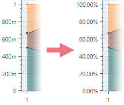
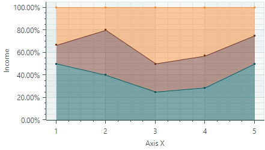

# Full-Stacked Area Series View

Full-Stacked Area Series Views (100% Stacked Area charts) are used to show proportional relationships between two or more data series. Each Full-Stacked Area Series is rendered as a filled area stacked on top of the previous Full-Stacked Area Series. The series' thickness is determined by its percentage contribution to the total. The top line always corresponds to `100%`.


If all Full-Stacked Area Series in the chart control only have negative values, the series are arranged in the direction of the negative _Y_ axis. In this case, the bottom line indicates `-100%`.


- Use Full-Stacked Area Series Views to show only positive or only negative data in the same chart control.
- If any Full-Stacked Area Series contains a mix of positive and negative values, all negative values are treated as zeroes.

The Full-Stacked Area Series View is encapsulated by the [`CartesianFullStackedAreaSeriesView`](../../../API/Eremex.AvaloniaUI.Charts/CartesianFullStackedAreaSeriesView.md) class.

## Create Full-Stacked Area Series Views

You typically use the Full-Stacked Area Series presentation to show proportional relationships between two or more data series. Steps to create a Full-Stacked Area chart include:

1. Create a [`CartesianSeries`](../../../API/Eremex.AvaloniaUI.Charts/CartesianSeries.md) object for each data series and add it to the [`CartesianChart.Series`](../../../API/Eremex.AvaloniaUI.Charts/CartesianChart/Series.md) collection.
2. Set the [`CartesianSeries.View`](../../../API/Eremex.AvaloniaUI.Charts/CartesianSeries/View.md) property to a [`CartesianFullStackedAreaSeriesView`](../../../API/Eremex.AvaloniaUI.Charts/CartesianFullStackedAreaSeriesView.md) object.
3. Use the [`CartesianSeries.DataAdapter`](../../../API/Eremex.AvaloniaUI.Charts/Series/DataAdapter.md) property to supply data for the series.
4. Format Y-axis values as a percentage by customizing the scale options of the Y axis.

    In the Full-Stacked Area Series View, the calculated Y-axis values (and so labels) are in the range between 0 and 1. To display these values as percentages (0%-100%) along the Y axis and in Crosshair labels, set the [`ScaleOptions.LabelFormatter`](../../../API/Eremex.AvaloniaUI.Charts/ScaleOptions/LabelFormatter.md) and [`ScaleOptions.CrosshairLabelFormatter`](../../../API/Eremex.AvaloniaUI.Charts/ScaleOptions/CrosshairLabelFormatter.md) properties to a [`PercentLabelFormatter`](../../../API/Eremex.AvaloniaUI.Charts/PercentLabelFormatter.md) object (or a custom [`IAxisLabelFormatter`](../../../API/Eremex.AvaloniaUI.Charts/IAxisLabelFormatter.md) object). See the example below.

    


The following code snippets show how to create the Full-Stacked Area chart consisting of three data series in XAML and code-behind.

``` xml
xmlns:mxc="https://schemas.eremexcontrols.net/avalonia/charts"

<mxc:CartesianChart x:Name="chartControl">
    <mxc:CartesianChart.Series>
        <mxc:CartesianSeries Name="areaSeries1" DataAdapter="{Binding DataAdapter1}" >
            <mxc:CartesianFullStackedAreaSeriesView Color="#ff07575b" 
                                                Transparency="0.5" MarkerSize="3" ShowMarkers="True"/>
        </mxc:CartesianSeries>
        <mxc:CartesianSeries Name="areaSeries2" DataAdapter="{Binding DataAdapter2}" >
            <mxc:CartesianFullStackedAreaSeriesView Color="#ff763626" 
                                                Transparency="0.5" MarkerSize="3" ShowMarkers="True"/>
        </mxc:CartesianSeries>
        <mxc:CartesianSeries Name="areaSeries3" DataAdapter="{Binding DataAdapter3}" >
            <mxc:CartesianFullStackedAreaSeriesView Color="#fffc913a" 
                                                Transparency="0.5" MarkerSize="3" ShowMarkers="True"/>
        </mxc:CartesianSeries>
    </mxc:CartesianChart.Series>

    <!--Format Y values as percentage-->
    <mxc:CartesianChart.AxesY>
        <mxc:AxisY ShowTitle="False">
            <mxc:AxisY.ScaleOptions>
                <mxc:NumericScaleOptions>
                    <mxc:NumericScaleOptions.LabelFormatter>
                        <mxc:PercentLabelFormatter />
                    </mxc:NumericScaleOptions.LabelFormatter>
                    <mxc:NumericScaleOptions.CrosshairLabelFormatter>
                        <mxc:PercentLabelFormatter />
                    </mxc:NumericScaleOptions.CrosshairLabelFormatter>
                </mxc:NumericScaleOptions>
            </mxc:AxisY.ScaleOptions>
        </mxc:AxisY>
    </mxc:CartesianChart.AxesY>
</mxc:CartesianChart>
```

``` cs
double[] args = new double[] { 1, 2, 3, 4, 5 };
double[] values1 = new double[] { 3, 2, 1, 2, 4 };
double[] values2 = new double[] { 1, 2, 1, 2, 2 };
double[] values3 = new double[] { 2, 1, 2, 3, 2 };

CartesianSeries series1 = new CartesianSeries();
series1.DataAdapter = new SortedNumericDataAdapter(args, values1);
series1.View = new CartesianFullStackedAreaSeriesView()
{
    Color = Color.FromUInt32(0xff07575b),
    Transparency = 0.5,
    ShowMarkers = true,
    MarkerSize = 3
};
CartesianSeries series2 = new CartesianSeries();
series2.DataAdapter = new SortedNumericDataAdapter(args, values2);
series2.View = new CartesianFullStackedAreaSeriesView()
{
    Color = Color.FromUInt32(0xff763626),
    Transparency = 0.5,
    ShowMarkers = true,
    MarkerSize = 3
};
CartesianSeries series3 = new CartesianSeries();
series3.DataAdapter = new SortedNumericDataAdapter(args, values3);
series3.View = new CartesianFullStackedAreaSeriesView()
{
    Color = Color.FromUInt32(0xfffc913a),
    Transparency = 0.5,
    ShowMarkers = true,
    MarkerSize = 3
};

AxisY axisY = new AxisY();
axisY.Title = "Income";
// Format Y values as percentage
axisY.ScaleOptions = new NumericScaleOptions() 
{ 
    LabelFormatter = new PercentLabelFormatter(), 
    CrosshairLabelFormatter =  new PercentLabelFormatter() 
};
chartControl.AxesY.Add(axisY);

chartControl.Series.Add(series1);
chartControl.Series.Add(series2);
chartControl.Series.Add(series3);
```

The result is shown below:




### Example - Create a Full-Stacked Area Chart Using the MVVM Design Pattern

The following example creates three series of the Full-Stacked Area type from a View Model. 

- The [`CartesianChart.SeriesSource`](../../../API/Eremex.AvaloniaUI.Charts/CartesianChart/SeriesSource.md) property is bound to the _SeriesCollection_ property in the View Model. This collection is a source of _SeriesViewModel_ objects used to initialize individual series in the Chart control. 

- The [`CartesianChart.SeriesTemplate`](../../../API/Eremex.AvaloniaUI.Charts/CartesianChart/SeriesTemplate.md) property is set to a template that creates a series (a [`CartesianSeries`](../../../API/Eremex.AvaloniaUI.Charts/CartesianSeries.md) object) of the Full-Stacked Area type from each _SeriesViewModel_ object. The series data, title and color are determined by the _SeriesViewModel.DataAdapter_, _SeriesViewModel.Title_, and _SeriesViewModel.Color_ properties, respectively.

- The [`ScaleOptions.LabelFormatter`](../../../API/Eremex.AvaloniaUI.Charts/ScaleOptions/LabelFormatter.md) and [`ScaleOptions.CrosshairLabelFormatter`](../../../API/Eremex.AvaloniaUI.Charts/ScaleOptions/CrosshairLabelFormatter.md) properties are set to a [`PercentLabelFormatter`](../../../API/Eremex.AvaloniaUI.Charts/PercentLabelFormatter.md) object to format Y-axis values as percentages.


``` xml
<!-- MainWindow.axaml -->
<mx:MxWindow xmlns="https://github.com/avaloniaui"
             xmlns:x="http://schemas.microsoft.com/winfx/2006/xaml"
             xmlns:vm="using:ChartStackedAreaSeriesViewExample.ViewModels"
             xmlns:d="http://schemas.microsoft.com/expression/blend/2008"
             xmlns:mc="http://schemas.openxmlformats.org/markup-compatibility/2006"
             xmlns:mx="https://schemas.eremexcontrols.net/avalonia"
             xmlns:mxc="https://schemas.eremexcontrols.net/avalonia/charts"
             mc:Ignorable="d" d:DesignWidth="800" d:DesignHeight="450"
             x:Class="ChartStackedAreaSeriesViewExample.Views.MainWindow"
             x:DataType="vm:MainWindowViewModel"
             Icon="/Assets/EMXControls.ico"
             Title="ChartStackedAreaSeriesViewExample">
    <Design.DataContext>
        <vm:MainWindowViewModel/>
    </Design.DataContext>
    <Grid ColumnDefinitions="*" Margin="10">

        <mxc:CartesianChart x:Name="chartControl" BorderThickness="0" SeriesSource="{Binding SeriesCollection}" >
            <mxc:CartesianChart.SeriesTemplate>
                <DataTemplate x:DataType="vm:SeriesViewModel">
                    <mxc:CartesianSeries DataAdapter="{Binding DataAdapter}" SeriesName="{Binding Title}">
                        <mxc:CartesianFullStackedAreaSeriesView
                        Color="{Binding Color}"
                        Transparency="0.5"
                        ShowMarkers="True"
                        MarkerSize="3"
                        Thickness="1" />
                    </mxc:CartesianSeries>
                </DataTemplate>
            </mxc:CartesianChart.SeriesTemplate>
            <mxc:CartesianChart.AxesX>
                <mxc:AxisX Name="xAxis" Title="Months" ShowMinorTickmarks="False" >
                    <mxc:AxisX.ScaleOptions>
                        <mxc:NumericScaleOptions GridSpacing="1" LabelFormatter="{Binding ArgsLabelFormatter}" />
                    </mxc:AxisX.ScaleOptions>
                </mxc:AxisX>
            </mxc:CartesianChart.AxesX>
            <mxc:CartesianChart.AxesY>
                <mxc:AxisY Title="Shipped Orders">
                    <mxc:AxisY.ScaleOptions>
                        <mxc:NumericScaleOptions>
                            <mxc:NumericScaleOptions.LabelFormatter>
                                <mxc:PercentLabelFormatter />
                            </mxc:NumericScaleOptions.LabelFormatter>
                            <mxc:NumericScaleOptions.CrosshairLabelFormatter>
                                <mxc:PercentLabelFormatter />
                            </mxc:NumericScaleOptions.CrosshairLabelFormatter>
                        </mxc:NumericScaleOptions>
                    </mxc:AxisY.ScaleOptions>
                </mxc:AxisY>
            </mxc:CartesianChart.AxesY>
            <mxc:CartesianChart.CrosshairOptions>
                <mxc:CrosshairOptions SeriesLabelMode="OneForAllSeries"/>
            </mxc:CartesianChart.CrosshairOptions>
        </mxc:CartesianChart>
    </Grid>
</mx:MxWindow>
```

``` cs
// MainWindow.axaml.cs
using ChartStackedAreaSeriesViewExample.ViewModels;
using Eremex.AvaloniaUI.Controls.Common;

namespace ChartStackedAreaSeriesViewExample.Views;

public partial class MainWindow : MxWindow
{
    public MainWindow()
    {
        InitializeComponent();
        this.DataContext = new MainWindowViewModel();
    }
}
```

``` cs
// MainWindowViewModel.cs
using Avalonia.Media;
using CommunityToolkit.Mvvm.ComponentModel;
using Eremex.AvaloniaUI.Charts;
using System;
using System.Collections.ObjectModel;

namespace ChartStackedAreaSeriesViewExample.ViewModels;

public partial class MainWindowViewModel : ObservableObject
{
    [ObservableProperty]
    ObservableCollection<SeriesViewModel> seriesCollection = new();

    [ObservableProperty] FuncLabelFormatter argsLabelFormatter = new(o => String.Format("{0:n0}", o));
    public MainWindowViewModel()
    {
        double[] args = new double[] { 1, 2, 3, 4, 5, 6, 7, 8, 9, 10, 11, 12 };
        double[] values1 = new double[] { 10, 15, 20, 18, 10, 8, 12, 14, 15, 20, 17, 20 };
        double[] values2 = new double[] { 10, 5, 5, 10, 20, 20, 17, 15, 20, 25, 27, 30 };
        double[] values3 = new double[] { 15, 10, 15, 25, 20, 22, 15, 17, 20, 20, 15, 20 };

        SeriesCollection.Add(new SeriesViewModel { Title = "Summit Mountain Logistics", Color = Color.FromUInt32(0xFFDB643B), DataAdapter = new SortedNumericDataAdapter(args, values1) });
        SeriesCollection.Add(new SeriesViewModel { Title = "Heartland Distribution", Color = Color.FromUInt32(0xFFEBB443), DataAdapter = new SortedNumericDataAdapter(args, values2) });
        SeriesCollection.Add(new SeriesViewModel { Title = "Intercontinental Dispatch", Color = Color.FromUInt32(0xFF6DA0A4), DataAdapter = new SortedNumericDataAdapter(args, values3) });
    }
}

public partial class SeriesViewModel : ObservableObject
{
    [ObservableProperty] string title;
    [ObservableProperty] Color color;
    [ObservableProperty] ISeriesDataAdapter dataAdapter;
}
```

## Data for the Full-Stacked Area Series View

You can use the following data adapters to provide data for Full-Stacked Area Series Views:

Numeric _X_ Values:

- [`SortedNumericDataAdapter`](../../../API/Eremex.AvaloniaUI.Charts/SortedNumericDataAdapter.md)
- [`FormulaDataAdapter`](../../../API/Eremex.AvaloniaUI.Charts/FormulaDataAdapter.md)


Date and Time _X_ Values:

- [`SortedDateTimeDataAdapter`](../../../API/Eremex.AvaloniaUI.Charts/SortedDateTimeDataAdapter.md)
- [`SortedTimeSpanDataAdapter`](../../../API/Eremex.AvaloniaUI.Charts/SortedTimeSpanDataAdapter.md)

Qualitative _X_ Values:

- [`QualitativeDataAdapter`](../../../API/Eremex.AvaloniaUI.Charts/QualitativeDataAdapter.md)


## Full-Stacked Area Series View Settings


- [`Color`](../../../API/Eremex.AvaloniaUI.Charts/CartesianPointSeriesView/Color.md) — Specifies the color used to paint the series.
- [`CrosshairMode`](../../../API/Eremex.AvaloniaUI.Charts/CartesianSortedLineSeriesView/CrosshairMode.md) — Specifies whether the crosshair's chart label snaps to the nearest data point, or displays an interpolated value. See [Show an Exact or Interpolated Value in Crosshair Chart Labels](../crosshair.md#show-an-exact-or-interpolated-value-in-crosshair-series-labels).
- [`MarkerImage`](../../../API/Eremex.AvaloniaUI.Charts/CartesianPointSeriesView/MarkerImage.md) — Gets or sets an image to use as custom point markers. If no image is specified, default square-shaped markers are displayed. You can use an `SvgImage` class instance to specify an SVG image.

    The [`MarkerImage`](../../../API/Eremex.AvaloniaUI.Charts/CartesianPointSeriesView/MarkerImage.md) property is declared with the `[Content]` attribute, which allows you to define an image directly between the &lt;CartesianFullStackedAreaSeriesView&gt; tags.

    ``` xml
    <mxc:CartesianFullStackedAreaSeriesView>
        <SvgImage Source="avares://Demo/Assets/circle.svg" />
    </mxc:CartesianFullStackedAreaSeriesView>
    ```

    SVG files contain predefined colors for SVG elements. To make these colors match your data series color, you can either:
    
    - Manually edit the source SVG image file beforehand
    - Use the [`MarkerImageCss`](../../../API/Eremex.AvaloniaUI.Charts/CartesianPointSeriesView/MarkerImageCss.md) property to dynamically customize [styles](https://developer.mozilla.org/en-US/docs/Web/SVG/Reference/Element/style) for SVG elements. The styles are applied when point markers are rendered.


- [`MarkerImageCss`](../../../API/Eremex.AvaloniaUI.Charts/CartesianPointSeriesView/MarkerImageCss.md) — Specifies [CSS styles](https://developer.mozilla.org/en-US/docs/Web/SVG/Reference/Element/style) for runtime customization of an SVG image defined by the [`MarkerImage`](../../../API/Eremex.AvaloniaUI.Charts/CartesianPointSeriesView/MarkerImage.md) property. The primary use case is replacing SVG element colors with the series color ([`Color`](../../../API/Eremex.AvaloniaUI.Charts/CartesianPointSeriesView/Color.md)). Include the `{0}` placeholder to insert the value of the [`Color`](../../../API/Eremex.AvaloniaUI.Charts/CartesianPointSeriesView/Color.md) property in the CSS code. 

    For example, when the [`MarkerImage`](../../../API/Eremex.AvaloniaUI.Charts/CartesianPointSeriesView/MarkerImage.md) property contains an SVG image with a circle element, the following CSS code styles the `circle` with an Orange fill (using the series color) and Dark Red border:

    ``` xml
    <mxc:CartesianFullStackedAreaSeriesView Color="orange" MarkerImageCss="circle {{fill:{0};stroke:darkred;}}">
        <SvgImage Source="avares://Demo/Assets/circle.svg" />
    </mxc:CartesianFullStackedAreaSeriesView>
    ```
    
    See also: [Example - Create a Lollipop Series View and Use Custom SVG Markers](lollipop-series-view.md#example-create-a-lollipop-series-view-and-use-custom-svg-data-point-markers).


- [`MarkerSize`](../../../API/Eremex.AvaloniaUI.Charts/CartesianPointSeriesView/MarkerSize.md) — Specifies the size of point markers.
- [`ShowInCrosshair`](../../../API/Eremex.AvaloniaUI.Charts/CrosshairSeriesViewBase/ShowInCrosshair.md) — Specifies the visibility of the crosshair chart label for the current series. See [Customize Chart Labels of the Crosshair](../crosshair.md#hide-a-series-in-the-crosshair).
- [`ShowMarkers`](../../../API/Eremex.AvaloniaUI.Charts/CartesianLineSeriesViewBase/ShowMarkers.md) — Enables or disables point markers.
- `Thickness` — Specifies the line thickness.
- [`Transparency`](../../../API/Eremex.AvaloniaUI.Charts/CartesianAreaSeriesView/Transparency.md) — A value between `0` and `1` which specifies the transparency level of filled areas:
    - `0` means fully opaque
    - `1` means fully transparent