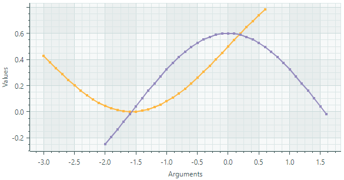

# Line Series View

The Line Series View ([`CartesianLineSeriesView`](../../../API/Eremex.AvaloniaUI.Charts/CartesianLineSeriesView.md)) connects points with lines. The series allows you to show or hide point markers, and adjust the thickness of lines and point markers. The following image demonstrates a chart control with two line series, each painted with its own color.


## Create a Line Series View

To create a Line Series View, add a [`CartesianSeries`](../../../API/Eremex.AvaloniaUI.Charts/CartesianSeries.md) object to the [`CartesianChart.Series`](../../../API/Eremex.AvaloniaUI.Charts/CartesianChart/Series.md) collection, and initialize the [`CartesianSeries.View`](../../../API/Eremex.AvaloniaUI.Charts/CartesianSeries/View.md) property with a [`CartesianLineSeriesView`](../../../API/Eremex.AvaloniaUI.Charts/CartesianLineSeriesView.md) instance.

Use the [`CartesianSeries.DataAdapter`](../../../API/Eremex.AvaloniaUI.Charts/Series/DataAdapter.md) property to supply data for the series.

The following code shows how to create an Line Series View in XAML and code-behind.

``` xml
xmlns:mxc="https://schemas.eremexcontrols.net/avalonia/charts"

<mxc:CartesianChart x:Name="chartControl">
    <mxc:CartesianChart.Series>
        <mxc:CartesianSeries Name="lineSeries1" DataAdapter="{Binding DataAdapter}" >
            <mxc:CartesianLineSeriesView Color="Red" MarkerSize="4" ShowMarkers="True" Thickness="2"/>
        </mxc:CartesianSeries>
    </mxc:CartesianChart.Series>
</mxc:CartesianChart>
```

``` cs
using Eremex.AvaloniaUI.Charts;

CartesianSeries series = new CartesianSeries();
chartControl.Series.Add(series);
double[] args = new double[] { 1, 2, 3, 4, 5, 6, 7 };
double[] values = new double[] { 0, 0.4, 1.5, 1.3, 0.4, 0, 0.1 };
series.DataAdapter = new SortedNumericDataAdapter(args, values);
series.View = new CartesianLineSeriesView()
{
    Color = Avalonia.Media.Colors.Green,
    ShowMarkers = true,
    MarkerSize = 4,
    Thickness = 2
};
```

### Example - Create Two Line Series Views


The following example creates a [`CartesianChart`](../../../API/Eremex.AvaloniaUI.Charts/CartesianChart.md) control with two Line Series Views. Data for the Series Views is provided by [`FormulaDataAdapter`](../../../API/Eremex.AvaloniaUI.Charts/FormulaDataAdapter.md) objects, which calculate values according to specified formulas. It is implied that a _MainWindowViewModel_ object is set as a data context for the window.



The example demonstrates how to customize the line thickness and point markers for the Series Views.

The _X_ and _Y_ axes are created in XAML to perform customization of their settings. Note the use of the [`NumericScaleOptions.LabelFormatter`](../../../API/Eremex.AvaloniaUI.Charts/ScaleOptions/LabelFormatter.md) property to format axis labels in a custom manner.

``` xml
<mx:MxWindow xmlns="https://github.com/avaloniaui"
        xmlns:x="http://schemas.microsoft.com/winfx/2006/xaml"
        xmlns:vm="using:ChartLinearSeriesView.ViewModels"
        xmlns:d="http://schemas.microsoft.com/expression/blend/2008"
        xmlns:mc="http://schemas.openxmlformats.org/markup-compatibility/2006"
        xmlns:mx="https://schemas.eremexcontrols.net/avalonia"
        xmlns:mxc="https://schemas.eremexcontrols.net/avalonia/charts"
        mc:Ignorable="d" d:DesignWidth="800" d:DesignHeight="450"
        x:Class="ChartLinearSeriesView.Views.MainWindow"
        x:DataType="vm:MainWindowViewModel"
        Icon="/Assets/EMXControls.ico"
        Title="ChartLinearSeriesView"
        Width="600" Height="350"
        >
    <Design.DataContext>
        <vm:MainWindowViewModel/>
    </Design.DataContext>

    <mxc:CartesianChart x:Name="chartControl">
        <mxc:CartesianChart.Series>
            <mxc:CartesianSeries Name="lineSeries1" DataAdapter="{Binding LineSeries1.DataAdapter}" >
                <mxc:CartesianLineSeriesView Color="{Binding LineSeries1.Color}" MarkerSize="4" ShowMarkers="True" Thickness="2"/>
            </mxc:CartesianSeries>
            <mxc:CartesianSeries Name="lineSeries2" DataAdapter="{Binding LineSeries2.DataAdapter}" >
                <mxc:CartesianLineSeriesView Color="{Binding LineSeries2.Color}" MarkerSize="4" ShowMarkers="True" Thickness="2"/>
            </mxc:CartesianSeries>
        </mxc:CartesianChart.Series>

        <mxc:CartesianChart.AxesX>
            <mxc:AxisX Name="xAxis" Title="Arguments" >
                <mxc:AxisX.ScaleOptions>
                    <mxc:NumericScaleOptions LabelFormatter="{Binding ArgsLabelFormatter}"/>
                </mxc:AxisX.ScaleOptions>
            </mxc:AxisX>
        </mxc:CartesianChart.AxesX>
        <mxc:CartesianChart.AxesY>
            <mxc:AxisY Title="Values">
                <mxc:AxisY.ScaleOptions>
                    <mxc:NumericScaleOptions LabelFormatter="{Binding ArgsLabelFormatter}"/>
                </mxc:AxisY.ScaleOptions>
            </mxc:AxisY>
        </mxc:CartesianChart.AxesY>
    </mxc:CartesianChart>
</mx:MxWindow>
```

``` cs
using Avalonia.Media;
using CommunityToolkit.Mvvm.ComponentModel;
using Eremex.AvaloniaUI.Charts;
using System;

namespace ChartLinearSeriesView.ViewModels;

public partial class MainWindowViewModel : ViewModelBase
{
    static double Sin(double argument) => 0.5* Math.Sin(argument)+0.5;
    static double Cos(double argument) => 0.6*Math.Cos(argument);

    [ObservableProperty] SeriesViewModel lineSeries1;
    [ObservableProperty] SeriesViewModel lineSeries2;
    [ObservableProperty] FuncLabelFormatter argsLabelFormatter = new(o => String.Format("{0:n1}", o));

    const int ItemCount = 37;
    const double Step = 0.1;

    public MainWindowViewModel()
    {
        LineSeries1 = new() 
        { 
            Color = Color.FromUInt32(0xfffeb640), 
            DataAdapter = new FormulaDataAdapter(-3, Step, ItemCount, Sin) 
        };
        LineSeries2 = new() 
        { 
            Color = Color.FromUInt32(0xff9389bd), 
            DataAdapter = new FormulaDataAdapter(-2, Step, ItemCount, Cos) 
        };
    }
}

public partial class SeriesViewModel : ObservableObject
{
    [ObservableProperty] Color color;
    [ObservableProperty] ISeriesDataAdapter dataAdapter;
}
```

## Data for the Line Series View

You can use the following data adapters to provide data for Line Series Views:

Numeric _X_ Values:

- [`SortedNumericDataAdapter`](../../../API/Eremex.AvaloniaUI.Charts/SortedNumericDataAdapter.md)
- [`FormulaDataAdapter`](../../../API/Eremex.AvaloniaUI.Charts/FormulaDataAdapter.md)

Date and Time _X_ Values:

- [`SortedDateTimeDataAdapter`](../../../API/Eremex.AvaloniaUI.Charts/SortedDateTimeDataAdapter.md)
- [`SortedTimeSpanDataAdapter`](../../../API/Eremex.AvaloniaUI.Charts/SortedTimeSpanDataAdapter.md)


Qualitative _X_ Values:

- [`QualitativeDataAdapter`](../../../API/Eremex.AvaloniaUI.Charts/QualitativeDataAdapter.md)


## Line Series View Settings


- [`Color`](../../../API/Eremex.AvaloniaUI.Charts/CartesianPointSeriesView/Color.md) — Specifies the color used to paint the series.
- [`CrosshairMode`](../../../API/Eremex.AvaloniaUI.Charts/CartesianSortedLineSeriesView/CrosshairMode.md) — Specifies whether the crosshair's chart label snaps to the nearest data point, or displays an interpolated value. See [Show an Exact or Interpolated Value in Crosshair Chart Labels](../crosshair.md#show-an-exact-or-interpolated-value-in-crosshair-series-labels).
- [`MarkerImage`](../../../API/Eremex.AvaloniaUI.Charts/CartesianPointSeriesView/MarkerImage.md) — Gets or sets an image to use as custom point markers. If no image is specified, default square-shaped markers are displayed. You can use an `SvgImage` class instance to specify an SVG image.

    The [`MarkerImage`](../../../API/Eremex.AvaloniaUI.Charts/CartesianPointSeriesView/MarkerImage.md) property is declared with the `[Content]` attribute, which allows you to define an image directly between the &lt;CartesianLineSeriesView&gt; tags.

    ``` xml
    <mxc:CartesianLineSeriesView>
        <SvgImage Source="avares://Demo/Assets/circle.svg" />
    </mxc:CartesianLineSeriesView>
    ```

    SVG files contain predefined colors for SVG elements. To make these colors match your data series color, you can either:
    
    - Manually edit the source SVG image file beforehand
    - Use the [`MarkerImageCss`](../../../API/Eremex.AvaloniaUI.Charts/CartesianPointSeriesView/MarkerImageCss.md) property to dynamically customize [styles](https://developer.mozilla.org/en-US/docs/Web/SVG/Reference/Element/style) for SVG elements. The styles are applied when point markers are rendered.

- [`MarkerImageCss`](../../../API/Eremex.AvaloniaUI.Charts/CartesianPointSeriesView/MarkerImageCss.md) — Specifies [CSS styles](https://developer.mozilla.org/en-US/docs/Web/SVG/Reference/Element/style) for runtime customization of an SVG image defined by the [`MarkerImage`](../../../API/Eremex.AvaloniaUI.Charts/CartesianPointSeriesView/MarkerImage.md) property. The primary use case is replacing SVG element colors with the series color ([`Color`](../../../API/Eremex.AvaloniaUI.Charts/CartesianPointSeriesView/Color.md)). Include the `{0}` placeholder to insert the value of the [`Color`](../../../API/Eremex.AvaloniaUI.Charts/CartesianPointSeriesView/Color.md) property in the CSS code. 

    For example, when the [`MarkerImage`](../../../API/Eremex.AvaloniaUI.Charts/CartesianPointSeriesView/MarkerImage.md) property contains an SVG image with a circle element, the following CSS code styles the `circle` with an Orange fill (using the series color) and Dark Red border:

    ``` xml
    <mxc:CartesianLineSeriesView Color="orange" MarkerImageCss="circle {{fill:{0};stroke:darkred;}}">
        <SvgImage Source="avares://Demo/Assets/circle.svg" />
    </mxc:CartesianLineSeriesView>
    ```
    
    See also: [Example - Create a Lollipop Series View and Use Custom SVG Markers](lollipop-series-view.md#example-create-a-lollipop-series-view-and-use-custom-svg-data-point-markers).

- [`MarkerSize`](../../../API/Eremex.AvaloniaUI.Charts/CartesianPointSeriesView/MarkerSize.md) — Specifies the size of point markers.
- [`ShowInCrosshair`](../../../API/Eremex.AvaloniaUI.Charts/CrosshairSeriesViewBase/ShowInCrosshair.md) — Specifies the visibility of the crosshair chart label for the current series. See [Customize Chart Labels of the Crosshair](../crosshair.md#hide-a-series-in-the-crosshair).
- [`ShowMarkers`](../../../API/Eremex.AvaloniaUI.Charts/CartesianLineSeriesViewBase/ShowMarkers.md) — Enables or disables point markers.
- `Thickness` — Specifies the line thickness.