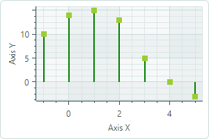

# Lollipop Series View

The Lollipop Series View (`CartesianLollipopSeriesView`) visualizes data using thin lines with markers at the end. The markers indicate individual data points, while the lines connect the markers to a baseline (a horizontal or vertical axis). The Lollipop chart uses square markers by default, but also supports custom markers in SVG format. The following image demonstrates a Lollipop Series View with circular markers loaded from an SVG file.


## Create a Lollipop Series View

To create a Lollipop Series View, add a `CartesianSeries` object to the `CartesianChart.Series` collection and initialize the `CartesianSeries.View` property with a `CartesianLollipopSeriesView` instance.

Use the `CartesianSeries.DataAdapter` property to supply data for the series.

The following code shows how to create a Lollipop Series View in XAML and code-behind.


``` xml
xmlns:mxc="https://schemas.eremexcontrols.net/avalonia/charts"

<mxc:CartesianChart x:Name="chartControl">
    <mxc:CartesianSeries DataAdapter="{Binding DataAdapter}">
        <mxc:CartesianLollipopSeriesView Color="YellowGreen"
                                            LineColor="Green"
                                            Thickness="2"
                                            MarkerSize="8"
                                            Orientation="Vertical">
        </mxc:CartesianLollipopSeriesView>
    </mxc:CartesianSeries>
</mxc:CartesianChart>
```

``` cs
using Eremex.AvaloniaUI.Charts;

CartesianSeries series = new CartesianSeries();
chartControl.Series.Add(series);
double[] args = new double[] { -1, 0, 1, 2, 3, 4, 5 };
double[] values = new double[] { 10, 14, 15, 13, 5, 0, -3 };
series.DataAdapter = new SortedNumericDataAdapter(args, values);
series.View = new CartesianLollipopSeriesView()
{
    LineColor = Avalonia.Media.Colors.Green,
    Color = Avalonia.Media.Colors.YellowGreen,
    MarkerSize = 8,
    Thickness = 2,
    Orientation = CartesianLollipopOrientation.Horizontal
};
```

## Example - Create a Lollipop Series View and Use Custom SVG Data Point Markers

The following example creates a Lollipop Series View to visualize sample data supplied by a `FormulaDataAdapter` object. The example shows how to use an SVG image as custom data point markers and dynamically adjust the colors of SVG elements so they match the data series color.


1. Specify an SVG Image as Point Markers

    Use the `MarkerImage` property to assign an SVG image as data point markers. The `MarkerImage` property is defined with the `[Content]` attribute, allowing you to specify the SVG image as the content of the &lt;CartesianLollipopSeriesView&gt; tag:

    ``` xml
    <mxc:CartesianLollipopSeriesView ...>
        <SvgImage Source="avares://ChartLollipopSeriesView/Assets/circle.svg" />
    </mxc:CartesianLollipopSeriesView>    
    ```

    The 'circle.svg' file renders a circle with a green border and yellow fill:

    

    ``` xml
    <!-- part of 'circle.svg' file -->
    <svg ...>
        <circle fill="yellow" stroke="green" stroke-width="10" cx="40" cy="40" r="30"/>
    </svg>
    ```

    The next step shows how to override these colors dynamically without modifying the source SVG file.

2. Apply the Series Color to SVG Elements 

    The Lollipop Series View (as well as any [Point Series View](point-series-view.md) descendant) 
    supports the `MarkerImageCss` property, which enables [CSS-based SVG styling](https://developer.mozilla.org/en-US/docs/Web/SVG/Reference/Element/style). This property allows you to customize the styles of specific SVG elements at runtime. For instance, CSS code can apply the series color to individual SVG elements.

    ``` xml
    <mxc:CartesianLollipopSeriesView 
        Color="Orange"
        MarkerImageCss="circle {{fill:{0};stroke:darkred;}}"
    >
    ```

    The CSS code above customizes the style of the `circle` SVG object. The new style paints the border with Dark Red, and fills the circle using the data series color. 
     
     - `{0}` placeholder — Inserts the value of the `CartesianLollipopSeriesView.Color` property.

    The result is demonstrated below:

    

    
3. Set the Size of Point Markers

    Use the `MarkerSize` property to adjust the size of the point markers.

Complete code:

``` xml
<!-- MainWindow.axaml -->
<mx:MxWindow xmlns="https://github.com/avaloniaui"
        xmlns:x="http://schemas.microsoft.com/winfx/2006/xaml"
        xmlns:vm="using:ChartLollipopSeriesView.ViewModels"
        xmlns:d="http://schemas.microsoft.com/expression/blend/2008"
        xmlns:mc="http://schemas.openxmlformats.org/markup-compatibility/2006"
        xmlns:mx="https://schemas.eremexcontrols.net/avalonia"
        xmlns:mxc="https://schemas.eremexcontrols.net/avalonia/charts"
        mc:Ignorable="d" d:DesignWidth="800" d:DesignHeight="450"
        x:Class="ChartLollipopSeriesView.Views.MainWindow"
        x:DataType="vm:MainWindowViewModel"
        Icon="/Assets/EMXControls.ico"
        Title="ChartLollipopSeriesView">

    <Design.DataContext>
        <!-- This only sets the DataContext for the previewer in an IDE,
             to set the actual DataContext for runtime, set the DataContext property in code (look at App.axaml.cs) -->
        <vm:MainWindowViewModel/>
    </Design.DataContext>

    <mxc:CartesianChart x:Name="chartControl">
        <mxc:CartesianChart.Series>
            <mxc:CartesianSeries Name="lollipopSeries1" 
                                 DataAdapter="{Binding PointSeriesVM1.DataAdapter}" 
                                 SeriesName="Income"
                                 >
                <mxc:CartesianLollipopSeriesView Color="Orange"
                                                 LineColor="Dimgray"
                                                 LineThickness="3"
                                                 MarkerSize="10"
                                                 MarkerImageCss="circle {{fill:{0};stroke:darkred;}}"
                                                 >
                    <SvgImage Source="avares://ChartLollipopSeriesView/Assets/circle.svg" />
                </mxc:CartesianLollipopSeriesView>
            </mxc:CartesianSeries>
        </mxc:CartesianChart.Series>
        <mxc:CartesianChart.AxesX>
            <mxc:AxisX Title="Weeks" MinorCount="0" ShowMinorGridlines="False">
                <mxc:AxisX.ScaleOptions>
                    <mxc:NumericScaleOptions GridSpacing="1" />
                </mxc:AxisX.ScaleOptions>
            </mxc:AxisX>
        </mxc:CartesianChart.AxesX>
        <mxc:CartesianChart.AxesY>
            <mxc:AxisY Title="Million yuan"/>
        </mxc:CartesianChart.AxesY>
    </mxc:CartesianChart>
</mx:MxWindow>
```

``` cs
// MainWindowViewModel.cs
using CommunityToolkit.Mvvm.ComponentModel;
using Eremex.AvaloniaUI.Charts;
using System;
using System.Collections.Generic;

namespace ChartLollipopSeriesView.ViewModels
{
    public partial class MainWindowViewModel : ViewModelBase
    {
        static double[] values = new double[] { 1, 2, 2.6, 2.5, 2, 1.3, 0.7, -0.3, 0, 1, 1.6, 2.4, 2.8, 3.2, 2.95, 3 };
        static double MyFunc(double argument) => values[(int)argument % values.Length];

        [ObservableProperty] SeriesViewModel pointSeriesVM1;

        public MainWindowViewModel()
        {
            PointSeriesVM1 = new()
            {
                DataAdapter = new FormulaDataAdapter(0, 1, values.Length, MyFunc)
            };
        }
    }

    public partial class SeriesViewModel : ObservableObject
    {
        [ObservableProperty] ISeriesDataAdapter dataAdapter;
    }
}
```

``` xml
<!-- circle.svg image -->
<svg viewBox="0 0 80 80" width="80" height="80" xmlns="http://www.w3.org/2000/svg">
<g>
<title>Layer 1</title>
<circle fill="yellow" stroke="green" stroke-opacity="1" stroke-width="10" cx="40" cy="40" id="svg_1" r="30"/>
</g>
</svg>
```


## Data for the Lollipop Series View

You can use the following data adapters to provide data for Lollipop Series Views:

Numeric _X_ Values:

- `FormulaDataAdapter`
- `ScatterDataAdapter`
- `SortedNumericDataAdapter`

Date and Time _X_ Values:

- `SortedDateTimeDataAdapter`
- `SortedTimeSpanDataAdapter`


Qualitative _X_ Values:

- `QualitativeDataAdapter`

## Lollipop Series View Settings


- `Color` — Specifies the color used to paint the point markers.
- `LineColor` — Specifies the color used to paint the lines.
- `LineThickness` — Specifies the line thickness.
- `LineOrientation` — Specifies the direction of the lines.

    - `Vertical` — The lines extend vertically from the point markers to the _X_ axis.

        


    - `Horizontal` — The lines extend horizontally from the point markers to the _Y_ axis.

        


- `MarkerImage` — Gets or sets an image to use as custom point markers. If no image is specified, default square-shaped markers are displayed. You can use an `SvgImage` class instance to specify an SVG image.

    The `MarkerImage` property is declared with the `[Content]` attribute, which allows you to define an image directly between the &lt;CartesianLollipopSeriesView&gt; tags.

    ``` xml
    <mxc:CartesianLollipopSeriesView>
        <SvgImage Source="avares://ChartLollipopSeriesView/Assets/circle.svg" />
    </mxc:CartesianLollipopSeriesView>
    ```

    SVG files contain predefined colors for SVG elements. To make these colors match your data series color, you can either:
    
    - Manually edit the source SVG image file beforehand
    - Use the `MarkerImageCss` property to dynamically customize [styles](https://developer.mozilla.org/en-US/docs/Web/SVG/Reference/Element/style) for SVG elements. The styles are applied when point markers are rendered.

- `MarkerImageCss` — Specifies [CSS styles](https://developer.mozilla.org/en-US/docs/Web/SVG/Reference/Element/style) for runtime customization of an SVG image defined by the `CartesianLollipopSeriesView.MarkerImage` property. The primary use case is replacing SVG element colors with the series color (`CartesianLollipopSeriesView.Color`). Include the `{0}` placeholder to insert the value of the `CartesianLollipopSeriesView.Color` property in the CSS code. 

    For example, when the `MarkerImage` property contains an SVG image with a circle element, the following CSS code styles the `circle` with an Orange fill (using the series color) and Dark Red border:

    ``` xml
    <mxc:CartesianLollipopSeriesView Color="orange" MarkerImageCss="circle {{fill:{0};stroke:darkred;}}">
        <SvgImage Source="avares://ChartLollipopSeriesView/Assets/circle.svg" />
    </mxc:CartesianLollipopSeriesView>
    ```

    

    **Complete code**: [Example - Create a Lollipop Series View and Use Custom SVG Markers](#example-create-a-lollipop-series-view-and-use-custom-svg-data-point-markers).

- `MarkerSize` — Specifies the size of the point markers, in pixels.
- `ShowInCrosshair` — Specifies the visibility of the crosshair chart label for the current series. See [Customize Chart Labels of the Crosshair](../crosshair.md#hide-a-series-in-the-crosshair).
