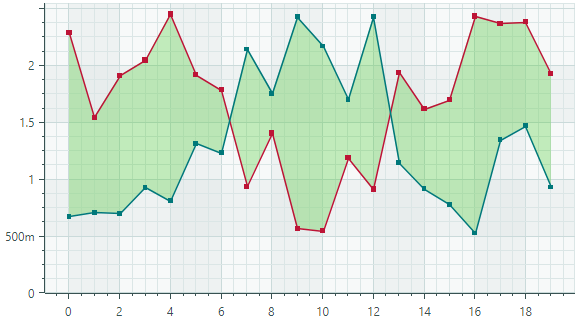
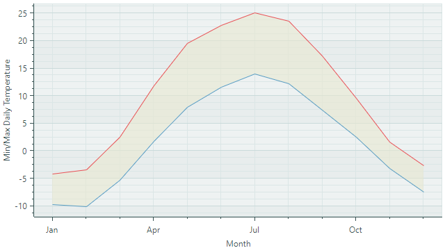

# Range Area Series View

The Range Area Series View ([`CartesianRangeAreaSeriesView`](../../../API/Eremex.AvaloniaUI.Charts/CartesianRangeAreaSeriesView.md)) plots two lines and fills the area between these lines.



You need to supply two Y-values for each data point. These values define the lower and upper bounds of a range. The chart connects the Y-values of each bound with lines and fills the area between them with a specified color. 

## Create a Range Series View

To create a Range Series View, add a [`CartesianSeries`](../../../API/Eremex.AvaloniaUI.Charts/CartesianSeries.md) object to the [`CartesianChart.Series`](../../../API/Eremex.AvaloniaUI.Charts/CartesianChart/Series.md) collection, and initialize the [`CartesianSeries.View`](../../../API/Eremex.AvaloniaUI.Charts/CartesianSeries/View.md)  with a [`CartesianRangeAreaSeriesView`](../../../API/Eremex.AvaloniaUI.Charts/CartesianRangeAreaSeriesView.md) instance.

Use the [`CartesianSeries.DataAdapter`](../../../API/Eremex.AvaloniaUI.Charts/Series/DataAdapter.md) property to supply data for the series. The Range Area Series View requires two Y-values per data point. You should use special data adapters to provide Y-values for the Range Area Series View. See the following link for information on supported data adapters: [Data for the Range Area Series View](#data-for-the-range-area-series-view).

The [`CartesianRangeAreaSeriesView`](../../../API/Eremex.AvaloniaUI.Charts/CartesianRangeAreaSeriesView.md) object includes the [`Color1`](../../../API/Eremex.AvaloniaUI.Charts/CartesianRangeAreaSeriesView/Color1.md), [`Color2`](../../../API/Eremex.AvaloniaUI.Charts/CartesianRangeAreaSeriesView/Color2.md) and [`Color`](../../../API/Eremex.AvaloniaUI.Charts/CartesianRangeAreaSeriesView/Color.md) properties that allow you to specify different colors to paint the lines and the fill.

The following code shows how to create a Range Area Series View in XAML and code-behind.

``` xml
<mxc:CartesianChart x:Name="chartControl">
    <mxc:CartesianChart.Series>
        <mxc:CartesianSeries Name="rangeAreaSeries1" DataAdapter="{Binding DataAdapter}" >
            <mxc:CartesianRangeAreaSeriesView Color="Red" 
                                                Color1="Green" 
                                                Color2="Blue" 
                                                Transparency="0.4"/>
        </mxc:CartesianSeries>
    </mxc:CartesianChart.Series>
</mxc:CartesianChart>
```

``` cs
CartesianSeries series = new CartesianSeries();
chartControl.Series.Add(series);
List<double> args = new() { 1, 2, 3, 4, 5 };
List<double> values1 = new() { -1, 5, 3, 7, 4 };
List<double> values2 = new() { 5, 1, 6, 2, 3 };
series.DataAdapter = new NumericRangeDataAdapter(args, values1, values2);
series.View = new CartesianRangeAreaSeriesView()
{
    Color = Avalonia.Media.Colors.Red,
    Transparency = 0.4,
    Color1 = Avalonia.Media.Colors.Green,
    Color2 = Avalonia.Media.Colors.Blue
};
```

## Example - Use a Range Area Series View to Display the Min and Max Month Temperatures

The following example uses the Range Area Series View to display monthly minimum and maximum temperatures in a city. The data adapter ([`DateTimeRangeDataAdapter`](../../../API/Eremex.AvaloniaUI.Charts/DateTimeRangeDataAdapter.md)) provides two Y-values for each data point (month).

Note the use of the [`DateTimeScaleOptions.LabelFormatter`](../../../API/Eremex.AvaloniaUI.Charts/ScaleOptions/LabelFormatter.md) property to format labels of the _X_ axis in a custom manner.



``` xml
<mx:MxWindow xmlns="https://github.com/avaloniaui"
        xmlns:x="http://schemas.microsoft.com/winfx/2006/xaml"
        xmlns:vm="using:ChartRangeAreaSeriesView.ViewModels"
        xmlns:d="http://schemas.microsoft.com/expression/blend/2008"
        xmlns:mc="http://schemas.openxmlformats.org/markup-compatibility/2006"
        xmlns:mx="https://schemas.eremexcontrols.net/avalonia"
        xmlns:mxc="https://schemas.eremexcontrols.net/avalonia/charts"
        mc:Ignorable="d" d:DesignWidth="800" d:DesignHeight="450"
        x:Class="ChartRangeAreaSeriesView.Views.MainWindow"
        x:DataType="vm:MainWindowViewModel"
        Icon="/Assets/EMXControls.ico"
        Title="ChartRangeAreaSeriesView">

    <Design.DataContext>
        <vm:MainWindowViewModel/>
    </Design.DataContext>

    <mxc:CartesianChart x:Name="chartControl">
        <mxc:CartesianChart.Series>
            <mxc:CartesianSeries Name="rangeAreaSeries1" DataAdapter="{Binding RangeAreaSeries1.DataAdapter}" >
                <mxc:CartesianRangeAreaSeriesView Color="{Binding RangeAreaSeries1.Color}" 
                                                  Color1="{Binding RangeAreaSeries1.Color1}" 
                                                  Color2="{Binding RangeAreaSeries1.Color2}" 
                                                  Transparency="0.6"/>
            </mxc:CartesianSeries>
        </mxc:CartesianChart.Series>
        <mxc:CartesianChart.AxesX>
            <mxc:AxisX Name="xAxis" Title="Month" >
                <mxc:AxisX.ScaleOptions>
                    <mxc:DateTimeScaleOptions LabelFormatter="{Binding MonthFormatter}"
                                              MeasureUnit="Month"/>
                </mxc:AxisX.ScaleOptions>
            </mxc:AxisX>
        </mxc:CartesianChart.AxesX>
        <mxc:CartesianChart.AxesY>
            <mxc:AxisY Title="Min/Max Daily Temperature"/>
        </mxc:CartesianChart.AxesY>
    </mxc:CartesianChart>
</mx:MxWindow>
```

``` cs
using CommunityToolkit.Mvvm.ComponentModel;
using Avalonia.Media;
using Eremex.AvaloniaUI.Charts;
using System;
using System.Collections.Generic;

namespace ChartRangeAreaSeriesView.ViewModels;

public partial class MainWindowViewModel : ViewModelBase
{
    
    [ObservableProperty] FuncLabelFormatter monthFormatter = new(o => String.Format("{0:MMM}", o));
    [ObservableProperty] SeriesViewModel rangeAreaSeries1;

    public MainWindowViewModel()
    {
        RangeAreaSeries1 = new() 
        { 
            Color = Color.FromUInt32(0xffE7E8D1), 
            Color1 = Color.FromUInt32(0xffe95057),
            Color2 = Color.FromUInt32(0xff589cc1),
        };
        List<double> values1 = new() { -4.2, -3.4, 2.5, 11.9, 19.6, 22.8, 25.1, 23.6, 17.3, 9.6, 1.6, -2.7 };
        List<double> values2 = new() { -9.7, -10.1, -5.3, 1.8, 7.9, 11.6, 14.0, 12.2, 7.4, 2.5, -3.1, -7.5 };
        List<DateTime> args = new();
        for (int i = 1; i <=12; i++) 
            args.Add(new DateTime(DateTime.Now.Year, i, 1));
        rangeAreaSeries1.DataAdapter = new DateTimeRangeDataAdapter(args, values1, values2);
    }
}

public partial class SeriesViewModel : ObservableObject
{
    [ObservableProperty] Color color;
    [ObservableProperty] Color color1;
    [ObservableProperty] Color color2;
    [ObservableProperty] DateTimeRangeDataAdapter dataAdapter;
}
```

## Data for the Range Area Series View

You can use the following data adapters to provide data for the Range Area Series View. These data adapters allow you to specify two Y values per argument.

Numeric _X_ Values:

- [`NumericRangeDataAdapter`](../../../API/Eremex.AvaloniaUI.Charts/NumericRangeDataAdapter.md)

Date and Time _X_ Values:

- [`DateTimeRangeDataAdapter`](../../../API/Eremex.AvaloniaUI.Charts/DateTimeRangeDataAdapter.md)
- [`TimeSpanRangeDataAdapter`](../../../API/Eremex.AvaloniaUI.Charts/TimeSpanRangeDataAdapter.md)

Qualitative _X_ Values:

- [`QualitativeRangeDataAdapter`](../../../API/Eremex.AvaloniaUI.Charts/QualitativeRangeDataAdapter.md) 

## Range Area Series View Settings

- [`Color`](../../../API/Eremex.AvaloniaUI.Charts/CartesianRangeAreaSeriesView/Color.md) — Specifies the color to fill the area between two lines. Use the [`Transparency`](../../../API/Eremex.AvaloniaUI.Charts/CartesianRangeAreaSeriesView/Transparency.md) option to control the transparency level of the filled area.
- [`Color1`](../../../API/Eremex.AvaloniaUI.Charts/CartesianRangeAreaSeriesView/Color1.md) — Specifies the color to paint the first line.
- [`Color2`](../../../API/Eremex.AvaloniaUI.Charts/CartesianRangeAreaSeriesView/Color2.md) — Specifies the color to paint the second line.
- [`CrosshairMode`](../../../API/Eremex.AvaloniaUI.Charts/CartesianRangeAreaSeriesView/CrosshairMode.md) — Specifies whether the crosshair's chart label snaps to the nearest data point, or displays an interpolated value. See [Show an Exact or Interpolated Value in Crosshair Chart Labels](../crosshair.md#show-an-exact-or-interpolated-value-in-crosshair-series-labels).
- [`Marker1Image`](../../../API/Eremex.AvaloniaUI.Charts/CartesianRangeAreaSeriesView/Marker1Image.md) — Allows you to specify an image in SVG format to use as point markers for the first line.
- [`Marker1ImageCss`](../../../API/Eremex.AvaloniaUI.Charts/CartesianRangeAreaSeriesView/Marker1ImageCss.md) — Specifies the CSS code that allows you to customize colors of elements in the specified SVG image ([`Marker1Image`](../../../API/Eremex.AvaloniaUI.Charts/CartesianRangeAreaSeriesView/Marker1Image.md)).
- [`Marker1Size`](../../../API/Eremex.AvaloniaUI.Charts/CartesianRangeAreaSeriesView/Marker1Size.md) — Specifies the size of point markers for the first line.
- [`Marker2Image`](../../../API/Eremex.AvaloniaUI.Charts/CartesianRangeAreaSeriesView/Marker2Image.md) — Allows you to specify an image in SVG format to use as point markers for the second line.
- [`Marker2ImageCss`](../../../API/Eremex.AvaloniaUI.Charts/CartesianRangeAreaSeriesView/Marker2ImageCss.md) — Specifies the CSS code that allows you to customize colors of elements in the specified SVG image ([`Marker2Image`](../../../API/Eremex.AvaloniaUI.Charts/CartesianRangeAreaSeriesView/Marker2Image.md)).
- [`Marker2Size`](../../../API/Eremex.AvaloniaUI.Charts/CartesianRangeAreaSeriesView/Marker2Size.md) — Specifies the size of point markers for the second line.
- [`ShowInCrosshair`](../../../API/Eremex.AvaloniaUI.Charts/CrosshairSeriesViewBase/ShowInCrosshair.md) — Specifies the visibility of the crosshair chart label for the current series. See [Customize Chart Labels of the Crosshair](../crosshair.md#hide-a-series-in-the-crosshair).
- [`ShowMarkers1`](../../../API/Eremex.AvaloniaUI.Charts/CartesianRangeAreaSeriesView/ShowMarkers1.md) — Enables or disables point markers for the first line.
- [`ShowMarkers2`](../../../API/Eremex.AvaloniaUI.Charts/CartesianRangeAreaSeriesView/ShowMarkers2.md) — Enables or disables point markers for the second line.
- `Thickness1` — Specifies the thickness of the first line.
- `Thickness2` — Specifies the thickness of the second line.
- [`Transparency`](../../../API/Eremex.AvaloniaUI.Charts/CartesianRangeAreaSeriesView/Transparency.md) — Gets or sets the transparency level for the filled area, expressed as a value between `0` (fully transparent) and `1` (fully opaque).
