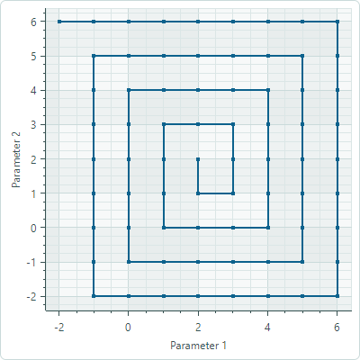

# Scatter Line Series View

The Scatter Line Series View ([`CartesianScatterLineSeriesView`](../../../API/Eremex.AvaloniaUI.Charts/CartesianScatterLineSeriesView.md)) connects points with lines. Unlike the [Line Series View](line-series-vew.md), the points for the Scatter Line Series View do not need to be sorted by their X-values. Instead, the points are connected in the exact order they appear in the data series.

<!-- TODO
Check whether points for the Line Series View must be sorted by X-values.
 -->


## Create a Scatter Line Series View

To create a  Scatter Line Series View, add a [`CartesianSeries`](../../../API/Eremex.AvaloniaUI.Charts/CartesianSeries.md) object to the [`CartesianChart.Series`](../../../API/Eremex.AvaloniaUI.Charts/CartesianChart/Series.md) collection, and initialize the [`CartesianSeries.View`](../../../API/Eremex.AvaloniaUI.Charts/CartesianSeries/View.md) with a [`CartesianScatterLineSeriesView`](../../../API/Eremex.AvaloniaUI.Charts/CartesianScatterLineSeriesView.md) instance.

The following code shows how to create a Scatter Line Series View in XAML and code-behind.

``` xml
<mxc:CartesianChart x:Name="chartControl">
    <mxc:CartesianChart.Series>
        <mxc:CartesianSeries Name="scatterLineSeries1" DataAdapter="{Binding DataAdapter}" >
            <mxc:CartesianScatterLineSeriesView Color="Red" 
                                                ShowMarkers="True"
                                                MarkerSize="4" Thickness="2"/>
        </mxc:CartesianSeries>
    </mxc:CartesianChart.Series>
</mxc:CartesianChart>
```

``` cs
CartesianSeries series = new CartesianSeries();
chartControl.Series.Add(series);
List<(double, double)> points = new List<(double, double)>() { (0, 2), (-1, 3), (-2, 0), (2,1), (-2,5) };
// The ScatterDataAdapter allows unsorted points
series.DataAdapter = new ScatterDataAdapter(points);
series.View = new CartesianScatterLineSeriesView()
{
    Color = Avalonia.Media.Colors.Green,
    MarkerSize = 4,
};
```

## Example - Use a Scatter Line Series View to Connect Points in the Data Series

In this example, the Scatter Line Series View connects points that form a square spiral. The [`ScatterDataAdapter`](../../../API/Eremex.AvaloniaUI.Charts/ScatterDataAdapter.md) adapter is used to supply data for the chart. The points are connected in the order in which they appear in the data series. 



``` xml
<mx:MxWindow xmlns="https://github.com/avaloniaui"
        xmlns:x="http://schemas.microsoft.com/winfx/2006/xaml"
        xmlns:vm="using:ChartScatterLineSeriesView.ViewModels"
        xmlns:d="http://schemas.microsoft.com/expression/blend/2008"
        xmlns:mc="http://schemas.openxmlformats.org/markup-compatibility/2006"
        xmlns:mx="https://schemas.eremexcontrols.net/avalonia"
        xmlns:mxc="https://schemas.eremexcontrols.net/avalonia/charts"
        mc:Ignorable="d" d:DesignWidth="800" d:DesignHeight="450"
        x:Class="ChartScatterLineSeriesView.Views.MainWindow"
        x:DataType="vm:MainWindowViewModel"
        Icon="/Assets/EMXControls.ico"
        Title="ChartScatterLineSeriesView"
        Width="500" Height="500">
    <Design.DataContext>
        <vm:MainWindowViewModel/>
    </Design.DataContext>

    <mxc:CartesianChart x:Name="chartControl">
        <mxc:CartesianChart.Series>
            <mxc:CartesianSeries Name="scatterLineSeries1" DataAdapter="{Binding ScatterLineSeriesVM1.DataAdapter}" >
                <mxc:CartesianScatterLineSeriesView Color="{Binding ScatterLineSeriesVM1.Color}" 
                                                    ShowMarkers="True"
                                                    MarkerSize="4" Thickness="2"/>
            </mxc:CartesianSeries>
        </mxc:CartesianChart.Series>
        <mxc:CartesianChart.AxesX>
            <mxc:AxisX Name="xAxis" Title="Parameter 1" />
        </mxc:CartesianChart.AxesX>
        <mxc:CartesianChart.AxesY>
            <mxc:AxisY Title="Parameter 2"/>
        </mxc:CartesianChart.AxesY>
    </mxc:CartesianChart>
</mx:MxWindow>
```

``` cs
using Avalonia;
using Avalonia.Media;
using CommunityToolkit.Mvvm.ComponentModel;
using Eremex.AvaloniaUI.Charts;
using System;
using System.Collections.Generic;

namespace ChartScatterLineSeriesView.ViewModels;

public partial class MainWindowViewModel : ViewModelBase
{
    [ObservableProperty] SeriesViewModel scatterLineSeriesVM1;

    public MainWindowViewModel()
    {
        ScatterLineSeriesVM1 = new()
        {
            Color = Color.FromUInt32(0xff0d628d),
            DataAdapter = new ScatterDataAdapter(GenerateSquareSpiralData())
        };
    }

    private List<(double, double)> GenerateSquareSpiralData()
    {
        List<(double, double)> points = new List<(double, double)> ();
        double x = 2, y = 2;
        int stepsPerSide = 1; // Steps before changing direction
        int direction = 3; // 0=right, 1=up, 2=left, 3=down
        int turns = 4;
        double stepSize = 1.0;

        points.Add((x, y));
        
        for (int i = 0; i < turns * 4; i++) // 4 sides per turn
        {
            for (int step = 0; step < stepsPerSide; step++)
            {
                switch (direction)
                {
                    case 0: x += stepSize; break; // Right
                    case 1: y += stepSize; break; // Up
                    case 2: x -= stepSize; break; // Left
                    case 3: y -= stepSize; break; // Down
                }
                points.Add((x, y));
            }
            direction = (direction + 1) % 4; // Change direction
            if (i % 2 == 1) stepsPerSide++; // Increase steps every 2 turns
        }
        return points;
    }
}

public partial class SeriesViewModel : ObservableObject
{
    [ObservableProperty] Color color;
    [ObservableProperty] ScatterDataAdapter dataAdapter;
}
```

## Data for the Scatter Line Series View

You can use the following data adapter to provide data for Scatter Line Series Views:

- [`ScatterDataAdapter`](../../../API/Eremex.AvaloniaUI.Charts/ScatterDataAdapter.md)


## Scatter Line Series View Settings

- [`Color`](../../../API/Eremex.AvaloniaUI.Charts/CartesianPointSeriesView/Color.md) — Specifies the color used to paint the series.
- [`MarkerImage`](../../../API/Eremex.AvaloniaUI.Charts/CartesianPointSeriesView/MarkerImage.md) — Gets or sets an image to use as custom point markers. If no image is specified, default square-shaped markers are displayed. You can use an `SvgImage` class instance to specify an SVG image.

    The [`MarkerImage`](../../../API/Eremex.AvaloniaUI.Charts/CartesianPointSeriesView/MarkerImage.md) property is declared with the `[Content]` attribute, which allows you to define an image directly between the &lt;CartesianScatterLineSeriesView&gt; tags.

    ``` xml
    <mxc:CartesianScatterLineSeriesView>
        <SvgImage Source="avares://Demo/Assets/circle.svg" />
    </mxc:CartesianScatterLineSeriesView>
    ```

    SVG files contain predefined colors for SVG elements. To make these colors match your data series color, you can either:
    
    - Manually edit the source SVG image file beforehand
    - Use the [`MarkerImageCss`](../../../API/Eremex.AvaloniaUI.Charts/CartesianPointSeriesView/MarkerImageCss.md) property to dynamically customize [styles](https://developer.mozilla.org/en-US/docs/Web/SVG/Reference/Element/style) for SVG elements. The styles are applied when point markers are rendered.
- [`MarkerImageCss`](../../../API/Eremex.AvaloniaUI.Charts/CartesianPointSeriesView/MarkerImageCss.md) — Specifies [CSS styles](https://developer.mozilla.org/en-US/docs/Web/SVG/Reference/Element/style) for runtime customization of an SVG image defined by the [`MarkerImage`](../../../API/Eremex.AvaloniaUI.Charts/CartesianPointSeriesView/MarkerImage.md) property. The primary use case is replacing SVG element colors with the series color ([`Color`](../../../API/Eremex.AvaloniaUI.Charts/CartesianPointSeriesView/Color.md)). Include the `{0}` placeholder to insert the value of the [`Color`](../../../API/Eremex.AvaloniaUI.Charts/CartesianPointSeriesView/Color.md) property in the CSS code. 

    For example, when the [`MarkerImage`](../../../API/Eremex.AvaloniaUI.Charts/CartesianPointSeriesView/MarkerImage.md) property contains an SVG image with a circle element, the following CSS code styles the `circle` with an Orange fill (using the series color) and Dark Red border:

    ``` xml
    <mxc:CartesianScatterLineSeriesView Color="orange" MarkerImageCss="circle {{fill:{0};stroke:darkred;}}">
        <SvgImage Source="avares://Demo/Assets/circle.svg" />
    </mxc:CartesianScatterLineSeriesView>
    ```
    
    See also: [Example - Create a Lollipop Series View and Use Custom SVG Markers](lollipop-series-view.md#example-create-a-lollipop-series-view-and-use-custom-svg-data-point-markers).

- [`MarkerSize`](../../../API/Eremex.AvaloniaUI.Charts/CartesianPointSeriesView/MarkerSize.md) — Specifies the size of point markers.
- [`ShowInCrosshair`](../../../API/Eremex.AvaloniaUI.Charts/CrosshairSeriesViewBase/ShowInCrosshair.md) — Specifies the visibility of the crosshair chart label for the current series. See [Customize Chart Labels of the Crosshair](../crosshair.md#hide-a-series-in-the-crosshair).
- [`ShowMarkers`](../../../API/Eremex.AvaloniaUI.Charts/CartesianLineSeriesViewBase/ShowMarkers.md) — Enables or disables point markers.
- `Thickness` — Specifies the line thickness.