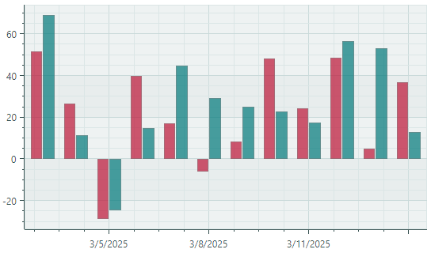

# Side-by-side Bar Series View

The Side-by-side Bar Series View ([`CartesianSideBySideBarSeriesView`](../../../API/Eremex.AvaloniaUI.Charts/CartesianSideBySideBarSeriesView.md)) allows you to visualize data as a set of rectangular bars. If you provide multiple series, data is visualized as side-by-side bars along the horizontal axis.



## Create a Side-by-side Bar Series View

To create a Side-by-side Bar Series View, add a [`CartesianSeries`](../../../API/Eremex.AvaloniaUI.Charts/CartesianSeries.md) object to the [`CartesianChart.Series`](../../../API/Eremex.AvaloniaUI.Charts/CartesianChart/Series.md) collection, and initialize the [`CartesianSeries.View`](../../../API/Eremex.AvaloniaUI.Charts/CartesianSeries/View.md) property with a [`CartesianSideBySideBarSeriesView`](../../../API/Eremex.AvaloniaUI.Charts/CartesianSideBySideBarSeriesView.md) object.

Use the [`CartesianSeries.DataAdapter`](../../../API/Eremex.AvaloniaUI.Charts/Series/DataAdapter.md) property to supply data for the series.

The following code shows how to create a Bar Series View in XAML and code-behind.

``` xml
xmlns:mxc="https://schemas.eremexcontrols.net/avalonia/charts"

<mxc:CartesianChart x:Name="chartControl">
    <mxc:CartesianChart.Series>
        <mxc:CartesianSeries Name="barSeries1" DataAdapter="{Binding DataAdapter}" >
            <mxc:CartesianSideBySideBarSeriesView Color="Red" />
        </mxc:CartesianSeries>
</mxc:CartesianChart>
```

``` cs
using Eremex.AvaloniaUI.Charts;

CartesianSeries series = new CartesianSeries();
chartControl.Series.Add(series);
DateTime[] args = new DateTime[] {DateTime.Today, DateTime.Today.AddMonths(1)};
double[] values = new double[] {10, 20};
series.DataAdapter = new SortedDateTimeDataAdapter(args, values );
series.View = new CartesianSideBySideBarSeriesView()
{
    Color = Avalonia.Media.Colors.Red
};
```

!!! tip

    If you use date-time arguments, you may also need to initialize the _X_ axis, and customize the axis scale options. Refer to the following topic for more details: [Axis Scale](../cartesian-chart.md#axis-scale).

<!-- TODO
No bars are displayed without axis X
 -->

### Example - Create Two Side-by-side Bar Series Views

The following example creates a [`CartesianChart`](../../../API/Eremex.AvaloniaUI.Charts/CartesianChart.md) control with two Side-by-side Bar Series Views. Data for the Bar Series Views is provided by [`SortedDateTimeDataAdapter`](../../../API/Eremex.AvaloniaUI.Charts/SortedDateTimeDataAdapter.md) objects initialized in the main View Model. It is implied that a _MainWindowViewModel_ object is set as a data context for the window.

The example shows how to initialize the color, bar width, and distance between bars for [`CartesianSideBySideBarSeriesView`](../../../API/Eremex.AvaloniaUI.Charts/CartesianSideBySideBarSeriesView.md) objects.

The _X_ and _Y_ axes are created in XAML to perform customization of their settings (including the title and scale options). 

When you use a [`SortedDateTimeDataAdapter`](../../../API/Eremex.AvaloniaUI.Charts/SortedDateTimeDataAdapter.md) object, you need to specify the `MeasureUnit` property to define axis scaling. In the example, the data uses monthly intervals, so the `MeasureUnit` property is set to `Month`.


``` xml
<mx:MxWindow xmlns="https://github.com/avaloniaui"
        xmlns:x="http://schemas.microsoft.com/winfx/2006/xaml"
        xmlns:vm="using:ChartBarSeriesView.ViewModels"
        xmlns:d="http://schemas.microsoft.com/expression/blend/2008"
        xmlns:mc="http://schemas.openxmlformats.org/markup-compatibility/2006"
        xmlns:mx="https://schemas.eremexcontrols.net/avalonia"
        xmlns:mxc="https://schemas.eremexcontrols.net/avalonia/charts"
        mc:Ignorable="d" d:DesignWidth="800" d:DesignHeight="450"
        x:Class="ChartBarSeriesView.Views.MainWindow"
        x:DataType="vm:MainWindowViewModel"
        Icon="/Assets/EMXControls.ico"
        Title="ChartBarSeriesView">

    <Design.DataContext>
        <vm:MainWindowViewModel/>
    </Design.DataContext>

    <mxc:CartesianChart x:Name="chartControl">
        <mxc:CartesianChart.Series>
            <mxc:CartesianSeries Name="barSeries1" DataAdapter="{Binding BarSeries1.DataAdapter}" >
                <mxc:CartesianSideBySideBarSeriesView Color="{Binding BarSeries1.Color}" BarWidth="0.9" BarDistanceFixed="1" />
            </mxc:CartesianSeries>
            <mxc:CartesianSeries Name="barSeries2" DataAdapter="{Binding BarSeries2.DataAdapter}" >
                <mxc:CartesianSideBySideBarSeriesView Color="{Binding BarSeries2.Color}" BarWidth="0.9" />
            </mxc:CartesianSeries>
        </mxc:CartesianChart.Series>

        <mxc:CartesianChart.AxesX>
            <mxc:AxisX Name="salesAxis" Title="Months">
                <mxc:AxisX.ScaleOptions>
                    <mxc:DateTimeScaleOptions MeasureUnit="Month"  LabelFormatter="{Binding MonthFormatter}"/>
                </mxc:AxisX.ScaleOptions>
            </mxc:AxisX>
        </mxc:CartesianChart.AxesX>
        <mxc:CartesianChart.AxesY>
            <mxc:AxisY Title="Sales"/>
        </mxc:CartesianChart.AxesY>
    </mxc:CartesianChart>
</mx:MxWindow>
```

``` cs
using Avalonia.Media;
using CommunityToolkit.Mvvm.ComponentModel;
using Eremex.AvaloniaUI.Charts;
using System;

namespace ChartBarSeriesView.ViewModels;

public partial class MainWindowViewModel : ViewModelBase
{
    [ObservableProperty] SeriesViewModel barSeries1;
    [ObservableProperty] SeriesViewModel barSeries2;
    [ObservableProperty] FuncLabelFormatter monthFormatter = new(o => String.Format("{0:MMM} {0:yy}", o));

    public MainWindowViewModel()
    {
        var random = new Random(11);
        var startDate = new DateTime(DateTime.Now.Year, 1, 1);
        SortedDateTimeDataAdapter barSeries1DataAdapter = new();
        SortedDateTimeDataAdapter barSeries2DataAdapter = new();
        for (int i = 0; i < 12; i++)
        {
            var argument = startDate.AddMonths(i);
            barSeries1DataAdapter.Add(argument, random.NextDouble() * 100 - 30);
            barSeries2DataAdapter.Add(argument, random.NextDouble() * 100 - 30);
        }
        // Create data series
        BarSeries1 = new() { Color = Color.FromUInt32(0xffe07a5f), DataAdapter = barSeries1DataAdapter };
        BarSeries2 = new() { Color = Color.FromUInt32(0xff3D405B), DataAdapter = barSeries2DataAdapter };
    }
}

public partial class SeriesViewModel : ObservableObject
{
    [ObservableProperty] Color color;
    [ObservableProperty] ISeriesDataAdapter dataAdapter;
}
```


## Data for the Bar Series View

You can use the following data adapters to provide data for Side-by-side Bar Series Views:


Numeric _X_ Values:

- [`SortedNumericDataAdapter`](../../../API/Eremex.AvaloniaUI.Charts/SortedNumericDataAdapter.md)
- [`FormulaDataAdapter`](../../../API/Eremex.AvaloniaUI.Charts/FormulaDataAdapter.md)

Date and Time _X_ Values:

- [`SortedDateTimeDataAdapter`](../../../API/Eremex.AvaloniaUI.Charts/SortedDateTimeDataAdapter.md)
- [`SortedTimeSpanDataAdapter`](../../../API/Eremex.AvaloniaUI.Charts/SortedTimeSpanDataAdapter.md)

Qualitative _X_ Values:

- [`QualitativeDataAdapter`](../../../API/Eremex.AvaloniaUI.Charts/QualitativeDataAdapter.md)


## Bar Series View Settings

- [`CartesianSideBySideBarSeriesView.BarDistanceFixed`](../../../API/Eremex.AvaloniaUI.Charts/CartesianSideBySideBarSeriesView/BarDistanceFixed.md) — The width of the empty space to the right of the bars that belong to the current Bar Series View. The [`BarDistanceFixed`](../../../API/Eremex.AvaloniaUI.Charts/CartesianSideBySideBarSeriesView/BarDistanceFixed.md) property allows you to adjust the distance between bars of different series.
- [`CartesianSideBySideBarSeriesView.BarWidth`](../../../API/Eremex.AvaloniaUI.Charts/CartesianSideBySideBarSeriesView/BarWidth.md) — The width of the bars of the current Bar Series View.
- [`CartesianSideBySideBarSeriesView.BorderColor`](../../../API/Eremex.AvaloniaUI.Charts/CartesianSideBySideBarSeriesView/BorderColor.md) — The border color for the bars.
- [`CartesianSideBySideBarSeriesView.BorderThickness`](../../../API/Eremex.AvaloniaUI.Charts/CartesianSideBySideBarSeriesView/BorderThickness.md) — The thickness of the bar borders.
- [`CartesianSideBySideBarSeriesView.Color`](../../../API/Eremex.AvaloniaUI.Charts/CartesianSideBySideBarSeriesView/Color.md) — The fill color for the bars.
