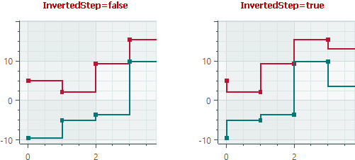

# Step Area Series View

The Step Area Series View (`CartesianStepAreaSeriesView`) connects points with horizontal and vertical line segments, and paints filled areas.


## Data for the Step Area Series View

You can use the following data adapters to provide data for Step Area Series Views:

Numeric _X_ Values:

- `SortedNumericDataAdapter`
- `FormulaDataAdapter`

Date and Time _X_ Values:

- `SortedDateTimeDataAdapter`
- `SortedTimeSpanDataAdapter`

Qualitative _X_ Values:

- `QualitativeDataAdapter`

## Step Area Series View Settings

- `Color` — Specifies the color used to paint the series.
- `CrosshairMode` — Specifies whether the crosshair's chart label snaps to the nearest data point, or displays an interpolated value. See [Show an Exact or Interpolated Value in Crosshair Chart Labels](../crosshair.md#show-an-exact-or-interpolated-value-in-crosshair-series-labels).
- `InvertedStep` — Specifies the drawing order of step segments between neighboring data points. If `InvertedStep` is `false` (default), steps are composed of horizontal and then vertical segments. If `InvertedStep` is `true`, steps are composed of vertical and then horizontal segments.

    

- `MarkerImage` — Gets or sets an image to use as custom point markers. If no image is specified, default square-shaped markers are displayed. You can use an `SvgImage` class instance to specify an SVG image.

    The `MarkerImage` property is declared with the `[Content]` attribute, which allows you to define an image directly between the &lt;CartesianStepAreaSeriesView&gt; tags.

    ``` xml
    <mxc:CartesianStepAreaSeriesView>
        <SvgImage Source="avares://Demo/Assets/circle.svg" />
    </mxc:CartesianStepAreaSeriesView>
    ```

    SVG files contain predefined colors for SVG elements. To make these colors match your data series color, you can either:
    
    - Manually edit the source SVG image file beforehand
    - Use the `MarkerImageCss` property to dynamically customize [styles](https://developer.mozilla.org/en-US/docs/Web/SVG/Reference/Element/style) for SVG elements. The styles are applied when point markers are rendered.

- `MarkerImageCss` — Specifies [CSS styles](https://developer.mozilla.org/en-US/docs/Web/SVG/Reference/Element/style) for runtime customization of an SVG image defined by the `MarkerImage` property. The primary use case is replacing SVG element colors with the series color (`Color`). Include the `{0}` placeholder to insert the value of the `Color` property in the CSS code. 

    For example, when the `MarkerImage` property contains an SVG image with a circle element, the following CSS code styles the `circle` with an Orange fill (using the series color) and Dark Red border:

    ``` xml
    <mxc:___222___ Color="orange" MarkerImageCss="circle {{fill:{0};stroke:darkred;}}">
        <SvgImage Source="avares://Demo/Assets/circle.svg" />
    </mxc:___222___>
    ```
    
    See also: [Example - Create a Lollipop Series View and Use Custom SVG Markers](lollipop-series-view.md#example-create-a-lollipop-series-view-and-use-custom-svg-data-point-markers).

- `MarkerSize` — Specifies the size of point markers.
- `ShowInCrosshair` — Specifies the visibility of the crosshair chart label for the current series. See [Customize Chart Labels of the Crosshair](../crosshair.md#hide-a-series-in-the-crosshair).
- `ShowMarkers` — Enables or disables point markers.
- `Thickness` — Specifies the line thickness.
- `Transparency` — A value between `0` and `1` which specifies the transparency level of filled areas:
    - `0` means fully opaque
    - `1` means fully transparent