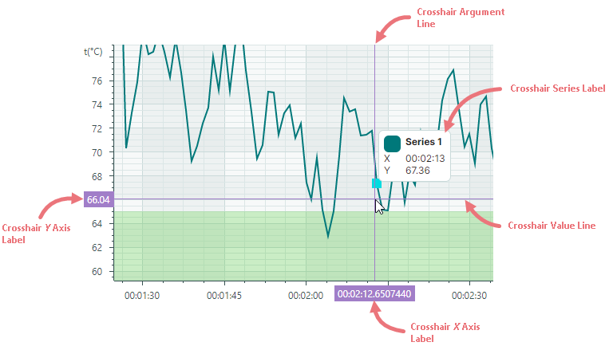
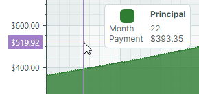
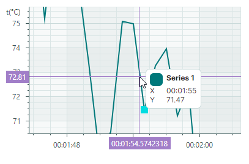
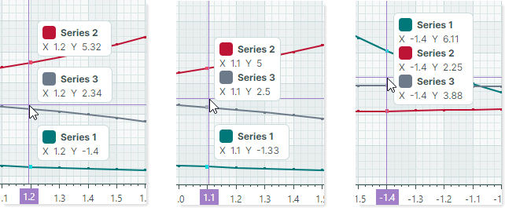
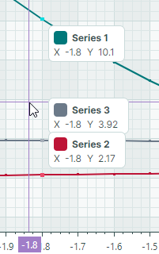
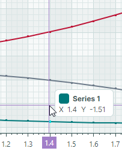
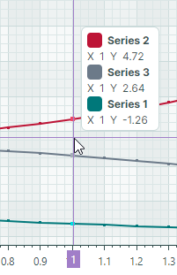
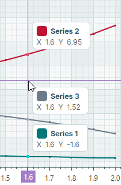
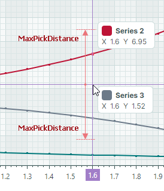
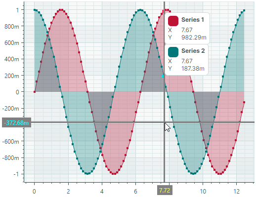

# Crosshair

## What Is a Crosshair?


The Cartesian Chart control includes a crosshair that allows you to see exact series values at the current cursor position. Rendered as a pair of horizontal and vertical lines, the crosshair follows the mouse pointer as it hovers over the diagram area. It displays a series label (or multiple labels for multiple series) that shows the series value, and highlights the current _X_ and _Y_ coordinates on the axes.




To customize display settings of the crosshair, or disable this feature, initialize the [`CartesianChart.CrosshairOptions`](../../API/Eremex.AvaloniaUI.Charts/ChartControl/CrosshairOptions.md) property with an instance of the [`Eremex.AvaloniaUI.Charts.CrosshairOptions`](../../API/Eremex.AvaloniaUI.Charts/CrosshairOptions.md) class. Then use the properties exposed by the [`CrosshairOptions`](../../API/Eremex.AvaloniaUI.Charts/CrosshairOptions.md) class to adjust the crosshair settings as needed.


## Disable the Crosshair

The [`CrosshairOptions.ShowCrosshair`](../../API/Eremex.AvaloniaUI.Charts/CrosshairOptions/ShowCrosshair.md) property allows you to disable the crosshair.

``` xml
<mxc:CartesianChart x:Name="chartControl1" >
    <mxc:CartesianChart.CrosshairOptions>
        <mxc:CrosshairOptions ShowCrosshair="False"/>
    </mxc:CartesianChart.CrosshairOptions>
    <!-- ... -->
</mxc:CartesianChart>
```

## Disable Individual Lines and Axis Labels of the Crosshair

The [`CrosshairOptions.ShowArgumentLine`](../../API/Eremex.AvaloniaUI.Charts/CrosshairOptions/ShowArgumentLine.md) and [`CrosshairOptions.ShowValueLine`](../../API/Eremex.AvaloniaUI.Charts/CrosshairOptions/ShowValueLine.md) properties can be used to hide the vertical and horizontal line of the crosshair, respectively. To prevent crosshair labels from being displayed for the _X_ and _Y_ axes, use the [`CrosshairOptions.ShowArgumentLabel`](../../API/Eremex.AvaloniaUI.Charts/CrosshairOptions/ShowArgumentLabel.md) and [`CrosshairOptions.ShowValueLabel`](../../API/Eremex.AvaloniaUI.Charts/CrosshairOptions/ShowValueLabel.md) properties.

The following example hides the crosshair's vertical line and label for the _X_ axis:


``` xml
<mxc:CartesianChart x:Name="chartControl1" >
    <mxc:CartesianChart.CrosshairOptions>
        <mxc:CrosshairOptions ShowArgumentLabel="False" ShowValueLabel="False"/>
    </mxc:CartesianChart.CrosshairOptions>
    <!-- ... -->
</mxc:CartesianChart>
```

## Customize Crosshair Series Labels

The crosshair series labels display the names and current values of the series.


### Format Values in Crosshair Series Labels

The values displayed in the crosshair labels use default formats initially:


To format these values in a custom manner, create a formatter object and assign it to the `Axis.ScaleOptions.CrosshairLabelFormatter` property. Axis values can be [formatted](cartesian-chart.md#format-axis-labels) similarly (see the `Axis.ScaleOptions.LabelFormatter` property). 

You can implement a custom label formatter based on a function/expression using the [`Eremex.AvaloniaUI.Charts.FuncLabelFormatter`](../../API/Eremex.AvaloniaUI.Charts/FuncLabelFormatter.md) object.

The following example creates a formatter object that formats numeric values as currency. This formatter is used to format _Y_ axis values and values in the crosshair series label.



``` xml
<mxc:CartesianChart.AxesY>
    <mxc:AxisY Title="Payment">
        <mxc:AxisY.ScaleOptions>
            <mxc:NumericScaleOptions
                CrosshairLabelFormatter="{Binding CurrencyFormatter}"
                LabelFormatter="{Binding CurrencyFormatter}"/>
        </mxc:AxisY.ScaleOptions>
    </mxc:AxisY>
</mxc:CartesianChart.AxesY>
```

``` cs
public partial class MainViewModel : ViewModelBase 
{
[ObservableProperty] 
FuncLabelFormatter currencyFormatter = new(o => String.Format("{0:c}", o));
}
```


<!-- 
TODO
### Change the Template of Crosshair Series Labels 

-->


### Hide a Series in the Crosshair

A series view's [`CrosshairSeriesViewBase.ShowInCrosshair`](../../API/Eremex.AvaloniaUI.Charts/CrosshairSeriesViewBase/ShowInCrosshair.md) property specifies the visibility of this series in the crosshair label.

<!-- TODO
Add an image of the crosshair chart label, as many other topics refer to this section
 -->

The following code defines two series (_Interest_ and _Principal_). The [`ShowInCrosshair`](../../API/Eremex.AvaloniaUI.Charts/CrosshairSeriesViewBase/ShowInCrosshair.md) property is set to `false` for the first series to hide it in the crosshair:


``` xml
<mxc:CartesianChart.Series>
    <mxc:CartesianSeries DataAdapter="{Binding InterestSeriesDataAdapter}" SeriesName="Interest">
        <mxc:CartesianAreaSeriesView Color="#F9A825" Transparency="0.2" 
          MarkerSize="2" ShowMarkers="True"
          ShowInCrosshair="False" />
    </mxc:CartesianSeries>

    <mxc:CartesianSeries DataAdapter="{Binding PrincipalSeriesDataAdapter}" SeriesName="Principal">
        <mxc:CartesianAreaSeriesView Color="#2E7D32" Transparency="0.2" MarkerSize="2" ShowMarkers="True" />
    </mxc:CartesianSeries>
</mxc:CartesianChart.Series>
```


### Horizontal Indent of the Crosshair Series Label

The [`CrosshairOptions.SeriesLabelIndent`](../../API/Eremex.AvaloniaUI.Charts/CrosshairOptions/SeriesLabelIndent.md) property allows you to adjust the horizontal distance between the crosshair series label and the crosshair vertical line. The property's default value is 2.


``` xml
<mxc:CartesianChart.CrosshairOptions>
    <mxc:CrosshairOptions SeriesLabelIndent="30"/>
</mxc:CartesianChart.CrosshairOptions>
```


### Show an Exact or Interpolated Value in Crosshair Series Labels

Cartesian Chart supports series that consist of sorted discrete data points. For these series, the crosshair lines do not always intersect data points, but are most often displayed between them. 
You can use the [`CartesianSortedLineSeriesView.CrosshairMode`](../../API/Eremex.AvaloniaUI.Charts/CartesianSortedLineSeriesView/CrosshairMode.md) property to specify whether the crosshair label snaps to the nearest data point, or displays an interpolated value. The following options are available:

- [`CrosshairSeriesMode.Point`](../../API/Eremex.AvaloniaUI.Charts/CrosshairSeriesMode.md) — The crosshair label snaps to the nearest data point and displays its value.
  
  

- [`CrosshairSeriesMode.Interpolate`](../../API/Eremex.AvaloniaUI.Charts/CrosshairSeriesMode.md) — The crosshair series label displays an interpolated value of the point at the intersection of the vertical crosshair line with the chart.

  

The following code shows how to customize the [`CrosshairMode`](../../API/Eremex.AvaloniaUI.Charts/CartesianSortedLineSeriesView/CrosshairMode.md) option:

``` xml
<mxc:CartesianChart.Series>
    <mxc:CartesianSeries DataAdapter="{Binding Series.DataAdapter}">
        <mxc:CartesianLineSeriesView Color="{Binding Series.Color}" Thickness="2" CrosshairMode="Interpolate"/>
    </mxc:CartesianSeries>
</mxc:CartesianChart.Series>

```

### Customize Crosshair Labels for Multiple Series

#### Label Display Mode

When the Cartesian Chart contains multiple series, the crosshair displays a label for each series:


The [`CrosshairOptions.SeriesLabelMode`](../../API/Eremex.AvaloniaUI.Charts/CrosshairOptions/SeriesLabelMode.md) property specifies whether and how multiple series labels are combined. The following options are available:

- [`CrosshairSeriesLabelMode.Smart`](../../API/Eremex.AvaloniaUI.Charts/CrosshairSeriesLabelMode.md) (default) — Each series displays its own crosshair label. When labels overlap, they are combined in a single label.
  
  


- [`CrosshairSeriesLabelMode.ForEachSeries`](../../API/Eremex.AvaloniaUI.Charts/CrosshairSeriesLabelMode.md) — Each series displays its own crosshair label. Labels may overlap in this mode.
  
  

- [`CrosshairSeriesLabelMode.ForNearestSeries`](../../API/Eremex.AvaloniaUI.Charts/CrosshairSeriesLabelMode.md) — A crosshair label is displayed only for the series nearest the cursor.
  
  

- [`CrosshairSeriesLabelMode.OneForAllSeries`](../../API/Eremex.AvaloniaUI.Charts/CrosshairSeriesLabelMode.md) — The crosshair displays a single label that combines information from all series.

  

The following example enables a single crosshair label when multiple series are present.

``` xml
<mxc:CartesianChart.CrosshairOptions>
    <mxc:CrosshairOptions SeriesLabelMode="OneForAllSeries"/>
</mxc:CartesianChart.CrosshairOptions>
```

#### Series Sorting

When multiple series are combined in a single crosshair label, you can use the [`CrosshairOptions.SeriesLabelItemSortMode`](../../API/Eremex.AvaloniaUI.Charts/CrosshairOptions/SeriesLabelItemSortMode.md) property to specify the display order of the series in the label. This property can be set to the following values:

- [`CrosshairSeriesLabelItemSortMode.BySeries`](../../API/Eremex.AvaloniaUI.Charts/CrosshairSeriesLabelItemSortMode.md) (default) — Sorts series by the order in which these series are added to the [`CartesianChart.Series`](../../API/Eremex.AvaloniaUI.Charts/CartesianChart/Series.md) collection.

    

- [`CrosshairSeriesLabelItemSortMode.ByValue`](../../API/Eremex.AvaloniaUI.Charts/CrosshairSeriesLabelItemSortMode.md) — Sorts series by their _Y_ values.

    

## Show Delay

Use the [`CrosshairOptions.SeriesLabelShowDelay`](../../API/Eremex.AvaloniaUI.Charts/CrosshairOptions/SeriesLabelShowDelay.md) property to specify the delay (in milliseconds) before a crosshair series label is displayed.

## Include Only Series Near the Cursor

By default, linear charts display crosshair labels for all series that have data points at the current argument value.



The chart control allows you to limit crosshair labels to series near the cursor. Use the [`CrosshairOptions.MaxPickDistance`](../../API/Eremex.AvaloniaUI.Charts/CrosshairOptions/MaxPickDistance.md) property to specify the range within which to search for data points to include in crosshair labels. For regular linear charts, the [`MaxPickDistance`](../../API/Eremex.AvaloniaUI.Charts/CrosshairOptions/MaxPickDistance.md) property specifies the maximum vertical distance (in pixels) upward or downward.



In the image above, only data points from the _Series 1_ and _Series 3_ lie within the range limited by a custom [`MaxPickDistance`](../../API/Eremex.AvaloniaUI.Charts/CrosshairOptions/MaxPickDistance.md) value. The data point from the _Series 2_ (red line) is beyond this range and is not shown.


For [Scatter Line views](cartesian-series-views/scatter-line-series-view.md), the [`MaxPickDistance`](../../API/Eremex.AvaloniaUI.Charts/CrosshairOptions/MaxPickDistance.md) property specifies the radius of a circular area around the cursor within which to search for data points.

!!! Tip

    To display a crosshair label for a single series nearest the cursor, set the [`CrosshairOptions.SeriesLabelMode`](../../API/Eremex.AvaloniaUI.Charts/CrosshairOptions/SeriesLabelMode.md) property to `ForNearestSeries`. See [Label Display Mode](#label-display-mode).


## Customize Crosshair Lines and Labels on the _X_ and _Y_ Axes

A chart control's [`CrosshairOptions`](../../API/Eremex.AvaloniaUI.Charts/CrosshairOptions.md) object contains a set of properties that allow you to change the visual settings of crosshair lines, _X_ axis label, and _Y_ axis label.

- [`ArgumentColor`](../../API/Eremex.AvaloniaUI.Charts/CrosshairOptions/ArgumentColor.md) — The background color of the crosshair _X_ axis labels.
- [`ArgumentLineThickness`](../../API/Eremex.AvaloniaUI.Charts/CrosshairOptions/ArgumentLineThickness.md) — The thickness of the crosshair argument line.
- [`ArgumentTextColor`](../../API/Eremex.AvaloniaUI.Charts/CrosshairOptions/ArgumentTextColor.md) — The foreground (text) color of the crosshair _X_ axis labels.
- [`ValueColor`](../../API/Eremex.AvaloniaUI.Charts/CrosshairOptions/ValueColor.md) — The background color of the crosshair _Y_ axis labels.
- [`ValueLineThickness`](../../API/Eremex.AvaloniaUI.Charts/CrosshairOptions/ValueLineThickness.md) — The thickness of the crosshair value line.
- [`ValueTextColor`](../../API/Eremex.AvaloniaUI.Charts/CrosshairOptions/ValueTextColor.md) — The foreground (text) color of the crosshair _Y_ axis labels.

The following XAML code demonstrates how to customize these settings for a sample chart control. The crosshair line thickness is set to 3. The crosshair labels have a gray background, but different text colors: yellow for the _X_-axis labels and cyan for the _Y_-axis labels.




``` xml
<mxc:CartesianChart ...>
    <mxc:CartesianChart.CrosshairOptions>
        <mxc:CrosshairOptions 
            ArgumentColor="Gray" ArgumentTextColor="Yellow" ArgumentLineThickness="3"
            ValueColor="Gray" ValueTextColor="Cyan" ValueLineThickness="3" />
    </mxc:CartesianChart.CrosshairOptions>
</mxc:CartesianChart>
```