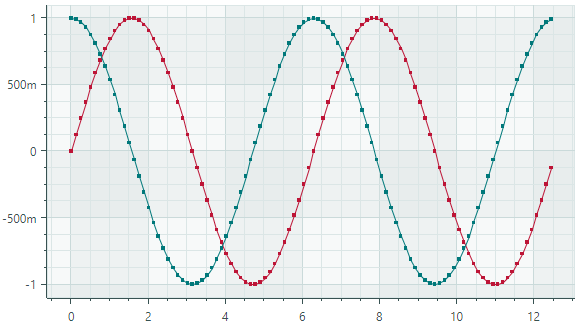
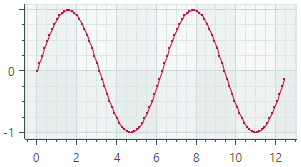
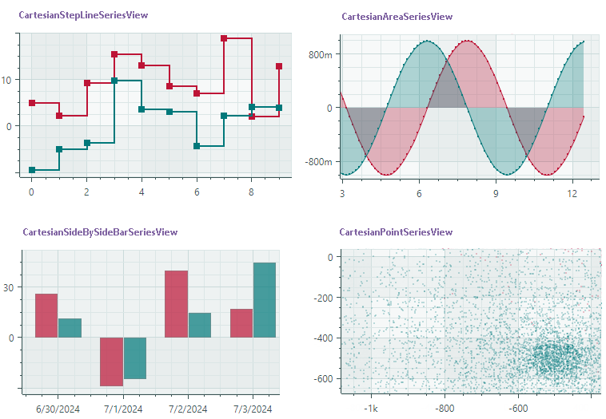

# Get Started with Charts - MVVM Pattern

You can populate Chart Controls with data using the MVVM design pattern. This is helpful when you need to display multiple data series.

This tutorial shows how to paint two line charts in the [`CartesianChart`](../../API/Eremex.AvaloniaUI.Charts/CartesianChart.md) control using the MVVM pattern. Data for line charts in this example is calculated using math functions (sine and cosine). 
You can find the complete code of this tutorial in the _Cartesian Chart&rarr;Line_ module of the Demo application.



## Define View Models

Start by defining View Models that provide data and series settings for a chart control.

- _CartesianLineSeriesViewViewModel_ — The main View Model that will be set as a chart control's Data Context. The main View Model exposes the _CartesianLineSeriesViewViewModel.Series_ property which specifies a collection of data series' View Models.

- _SeriesViewModel_ — A View Model for a data series.


``` cs
// The main View Model
public partial class CartesianLineSeriesViewViewModel : ChartsPageViewModel
{
    static double Sin(double argument) => Math.Sin(argument);
    static double Cos(double argument) => Math.Cos(argument);

    const int ItemCount = 100;
    const double Step = 4 * Math.PI / ItemCount;

    // A collection of View Models used to create data series.
    [ObservableProperty] ObservableCollection<SeriesViewModel> series = new()
    {
        new SeriesViewModel { Color = Color.FromArgb(255, 189, 20, 54), DataAdapter = new FormulaDataAdapter(0, Step, ItemCount, Sin)},
        new SeriesViewModel { Color = Color.FromArgb(255, 0, 120, 122), DataAdapter = new FormulaDataAdapter(0, Step, ItemCount, Cos)},
    };
}

// A View Model for a data series.
public partial class SeriesViewModel : ObservableObject
{
    [ObservableProperty] string axisXKey;
    [ObservableProperty] string axisYKey;
    [ObservableProperty] Color color;
    [ObservableProperty] ISeriesDataAdapter dataAdapter;
}
```

The _CartesianLineSeriesViewViewModel.Series_ collection is initialized with two series View Models. The Cartesian Chart will render them as two data series.

A View Model for a data series (_SeriesViewModel_) exposes properties that specify data and color to paint the series in the chart control:

- _Color_ — A color to paint a data series.
- _DataAdapter_ — An [`ISeriesDataAdapter`](../../API/Eremex.AvaloniaUI.Charts/ISeriesDataAdapter.md) object that supplies data for a series. 
  
  Eremex Charts ship with multiple Data Adapters for various data types (numeric, date-time, and qualitative). All Data Adapters implement the [`ISeriesDataAdapter`](../../API/Eremex.AvaloniaUI.Charts/ISeriesDataAdapter.md) interface.
  
  This tutorial uses a [`Eremex.AvaloniaUI.Charts.FormulaDataAdapter`](../../API/Eremex.AvaloniaUI.Charts/FormulaDataAdapter.md) object. It specifies a function that returns numeric _Y_ values in _Step_ increments. 
  
  A few examples of other Data Adapters include:
  - [`SortedNumericDataAdapter`](../../API/Eremex.AvaloniaUI.Charts/SortedNumericDataAdapter.md) — Supplies (numeric _X_, numeric _Y_) pairs sorted by the _X_ values.
  - [`QualitativeDataAdapter`](../../API/Eremex.AvaloniaUI.Charts/QualitativeDataAdapter.md) — Supplies (string _X_, numeric _Y_) pairs.

  See the following topic for more information: [Cartesian Chart](cartesian-chart.md).

## Create a Chart Control

In XAML, create a [`CartesianChart`](../../API/Eremex.AvaloniaUI.Charts/CartesianChart.md) control and initialize its [`CartesianChart.SeriesSource`](../../API/Eremex.AvaloniaUI.Charts/CartesianChart/SeriesSource.md) and [`CartesianChart.SeriesTemplate`](../../API/Eremex.AvaloniaUI.Charts/CartesianChart/SeriesTemplate.md) properties:

- [`CartesianChart.SeriesSource`](../../API/Eremex.AvaloniaUI.Charts/CartesianChart/SeriesSource.md) — The collection of View Models representing data series (the _CartesianLineSeriesViewViewModel.Series_ collection storing _SeriesViewModel_ objects).
  
  It is assumed that a chart control's Data Context is set to a _CartesianLineSeriesViewViewModel_ object.

- [`CartesianChart.SeriesTemplate`](../../API/Eremex.AvaloniaUI.Charts/CartesianChart/SeriesTemplate.md) - A template that creates a [`CartesianSeries`](../../API/Eremex.AvaloniaUI.Charts/CartesianSeries.md) object from a series View Model. The [`CartesianSeries`](../../API/Eremex.AvaloniaUI.Charts/CartesianSeries.md) class encapsulates a single data series in the [`CartesianChart`](../../API/Eremex.AvaloniaUI.Charts/CartesianChart.md) control.

``` xml
<mxc:CartesianChart Grid.Column="0" Classes="DemoChart" 
 SeriesSource="{Binding Series}" x:Name="chart1">
    <mxc:CartesianChart.SeriesTemplate>
        <DataTemplate x:DataType="vm:SeriesViewModel">
            <mxc:CartesianSeries DataAdapter="{Binding DataAdapter}">
                <mxc:CartesianLineSeriesView Color="{Binding Color}"
                                             ShowMarkers="True"
                                             MarkerSize="4"
                                             Thickness="2"/>
            </mxc:CartesianSeries>
        </DataTemplate>
    </mxc:CartesianChart.SeriesTemplate>
</mxc:CartesianChart>
```

When you create a [`CartesianSeries`](../../API/Eremex.AvaloniaUI.Charts/CartesianSeries.md) object, initialize the following properties to specify the series data and view:

- [`CartesianSeries.DataAdapter`](../../API/Eremex.AvaloniaUI.Charts/Series/DataAdapter.md) — The Data Adapter that supplies data. Set this property to the _DataAdapter_ property defined in the View Model.
- [`CartesianSeries.View`](../../API/Eremex.AvaloniaUI.Charts/CartesianSeries/View.md) — The series view, which determines the visual representation of the data series. 

## Customize a Series View

The [`CartesianSeries.View`](../../API/Eremex.AvaloniaUI.Charts/CartesianSeries/View.md) property specifies the visual representation of the data series. In XAML, you can specify a view as the content of the [`CartesianSeries`](../../API/Eremex.AvaloniaUI.Charts/CartesianSeries.md) object.

``` xml
<mxc:CartesianSeries DataAdapter="{Binding DataAdapter}">
    <mxc:CartesianLineSeriesView Color="{Binding Color}"
                                    ShowMarkers="True"
                                    MarkerSize="4"
                                    Thickness="2"/>
</mxc:CartesianSeries>
```

In this tutorial, the [`CartesianSeries.View`](../../API/Eremex.AvaloniaUI.Charts/CartesianSeries/View.md) property is initialized with a [`CartesianLineSeriesView`](../../API/Eremex.AvaloniaUI.Charts/CartesianLineSeriesView.md) object to render data as a line connecting underlying data points.



To present data in a different way in your projects, use other series views ([`SeriesViewBase`](../../API/Eremex.AvaloniaUI.Charts/SeriesViewBase.md) class descendants). A few examples of available series views are shown below:




A series view contains settings that allow you to change the display style of the series. 

``` xml
<mxc:CartesianLineSeriesView Color="{Binding Color}"
                             ShowMarkers="True"
                             MarkerSize="4"
                             Thickness="2"/>
```

For instance, the [`CartesianLineSeriesView`](../../API/Eremex.AvaloniaUI.Charts/CartesianLineSeriesView.md) class exposes the following properties:

- [`Color`](../../API/Eremex.AvaloniaUI.Charts/CartesianPointSeriesView/Color.md) — A color to paint the series.
- [`CrosshairMode`](../../API/Eremex.AvaloniaUI.Charts/CartesianSortedLineSeriesView/CrosshairMode.md) — Specifies whether to display an interpolated _Y_ value or the _Y_ value of the nearest point when the crosshair feature is active and the [`ShowInCrosshair`](../../API/Eremex.AvaloniaUI.Charts/CrosshairSeriesViewBase/ShowInCrosshair.md) option is `true`.
- [`MarkerSize`](../../API/Eremex.AvaloniaUI.Charts/CartesianPointSeriesView/MarkerSize.md) — Specifies the size of the point marker.
- [`MarkerImage`](../../API/Eremex.AvaloniaUI.Charts/CartesianPointSeriesView/MarkerImage.md) — Allows you to specify a custom image to use as data point markers. To assign SVG images, use `SvgImage` class objects.
- [`MarkerImageCss`](../../API/Eremex.AvaloniaUI.Charts/CartesianPointSeriesView/MarkerImageCss.md) — The CSS code that allows you to customize colors of elements in the specified SVG image ([`MarkerImage`](../../API/Eremex.AvaloniaUI.Charts/CartesianPointSeriesView/MarkerImage.md)).
- [`ShowInCrosshair`](../../API/Eremex.AvaloniaUI.Charts/CrosshairSeriesViewBase/ShowInCrosshair.md) — Specifies whether to display the chart's _Y_ value at the intersection of the vertical crosshair line with the graph.
- [`ShowMarkers`](../../API/Eremex.AvaloniaUI.Charts/CartesianLineSeriesViewBase/ShowMarkers.md) — Enables or disables point markers.
- `Thickness` — Specifies the line thickness.

<!-- TODO
Desribe MarkerImage and MarkerImageCss in greater detail.
 -->


## Create Chart Axes

The [`CartesianChart`](../../API/Eremex.AvaloniaUI.Charts/CartesianChart.md) control automatically creates cartesian axes (the X-axis and Y-axis) if you do not define them manually. If you want to customize axes in XAML, add [`AxisX`](../../API/Eremex.AvaloniaUI.Charts/AxisX.md) and/or [`AxisY`](../../API/Eremex.AvaloniaUI.Charts/AxisY.md) objects to the [`CartesianChart.AxesX`](../../API/Eremex.AvaloniaUI.Charts/CartesianChart/AxesX.md)/[`CartesianChart.AxesY`](../../API/Eremex.AvaloniaUI.Charts/CartesianChart/AxesY.md) collections, and then modify axis settings.

<!-- TODO
how to define an axis for the second series

check the text: automatically creates cartesian axes (the X-axis and Y-axis) if you do not define them manually. If you want to customize axes in XAML, add them to the [`CartesianChart.AxesX`](../../API/Eremex.AvaloniaUI.Charts/CartesianChart/AxesX.md) and [`CartesianChart.AxesY`](../../API/Eremex.AvaloniaUI.Charts/CartesianChart/AxesY.md) collections, and then modify settings of these axes.
 -->


``` xml
 <mxc:CartesianChart Grid.Column="0" Classes="DemoChart" SeriesSource="{Binding Series}" x:Name="chart1">
    <!-- ... -->
    <mxc:CartesianChart.AxesX>
        <mxc:AxisX ShowTitle="True"  />
    </mxc:CartesianChart.AxesX>
    <mxc:CartesianChart.AxesY>
        <mxc:AxisY ShowTitle="False" />
    </mxc:CartesianChart.AxesY>
</mxc:CartesianChart>
``` 

The following list shows basic settings of cartesian axes:

- [`ConstantLines`](../../API/Eremex.AvaloniaUI.Charts/Axis/ConstantLines.md) and [`ConstantLinesSource`](../../API/Eremex.AvaloniaUI.Charts/Axis/ConstantLinesSource.md) — Allows you to paint constant lines for specific values. See also [`Strips`](../../API/Eremex.AvaloniaUI.Charts/Axis/Strips.md) and [`StripsSource`](../../API/Eremex.AvaloniaUI.Charts/Axis/StripsSource.md).
- [`EnableScrolling`](../../API/Eremex.AvaloniaUI.Charts/Axis/EnableScrolling.md) —  Allows a user to scroll the axis with a mouse drag operation.
- [`EnableZooming`](../../API/Eremex.AvaloniaUI.Charts/Axis/EnableZooming.md) —  Allows a user to zoom the axis.
- [`MinorCount`](../../API/Eremex.AvaloniaUI.Charts/Axis/MinorCount.md) — Specifies the number of minor tickmarks and grid lines.
- [`Position`](../../API/Eremex.AvaloniaUI.Charts/CartesianAxis/Position.md) — Specifies the position of the axis. Available options include: `Near` (the X-axis is displayed at the bottom, and the Y-axis is displayed at the chart's left edge), and `Far` (the X-axis is displayed at the top, and the Y-axis is displayed at the chart's right edge).
- `Range` — The value range settings.
- [`ScaleOptions`](../../API/Eremex.AvaloniaUI.Charts/ScaleOptions.md) — Specifies the scale settings.
- [`ShowAxisLine`](../../API/Eremex.AvaloniaUI.Charts/Axis/ShowAxisLine.md) — Specifies the visibility of the axis line.
- [`ShowInterlacing`](../../API/Eremex.AvaloniaUI.Charts/Axis/ShowInterlacing.md) — Specifies whether to paint interlaced strip lines between major gridlines.
- [`ShowLabels`](../../API/Eremex.AvaloniaUI.Charts/Axis/ShowLabels.md) — Specifies the visibility of the labels corresponding to major tickmarks.
- [`ShowMajorGridlines`](../../API/Eremex.AvaloniaUI.Charts/Axis/ShowMajorGridlines.md) — Specifies the visibility of the grid lines corresponding to major tickmarks.
- [`ShowMajorTickmarks`](../../API/Eremex.AvaloniaUI.Charts/Axis/ShowMajorTickmarks.md) — Specifies the visibility of the major tickmarks.
- [`ShowMinorGridlines`](../../API/Eremex.AvaloniaUI.Charts/Axis/ShowMinorGridlines.md) — Specifies the visibility of the grid lines corresponding to minor tickmarks.
- [`ShowMinorTickmarks`](../../API/Eremex.AvaloniaUI.Charts/Axis/ShowMinorTickmarks.md) — Specifies the visibility of the minor tickmarks.
- [`ShowTitle`](../../API/Eremex.AvaloniaUI.Charts/CartesianAxis/ShowTitle.md) — Specifies the visibility of the axis title (the [`Title`](../../API/Eremex.AvaloniaUI.Charts/CartesianAxis/Title.md) property).
- [`Strips`](../../API/Eremex.AvaloniaUI.Charts/Axis/Strips.md) and [`StripsSource`](../../API/Eremex.AvaloniaUI.Charts/Axis/StripsSource.md) —  Allows you to fill ranges between specific values. See also [`ConstantLines`](../../API/Eremex.AvaloniaUI.Charts/Axis/ConstantLines.md) and [`ConstantLinesSource`](../../API/Eremex.AvaloniaUI.Charts/Axis/ConstantLinesSource.md).
- [`Thickness`](../../API/Eremex.AvaloniaUI.Charts/Axis/Thickness.md) — The thickness of the axis line.
- [`Title`](../../API/Eremex.AvaloniaUI.Charts/CartesianAxis/Title.md) — Gets or sets the title for the axis.
- [`TitlePosition`](../../API/Eremex.AvaloniaUI.Charts/CartesianAxis/TitlePosition.md) — Specifies the position of the axis title.


## Result

Run the application to see the result of this tutorial. The [`CartesianChart`](../../API/Eremex.AvaloniaUI.Charts/CartesianChart.md) control displays two data series using the Line series view. 


## Complete Code

You can find the complete code of this tutorial in the _Cartesian Chart&rarr;Line_ module of the Demo application.

