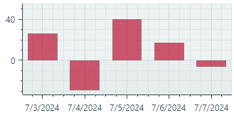
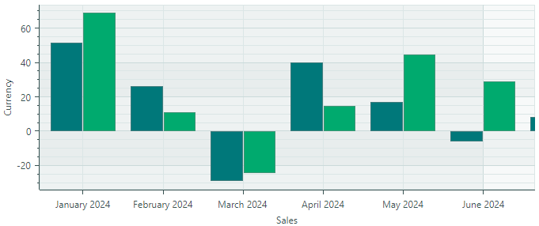
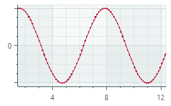
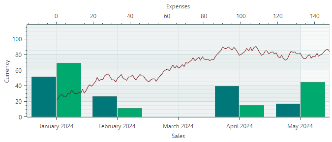
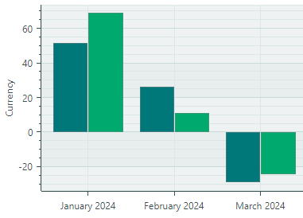

# Get Started with Charts

This tutorial shows how to display three data series within a `CartesianChart` control, using the Bar and Line series views.


First, we'll define data for a chart control (in View Model objects), and then bind the chart control to this data.

Next, we'll define and customize the default axes, and show how to add an additional _X_ axis and associate it with a specific series.

## Define a View Model for a Series

Start by creating a View Model for a single series. 

``` cs
using Eremex.AvaloniaUI.Charts;

public partial class SeriesViewModel : ObservableObject
{
    [ObservableProperty] Color color;
    [ObservableProperty] ISeriesDataAdapter dataAdapter;
}
```

The _SeriesViewModel_ class exposes two properties that specify the color and data for a series.

Data for a chart control's series is supplied using _Data Adapter_ objects. 
Eremex Charts support multiple Data Adapters for various data types (numeric, date-time, and qualitative). In this tutorial, we'll use two Data Adapters:

- `SortedNumericDataAdapter` — Supplies (numeric _X_, numeric _Y_) pairs sorted by the _X_ values.
- `SortedDateTimeDataAdapter` — Supplies (DateTime _X_, numeric _Y_) pairs sorted by the _X_ values.

These Data Adapters are initialized in the main View Model.

For information on other Data Adapters, see [Cartesian Chart](cartesian-chart.md).

## Define the Main View Model

Create the _MainWindowViewModel_ class which encapsulates the main View Model for the Window. A _MainWindowViewModel_ instance will be set as the window's (and the chart control's) `DataContext`.

Add three _SeriesViewModel_ properties to the _MainWindowViewModel_ class. They describe three data series in the target chart control.

``` cs
public partial class MainWindowViewModel : ViewModelBase
{
    [ObservableProperty] SeriesViewModel barSeries1; 
    [ObservableProperty] SeriesViewModel barSeries2; 
    [ObservableProperty] SeriesViewModel lineSeries;
}
```

Initialize these objects in the View Model's constructor, and specify the colors and Data Adapters for the series. 

``` cs
public partial class MainWindowViewModel : ViewModelBase
{
    public MainWindowViewModel()
    {
        //Init data
        var random = new Random(4);
        var random2 = new Random(0);

        var startDate = new DateTime(DateTime.Now.Year, 1, 1);
        SortedDateTimeDataAdapter barSeries1DataAdapter = new();
        SortedDateTimeDataAdapter barSeries2DataAdapter = new();
        SortedNumericDataAdapter lineSeriesDataAdapter = new();
        for (int i = 0; i < 12; i++)
        {
            var argument = startDate.AddMonths(i);
            barSeries1DataAdapter.Add(argument, random.NextDouble() * 100 - 30);
            barSeries2DataAdapter.Add(argument, random.NextDouble() * 100 - 30);
        }
        double startValue = 20;
        for (int i = 0; i < 365; i++)
        {
            var argument = i;
            var value = startValue + (random2.NextDouble() - 0.5) * 10;
            lineSeriesDataAdapter.Add(argument, value);
            startValue = value;
        }
        // Create data series
        BarSeries1 = new() { Color = Color.FromArgb(255, 0, 120, 122), DataAdapter = barSeries1DataAdapter };
        BarSeries2 = new() { Color = Color.FromArgb(255, 0, 170, 110), DataAdapter = barSeries2DataAdapter };
        LineSeries = new() { Color = Color.FromArgb(255, 120, 10, 12), DataAdapter = lineSeriesDataAdapter };
    }

    [ObservableProperty] SeriesViewModel barSeries1; 
    [ObservableProperty] SeriesViewModel barSeries2; 
    [ObservableProperty] SeriesViewModel lineSeries;
}
```

Data Adapters are populated with random data:

- The `SortedDateTimeDataAdapter` objects are filled with 12 points that correspond to 12 months of the year. The _X_ values of the `SortedDateTimeDataAdapter` objects are `DateTime` values.

- The `SortedNumericDataAdapter` object is populated with 365 points that correspond to the days of the year. The _X_ values of the `SortedNumericDataAdapter` object are numeric values.


## Create a Cartesian Chart Control

Ensure that the DataContext of the window and the chart control is set to a _MainWindowViewModel_ object.


Open the MainWindow XAML file, and define a `CartersianChart` control with two series as follows:

``` xml
xmlns:mxc="https://schemas.eremexcontrols.net/avalonia/charts"             

<mxc:CartesianChart>
    <mxc:CartesianChart.Series>
        <mxc:CartesianSeries Name="barSeries1" DataAdapter="{Binding BarSeries1.DataAdapter}" >
        </mxc:CartesianSeries>

        <mxc:CartesianSeries Name="barSeries2" DataAdapter="{Binding BarSeries2.DataAdapter}" >
        </mxc:CartesianSeries>
    </mxc:CartesianChart.Series>
</mxc:CartesianChart>
```

This code adds two series (`CartesianSeries` objects) to the `CartesianChart.Series` collection, and binds them to corresponding data adapters in the main  View Model.

### Specify a Series View

A **series view** determines the visual appearance and settings of the series. The Cartesian Chart supports multiple series views: Line, Scatter Line, Range Area, Bar, Range Bar, etc. See the following topic for more information: [Cartesian Chart](cartesian-chart.md).

Let's apply the Bar series view to the series. For this purpose, define a `CartesianSideBySideBarSeriesView` object as a `CartesianSeries` object's content. 

``` xml
<mxc:CartesianChart>
    <mxc:CartesianChart.Series>
        <mxc:CartesianSeries Name="barSeries1" DataAdapter="{Binding BarSeries1.DataAdapter}" >
            <mxc:CartesianSideBySideBarSeriesView Color="{Binding BarSeries1.Color}" />
        </mxc:CartesianSeries>
        <mxc:CartesianSeries Name="barSeries2" DataAdapter="{Binding BarSeries2.DataAdapter}" >
            <mxc:CartesianSideBySideBarSeriesView Color="{Binding BarSeries2.Color}" />
        </mxc:CartesianSeries>
    </mxc:CartesianChart.Series>
</mxc:CartesianChart>
```

`CartesianSideBySideBarSeriesView` renders points as rectangular bars:



The series view's `Color` setting allows you to specify the color to render the associated series.


## Create and Customize Default Axes

Cartesian Chart can automatically create axes for underlying data. You may need to manually define the _X_ and _Y_ axes if you want to customize axis settings (for instance, specify a title and scale options). 

To define axes, add `AxisX` and/or `AxisY` objects to the `CartesianChart.AxesX`/`CartesianChart.AxesY` collections:

``` xml
<mxc:CartesianChart>
    <!-- ... -->
    <mxc:CartesianChart.AxesX>
        <mxc:AxisX Name="salesAxis" Title="Sales">
            <mxc:AxisX.ScaleOptions>
                <mxc:DateTimeScaleOptions MeasureUnit="Month" />
            </mxc:AxisX.ScaleOptions>
        </mxc:AxisX>
    </mxc:CartesianChart.AxesX>

    <mxc:CartesianChart.AxesY>
        <mxc:AxisY Title="Currency"/>
    </mxc:CartesianChart.AxesY>
</mxc:CartesianChart>
```

The code above creates the _X_ and _Y_ axes, and specifies titles for them. 

Since the underlying data points represent values for individual months, the `Month` time unit is applied to the horizontal date-time axis (using the `AxisX.ScaleOptions` property). 

If you run the application now, you'll see the following result:




## Add an Additional Series and _X_ Axis

You can add as many series to the chart control as you want. These series can use either default or their own axes. 

Let's add a Line Series and an axis for it to the chart. 

First, create a new `CartesianSeries` object in the `CartesianChart.Series` collection, and bind it to the _LineSeries.DataAdapter_ object defined in the View Model.

``` xml
<mxc:CartesianChart>
    <mxc:CartesianChart.Series>
        <!-- ... -->
        <mxc:CartesianSeries Name="lineSeries" DataAdapter="{Binding LineSeries.DataAdapter}" >
        </mxc:CartesianSeries> 
    </mxc:CartesianChart.Series>
</mxc:CartesianChart>
```

### Specify a Line Series View

To apply the Line Series View to this series, define a `CartesianLineSeriesView` object as the series' content:

``` xml
<mxc:CartesianSeries Name="lineSeries" DataAdapter="{Binding LineSeries.DataAdapter}" >
    <mxc:CartesianLineSeriesView Color="{Binding LineSeries.Color}" />
</mxc:CartesianSeries> 
```

`CartesianLineSeriesView` is a series view that connects points with lines:



As with any series view, you can use the `CartesianLineSeriesView.Color` property to specify the paint color of the series.

### Specify its Own Axis for the Line Series

The _X_ values of the Line series are of the numeric type, while the existing horizontal axis displays `DateTime` values. Thus, an additional numeric axis is required for the Line series. 

Define a new numeric _X_ axis in the `CartesianChart.AxesX` collection.

``` xml
<mxc:CartesianChart.AxesX>
    <!-- ... -->
    <mxc:AxisX Position="Far" Title="Expenses">
        <mxc:AxisX.ScaleOptions>
            <mxc:NumericScaleOptions />
        </mxc:AxisX.ScaleOptions>
    </mxc:AxisX>
</mxc:CartesianChart.AxesX>
```


The axis's `Position` property is set to `Far` to display the axis at the edge opposite to the default position. For a horizontal axis, the `Far` option corresponds to the chart's top edge. For a vertical axis, the `Far` option places the axis at the chart's right edge.

Now we need to associate the Line series with its axis. This is accomplished by specifying the axis ID (a unique string value). Set the same ID to the `Key` property of the axis and the `CartesianSeries.AxisXKey`/`CartesianSeries.AxisYKey` property of the series. 

In this tutorial, specify the _"lineSeriesAxis"_ ID for the series and axis, as follows:

``` xml
<mxc:CartesianSeries Name="lineSeries" DataAdapter="{Binding LineSeries.DataAdapter}"  
  AxisXKey="lineSeriesAxis">
    <mxc:CartesianLineSeriesView Color="{Binding LineSeries.Color}" />
</mxc:CartesianSeries>

<mxc:CartesianChart.AxesX>
    <!-- ... -->
    <mxc:AxisX Position="Far" Title="Expenses"
       Key="lineSeriesAxis">
        <mxc:AxisX.ScaleOptions>
            <mxc:NumericScaleOptions />
        </mxc:AxisX.ScaleOptions>
    </mxc:AxisX>
</mxc:CartesianChart.AxesX>
```

You can run the application to see the chart control displaying three series:




## Create a Custom Label Formatter

`CartesianChart` formats labels for major tickmarks based on the axis scaling options. The following image shows label formatting when the `Month` time unit is applied to the _X_ axis:



The `ScaleOptions.LabelFormatter` property of an axis allows you to change the display format of the labels. You can use the `Eremex.AvaloniaUI.Charts.FuncLabelFormatter` class as a label formatter, or create a custom label formatter by implementing the `IAxisLabelFormatter` interface.

We'll use the `FuncLabelFormatter` class to create short labels for date-time values of the _X_ axis. In the main View Model, implement a property of the `FuncLabelFormatter` type that formats labels in a specific manner. In XAML, bind the axis's `ScaleOptions.LabelFormatter` option to this formatter.


``` xml
<mxc:AxisX Name="salesAxis" Title="Sales">
    <mxc:AxisX.ScaleOptions>
        <mxc:DateTimeScaleOptions MeasureUnit="Month" LabelFormatter="{Binding MonthFormatter}" />
    </mxc:AxisX.ScaleOptions>
</mxc:AxisX>
```

``` cs
public partial class MainWindowViewModel : ViewModelBase
{
    // ...
    [ObservableProperty] FuncLabelFormatter monthFormatter = new(o => String.Format("{0:MMM} {0:yy}", o));
}
```

## Result

Now you can run the application to see the result of this tutorial. The `CartesianChart` control displays three data series using the Bar and Line series views. The Line series is associated with its own _X_ axis displayed at the top of the chart. 


## Complete Code

``` xml
<mx:MxWindow xmlns="https://github.com/avaloniaui"
        xmlns:x="http://schemas.microsoft.com/winfx/2006/xaml"
        xmlns:vm="using:EremexChartsSample.ViewModels"
        xmlns:d="http://schemas.microsoft.com/expression/blend/2008"
        xmlns:mc="http://schemas.openxmlformats.org/markup-compatibility/2006"
        xmlns:mx="https://schemas.eremexcontrols.net/avalonia"
        xmlns:mxc="https://schemas.eremexcontrols.net/avalonia/charts"             
        mc:Ignorable="d" d:DesignWidth="800" d:DesignHeight="450"
        x:Class="EremexChartsSample.Views.MainWindow"
        x:DataType="vm:MainWindowViewModel"
        
        Title="EremexChartsSample">

    <Design.DataContext>
        <!-- This only sets the DataContext for the previewer in an IDE,
             to set the actual DataContext for runtime, set the DataContext property in code (look at App.axaml.cs) -->
        <vm:MainWindowViewModel/>
    </Design.DataContext>

    <mxc:CartesianChart Name="chart1">
        <mxc:CartesianChart.Series>
            <mxc:CartesianSeries Name="barSeries1" DataAdapter="{Binding BarSeries1.DataAdapter}" >
                <mxc:CartesianSideBySideBarSeriesView Color="{Binding BarSeries1.Color}" BarWidth="1" />
            </mxc:CartesianSeries>
            <mxc:CartesianSeries Name="barSeries2" DataAdapter="{Binding BarSeries2.DataAdapter}" >
                <mxc:CartesianSideBySideBarSeriesView Color="{Binding BarSeries2.Color}" />
            </mxc:CartesianSeries>
            <mxc:CartesianSeries Name="lineSeries" DataAdapter="{Binding LineSeries.DataAdapter}"  AxisXKey="lineSeriesAxis" >
                <mxc:CartesianLineSeriesView Color="{Binding LineSeries.Color}" />
            </mxc:CartesianSeries>
        </mxc:CartesianChart.Series>

        <mxc:CartesianChart.AxesX>
            <mxc:AxisX Name="salesAxis" Title="Sales">
                <mxc:AxisX.ScaleOptions>
                    <mxc:DateTimeScaleOptions MeasureUnit="Month" LabelFormatter="{Binding MonthFormatter}" />
                </mxc:AxisX.ScaleOptions>
            </mxc:AxisX>
            <mxc:AxisX Key="lineSeriesAxis" Position="Far" Title="Expenses">
                <mxc:AxisX.ScaleOptions>
                    <mxc:NumericScaleOptions />
                </mxc:AxisX.ScaleOptions>
            </mxc:AxisX>
        </mxc:CartesianChart.AxesX>

        <mxc:CartesianChart.AxesY>
            <mxc:AxisY Title="Currency"/>
        </mxc:CartesianChart.AxesY>
            
    </mxc:CartesianChart>
</mx:MxWindow>
```

``` cs
using Avalonia.Media;
using CommunityToolkit.Mvvm.ComponentModel;
using Eremex.AvaloniaUI.Charts;
using System;

namespace EremexChartsSample.ViewModels;

public partial class MainWindowViewModel : ViewModelBase
{
    public MainWindowViewModel()
    {
        //Init data
        var random = new Random(4);
        var random2 = new Random(0);

        var startDate = new DateTime(DateTime.Now.Year, 1, 1);
        SortedDateTimeDataAdapter barSeries1DataAdapter = new();
        SortedDateTimeDataAdapter barSeries2DataAdapter = new();
        SortedNumericDataAdapter lineSeriesDataAdapter = new();
        for (int i = 0; i < 12; i++)
        {
            var argument = startDate.AddMonths(i);
            barSeries1DataAdapter.Add(argument, random.NextDouble() * 100 - 30);
            barSeries2DataAdapter.Add(argument, random.NextDouble() * 100 - 30);

        }

        double startValue = 20;
        for (int i = 0; i < 365; i++)
        {
            var argument = i;
            var value = startValue + (random2.NextDouble() - 0.5) * 10;
            lineSeriesDataAdapter.Add(argument, value);
            startValue = value;
        }

        // Create data series
        BarSeries1 = new() { Color = Color.FromArgb(255, 0, 120, 122), DataAdapter = barSeries1DataAdapter };
        BarSeries2 = new() { Color = Color.FromArgb(255, 0, 170, 110), DataAdapter = barSeries2DataAdapter };
        LineSeries = new() { Color = Color.FromArgb(255, 120, 10, 12), DataAdapter = lineSeriesDataAdapter };
    }

    [ObservableProperty] SeriesViewModel barSeries1; 
    [ObservableProperty] SeriesViewModel barSeries2; 
    [ObservableProperty] SeriesViewModel lineSeries;

    [ObservableProperty] CustomLabelFormatter monthFormatter = new(o => String.Format("{0:MMM} {0:yy}", o));
}

public partial class SeriesViewModel : ObservableObject
{
    [ObservableProperty] Color color;
    [ObservableProperty] ISeriesDataAdapter dataAdapter;
}

public class CustomLabelFormatter : IAxisLabelFormatter
{
    readonly Func<object, string> formatFunc;

    public CustomLabelFormatter(Func<object, string> formatFunc)
    {
        this.formatFunc = formatFunc;
    }
    public string Format(object value) => 
        formatFunc(value);
}
```