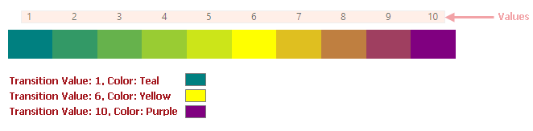
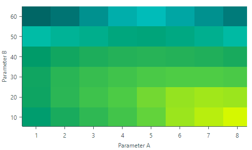
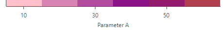
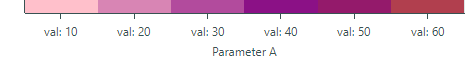
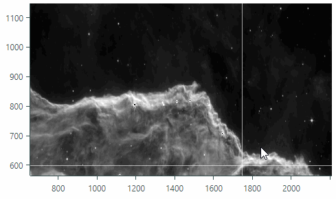
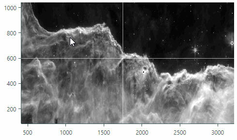

# Heatmap

The Heatmap control (`Eremex.AvaloniaUI.Charts.Heatmap`) allows you to create a two-dimensional [heat map](https://en.wikipedia.org/wiki/Heat_map), a chart that visualizes data using color. 
The control paints each data point within a 2D "map" with a color that corresponds to a value at this point.

Heatmap control is a `Eremex.AvaloniaUI.Charts.ChartControl` descendant, which is the base class for all chart controls, including `CartersianChart` and `PolarChart`. Thus, it inherits specific functionality common to all chart controls. The Heatmap control's features include:

- Custom color encoding
- Grayscale colorization
- Customization of the X and Y axes
- Crosshair 
- Strips and constant lines
- Scroll and zoom with the mouse and keyboard
- Export the result of data colorization to a bitmap


## Demo Application

See the Eremex Controls Demo application for examples that demonstrate the Heatmap control's features in action.

## Get Started with Heatmap Control

To set up a Heatmap control, [provide data](#provide-data) to the control, and [specify a color provider](#data-point-value-colorization) that colors values of data points according to specific logic. You can also customize axes to display the axis values and, for example, constant lines.

Note that the _X_ and _Y_ axes in the Heatmap control are qualitative. The arguments of these axes are of the string type.
The values of the data points within the "map" are of the Double type.


## Provide Data

Set the `Heatmap.DataAdapter` property to a `Eremex.AvaloniaUI.Charts.HeatmapDataAdapter` object to supply data to a Heatmap control. 
The `HeatmapDataAdapter` class contains the following main properties that need to be initialized:

``` cs
public class HeatmapDataAdapter : ISeriesDataAdapter
{
    public IList<string> XArguments;
    public IList<string> YArguments;
    public double[,] Values;
    //...
}
```

- `XArguments` — A list of strings that specify arguments of the _X_ axis. The _X_ arguments must be unique.
- `YArguments` — A list of strings that specify arguments of the _Y_ axis. The _Y_ arguments must be unique.
- `Values` — A two-dimensional array of values of the Double type. 
    
    The width and height of the `Values` array must match the number of items in the `XArguments` and `YArguments` list, respectively.
    
    The `Values` array may contain the `Double.NaN` value for specific points. These points are not rendered by the Heatmap control, and a user can see the control's background through these points.

    Rows of the `Values` array are rendered by the Heatmap control from bottom to top.
    The first row of the `Values` array is rendered at the bottom, and the last row at the top. See the example below for details.

Use the following methods to update data for the Heatmap control at runtime:

- `HeatmapDataAdapter.UpdateValues(double[,] newValues)` — Updates current values (`HeatmapDataAdapter.Values`) with values specified by the method's `newValues` parameter. The number of columns and rows in the `newValues` array must match those in the `HeatmapDataAdapter.Values` array.
- `HeatmapDataAdapter.UpdateXArguments(IList<string> newArguments)` — Updates current _X_ arguments (`HeatmapDataAdapter.XArguments`) with new arguments. The number of elements in the `newArguments` list must match the number of elements in the `HeatmapDataAdapter.XArguments` list. The _X_ arguments must be unique.
- `HeatmapDataAdapter.UpdateYArguments(IList<string> newArguments)` — Updates current _Y_ arguments (`HeatmapDataAdapter.YArguments`) with new arguments. The number of elements in the `newArguments` list must match the number of elements in the `HeatmapDataAdapter.YArguments` list. The _Y_ arguments must be unique.

### Example - Provide data and Use Default Rendering

The following example supplies sample data to a Heatmap control. 
The data represents a two-dimensional array that consists of three rows and five columns.

The control's default color provider (`HeatmapGrayscaleColorProvider`) represents the minimum value in black, and the maximum value in white. Other values are colored in proportional shades of gray.


``` cs
//Create an array that contains 3 rows with 5 values in each row
double[,] values = new double[,] 
{
    {1, 2, 3, 4, 5}, // values rendered at the bottom
    {6, 7, 8, 9, 10},
    {11, 12, 13, 14, 15}, // values rendered at the top
};
List<string> xArgs = new List<string>() { "A", "B", "C", "D", "E" };
List<string> yArgs = new List<string>() { "I", "II", "III" };

HeatmapDataAdapter dataAdapter = new HeatmapDataAdapter(xArgs, yArgs, values);
heatMap1.DataAdapter = dataAdapter;
```


## Data Point Value Colorization

Color providers are used to color data points in a Heatmap control. For each data point, the control requests a color for a specific value from the color provider (the `Heatmap.ColorProvider` property).

The following color providers are available:

- `HeatmapGrayscaleColorProvider` (default) — Allows you to color values in grayscale.
- `HeatmapRangeColorProvider` — Allows you to color data points in a custom manner by associating custom colors with specific values.


When required, you can create your own color provider by implementing the `IHeatmapColorProvider` interface.

## Grayscale Colorization

The Heatmap control uses grayscale coloring of data points by default. Grayscale coloring is implemented by `HeatmapGrayscaleColorProvider`. To use this color provider, you can leave the `Heatmap.ColorProvider` property unassigned, or explicitly set the `Heatmap.ColorProvider` property to a `HeatmapGrayscaleColorProvider` object.

The `HeatmapGrayscaleColorProvider` object renders the minimum value across all data points in black, and the maximum value in white. Other values, which lie between the minimum and maximum values, are rendered in proportional shades of gray.

### Example - Grayscale Colorization

The following example binds a Heatmap control to sample data and renders data points using the default color provider (`HeatmapGrayscaleColorProvider`). The code also shows how to change axis titles.


```xml
xmlns:mxc="https://schemas.eremexcontrols.net/avalonia/charts"

<mxc:Heatmap DataAdapter="{Binding DataAdapter}">
    <mxc:Heatmap.AxisX>
        <mxc:HeatmapAxisX Title="Parameter A">
        </mxc:HeatmapAxisX>
    </mxc:Heatmap.AxisX>
    <mxc:Heatmap.AxisY>
        <mxc:HeatmapAxisY Title="Parameter B">
        </mxc:HeatmapAxisY>
    </mxc:Heatmap.AxisY>
</mxc:Heatmap>
```

```cs
public partial class MainWindowViewModel : ViewModelBase
{
    [ObservableProperty]
    HeatmapDataAdapter dataAdapter;

    public MainWindowViewModel()
    {
        double[,] values = new double[,]
        {
            {148, 169, 185, 199, 213, 223, 228, 233}, // values rendered at the bottom
            {161, 182, 196, 207, 216, 222, 224, 223},
            {162, 181, 191, 198, 205, 208, 208, 205},
            {150, 163, 172, 177, 179, 177, 174, 168},
            {126, 132, 136, 142, 143, 140, 135, 127},
            {95, 97, 101, 105, 107, 104, 101, 98} // values rendered at the top
        };

        List<string> xArgs = new List<string>() { "1", "2", "3", "4", "5", "6", "7", "8" };
        List<string> yArgs = new List<string>() { "10", "20", "30", "40", "50", "60"};

        dataAdapter = new HeatmapDataAdapter(xArgs, yArgs, values);
    }
}
```


## Custom Colorization

To color data points in a Heatmap control in a custom manner, assign a `HeatmapRangeColorProvider` object to the `Heatmap.ColorProvider` property. `HeatmapRangeColorProvider` allows you to associate custom colors with specific values (transition values). To calculate the colors for values that fall between two transition values, `HeatmapRangeColorProvider` uses a gradient between the colors assigned to these transition values.

When specifying transition values, you can specify absolute or normalized magnitudes.

The following image shows how `HeatmapRangeColorProvider` builds color gradients between sample absolute transition values. In this example three transition values are defined:

- Value 1 is associated with the Teal color
- Value 6 is associated with Yellow
- Value 10 is associated with Purple



### Example - Custom Colorization

The following example uses `HeatmapRangeColorProvider` to colorize a Heatmap control's data points according to custom color rules. The code specifies colors to represent the absolute transition values: 95, 110, 150, 210 and 233.
Colors for other values are calculated according to a gradient between the colors assigned to adjacent transition values.




``` xml
xmlns:mxc="https://schemas.eremexcontrols.net/avalonia/charts"

<mxc:Heatmap DataAdapter="{Binding DataAdapter}" ColorProvider="{Binding ColorProvider}">
    <mxc:Heatmap.AxisX>
        <mxc:HeatmapAxisX Title="Parameter A">
        </mxc:HeatmapAxisX>
    </mxc:Heatmap.AxisX>
    <mxc:Heatmap.AxisY>
        <mxc:HeatmapAxisY Title="Parameter B">
        </mxc:HeatmapAxisY>
    </mxc:Heatmap.AxisY>
</mxc:Heatmap>
```

``` cs
public partial class MainWindowViewModel : ViewModelBase
{
    [ObservableProperty]
    HeatmapDataAdapter dataAdapter;

    [ObservableProperty]
    HeatmapRangeColorProvider colorProvider = new HeatmapRangeColorProvider();

    public MainWindowViewModel()
    {
        HeatmapRangeStop[] colorRanges = new HeatmapRangeStop[]
        {
            new() { Value = 95, Color = Color.FromRgb(0,102,101) },
            new() { Value = 110, Color = Color.FromRgb(1,210,207) },
            new() { Value = 150, Color = Color.FromRgb(0,155,105)},
            new() { Value = 210, Color = Color.FromRgb(81,206,68)},
            new() { Value = 233, Color = Color.FromRgb(213,248,0) }
        };
        colorProvider.AddRange(colorRanges);

        double[,] values = new double[,]
        {
            {148, 169, 185, 199, 213, 223, 228, 233}, // values rendered at the bottom
            {161, 182, 196, 207, 216, 222, 224, 223},
            {162, 181, 191, 198, 205, 208, 208, 205},
            {150, 163, 172, 177, 179, 177, 174, 168},
            {126, 132, 136, 142, 143, 140, 135, 127},
            {95, 97, 101, 105, 107, 104, 101, 98}    // values rendered at the top
        };

        List<string> xArgs = new List<string>() { "1", "2", "3", "4", "5", "6", "7", "8" };
        List<string> yArgs = new List<string>() { "10", "20", "30", "40", "50", "60"};

        dataAdapter = new HeatmapDataAdapter(xArgs, yArgs, values);
    }
}
```

### Colors for Values Beyond the Boundary Transition Values

Typically, a `HeatmapRangeColorProvider` object should include colors for the minimum and maximum values of the entire value range. This ensures that the color gradients built by the `HeatmapRangeColorProvider` object cover all values supplied to the Heatmap control.
Otherwise, the values beyond the boundary transition values are colored with the same colors as the boundary transition values.

The following image demonstrates how `HeatmapRangeColorProvider` calculates colors when specific values are beyond the minimum and maximum transition values.


### Normalized Transition Values

If you do not know the minimum and maximum absolute values of the entire data range, you can specify transition values using normalized magnitudes. Set the `HeatmapRangeColorProvider.IsNormalizedValues` property to `true` to enable value normalization for the `HeatmapRangeColorProvider` object. In this mode, specify transition values in the range between `0` and `1`, where `0` and `1` represent the minimum and maximum values, respectively. The normalized value `0.5` represents the absolute value in the middle of the data range (`minimum + (maximum-minimum)/2`).


#### Example - Colorize Data Points if the Minimum and Maximum are not Known Beforehand

The following example uses the `HeatmapRangeColorProvider` object to colorize data points using normalized transition values. The `HeatmapRangeColorProvider.IsNormalizedValues` property is set to `true` to enable value normalization. Transition values are specified in normalized magnitudes: 0, 0.3, 0.7 and 1, where values 0 and 1 represent the minimum and maximum values of the data range.


``` cs
double[,] values = new double[,]
{
    {-5, -4, -3, -2, -1, 0}, // values rendered at the bottom
    {1, 2, 3, 4, 5, 6}       // values rendered at the top
};

List<string> xArgs = new List<string>();

for (int i=1; i <= values.GetLength(1); i++)
{
    xArgs.Add((i*10).ToString());
}

List<string> yArgs = new List<string>() { "p1", "p2" };


HeatmapRangeColorProvider colorProvider = new HeatmapRangeColorProvider();
colorProvider.IsNormalizedValues = true;
HeatmapRangeStop[] colorRanges = new HeatmapRangeStop[]
{
    new() { Value = 0, Color = Colors.Pink },
    new() { Value = 0.3, Color = Colors.Purple},
    new() { Value = 0.7, Color = Colors.Orange },
    new() { Value = 1, Color = Colors.Green},
};
colorProvider.AddRange(colorRanges);

heatmap.ColorProvider = colorProvider;
heatmap.DataAdapter = new HeatmapDataAdapter(xArgs, yArgs, values);
```

## Axes

The Heatmap control contains two axes, _X_ and _Y_. Arguments for these axes are provided with a call to the `HeatmapDataAdapter` constructor, by the `xArguments` and `yArguments` parameters.

``` cs
double[,] values = new double[,] 
{
    {1, 2, 3, 4, 5}, // values rendered at the bottom
    {6, 7, 8, 9, 10},
    {11, 12, 13, 14, 15}, // values rendered at the top
};
List<string> xArgs = new List<string>() { "A", "B", "C", "D", "E" };
List<string> yArgs = new List<string>() { "I", "II", "III" };
//...
HeatmapDataAdapter dataAdapter = new HeatmapDataAdapter(xArgs, yArgs, values);
heatmap.DataAdapter = dataAdapter;
```

- The control's axes are qualitative, which means that their values are of the string type.
- The number of elements in the `yArguments` list must match the number of rows in the two-dimensional data array (`HeatmapDataAdapter.Values`).
- The number of elements in the `xArguments` list must match the number of columns in the two-dimensional data array (`HeatmapDataAdapter.Values`).

You can customize axis settings by specifying the `Heatmap.AxisX` and `Heatmap.AxisY` objects.

The following code sets titles for the axes.

``` xml
xmlns:mxc="https://schemas.eremexcontrols.net/avalonia/charts"

<mxc:Heatmap ...>
    <mxc:Heatmap.AxisX>
        <mxc:HeatmapAxisX Title="Axis X">
        </mxc:HeatmapAxisX>
    </mxc:Heatmap.AxisX>
    <mxc:Heatmap.AxisY>
        <mxc:HeatmapAxisY Title="Axis Y">
        </mxc:HeatmapAxisY>
    </mxc:Heatmap.AxisY>
</mxc:Heatmap>
```


### Axis Scale

You can use the `AxisX.ScaleOptions` and `AxisY.ScaleOptions` properties to customize axis display options. These properties are of the `QualitativeScaleOptions` type.

The following example sets the `GridSpacing` scale option to 2 to display every second label and major tickmark, and skip the labels and tickmarks in between.



``` xml
<mxc:HeatmapAxisX >
    <mxc:HeatmapAxisX.ScaleOptions>
        <mxc:QualitativeScaleOptions GridSpacing="2" />
    </mxc:HeatmapAxisX.ScaleOptions>
</mxc:HeatmapAxisX>
```


#### Format Axis Labels

The `ScaleOptions.LabelFormatter` property allows you to specify an object that formats axis display values in a custom manner. You can implement a custom label formatter based on a function/expression using the `Eremex.AvaloniaUI.Charts.FuncLabelFormatter` object.

The following example implements a custom label formatter for axis values.



``` xml
<mxc:Heatmap Grid.Row="1" Name="heatmap">
    <mxc:Heatmap.AxisX>
        <mxc:HeatmapAxisX Title="Parameter A">
            <mxc:HeatmapAxisX.ScaleOptions>
                <mxc:QualitativeScaleOptions LabelFormatter="{Binding CustomLabelFormatter}" />
            </mxc:HeatmapAxisX.ScaleOptions>
        </mxc:HeatmapAxisX>
    </mxc:Heatmap.AxisX>
</mxc:Heatmap>
```

``` cs
public partial class MainWindowViewModel : ViewModelBase
{
    // ...
    [ObservableProperty] FuncLabelFormatter customLabelFormatter = new(o => String.Format("val: {0}", o));
}
```


### Axis Settings

The following list summarizes display and behavior settings of the Heatmap control's axes:

- `ConstantLines` and `ConstantLinesSource` — Allows you to paint constant lines for specific values. See [Constant Lines and Strips](#constant-lines-and-strips).
- `EnableZooming` —  Allows a user to zoom an axis with the mouse wheel and keyboard.
- `EnableScrolling` —  Allows a user to scroll an axis with a mouse drag operation and keyboard shortcuts.
- `InterlacingColor` - The color used to paint interlaced strip lines (when the `ShowInterlacing` option is enabled).
- `MinorCount` — Specifies the number of minor tickmarks and grid lines.
- `Position` — Specifies the position of the axis. Available options include: `Near` (the X-axis is displayed at the bottom, and the Y-axis is displayed at the chart's left edge), and `Far` (the X-axis is displayed at the top, and the Y-axis is displayed at the chart's right edge).
- `ShowAxisLine` — Specifies the visibility of the axis line.
- `ShowInterlacing` — Specifies whether to paint interlaced strip lines between major gridlines. See `ShowMajorGridlines` for more information.
- `ShowLabels` — Specifies the visibility of the labels corresponding to major tickmarks.
- `ShowMajorGridlines` — Specifies the visibility of the grid lines corresponding to major tickmarks. Major and minor gridlines are displayed behind colored data points. Gridlines are visible in the following cases:
    
    - at positions where data points are rendered using semi-transparent colors.
    - at positions where data points are not rendered (for instance, when a data point's value is `Double.NaN`).
    
- `ShowMajorTickmarks` — Specifies the visibility of the major tickmarks.
- `ShowMinorGridlines` — Specifies the visibility of the grid lines corresponding to minor tickmarks. See `ShowMajorGridlines` for more information.
- `ShowMinorTickmarks` — Specifies the visibility of the minor tickmarks.
- `ShowTitle` — Specifies the visibility of the axis title (the `Title` property).
- `Strips` and `StripsSource` — Allows you to fill ranges between specific values. See [Constant Lines and Strips](#constant-lines-and-strips).
- `Thickness` — The thickness of the axis line.
- `Title` — Gets or sets the title for the axis.
- `TitlePosition` — Gets or sets the position of the axis title.


## Crosshair

A crosshair is a pair of thin vertical and horizontal lines (argument and value lines) that allow a user to see exact values of axes and data points at the current cursor position. The crosshair appears when hovering over the data area, and it follows the mouse pointer.


Use the `Heatmap.CrosshairOptions` property to customize display settings of the crosshair, or disable this feature. 

### Disable the Crosshair

The `CrosshairOptions.ShowCrosshair` property allows you to disable the crosshair.

``` xml
<mxc:Heatmap x:Name="heatmap1" >
    <mxc:Heatmap.CrosshairOptions>
        <mxc:CrosshairOptions ShowCrosshair="False" />
    </mxc:Heatmap.CrosshairOptions>
    <!-- ... -->
</mxc:Heatmap>
```

## Constant Lines and Strips

The Heatmap control allows you to use constant lines and strips to mark specific values and value ranges for the horizontal and vertical axes.

### Constant Lines

A constant line is a line drawn perpendicular to an axis that marks a specific axis value. To create constant lines, use the `ConstantLines` collection or the `ConstantLinesSource` source of the `HeatmapAxisX` and `HeatmapAxisY` objects.

The following example creates constant lines for the _X_ and _Y_ axes to mark axis values "H" and "V", respectively.


``` xml
<mxc:Heatmap Name="heatmap">
    <mxc:Heatmap.AxisX>
        <mxc:HeatmapAxisX Title="Parameter A">
            <mxc:HeatmapAxisX.ConstantLines>
                <mxc:ConstantLine AxisValue="H" ShowTitle="True" Title="Level H" Color="DimGray" ShowBehind="False" />
            </mxc:HeatmapAxisX.ConstantLines>
        </mxc:HeatmapAxisX>
    </mxc:Heatmap.AxisX>
    <mxc:Heatmap.AxisY>
        <mxc:HeatmapAxisY Title="Parameter X">
            <mxc:HeatmapAxisY.ConstantLines>
                <mxc:ConstantLine AxisValue="V" ShowTitle="True" Title="Level V" Color="DimGray" ShowBehind="False" />
            </mxc:HeatmapAxisY.ConstantLines>
        </mxc:HeatmapAxisY>
    </mxc:Heatmap.AxisY>            
</mxc:Heatmap>
```

Set the `ConstantLine.ShowBehind` option to `false` to draw constant lines above colored data points. Otherwise, they are drawn behind data points, and are visible in the following cases:
    
- at positions where data points are rendered using semi-transparent colors.
- at positions where data points are not rendered (for instance, when a data point's value is `Double.NaN`).

### Strips

A strip is an extension of a constant line. Strips are used to highlight ranges of axis values. They are always displayed behind colored data points.

To create strips, use the `Strips` collection or the `StripsSource` source of the `HeatmapAxisX` and `HeatmapAxisY` objects.

``` xml
<mxc:Heatmap.AxisY>
    <mxc:HeatmapAxisY Title="Parameter">
        <mxc:HeatmapAxisY.Strips>
            <mxc:Strip AxisValue1="W" AxisValue2="V" Color="Gray" />
        </mxc:HeatmapAxisY.Strips>
    </mxc:HeatmapAxisY>
</mxc:Heatmap.AxisY>
```

The strips are visible in the following cases:
    
- at positions where data points are rendered using semi-transparent colors.
- at positions where data points are not rendered (for instance, when a data point's value is `Double.NaN`).


## Scroll and Zoom

### Allow Scroll and Zoom Operations

Scroll and zoom operations are enabled by default. The following options allow you to disable these operations for the _X_ and/or _Y_ axes:

- `Axis.EnableZooming`
- `Axis.EnableScrolling`

``` xml
<!-- Disable scroll and zoom operations for the X axis -->
<mxc:Heatmap.AxisX>
    <mxc:HeatmapAxisX EnableZooming="False" EnableScrolling="False"/>
</mxc:Heatmap.AxisX>
<!-- Disable scroll and zoom operations for the Y axis -->
<mxc:Heatmap.AxisY>
    <mxc:HeatmapAxisY EnableZooming="False" EnableScrolling="False"/>
</mxc:Heatmap.AxisY>
```


### Scroll and Zoom by Users

#### Scroll the heat map (the _X_ and _Y_ axes simultaneously)

- Drag the data area with the mouse

    or

- Press Ctrl+ARROW keys to scroll using the keyboard.

<!-- TODO
Make animations for scrolling and zooming features, like in Charts
 -->


#### Zoom the heat map

- Scroll the mouse wheel over the data area

    or

- Press Ctrl+'+' to zoom in, and Ctrl+'-' to zoom out.



#### Scroll an _X_ or _Y_ axis

- Drag with the mouse within a corresponding axis area. 

#### Zoom an _X_ or _Y_ axis

- Scroll the mouse wheel within a corresponding axis area.



#### Zoom into a specific region

- Press and hold SHIFT in the data area, and then drag to select the desired rectangle.

#### Zoom into a value range on an axis

- Press and hold SHIFT in the axis area, and then drag to select the desired range.


### Export

You can use the `Heatmap.Export` method to export the control's rendering to a `WriteableBitmap` object. The resulting bitmap contains colored data points. The size of the bitmap matches the size of the Heatmap control's data specified by the `Heatmap.DataAdapter.Values` array.

The following example saves a Heatmap control's rendering to an image file.

``` cs
WriteableBitmap bitmap = heatmap.Export();
bitmap.Save("exported-heatmap.png");
```