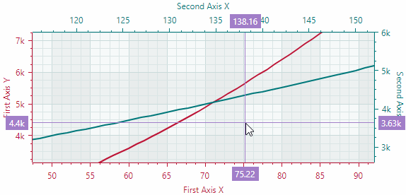

# Scroll and Zoom in a Chart Control

The `CartesianChart` control supports scroll and zoom operations for the entire view and individual axes. A user can zoom and scroll the chart with the mouse and keyboard. In code, these operations are available through a dedicated API.

## Allow Scroll and Zoom Operations

Scroll and zoom operations are enabled by default. The following options allow you to disable these operations for individual axes:

- `Axis.EnableZooming`
- `Axis.EnableScrolling`

``` xml
<mxc:CartesianChart.AxesX>
    <mxc:AxisX ShowTitle="False" EnableScrolling="False" EnableZooming="False" />
</mxc:CartesianChart.AxesX>
```
``` cs
chartControl1.AxesX[0].EnableZooming = false;
```

The chart control's minimum zoom bounds prevent zooming out too far and thus making the view too small. The total axis ranges define the minimum zoom bounds. To specify a total axis range, use the `WholeMin` and `WholeMax` properties of the `AxisX.Range`/`AxisY.Range` objects.

``` xml
<mxc:CartesianChart.AxesY>
    <mxc:AxisY ShowTitle="False">
        <mxc:AxisYRange WholeMin="100" WholeMax="200" AutoCorrectWholeRange="False" AlwaysShowZeroLevel="True" />
    </mxc:AxisY>
</mxc:CartesianChart.AxesY>
```

See the following topic for more information: [Axis Value Range](cartesian-chart.md#axis-value-range)

## Scroll and Zoom by Users

### Scroll all axes simultaneously 

- Drag the diagram area with the mouse

    or

- Press Ctrl+ARROW keys to scroll using the keyboard.


### Zoom all axes simultaneously 

- Scroll the mouse wheel over the diagram area

    or

- Press Ctrl+'+' to zoom in, and Ctrl+'-' to zoom out.


### Scroll an individual axis
- Drag with the mouse within a corresponding axis area. 

### Zoom an individual axis

- Scroll the mouse wheel within a corresponding axis area.



### Zoom into a specific region

- Press and hold SHIFT in the diagram area, and then drag to select the desired rectangle.

### Zoom into a value range on an axis

- Press and hold SHIFT in the axis area, and then drag to select the desired range.


## Scroll and Zoom in Code

### Make a Specific Data Portion Visible

To see a specific data portion in the control's viewport, customize the visible range of the chart control's axes. Use the `VisualMin` and `VisualMax` properties of the `AxisX.Range`/`AxisY.Range` objects to specify the range of values for the viewport.

``` cs
chartControl1.AxesX[0].Range.VisualMin = 10;
chartControl1.AxesX[0].Range.VisualMax = 20;
chartControl1.AxesY[0].Range.VisualMin = -50;
chartControl1.AxesY[0].Range.VisualMax = 50;
```

### Imitate a User Scroll Operation in Code

Use the `CartesianChart.Scroll` method to scroll the series data along specific axes or all axes simultaneously. This method imitates a scroll operation performed by users.

The method's signature is shown below:

``` cs
public void Scroll(double deltaX, double deltaY, IEnumerable<Axis>? axes = null)
```

- `deltaX` — Specifies the number of pixels to scroll along a horizontal axis (axes). Positive values correspond to scrolling to the right; negative values correspond to scrolling to the left.
- `deltaY` — Specifies the number of pixels to scroll along a vertical axis (axes). Positive values correspond to scrolling to the top; negative values correspond to scrolling to the bottom.
- `axes` — The axes along which to scroll the viewport. If this parameter is omitted, the viewport is scrolled along all axes simultaneously.

``` cs
//Scroll along all X axes horizontally by 10 units
chartControl1.Scroll(10, 0);

//Scroll along all Y axes vertically by 10 units
chartControl1.Scroll(0, 10);

//Scroll along the first X axis
AxisX axisX = chartControl1.AxesX[0];
chartControl1.Scroll(10, 0, new[] { axisX });
```

### Imitate a User Zoom Operation in Code

Use the `CartesianChart.Zoom` method to zoom the series data along specific axes or all axes simultaneously. This method imitates zoom operations performed by users.

The method's signature is shown below:

``` cs
public void Zoom(double delta, IEnumerable<Axis>? axes = null)
```

- `delta` — Specifies the number of mouse wheel scroll up/down actions. This value determines a zoom factor. 
    - Positive values correspond to mouse wheel scroll up (zoom in) operations. A value of `1` corresponds to a single scroll up action. 
    - Negative values correspond to mouse wheel scroll down (zoom out) operations. A value of `-1` corresponds to a single scroll down action. 
    
- `axes` — The axes along which to zoom the viewport. If this parameter is omitted, the viewport is zoomed along all axes simultaneously.

``` cs
//Zoom in (imitate a single scroll up action)
chartControl1.Zoom(1);

//Zoom out (imitate a single scroll down action)
chartControl1.Zoom(-1);
```
