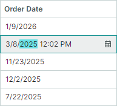
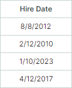
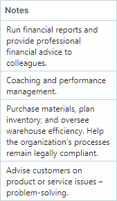
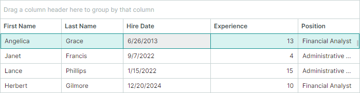
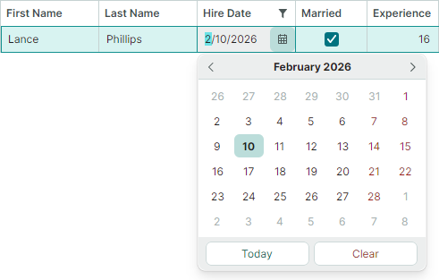
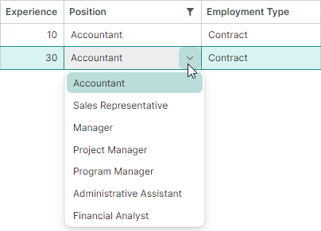

# Cells

Grid cells are used to display and edit row values. They are formed at the intersections of [rows](rows.md) and [columns](columns.md). While cells present the data, their behavior and appearance (for example, in-place editors and formatting settings) are usually defined by the properties of their parent columns. This topic summarizes how to manage and obtain cell content and to customize cell appearance.

## Format Cell Values

The Data Grid control allows you present cell values using common and custom formats. For instance, you can format numeric values as a currency, a percentage, an integer or float number, and so on. A DateTime value can be presented in a short date format, long date format, only time format, etc.

The following approaches are available to format cell values:

- [Use masked input](#use-masked-input)
- [Set a display format](#set-a-display-format)

- [Customize cell display text using an event](#customize-display-text-of-cells)


### Use Masked Input

Eremex editors allow you to use [masks](../editors/masks/index.md) to restrict data input and format numeric and date-time values. Masks are supported both for standalone editors and editors embedded in container controls (DataGrid, TreeList, PropertyGrid, and so on).


*Applicable to*: Cells in display and edit mode. To prevent masks from being applied in display mode (when cell editing is not active), disable the editor's [`MaskUseAsDisplayFormat`](../../API/Eremex.AvaloniaUI.Controls.Editors/TextEditorProperties/MaskUseAsDisplayFormat.md) property.

*Steps*:

1. Assign an Eremex [in-place editor](data-editing/index.md) to a column. 
2. Set the editor's [`MaskType`](../../API/Eremex.AvaloniaUI.Controls.Editors/MaskType.md) property to [`MaskType.Numeric`](../../API/Eremex.AvaloniaUI.Controls.Editors/MaskType.md) or [`MaskType.DateTime`](../../API/Eremex.AvaloniaUI.Controls.Editors/MaskType.md) to apply a mask to numeric or date-time values, respectively.
3. Set the editor's [`Mask`](../../API/Eremex.AvaloniaUI.Controls.Editors/TextEditorProperties/Mask.md) property to the required mask. See the following topics for information on mask specifiers:

    - [Numeric Masks](../editors/masks/numeric-masks.md)
    - [Date-Time Masks](../editors/masks/date-time-masks.md)


#### Example - Custom Format Date-time Values Using Masks

The following example assigns a DateEditor to a column, and applies a custom date-time mask ("MMMM dd, yyyy"). This mask formats cell values in edit and display mode, as shown in the image below:


``` xml
<mxdg:GridColumn FieldName="BirthDate" Width="*" MinWidth="80">
	<mxdg:GridColumn.EditorProperties>
		<mxe:DateEditorProperties MaskType="DateTime" Mask="MMMM dd, yyyy"/>
	</mxdg:GridColumn.EditorProperties>
</mxdg:GridColumn>
```


### Set a Display Format

You can use standard and custom format specifiers to format cell values in display mode. 
    
*Applicable to*: Cells in display mode.

*Drawbacks*: Display formats are not applied in edit mode, nor do they restrict user input. For example, users still able to enter letters in numeric columns that use text editors. To format values in display and edit modes and to restrict data input, use dedicated editors (SpinEditor for numeric values, DateEditor for date-time values) or apply masks to your text editor.

*Steps*:

1. Assign an Eremex [in-place editor](data-editing/index.md) to a column. 
2. Set the editor's display format using its [`DisplayFormatString`](../../API/Eremex.AvaloniaUI.Controls.Editors/BaseEditorProperties/DisplayFormatString.md) property.
3. For editors that use masks for display value formatting, disable the editor's [`MaskUseAsDisplayFormat`](../../API/Eremex.AvaloniaUI.Controls.Editors/TextEditorProperties/MaskUseAsDisplayFormat.md) property. For example, DateEditor and SpinEditor use masks for value formatting in display mode, by default. So, disabling the [`MaskUseAsDisplayFormat`](../../API/Eremex.AvaloniaUI.Controls.Editors/TextEditorProperties/MaskUseAsDisplayFormat.md) property is required for these editors to apply the display format specified by the [`DisplayFormatString`](../../API/Eremex.AvaloniaUI.Controls.Editors/BaseEditorProperties/DisplayFormatString.md) property.

    You can find the description of all display formats in the .NET documentation:

    - [Standard numeric format strings](https://learn.microsoft.com/en-us/dotnet/standard/base-types/standard-numeric-format-strings)
    - [Custom numeric format strings](https://learn.microsoft.com/en-us/dotnet/standard/base-types/custom-numeric-format-strings)
    - [Standard date and time format strings](https://learn.microsoft.com/en-us/dotnet/standard/base-types/standard-date-and-time-format-strings)
    - [Custom date and time format strings](https://learn.microsoft.com/en-us/dotnet/standard/base-types/custom-date-and-time-format-strings)

#### Example - Format Date-Time Values Differently in Display and Edit Modes

The following example assigns a DateEditor in-place editor to a column, and uses its settings to apply different value formatting in display and edit modes:

- The [`DisplayFormatString`](../../API/Eremex.AvaloniaUI.Controls.Editors/BaseEditorProperties/DisplayFormatString.md) property is set to 'd'. This setting applies the short date format to values in display mode. For the [`DisplayFormatString`](../../API/Eremex.AvaloniaUI.Controls.Editors/BaseEditorProperties/DisplayFormatString.md) property to be in effect, the [`MaskUseAsDisplayFormat`](../../API/Eremex.AvaloniaUI.Controls.Editors/TextEditorProperties/MaskUseAsDisplayFormat.md) property is disabled.
- The [`Mask`](../../API/Eremex.AvaloniaUI.Controls.Editors/TextEditorProperties/Mask.md) property is set to 'g'. This format enables the full date-time pattern with long time in edit mode.



``` xml
<mxdg:GridColumn FieldName="OrderDate" Width="3*" BandName="AdditionalInformation" >
	<mxdg:GridColumn.EditorProperties>
		<mxe:DateEditorProperties DisplayFormatString="d" Mask="g" MaskUseAsDisplayFormat="False" />
	</mxdg:GridColumn.EditorProperties>
</mxdg:GridColumn>
```

#### Example - Format Values as Currency

The following example assigns a TextEditor in-place editor to a column, and sets the editor's [`DisplayFormatString`](../../API/Eremex.AvaloniaUI.Controls.Editors/BaseEditorProperties/DisplayFormatString.md) property to the "c" string. This format displays cell values as a currency when cells are in display mode:


``` xml
<mxdg:GridColumn FieldName="Price" Width="2*">
    <mxdg:GridColumn.EditorProperties>
        <mxe:TextEditorProperties DisplayFormatString="c" />
    </mxdg:GridColumn.EditorProperties>
</mxdg:GridColumn>
```

#### Example - Custom Format Float Values 

The code below assigns a TextEditor in-place editor to a column, and sets the [`DisplayFormatString`](../../API/Eremex.AvaloniaUI.Controls.Editors/BaseEditorProperties/DisplayFormatString.md) property to the "{}{0:F1} kW" string. This format displays float values with one digit after the decimal point, and adds the "kW" suffix to the output. When a cell is in edit mode, the display format is not applied. The "{}" string is an escape token that allows the XAML parser to treat a string starting with an open curly brace ("{") as literal text rather than a markup extension.


``` xml
<mxdg:GridColumn FieldName="PowerConsumption" Width="1.2*" >
    <mxdg:GridColumn.EditorProperties>
        <mxe:TextEditorProperties DisplayFormatString="{}{0:F1} kW" />
    </mxdg:GridColumn.EditorProperties>
</mxdg:GridColumn>
```


### Format Display Values Using an Event

*Applicable to*: Cells in display mode

If no display format or mask meets your requirements, you can handle the [`CustomColumnDisplayText`](../../API/Eremex.AvaloniaUI.Controls.DataGrid/DataGridControl/CustomColumnDisplayText.md) event to format cell values in a custom manner. This event allows you to replace default text representatation of values in cells and [column filters](filter-and-search.md#column-filters). To supply custom value display text for group rows, handle the [`DataGridControl.CustomGroupValueDisplayText`](../../API/Eremex.AvaloniaUI.Controls.DataGrid/DataGridControl/CustomGroupValueDisplayText.md) event.

When you change cell display text, underlying cell values are not modified.

#### Example - Custom Format Cell Values Using the CustomColumnDisplayText Event

The following [`CustomColumnDisplayText`](../../API/Eremex.AvaloniaUI.Controls.DataGrid/DataGridControl/CustomColumnDisplayText.md) event handler displays the "pcs" string after cell values in the "Stock" column. Custom display values provided using this event are ignored when cells are being edited.


``` cs
using Eremex.AvaloniaUI.Controls.DataGrid;

private void DataGrid_CustomColumnDisplayText(object sender, DataGridCustomColumnDisplayTextEventArgs e)
{
    if (e.Column.FieldName == "Stock")
        e.DisplayText = string.Format("{0} pcs", e.Value);
}
```

## Value Alignment

Default horizontal content alignment in cells vary by cell data type:

- Numeric values are aligned to the right.
- Boolean values (check boxes) are centered.
- Other values are aligned to the left.

Vertically cell values are centered, by default.

To custom align values in cells horizontally or vertically, do the following:

1. Assign an Eremex [in-place editor](data-editing/index.md) to a column. 
2. Use the editor's [`HorizontalContentAlignment`](../../API/Eremex.AvaloniaUI.Controls.Editors/BaseEditorProperties/HorizontalContentAlignment.md) property to set the horizontal alignment.
2. Use the editor's [`VerticalContentAlignment`](../../API/Eremex.AvaloniaUI.Controls.Editors/BaseEditorProperties/VerticalContentAlignment.md) property to set the vertical alignment.

### Example - Center Column Values and Header

The following code centers values and header in the _Hire Date_ column. To align cell values, the code assigns a [`DateEditor`](../../API/Eremex.AvaloniaUI.Controls.Editors/DateEditor.md)in-place editor to this column, and then sets the editor's [`HorizontalContentAlignment`](../../API/Eremex.AvaloniaUI.Controls.Editors/BaseEditor/HorizontalContentAlignment.md) property to `Center`.
To align the column header's content, the column's `HorizontalContentAlignment` property is used.



``` xml
<mxdg:GridColumn FieldName="HireDate" Width="*" MinWidth="80" HeaderHorizontalAlignment="Center">
	<mxdg:GridColumn.EditorProperties>
		<mxe:DateEditorProperties HorizontalContentAlignment="Center"/>
	</mxdg:GridColumn.EditorProperties>
</mxdg:GridColumn>
```

## Multi-line Text and Text Wrapping in Cells

Do the following to display multi-line text in cells:

1. Assign a TextEditor [in-place editor](data-editing/index.md) (or its descendant) to a column. 
2. Use the editor's [`TextWrapping`](../../API/Eremex.AvaloniaUI.Controls.Editors/TextEditor/TextWrapping.md) property to enable text wrapping.

When text wrapping is enabled, the heights of rows are automatically adjusted to display cell contents in their entirety.

### Example - Enable Text Wrapping in Cells

The following code assigns a text editor to a column and enables text wrapping for this editor.



``` xml
<mxdg:GridColumn FieldName="Notes" Width="*" MinWidth="80">
    <mxdg:GridColumn.EditorProperties>
        <mxe:TextEditorProperties TextWrapping="Wrap"/>
    </mxdg:GridColumn.EditorProperties>
</mxdg:GridColumn>
``` 

 

## Provide Data for Cells

Cells in the DataGrid control belong to either bound or unbound columns. 

[Bound columns](data-binding/index.md) are linked to fields (properties) in the control's underlyinga data source. The [`GridColumn.FieldName`](../../API/Eremex.AvaloniaUI.Controls.DataControl/ColumnBase/FieldName.md) properties of these columns are set to the field names that exist in the data source.
Cells of bound columns get their values from corresponding data source fields.

[Unbound columns](data-binding/unbound-columns.md) (also called calculated columns) allow you to display (and optionally edit) values that are not present in the data source. For instance, you can create a read-only unbound column that displays values calculated from multiple other fields. Values for unbound columns are provided with the [`CustomUnboundColumnData`](../../API/Eremex.AvaloniaUI.Controls.DataGrid/DataGridControl/CustomUnboundColumnData.md) event. You can also create editable unbound columns. In this case, your [`CustomUnboundColumnData`](../../API/Eremex.AvaloniaUI.Controls.DataGrid/DataGridControl/CustomUnboundColumnData.md) event handler must also save data entered by users (for instance, you can save it to a cache or a data source).
 
Unbound columns can be used to customize display text of cells. For information on other methods for display text customization, see [Customize Display Text of Cells](#customize-display-text-of-cells).


### Example — Create a Calculated Column 

The following example creates an unbound column _Year Total_. The [`CustomUnboundColumnData`](../../API/Eremex.AvaloniaUI.Controls.DataGrid/DataGridControl/CustomUnboundColumnData.md) event handler calculates values for this column as a sum of Quarter1, Quarter2, Quarter3 and Quarter4 fields.


``` xml
<!-- MainWindow.axaml -->
xmlns:mxdg="https://schemas.eremexcontrols.net/avalonia/datagrid"
xmlns:mxe="https://schemas.eremexcontrols.net/avalonia/editors"
xmlns:sys="clr-namespace:System;assembly=System.Runtime"

<mxdg:DataGridControl Name="dataGrid1" Margin="10" BorderThickness="1"
                        ItemsSource="{Binding Revenues}"
                        CustomUnboundColumnData="dataGrid1_CustomUnboundColumnData" >
    <mxdg:DataGridControl.Columns>
        <mxdg:GridColumn FieldName="Description" Width="*" />
        <mxdg:GridColumn FieldName="Quarter1" Width="*">
            <mxdg:GridColumn.EditorProperties>
                <mxe:TextEditorProperties MaskType="Numeric" Mask="c0"/>
            </mxdg:GridColumn.EditorProperties>
        </mxdg:GridColumn>
        <mxdg:GridColumn FieldName="Quarter2" Width="*">
            <mxdg:GridColumn.EditorProperties>
                <mxe:TextEditorProperties MaskType="Numeric" Mask="c0"/>
            </mxdg:GridColumn.EditorProperties>
        </mxdg:GridColumn>
        <mxdg:GridColumn FieldName="Quarter3" Width="*">
            <mxdg:GridColumn.EditorProperties>
                <mxe:TextEditorProperties MaskType="Numeric" Mask="c0"/>
            </mxdg:GridColumn.EditorProperties>
        </mxdg:GridColumn>
        <mxdg:GridColumn FieldName="Quarter4" Width="*">
            <mxdg:GridColumn.EditorProperties>
                <mxe:TextEditorProperties MaskType="Numeric" Mask="c0"/>
            </mxdg:GridColumn.EditorProperties>
        </mxdg:GridColumn>
        <mxdg:GridColumn Name="colYearTotal" FieldName="YearTotal"
                            Width="*" ReadOnly="True" UnboundDataType="{x:Type sys:Decimal}" >
            <mxdg:GridColumn.EditorProperties>
                    <mxe:TextEditorProperties DisplayFormatString="c0"/>
                </mxdg:GridColumn.EditorProperties>
            </mxdg:GridColumn>
    </mxdg:DataGridControl.Columns>
</mxdg:DataGridControl>
```

``` cs
// MainWindow.axaml.cs
private void dataGrid1_CustomUnboundColumnData(object? sender, DataGridUnboundColumnDataEventArgs e)
{
    if (e.IsGettingData && e.Column.FieldName == "YearTotal")
    {
        RevenueViewModel rec = e.Item as RevenueViewModel;
        if (rec != null)
        {
            e.Value = rec.Quarter1 + rec.Quarter2 + rec.Quarter3 + rec.Quarter4;
        }
    }
}
```

``` cs
// MainWindowViewModel.cs
public partial class MainWindowViewModel : ObservableObject
{
    [ObservableProperty]
    List<RevenueViewModel> revenues;

    public MainWindowViewModel()
    {
        revenues = new List<RevenueViewModel>
            {
                new() { Description = "2025 Revenue", Quarter1 = 1250000m, Quarter2 = 1425000m, Quarter3 = 1680000m, Quarter4 = 1950000m },
                new() { Description = "2026 Revenue", Quarter1 = 1100000m, Quarter2 = 1250000m, Quarter3 = 1450000m, Quarter4 = 1750000m },
                new() { Description = "2027 Revenue", Quarter1 = 950000m, Quarter2 = 1050000m, Quarter3 = 1200000m, Quarter4 = 1400000m },
            };
    }
}

public partial class RevenueViewModel : ObservableObject
{
    [ObservableProperty]
    private string description;

    [ObservableProperty]
    private decimal quarter1;

    [ObservableProperty]
    private decimal quarter2;

    [ObservableProperty]
    private decimal quarter3;

    [ObservableProperty]
    private decimal quarter4;
}
```

See the following topic for more information: [Unbound Columns](data-binding/unbound-columns.md).


## Customize Display Text of Cells

You can handle the [`CustomColumnDisplayText`](../../API/Eremex.AvaloniaUI.Controls.DataGrid/DataGridControl/CustomColumnDisplayText.md) event to customize display text of specific cells. This event affects only displayed text, but not cell edit values. 

The [`CustomColumnDisplayText`](../../API/Eremex.AvaloniaUI.Controls.DataGrid/DataGridControl/CustomColumnDisplayText.md) event also allows you to modify text representation of cell values in column filters and filter panel. When the [`CustomColumnDisplayText`](../../API/Eremex.AvaloniaUI.Controls.DataGrid/DataGridControl/CustomColumnDisplayText.md) event fires for values in the filter panel, the event's [`SourceItemIndex`](../../API/Eremex.AvaloniaUI.Controls.DataGrid/DataGridCustomColumnDisplayTextEventArgs/SourceItemIndex.md) parameter returns `-1`. To supply custom value display text for group rows, handle the [`DataGridControl.CustomGroupValueDisplayText`](../../API/Eremex.AvaloniaUI.Controls.DataGrid/DataGridControl/CustomGroupValueDisplayText.md) event.

If cell display text is dependent of values of other data source fields/properties, you can retrieve these field values using the DataGridControl's methods ([`DataGridControl.GetSourceItem`](../../API/Eremex.AvaloniaUI.Controls.DataGrid/DataGridControl/GetSourceItem.md) and [`DataGridControl.GetSourceItemValue`](../../API/Eremex.AvaloniaUI.Controls.DataGrid/DataGridControl/GetSourceItemValue.md)) and the methods of your data source.

### Example - Modify Cell Display Text Using an Event

The following example handles the [`CustomColumnDisplayText`](../../API/Eremex.AvaloniaUI.Controls.DataGrid/DataGridControl/CustomColumnDisplayText.md) event to modify display text of _HireDate_ column values.

The grid in the current example displays a collection of _EmployeeInfo_ objects. The _EmployeeInfo.HireDate_ field specifies a date when a person was hired. The _EmployeeInfo.Experience_ field specifies the total number of the employee's working years. The initial layout is shown below:



The [`CustomColumnDisplayText`](../../API/Eremex.AvaloniaUI.Controls.DataGrid/DataGridControl/CustomColumnDisplayText.md) event handler provides custom display text for _HireDate_ values. Instead of date-time values, the _HireDate_ column will display the number of working years from the hiring date till today, followed by the total number of working years (a value of the _Experience_ column). The captions of the _HireDate_ and _Experience_ columns are replaced with "Company Work Experience" and "Total Work Experience", respectively.


``` xml
<!-- MainWindow.axaml -->
xmlns:data="clr-n4amespace:AppEmployees.ViewModels"
xmlns:mxdg="https://schemas.eremexcontrols.net/avalonia/datagrid"
xmlns:mxe="https://schemas.eremexcontrols.net/avalonia/editors"

<mxdg:DataGridControl x:Name="dataGrid" ItemsSource="{Binding Employees}" BorderThickness="1" Margin="10">
    <mxdg:GridColumn FieldName="FirstName" Width="*" MinWidth="80"/>
    <mxdg:GridColumn FieldName="LastName" Width="*" MinWidth="80"/>

    <mxdg:GridColumn FieldName="HireDate" Width="*" MinWidth="170" AllowEditing="False"/>
    <mxdg:GridColumn FieldName="Experience" Width="*" MinWidth="170" />

    <mxdg:GridColumn FieldName="Position" Width="*" MinWidth="100">
        <mxdg:GridColumn.EditorProperties>
            <mxe:ComboBoxEditorProperties ItemsSource="{Binding Source={x:Static data:MainWindowViewModel.Positions}}" IsTextEditable="False"/>
        </mxdg:GridColumn.EditorProperties>
    </mxdg:GridColumn>
</mxdg:DataGridControl>
```

```cs
// MainWindow.axaml.cs

public partial class MainWindow : MxWindow
{
    public MainWindow()
    {
        InitializeComponent();
        GridColumn colHireDate = dataGrid.Columns["HireDate"];
        GridColumn colExperience = dataGrid.Columns["Experience"];
        colExperience.Header = "Total Work Experience";
        colHireDate.Header = "Company Work Experience";
        colHireDate.ColumnFilterMode = Eremex.AvaloniaUI.Controls.DataControl.ColumnFilterMode.DisplayText;
        colHireDate.SortMode = Eremex.AvaloniaUI.Controls.DataControl.SortMode.DisplayText;
        dataGrid.CustomColumnDisplayText += DataGrid_CustomColumnDisplayText;
    }

    private void DataGrid_CustomColumnDisplayText(object sender, Eremex.AvaloniaUI.Controls.DataGrid.DataGridCustomColumnDisplayTextEventArgs e)
    {
        if (e.Column.FieldName != "HireDate")
            return;
        // Get the currently processed value of the HireDate column.
        DateTime hireDate = (DateTime)e.Value;
        // Calculate the number of days from the hire date till today.
        int workingDays = (int)(DateTime.Now - hireDate).TotalDays;
        // Calculate the number of years from the hire date till today.
        int workingYears = (int)workingDays / 365;

        // Supply custom display text for HireDate values shown in the filter panel.
        if (e.SourceItemIndex < 0)
        {
            e.DisplayText = String.Format($"{workingYears} years");
            return;
        }
        // Get the value of the Experience field.
        int totalWorkExperience = (int)dataGrid.GetSourceItemValue(e.SourceItemIndex, "Experience");
        // Supply custom display text for HireDate values.
        e.DisplayText = String.Format($"{workingYears} years ({totalWorkExperience} total)");
    }
}
```

``` cs
using CommunityToolkit.Mvvm.ComponentModel;

public partial class MainWindowViewModel : ObservableObject
{
    [ObservableProperty]
    IList<EmployeeInfo> employees;

    public MainWindowViewModel() {
        Employees = GenerateEmployeeInfo();
    }
    //...
}
public partial class EmployeeInfo : ObservableObject
{
    [ObservableProperty]
    public string firstName;
    [ObservableProperty]
    public string lastName;
    [ObservableProperty]
    public DateTime hireDate;
    [ObservableProperty]
    public int experience;
    [ObservableProperty]
    public string position;
    [ObservableProperty]
}
```

## Get and Set Row Values in Code


The DataGrid provides methods to get and set values in individual cells, as well as to work with underlying data objects.

### Work with Cell Values

The following methods operate on cells addressed by row and column (or field name).
These methods use row indexes to identify rows. Row indexes reflect the order of rows in the control, 
identifying both visible and hidden (within collapsed groups) rows.
For more details on row identification, see: [Identify and Get Rows](rows.md#identify-and-get-rows).

| Method | Description |
|--------|-------------|
| [`GetCellValue`](../../API/Eremex.AvaloniaUI.Controls.DataGrid/DataGridControl/GetCellValue.md) | Returns the edit (raw) value stored in a specific cell. |
| [`SetCellValue`](../../API/Eremex.AvaloniaUI.Controls.DataGrid/DataGridControl/SetCellValue.md) | Sets a new value in a specific cell. |
| [`GetCellDisplayText`](../../API/Eremex.AvaloniaUI.Controls.DataGrid/DataGridControl/GetCellDisplayText.md) | Returns the formatted display text of a cell, which may differ from the edit value due to column formatting or a custom [`CustomColumnDisplayText`](../../API/Eremex.AvaloniaUI.Controls.DataGrid/DataGridControl/CustomColumnDisplayText.md) event handler. |

**Examples:**

```csharp
// Get the 'Price' field value from the first visible row
decimal price = (decimal)dataGrid.GetCellValue(0, "Price");

// Set a new value for the 'Status' column in the focused row 
dataGrid.SetCellValue(dataGrid.FocusedRowIndex, "Status", "Approved");

// Get the formatted display text (e.g., "$100.00" instead of 100)
string displayPrice = dataGrid.GetCellDisplayText(0, "Price");
```

### Work with Underlying Data Objects

The DataGrid control includes methods that allow you to retrieve a row's source object (business object) and modify its properties. Use the following members to obtain source items:

| Member | Description |
|--------|-------------|
| [`DataControlBase.FocusedItem`](../../API/Eremex.AvaloniaUI.Controls.DataControl/DataControlBase/FocusedItem.md) | Gets the source object for the currently focused row. |
| [`GetSourceItem`](../../API/Eremex.AvaloniaUI.Controls.DataGrid/DataGridControl/GetSourceItem.md) | Returns the source object by its index in the data source. |
| [`GetSourceItemValue`](../../API/Eremex.AvaloniaUI.Controls.DataGrid/DataGridControl/GetSourceItemValue.md) | Returns the value of a specific field in the data source at the specified index. |
| [`GetSourceItemByRowIndex`](../../API/Eremex.AvaloniaUI.Controls.DataGrid/DataGridControl/GetSourceItemByRowIndex.md) | Returns the source object by a row's index. |
| [`GetSourceItemByVisibleRowIndex`](../../API/Eremex.AvaloniaUI.Controls.DataGrid/DataGridControl/GetSourceItemByVisibleRowIndex.md) | Returns the source object by a row's visible index. |

For an explanation of different row index types, refer to [Identify and Get Rows](rows.md#identify-and-get-rows).

#### Examples

```csharp
// Example 1: Update the focused item's property
EmployeeInfo emp = dataGrid.FocusedItem as EmployeeInfo;
if (emp != null)
{
    emp.HiredDate = DateTime.Today;
}

// Example 2: Retrieve and modify an item by a row's visible index
var item = dataGrid.GetSourceItemByVisibleRowIndex(2) as Product;
if (item != null)
{
    item.UnitsInStock--;
}
```


## Cell In-place Editors

Cell in-place editors serve two purposes:

- Control value display when editing is inactive, including [formatting settings](#format-cell-values) and [value alignment](#value-alignment).
- Provide means to modify values in edit mode.



The DataGrid uses EMX editors to present and edit values of common data types, by default. For instance, double values are presented using the [`SpinEditor`](../../API/Eremex.AvaloniaUI.Controls.Editors/SpinEditor.md) in-place editor, Boolean values are presented using the [`CheckEditor`](../../API/Eremex.AvaloniaUI.Controls.Editors/CheckEditor.md) control, etc.

You can explicitly assign editors to columns/cells using these approaches:

1. Specify EMX editors using the [`GridColumn.EditorProperties`](../../API/Eremex.AvaloniaUI.Controls.DataControl/ColumnBase/EditorProperties.md) property.
2. Specify EMX editors using the [`GridColumn.CellTemplate`](../../API/Eremex.AvaloniaUI.Controls.DataControl/ColumnBase/CellTemplate.md) property.
3. Specify custom editors using the [`GridColumn.CellTemplate`](../../API/Eremex.AvaloniaUI.Controls.DataControl/ColumnBase/CellTemplate.md) property.

The first approach ([`GridColumn.EditorProperties`](../../API/Eremex.AvaloniaUI.Controls.DataControl/ColumnBase/EditorProperties.md)) s preferred, as it provides the following advantages:

- In-place EMX editors and the DataGrid share the same paint theme, ensuring synchronized appearance settings.
- The DataGrid can correctly obtain display text from cells and export it to various formats (XLSX, PDF, images, and so on). When you use cell templates, cells are exported blank.
- High performance during initialization, display, and scrolling. The control mimics the editor's appearance in display mode; the actual editor is created only when editing begins and destroyed once editing ends.


To specify an in-place EMX editor using the [`GridColumn.EditorProperties`](../../API/Eremex.AvaloniaUI.Controls.DataControl/ColumnBase/EditorProperties.md) property, do the following:

1. Set the [`GridColumn.EditorProperties`](../../API/Eremex.AvaloniaUI.Controls.DataControl/ColumnBase/EditorProperties.md) property to one of the following [`BaseEditorProperties`](../../API/Eremex.AvaloniaUI.Controls.Editors/BaseEditorProperties.md) class descendants that corresponds to the required editor type:

    - [`ButtonEditorProperties`](../../API/Eremex.AvaloniaUI.Controls.Editors/ButtonEditorProperties.md) — Corresponds to and contains settings specific to the [`ButtonEditor`](../../API/Eremex.AvaloniaUI.Controls.Editors/ButtonEditor.md) control.
    - [`CheckEditorProperties`](../../API/Eremex.AvaloniaUI.Controls.Editors/CheckEditorProperties.md) — Corresponds to and contains settings specific to the [`CheckEditor`](../../API/Eremex.AvaloniaUI.Controls.Editors/CheckEditor.md) control.
    - [`ComboBoxEditorProperties`](../../API/Eremex.AvaloniaUI.Controls.Editors/ComboBoxEditorProperties.md) — Corresponds to and contains settings specific to the [`ComboBoxEditor`](../../API/Eremex.AvaloniaUI.Controls.Editors/ComboBoxEditor.md) control.
    - [`DateEditorProperties`](../../API/Eremex.AvaloniaUI.Controls.Editors/DateEditorProperties.md) — Corresponds to and contains settings specific to the [`DateEditor`](../../API/Eremex.AvaloniaUI.Controls.Editors/DateEditor.md) control.
    - [`HyperlinkEditorProperties`](../../API/Eremex.AvaloniaUI.Controls.Editors/HyperlinkEditorProperties.md) — Corresponds to and contains settings specific to the [`HyperlinkEditor`](../../API/Eremex.AvaloniaUI.Controls.Editors/HyperlinkEditor.md) control.
    - [`MemoEditorProperties`](../../API/Eremex.AvaloniaUI.Controls.Editors/MemoEditorProperties.md) — Corresponds to and contains settings specific to the [`MemoEditor`](../../API/Eremex.AvaloniaUI.Controls.Editors/MemoEditor.md) control.
    - [`PopupColorEditorProperties`](../../API/Eremex.AvaloniaUI.Controls.Editors/PopupColorEditorProperties.md) — Corresponds to and contains settings specific to the [`PopupColorEditor`](../../API/Eremex.AvaloniaUI.Controls.Editors/PopupColorEditor.md) control.
    - [`SegmentedEditorProperties`](../../API/Eremex.AvaloniaUI.Controls.Editors/SegmentedEditorProperties.md) — Corresponds to and contains settings specific to the [`SegmentedEditor`](../../API/Eremex.AvaloniaUI.Controls.Editors/SegmentedEditor.md) control.
    - [`SpinEditorProperties`](../../API/Eremex.AvaloniaUI.Controls.Editors/SpinEditorProperties.md) — Corresponds to and contains settings specific to the [`SpinEditor`](../../API/Eremex.AvaloniaUI.Controls.Editors/SpinEditor.md) control.
    - [`TextEditorProperties`](../../API/Eremex.AvaloniaUI.Controls.Editors/TextEditorProperties.md) — Corresponds to and contains settings specific to the [`TextEditor`](../../API/Eremex.AvaloniaUI.Controls.Editors/TextEditor.md) control.

2. Modify the settings of the specified [`BaseEditorProperties`](../../API/Eremex.AvaloniaUI.Controls.Editors/BaseEditorProperties.md) descendant object.

### Example - Assign a ComboBoxEditor Control to a Column

The following example assigns a [`ComboBoxEditor`](../../API/Eremex.AvaloniaUI.Controls.Editors/ComboBoxEditor.md) editor to a column by setting the [`GridColumn.EditorProperties`](../../API/Eremex.AvaloniaUI.Controls.DataControl/ColumnBase/EditorProperties.md) property to a [`ComboBoxEditorProperties`](../../API/Eremex.AvaloniaUI.Controls.Editors/ComboBoxEditorProperties.md) object. The [`ComboBoxEditorProperties.ItemsSource`](../../API/Eremex.AvaloniaUI.Controls.Editors/ComboBoxEditorProperties/ItemsSource.md) property specifies the source of items to display in the combobox editor's dropdown.



``` xml
<mxdg:GridColumn FieldName="Position" Width="*" MinWidth="150">
	<mxdg:GridColumn.EditorProperties>
		<mxe:ComboBoxEditorProperties ItemsSource="{Binding Source={x:Static data:EmployeesData.Positions}}" IsTextEditable="False"/>
	</mxdg:GridColumn.EditorProperties>
</mxdg:GridColumn>
```

See the following topic for more information: [Data Editing](data-editing/index.md).


## Make Cells Read-Only (Copyable)

You can make column cells read-only, while allowing users to copy cell values. To achieve this:

- Set the column's [`ReadOnly`](../../API/Eremex.AvaloniaUI.Controls.DataControl/ColumnBase/ReadOnly.md) property to `true`.
- Keep the column's [`AllowEditing`](../../API/Eremex.AvaloniaUI.Controls.DataControl/ColumnBase/AllowEditing.md) property set to `true` (default).

``` xml
<mxdg:GridColumn FieldName="FirstName" ReadOnly="True"/>
```


## Make Cells Non-Editable (Prevent Copying)


### Entire Grid

To make the entire grid non-editable, set the control's [`AllowEditing`](../../API/Eremex.AvaloniaUI.Controls.DataControl/DataControlBase/AllowEditing.md) property to `false`.

``` xml
<mxdg:DataGridControl x:Name="dataGrid" AllowEditing="False">
```

### Specific Columns

To make all cells in a specific column non-editable, use one of the following approaches:

- Set the column's [`AllowEditing`](../../API/Eremex.AvaloniaUI.Controls.DataControl/ColumnBase/AllowEditing.md) property to `false`.

    ``` xml
    <mxdg:GridColumn FieldName="HireDate" AllowEditing="False"/>
    ```

    

- Set the column's [`AllowFocus`](../../API/Eremex.AvaloniaUI.Controls.DataControl/ColumnBase/AllowFocus.md) property to `false`. This setting prevents the column from receiving focus.

### Specific Cells

To make individual cells non-editable, handle the [`ShowingEditor`](../../API/Eremex.AvaloniaUI.Controls.DataGrid/DataGridControl/ShowingEditor.md) event. This event fires when a cell editor is about to be activated. Set the [`Cancel`](../../API/Eremex.AvaloniaUI.Controls.DataGrid/DataGridShowingEditorEventArgs/Cancel.md) event parameter to `true` to prevent cell editor activation.

``` cs
private void DataGrid_ShowingEditor(object sender, DataGridShowingEditorEventArgs e)
{
    DataGridControl grid = sender as DataGridControl;
    // Your condition to prevent cell editor activation
    if(grid.FocusedRowIndex == 0) 
        e.Cancel = true;
}
```


<!-- 

## Display Images in Cells 

## Customize Appearance of Cells

-->