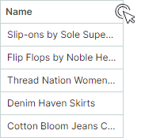

# Columns

DataGrid supports bound and unbound columns. Bound columns display values from fields of the bound data source. [Unbound columns](data-binding/unbound-columns.md) allow you to display custom data.


DataGrid columns provide properties to customize the column caption, cell editor, sort/group settings, and other options.

## Create Columns

The `GridColumn` class represents a column in the `DataGridControl`. `GridColumn` and `TreeListColumn` (a column in the `TreeListControl`) are derived from the `ColumnBase` class. Thus, columns in the DataGrid and TreeList controls share many API members.

To access the grid column collection, use the `DataGridControl.Columns` property.

The DataGrid control does not automatically create columns when you bind the control to a data source. Four approaches allow you to create columns:

- **Manual Column Creation**

    You can define all DataGrid columns manually in the `DataGridControl.Columns` collection (in XAML or code-behind). With this approach you have access to the created column objects by name in code. 

    The following sample creates two DataGrid columns and customizes the display format of the second column's values:

    ``` xml
    xmlns:mxdg="https://schemas.eremexcontrols.net/avalonia/datagrid"

    <mxdg:DataGridControl Name="dataGrid1" >                
        <mxdg:DataGridControl.Columns>
            <mxdg:GridColumn Name="colName" FieldName="Name" />
            <mxdg:GridColumn Name="colBirthdate" FieldName="Birthdate" >
                <mxdg:GridColumn.EditorProperties>
                    <mxe:TextEditorProperties DisplayFormatString="yyyy-MM-dd"/>
                </mxdg:GridColumn.EditorProperties>
            </mxdg:GridColumn>
        </mxdg:DataGridControl.Columns>
    </mxdg:DataGridControl>
    ```


- **Automatic Column Generation**

    Enable the `DataGridControl.AutoGenerateColumns` option to automatically generate missing columns when you bind the control to a data source. You can apply specific attributes (from the `System.ComponentModel` and `System.ComponentModel.DataAnnotations` namespaces) to properties of a business object to manage the automatic generation of columns, and customize settings of auto-generated columns (for instance, the column display name and order).

- **Combining Manual Column Creation and Automatic Generation**

    You can combine the two approaches above: manually create the required columns in the `DataGridControl.Columns` collection, and then enable the `DataGridControl.AutoGenerateColumns` option to delegate the generation of other columns to the DataGrid.

- **Column Generation from a View Model**

    DataGrid can create columns from a column source defined in a View Model. Use the `ColumnsSource` and `ColumnTemplate` properties in this scenario. See [Generate Columns from a View Model](#generate-columns-from-a-view-model).


See [Column Automatic Generation](#automatic-column-generation) for information on auto-generated columns.

## Bind Columns to Data

The `GridColumn.FieldName` property allows you to bind a column to a field in the underlying data table, or to a public property of a business object. Once bound, the column retrieves values from the data source.

DataGrid also allows you to create unbound columns, whose values should be supplied manually, using the `DataGridControl.CustomUnboundColumnData` event. See [Unbound Columns](data-binding/unbound-columns.md) for more information.

It is not recommended to bind multiple DataGrid columns to the same data field/property.

The following example creates DataGrid columns and binds them to data.

``` xml
xmlns:mxdg="https://schemas.eremexcontrols.net/avalonia/datagrid"

<mxdg:DataGridControl Grid.Column="3" Width="200" Name="dataGrid1" HorizontalAlignment="Stretch">
    <mxdg:DataGridControl.Columns>
        <mxdg:GridColumn Name="colFirstName" FieldName="FirstName" Header="First Name" 
         Width="*" AllowSorting="False"  />
        <mxdg:GridColumn Name="colLastName" FieldName="LastName" Header="Last Name" Width="*"/>
        <mxdg:GridColumn Name="colCity" FieldName="City" Header="City" Width="*" ReadOnly="True" />
        <mxdg:GridColumn Name="colPhone" FieldName="Phone" Header="Phone" Width="*"/>
    </mxdg:DataGridControl.Columns>
</mxdg:DataGridControl>
```

``` csharp
using Eremex.AvaloniaUI.Controls.DataGrid;

GridColumn colFirstName = new GridColumn() 
 { FieldName = "FirstName", Header = "First Name", AllowSorting = false, 
   Width= new GridLength(1, GridUnitType.Star) };
dataGrid1.Columns.Add(colFirstName);
```

## Automatic Column Generation

Set the `AutoGenerateColumns` property to `true` (the default value is `false`) to enable automatic column generation for properties in the data source. When `AutoGenerateColumns` is set to `true`, the DataGrid control fetches public properties from the data source, generates columns and binds them to the properties. If the control's `Columns` collection already contains a column bound to a specific property/field, no extra column bound to the same property/field is auto-generated.

The `AutoGeneratingColumn` and `AutoGeneratedColumns` events allow you to customize auto-generated columns. The `AutoGeneratingColumn` event fires when an auto-generated column is about to be added to the `Columns` collection. Set the event's `e.Cancel` parameter to `true` to prevent a column from being added to the collection. 

The `AutoGeneratedColumns` event fires after all columns have been auto-generated.

When you assign another data source to the control, the DataGrid first deletes columns that were previously auto-generated, and then auto-generates columns for the new data source.

### Use Attributes to Customize Settings of Auto-Generated Columns

You can apply specific attributes (from the `System.ComponentModel` and `System.ComponentModel.DataAnnotations` namespaces) to properties of a business object (data source record) to customize the visibility status, view and behavior settings for corresponding auto-generated DataGrid columns.  The supported attributes are described below:

#### `Browsable` Attribute 

The `System.ComponentModel.BrowsableAttribute` attribute controls column auto-generation. Apply the **Browsable(false)** attribute to specific properties to prevent corresponding columns from being auto-generated.

``` csharp
using CommunityToolkit.Mvvm.ComponentModel;
using System.ComponentModel;

public partial class MyBusinessObject : ObservableObject
{
    [ObservableProperty]
    [property: Browsable(false)]
    public int serviceId = "";
}
```

The `System.ComponentModel.BrowsableAttribute` attribute is equivalent to using the `System.ComponentModel.DataAnnotations.DisplayAttribute` attribute with the `AutoGenerateField` parameter.

#### `Display` Attribute 
The `System.ComponentModel.DataAnnotations.DisplayAttribute` is a general-purpose attribute that controls column auto-generation and display settings of auto-generated columns. The attribute has the following parameters supported by the DataGrid control:

- `AutoGenerateField` — Specifies whether to auto-generate a corresponding column.

- `Order` — Specifies the auto-generated column's visible position (`ColumnBase.VisibleIndex`). 

- `Name` — Specifies the auto-generated column's caption (`ColumnBase.Header`).

- `ShortName` — Equivalent to the `Name` parameter.

- `GroupName` — Specifies the name of the band to associate with the auto-generated column. 
This attribute value is used to initialize the `GridColumn.BandName` property if the `DataGridControl.AutoGenerateBands` option is `true` (default).

    When Data Grid encounters `DisplayAttribute.GroupName`, it checks for an existing band with a matching name (`GridBand.BandName`). If none exists, the control automatically creates the band and initializes its `GridBand.BandName` property with the `DisplayAttribute.GroupName` value.

    The `DisplayAttribute.GroupName` parameter also supports nested bands. Use the '/' character to separate parent and child bands (for instance, "ParentBandName/ChildBandName"). 
    To include '/' as a literal, use "//".

 
``` csharp
using CommunityToolkit.Mvvm.ComponentModel;
using System.ComponentModel.DataAnnotations;

public partial class MyBusinessObject : ObservableObject
{
    [ObservableProperty]
    [property: Display(Name = "Birth date", Order=2, GroupName="General")]
    public DateTime? birthdate = null;

    [ObservableProperty]
    [property: Display(GroupName = "Details/Address")]
    public string country { get; set; }

    [ObservableProperty]
    [property: Display(GroupName = "Details/Contact")]
    public string phone { get; set; }
}
```

#### `DisplayName` Attribute

The `System.ComponentModel.DisplayNameAttribute` attribute allows you to initialize an auto-generated column's caption (`ColumnBase.Header`).

``` csharp
using CommunityToolkit.Mvvm.ComponentModel;
using System.ComponentModel;

public partial class MyBusinessObject : ObservableObject
{
    [ObservableProperty]
    [property: DisplayName("Birth date")]
    public DateTime? birthdate = null;
}
```

The `System.ComponentModel.DisplayNameAttribute` attribute is equivalent to using the `System.ComponentModel.DataAnnotations.DisplayAttribute` attribute with the `Name` or `ShortName` parameter.

#### `Editable` Attribute

The `System.ComponentModel.EditableAttribute` attribute applied to a property creates a non-editable column. Users cannot open in-place editors, and thus select and copy text.

``` csharp
using CommunityToolkit.Mvvm.ComponentModel;
using System.ComponentModel;

public partial class MyBusinessObject : ObservableObject
{
    [ObservableProperty]
    [property: Editable(false)]
    public int parentId = -1;
}
```

#### `Readonly` Attribute 

The `System.ComponentModel.ReadonlyAttribute` attribute applied to a property creates a read-only column. Users can select and copy text in read-only columns, but not edit values.

``` csharp
using CommunityToolkit.Mvvm.ComponentModel;
using System.ComponentModel;

public partial class MyBusinessObject : ObservableObject
{
    [ObservableProperty]
    [property: ReadOnly(true)]
    public int id = -1;
}
```

## Generate Columns from a View Model


You can populate the DataGrid control with columns from a column source defined in a View Model. The column source is a collection of business objects from which `GridColumn` objects are generated according to a specified template. The following API members maintain column generation from a View Model:

- `DataGridControl.ColumnsSource` — A collection of business objects used to generate grid columns according to the `ColumnTemplate` template. 

- `DataGridControl.ColumnTemplate` — A template that initializes a `GridColumn` object from business objects stored in the column source.

### Example - Generate Columns from a Column Source

The following code snippet from the "Large Data" demo shows how you can create and initialize Data Grid columns from a column source (`DataGridControl.ColumnsSource`).

``` xml
<mxdg:DataGridControl ItemsSource="{Binding Items}" ColumnsSource="{Binding Columns}" AutoGenerateColumns="True" BorderThickness="0,0,1,0"
                      CustomUnboundColumnData="DataGridControl_CustomUnboundColumnData" PropertyChanged="DataGridControl_PropertyChanged">
    <mxdg:DataGridControl.ColumnTemplate>
        <views:DataGridLargeDataViewColumnTemplate/>
    </mxdg:DataGridControl.ColumnTemplate>
</mxdg:DataGridControl>
```

``` cs
public class DataGridLargeDataViewColumnTemplate : ITemplate<object, GridColumn>
{
    public GridColumn Build(object param)
    {
        var largeDataColumn = (LargeDataColumn)param;
        var gridColumn = new GridColumn() 
        { 
            FieldName = largeDataColumn.FieldName,
            Header = largeDataColumn.Header
        };
        if (!largeDataColumn.FieldName.Contains("Id"))
        {
            gridColumn.UnboundDataType = largeDataColumn.DataType;

            if (largeDataColumn.FieldName.Contains("ComboBox"))
                gridColumn.EditorProperties = new ComboBoxEditorProperties() { ItemsSource = EmployeesData.EmployeeNames };
            else if (largeDataColumn.FieldName.Contains("Numeric"))
                gridColumn.EditorProperties = new SpinEditorProperties() { MaskType = MaskType.Numeric, Mask = "c" };
        }
        return gridColumn;
    }
}
```

For the complete example, see the Large Data demo for the Data Grid control.

## Move Columns

Use the `GridColumn.VisibleIndex` property to specify the column's visual position. To hide the column, set its `GridColumn.VisibleIndex` property to **-1**, or set the `IsVisible` property to `false`.

The control's default behavior allows a user to rearrange columns. Use the following properties to forbid column movement:

- `DataGridControl.AllowColumnMoving` — Specifies whether a user can move any column.
- `GridColumn.AllowMoving` — Specifies whether a user can move a specific column.

## Resize Columns

You can use the following properties to control column width in DataGrid:

- `GridColumn.Width` — The column width specified as a `GridLength` value. 
- `GridColumn.MinWidth` — The column's minimum width.
- `GridColumn.MaxWidth` — The column's maximum width.


The `Width` property is of the `GridLength` type. It allows you to set the column width to:

- A fixed width (a number of pixels).
- A weighted proportion of available space (the _star_ notation).
- The 'Auto' value — Activates automatic column width calculation to fit the column's header and visible values. When a user scrolls the control vertically, the control can enlarge the column width to fit new cell values appeared during the scroll operation.

``` xml
xmlns:mxdg="https://schemas.eremexcontrols.net/avalonia/datagrid"

<mxdg:DataGridControl Name="dataGrid1">
    <mxdg:DataGridControl.Columns>
        <mxdg:GridColumn Name="colFirstName" FieldName="FirstName" Header="First Name" Width="*"/>
        <mxdg:GridColumn Name="colLastName" FieldName="LastName" Header="Last Name" Width="2*"/>
        <mxdg:GridColumn Name="colPhone" FieldName="Phone" Header="Phone" Width="*"/>
    </mxdg:DataGridControl.Columns>
</mxdg:DataGridControl>
```

The following properties control column resize operations performed by users.

- `DataGridControl.AllowColumnResizing` — Specifies whether a user can resize any column.
- `GridColumn.AllowResizing` — Specifies whether a user can resize a specific column.

## Best Fit

The Best Fit feature resizes columns to their optimal widths — the minimum widths required to fully display column contents (values and headers) without truncation. 


Best Fit calculates the optimal widths for columns **in pixels** and assigns these values to the `TreeListColumn.Width` properties, replacing any previously set widths. 

!!! Note

    Best Fit replaces original column widths with calculated absolute pixel values. If a column previously had its width set to `Auto` or a star value (`*`), it is also replaced with an absolute pixel width. The original widths can be restored using the [Reset Column Width command](#reset-column-width-user-modifications).

Users can invoke the Best Fit functionality in the following ways:

- Double-click a column header's right edge.

    

- Right-click a column header and choose the _Best Fit_ or _Best Fit All Columns_ command from the context menu.

    

    - _Best Fit_ command — Resizes the selected column to its optimal width.
    - _Best Fit All Columns_ command — Resizes all columns to their optimal widths.


### Enable and Disable Best Fit Operations

The Best Fit functionality is enabled by default. You can use the following properties to control Best Fit operations for all columns and individual columns.

- `DataGridControl.AllowBestFit` (default is `true`) — Specifies whether Best Fit operations are enabled for all grid columns. You can override this global setting for individual columns using the `GridColumn.AllowBestFit` property.
- `GridColumn.AllowBestFit` (default is `null`) — Specifies whether Best Fit operations are enabled for a specific column. If the `GridColumn.AllowBestFit` property is set to `null`, the actual setting is specified by the global `DataGridControl.AllowBestFit` property.

### Best Fit Mode

You can use the `DataGridControl.BestFitMode` and `GridColumn.BestFitMode` properties to control the scope of processed row values for Best Fit operations.

``` xaml
<mxdg:DataGridControl BestFitMode="Full" >
```

#### Available Best Fit Calculation Modes

- `BestFitMode.Fast` mode — Measures widths of unique row values, which significantly boosts Best Fit performance in most scenarios. 

    !!! Note

        - `Fast` mode is not applicable if the display text of target cells is dependent on other cells. You need to switch to `Full` mode in this case.

        - `Fast` mode may incorrectly calculate column widths if cell templates (`GridColumn.CellTemplate`) are used to assign custom editors, or cells show validation errors triggered by the data source (see `ShowItemsSourceErrors`).

- `BestFitMode.Full` mode — Measures widths of all row values, including duplicates. Although this mode is slower than `Fast`, it corrrectly calculates column widths if cell templates or validation errors are used.

#### Automatic (Default) Best Fit Calculation Mode

- `Fast` is the default mode in most cases.
- `Full` is automatically activated as the default in the following scenarios:
    - Cell templates (`GridColumn.CellTemplate`) are used to assign editors to columns.
    - The control's `DataControlBase.ShowItemsSourceErrors` property is set to `true` and validation errors are applied to columns at the data source level (using validation attributes, the `IDataErrorInfo` interface, or the `INotifyDataErrorInfo` interface).

#### Choose Best Fit Calculation Mode

Use the following properties to specify Best Fit calculation mode for all or individual columns:

- `DataGridControl.BestFitMode` — Specifies the global Best Fit calculation mode for all grid columns.
When `DataGridControl.BestFitMode` is set to `null` (the initial value), Best Fit calculation mode is determined [automatically](#automatic-default-best-fit-calculation-mode). Use the `GridColumn.BestFitMode` property to override this global setting for specific columns.

- `GridColumn.BestFitMode` — Allows you to set Best Fit calculation mode for individual columns, overriding the `DataGridControl.BestFitMode` property. If the `GridColumn.BestFitMode` property is `null` (the initial value), the actual setting is specified by the control's `DataGridControl.BestFitMode` property.

### Call Best Fit Operations in Code

Use the following methods to resize grid columns to their optimal widths:

- `DataGridControl.BestFit(GridColumn column)` — Resizes the specified column to the width required to fully display its content.
- `DataGridControl.BestFitAllColumns()` — Resizes all columns to the widths required to fully display their contents.

To perform Best-Fit operations when the DataGrid control is initialized, call the `BestFit` or `BestFitAllColumns` method within a `DataGridControl.AttachedToVisualTree` event handler.

## Reset Column Width User Modifications

After a user changes column widths (by dragging or using Best Fit), the _Reset Column Width_ command appears in column context menus. This command resets changes made by users to column widths, restoring original widths applied to columns in XAML or code-behind before user modifications.


### Related API

- `DataGridControl.AllowResetColumnWidth` (default is `true`) — Specifies whether the _Reset Column Width_ command is availble in column context menus. If this property is disabled, users cannot undo their column resize operations through the UI. The `DataGridControl.AllowResetColumnWidth` does not affect resetting column width using the `DataGridControl.ResetColumnWidth` method.
- `DataGridControl.ResetColumnWidth` method — Resizes columns to their original widths, as defined in XAML or code-behind before any user modifications.

## Column Headers

DataGrid column headers are displayed in the header panel. You can hide this panel with the `DataGridControl.ShowColumnHeaders` property. 

The panel's height is automatically adjusted to fit contents of column headers. Use the `HeaderPanelMinHeight` property to limit the panel's minimum height.

A column header initially displays a caption (text label), which is a text representation of the `ColumnBase.Header` property. If the `ColumnBase.Header` property is not set, the column caption is generated from the column's field name (`ColumnBase.FieldName`).

Use the `ColumnBase.HeaderTemplate` property to specify a template used to render the column header. The template allows you to display images and custom controls, and to render text in a custom manner.

The following code displays an image before the column's caption. The `<TextBlock Text="{Binding}">` expression displays the contents of the column's `Header` property:

``` xml
xmlns:mxdg="https://schemas.eremexcontrols.net/avalonia/datagrid"

<mxdg:DataGridControl Name="DataGrid" HeaderPanelMinHeight="50">
    <mxdg:GridColumn FieldName="Number" Header="Position" HeaderVerticalAlignment="Bottom">
        <mxdg:GridColumn.HeaderTemplate>
            <DataTemplate>
                <StackPanel Orientation="Horizontal">
                    <Image Source="/info24x24.png" Width="24" Height="24" Margin="0,0,5,0"></Image>
                    <TextBlock Text="{Binding}" VerticalAlignment="Center"/>
                </StackPanel>
            </DataTemplate>
        </mxdg:GridColumn.HeaderTemplate>
    </mxdg:GridColumn>
</mxdg:DataGridControl>
```

Use the `ColumnBase.HeaderHorizontalAlignment` and `ColumnBase.HeaderVerticalAlignment` properties to align a column header's content horizontally and vertically. 

## Column Sorting 

A user can click a column header or use a column header's context menu to sort the DataGrid against the column. See [Data Sorting](sorting.md) for more information.

## Column Grouping

Users can group data by any number of columns. To group by a column, a user can drag-and-drop a column to the group panel, or use a corresponding command in the column header's context menu. See the following topic for more information: [Data Grouping](grouping.md).

## Column Values

To learn how to retrieve cell values for specific rows, see [Rows](rows.md).

## Column Header Tooltips

Use the `HeaderToolTip` property to specify custom tooltips for column headers. Custom tooltips are displayed when hovering over column headers regardless of whether column header text is trimmed or not.

``` xml
<mxdg:GridColumn FieldName="Position" HeaderToolTip="The job title or role of the employee"/>
```


When no custom tooltip is assigned to a column, the default tooltip is shown for the column header if the header text is trimmed. The default tooltip displays the full, untrimmed header text.


## Fixed Columns

If the total column width exceeds the control's viewport, a scrollbar appears to perform horizontal scrolling. DataGrid allows you to fix (pin) individual columns to the left or right edge. These columns remain frozen during horizontal scrolling, while non-fixed columns are scrolled normally.


!!! tip

    The total column width is calculated as a sum of individual column widths (see `GridColumn.Width`). To activate a horizontal scrollbar, set the widths of individual columns so that their sum exceeds the viewport width. Do not use star notation ("*") for column widths when you use fixed columns.

To fix a column or restore it to its normal state, set the `GridColumn.FixedMode` property to one of the following values:

- `Left` — Pins the column to the left edge. 
- `Right` — Pins the column to the right edge. 
- `None` — Unpins the fixed column. 

``` xml
<mxdg:GridColumn FieldName="FirstName" FixedMode="Left"/>
<mxdg:GridColumn FieldName="Phone" FixedMode="Right"/>
```

### _Fixed_ Menu

Users can fix a column at runtime using the built-in _Fixed_ sub-menu available from the column's context menu. Set the control's `ShowColumnMenuFixedItem` property to `true` to enable this _Fixed_ sub-menu:


### Fixed Column Position

When a column is fixed (pinned) or restored to its normal state, its visible position (synced with the `GridColumn.VisibleIndex` property) is automatically updated.

- Fixing to the left: The column is placed after existing left-fixed columns.
- Fixing to the right: The column is placed before existing right-fixed columns.
- Unfixing from the left: The column becomes the first scrollable column. 
- Unfixing from the right: The column becomes the last scrollable column. 

### Fixed Column Width

To change a fixed column's width, set the `GridColumn.Width` property to an absolute pixel value, or to `Auto` for automatic calculation based on cell content. Fixed columns do not support the star notation (proportional sizing) to set column width. 

When a column with a `star` width is fixed, its width is automatically reset to 120 pixels.

### Horizontal Scrollbar Display Mode

The horizontal scrollbar is displayed across scrollable columns, by default. Enable the `ExtendScrollbarToFixedColumns` property to display the horizontal scrollbar across all columns, including the fixed ones.


### Related API

- `DataGridControl.FixedColumnSeparatorWidth` — Specifies the width of separators that delimit fixed columns from scrollable columns.

## See Also

- [Unbound Columns](data-binding/unbound-columns.md)