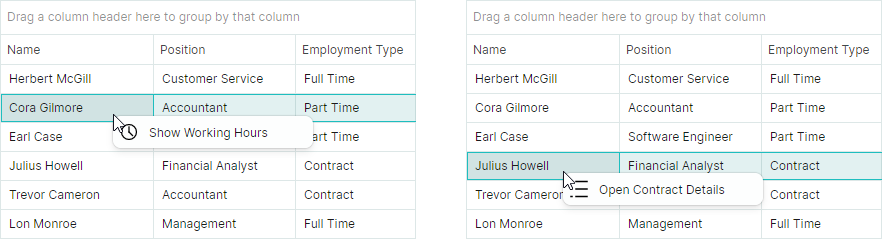
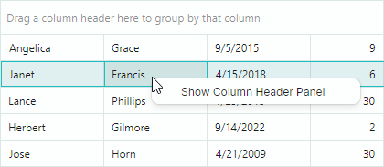

## Context Menus

Data Grid supports built-in context menus for specific elements. This topic shows how to replace and modify these menus, and display custom popup menus for the Data Grid's elements that do not have built-in context menus.

## Built-in Column Header Context Menu

A right-click on a column header displays the built-in column header menu. The menu contains commands to sort and group data, show the search panel, and display the column chooser.


The [`DataGridControl.ColumnMenu`](../../API/Eremex.AvaloniaUI.Controls.DataGrid/DataGridControl/ColumnMenu.md) property allows you to access and customize this menu.

To replace the default menu, assign a [`Eremex.AvaloniaUI.Controls.Bars.PopupMenu`](../../API/Eremex.AvaloniaUI.Controls.Bars/PopupMenu.md) object to the [`DataGridControl.ColumnMenu`](../../API/Eremex.AvaloniaUI.Controls.DataGrid/DataGridControl/ColumnMenu.md) property.

To customize the existing column header menu (add new items, or remove default items), access the menu after it has been initialized (for instance, within your DataGrid's `Initialized` event handler), and then modify the menu.

### Data Context

The `DataContext` property of the column header menu and its items ([`ToolbarButtonItem`](../../API/Eremex.AvaloniaUI.Controls.Bars/ToolbarButtonItem.md) objects) specifies the [`GridColumn`](../../API/Eremex.AvaloniaUI.Controls.DataGrid/GridColumn.md) object for which the menu has been invoked. 

### Example - How to replace the default column header menu

The following code creates a custom column header menu that contains the _Copy Column_ menu item. The code binds the menu item to the _CopyColumnDataCommand_ command defined in a ViewModel.


Take note of the initialization of the [`Command`](../../API/Eremex.AvaloniaUI.Controls.Bars/ToolbarItem/Command.md) and [`CommandParameter`](../../API/Eremex.AvaloniaUI.Controls.Bars/ToolbarItem/CommandParameter.md) properties for the menu item in the code below. The expression `CommandParameter="{Binding FieldName}"` specifies binding to the [`FieldName`](../../API/Eremex.AvaloniaUI.Controls.DataControl/ColumnBase/FieldName.md) property of the menu item's `DataContext` ([`GridColumn.FieldName`](../../API/Eremex.AvaloniaUI.Controls.DataControl/ColumnBase/FieldName.md)).

A [`GridColumn`](../../API/Eremex.AvaloniaUI.Controls.DataGrid/GridColumn.md)'s `DataContext` matches the Data Grid's `DataContext` (a _ViewModel_ object in this example). This allows you to access the View Model and its _CopyColumnCommand_ command using the expression: `Command="{Binding DataContext.CopyColumnCommand}"`.

``` xml
xmlns:mxdg="https://schemas.eremexcontrols.net/avalonia/datagrid"
xmlns:mxe="https://schemas.eremexcontrols.net/avalonia/editors"
xmlns:mxb="https://schemas.eremexcontrols.net/avalonia/bars"

<mxdg:DataGridControl Name="dataGrid1">
    <mxdg:DataGridControl.ColumnMenu>
        <mxb:PopupMenu>
            <mxb:ToolbarButtonItem
                Header="Copy Column"
                Command="{Binding DataContext.CopyColumnCommand}"
                CommandParameter="{Binding FieldName}">
            </mxb:ToolbarButtonItem>
        </mxb:PopupMenu>
    </mxdg:DataGridControl.ColumnMenu>
</mxdg:DataGridControl>
```
``` csharp
public MainView()
{
    DataContext = new ViewModel();
}

public partial class ViewModel : ObservableObject
{
    [RelayCommand]
    void CopyColumn(string fieldName)
    {
        //...
    }
}
```

### Example - How to modify the existing column header menu

The following example adds a custom command to the default column header menu.

The example handles the `DataGridControl.Initialized` event to access the default column header menu after it has been initialized, and adds a _Refresh Data_ command to the menu.


``` xml
xmlns:mxdg="https://schemas.eremexcontrols.net/avalonia/datagrid"
xmlns:mxe="https://schemas.eremexcontrols.net/avalonia/editors"
xmlns:mxb="https://schemas.eremexcontrols.net/avalonia/bars"

<mxdg:DataGridControl Name="dataGrid1" Initialized="OnInitialized">
    ...
</mxdg:DataGridControl>
```
``` csharp
using Eremex.AvaloniaUI.Controls.Bars;

private void OnInitialized(object sender, System.EventArgs e)
{
    ToolbarButtonItem btn1 = new ToolbarButtonItem();
    btn1.Header = "Refresh Data";
    btn1.ShowSeparator = true;
    btn1.Command = new RelayCommand<DataGridControl>(UpdateDataGrid);
    btn1.CommandParameter = dataGrid1;
    dataGrid1.ColumnMenu.Items.Add(btn1);
}

[RelayCommand]
void UpdateDataGrid(DataGridControl dataGrid)
{
    //...
}
```


## Row Cell Menu

Data Grid supports a built-in context menu for row cells (see the `DataGridControlBase.RowCellMenu` property). This menu is initially empty, and therefore hidden. To show the row cell menu, populate it with items in XAML or in code-behind.

### Data Context

The `DataContext` of the row cell menu and its items contains a `Eremex.AvaloniaUI.Controls.DataControl.Visuals.CellData` object, which allows you to access context specific information:

- `CellData.DataControl` — Returns the container control ([`DataGridControl`](../../API/Eremex.AvaloniaUI.Controls.DataGrid/DataGridControl.md)) for which the menu is invoked. 
- `CellData.Row` — Returns the clicked row's underlying data object. 

### Example - How to show the same context menu commands for all rows

The following example adds the "_Copy Row_" command to the row cell menu (`DataGridControlBase.RowCellMenu`) for all rows. 


The XAML code below assigns a popup menu to the [`DataGridControl.RowCellMenu`](../../API/Eremex.AvaloniaUI.Controls.DataGrid/DataGridControl/RowCellMenu.md) property. The popup menu contains a single item ([`ToolbarButtonItem`](../../API/Eremex.AvaloniaUI.Controls.Bars/ToolbarButtonItem.md)) bound to the _CopyRowCommand_ command defined in a View Model (a Data Grid's `DataContext`).

``` xml
xmlns:mxdg="https://schemas.eremexcontrols.net/avalonia/datagrid"
xmlns:mxe="https://schemas.eremexcontrols.net/avalonia/editors"
xmlns:mxb="https://schemas.eremexcontrols.net/avalonia/bars"

<mxdg:DataGridControl Name="dataGrid1">
    <mxdg:DataGridControl.RowCellMenu>
        <mxb:PopupMenu>
            <mxb:PopupMenu.Items>
                <mxb:ToolbarButtonItem Header="Copy Row"
                 Command="{Binding DataControl.DataContext.CopyRowCommand}"
                 CommandParameter="{Binding Row}"/>
            </mxb:PopupMenu.Items>
        </mxb:PopupMenu>
    </mxdg:DataGridControl.RowCellMenu>
</mxdg:DataGridControl>
```
``` csharp
public partial class MainView : UserControl
{
    ViewModel viewModel = new ViewModel();
    public MainView()
    {
        DataContext = viewModel;
        InitializeComponent();
    }
}

public partial class ViewModel : ObservableObject
{
    public ViewModel() { }
    [RelayCommand]
    void CopyRow(object row)
    {
        //...
    }
}
```

### Example - How to show different context menu commands for different rows

A Data Grid control in this example displays a list of _Employee_ objects. The example initializes the context menu for rows (`DataGridControlBase.RowCellMenu`), and displays different menu items for different data rows.



The context menu displays the _Show Working Hours_ menu item for rows that refer to part-time employees (the _Employee.IsPartTime_ property returns _true_).

The context menu displays the _Open Contract Details_ menu item for rows that refer to contractors (the _Employee.IsContract_ property returns _true_).

The XAML code below adds two items ("_Show Working Hours_" and "_Open Contract Details_") to the context menu. Visibility of these items is managed dynamically by the business object's _IsPartTime_ and _IsContract_ properties.

``` xml
xmlns:mxdg="https://schemas.eremexcontrols.net/avalonia/datagrid"
xmlns:mxb="https://schemas.eremexcontrols.net/avalonia/bars"

<mxdg:DataGridControl Name="dataGrid1" AutoGenerateColumns="True" ItemsSource="{Binding Employees}">
    <mxdg:DataGridControl.RowCellMenu>
        <mxb:PopupMenu>
            <mxb:PopupMenu.Items>
                <mxb:ToolbarButtonItem
                    Header="Show Working Hours"
                    Command="{Binding DataControl.DataContext.ShowWorkingHoursCommand}"
                    CommandParameter="{Binding Row}"
                    Glyph="{SvgImage 'avares://AvaloniaApplication3/Assets/time.svg'}"
                    GlyphSize="20,20"
                    IsVisible="{Binding Row.IsPartTime}">
                </mxb:ToolbarButtonItem>
                <mxb:ToolbarButtonItem
                    Header="Open Contract Details"
                    Command="{Binding DataControl.DataContext.OpenContractDetailsCommand}"
                    CommandParameter="{Binding Row}"
                    Glyph="{SvgImage 'avares://AvaloniaApplication3/Assets/details.svg'}"
                    GlyphSize="20,20"
                    IsVisible="{Binding Row.IsContract}"
                    >
                </mxb:ToolbarButtonItem>
            </mxb:PopupMenu.Items>
        </mxb:PopupMenu>
    </mxdg:DataGridControl.RowCellMenu>
</mxdg:DataGridControl>
```
``` csharp
public partial class MainView : UserControl
{
    MainViewModel viewModel = new MainViewModel();

    public MainView()
    {
        DataContext = viewModel;

        viewModel.Employees.Add(new Employee() { 
            Name = "Herbert McGill", EmploymentType=EmploymentType.FullTime, 
            Position= "Customer Service" 
        });
        viewModel.Employees.Add(new Employee() { 
            Name = "Cora Gilmore", EmploymentType = EmploymentType.PartTime, 
            Position = "Accountant" 
        });
        viewModel.Employees.Add(new Employee() { 
            Name = "Earl Case", EmploymentType = EmploymentType.PartTime, 
            Position = "Software Engineer" 
        });
        viewModel.Employees.Add(new Employee() { 
            Name = "Julius Howell", EmploymentType = EmploymentType.Contract, 
            Position = "Financial Analyst" 
        });
        viewModel.Employees.Add(new Employee() { 
            Name = "Trevor Cameron", EmploymentType = EmploymentType.Contract, 
            Position = "Accountant" 
        });
        viewModel.Employees.Add(new Employee() { 
            Name = "Lon Monroe", EmploymentType = EmploymentType.FullTime, 
            Position = "Management" 
        });

        InitializeComponent();
    }
}

public partial class MainViewModel : ViewModelBase
{
    public MainViewModel() { }

    public ObservableCollection<Employee> Employees { get; } = new();

    [RelayCommand]
    void OpenContractDetails(Employee emp)
    {
        if(emp.EmploymentType == EmploymentType.Contract)
        {
            //...
        }
    }

    [RelayCommand]
    void ShowWorkingHours(Employee emp)
    {
        if(emp.EmploymentType == EmploymentType.PartTime)
        {
            //...
        }
    }
}

public partial class Employee : ObservableObject
{
    [ObservableProperty]
    public string name = "";

    [ObservableProperty]
    public string position = "";

    [ObservableProperty]
    public EmploymentType employmentType;

    [Browsable(false)]
    public bool IsContract => EmploymentType == EmploymentType.Contract;

    [Browsable(false)]
    public bool IsPartTime => EmploymentType == EmploymentType.PartTime;
}

public enum EmploymentType
{
    [Display(Name = "Full Time")]
    FullTime,
    [Display(Name = "Part Time")]
    PartTime,
    Contract
}
```


### Example - How to generate context menu commands from a ViewModel

This example shows how to populate a DataGrid control's row cell menu with items defined in a ViewModel.


The row cell menu ([`DataGridControl.RowCellMenu`](../../API/Eremex.AvaloniaUI.Controls.DataGrid/DataGridControl/RowCellMenu.md)) is populated with items ([`ToolbarButtonItem`](../../API/Eremex.AvaloniaUI.Controls.Bars/ToolbarButtonItem.md) objects) from an item source specified by the [`PopupMenu.ItemsSource`](../../API/Eremex.AvaloniaUI.Controls.Bars/PopupMenu/ItemsSource.md) collection. In this example, the [`PopupMenu.ItemsSource`](../../API/Eremex.AvaloniaUI.Controls.Bars/PopupMenu/ItemsSource.md) property is bound to the _MenuItems_ collection defined in the main View Model using the following binding expression:

``` xml
<mxb:PopupMenu ItemsSource="{Binding DataControl.DataContext.MenuItems}">
```

When a [`PopupMenu`](../../API/Eremex.AvaloniaUI.Controls.Bars/PopupMenu.md) is displayed for a DataGrid cell, the menu's `DataContext` contains a `Eremex.AvaloniaUI.Controls.DataControl.Visuals.CellData` object. The `CellData` object exposes the `DataControl` property, which allows you to access the control for which the menu is displayed. 
The main View Model is assigned to the control's `DataContext`. Thus, the `DataControl.DataContext.MenuItems` syntax refers to the _MenuItems_ collection defined in the main View Model.

The `CellData` object also contains other properties that allow you to access cell-related information (column, row object, etc.).

The menu items are initialized using styles. The `DataContext` of the menu items are elements of the [`PopupMenu.ItemsSource`](../../API/Eremex.AvaloniaUI.Controls.Bars/PopupMenu/ItemsSource.md) collection. In this example, the [`PopupMenu.ItemsSource`](../../API/Eremex.AvaloniaUI.Controls.Bars/PopupMenu/ItemsSource.md) property stores a collection of _MenuItemViewModel_ objects. The following snippet binds the [`ToolbarButtonItem.Header`](../../API/Eremex.AvaloniaUI.Controls.Bars/ToolbarItem/Header.md) and [`ToolbarButtonItem.Command`](../../API/Eremex.AvaloniaUI.Controls.Bars/ToolbarItem/Command.md) properties to the  _MenuItemViewModel.Header_ and _MenuItemViewModel.Command_ properties, respectively.

``` xml
<mxb:PopupMenu.Styles>
    <Style Selector="mxb|ToolbarButtonItem">
        <Setter Property="Header" Value="{Binding Header}"/>
        <Setter Property="Command" Value="{Binding Command}"  />
    </Style>
</mxb:PopupMenu.Styles>
```

A [`ToolbarButtonItem`](../../API/Eremex.AvaloniaUI.Controls.Bars/ToolbarButtonItem.md)'s command requires information about the row that has been right-clicked. To pass the data row to the command, the XAML code sets the [`ToolbarButtonItem.CommandParameter`](../../API/Eremex.AvaloniaUI.Controls.Bars/ToolbarItem/CommandParameter.md) property, as follows:

``` xml
xmlns:mxvis="clr-namespace:Eremex.AvaloniaUI.Controls.DataControl.Visuals;
 assembly=Eremex.Avalonia.Controls"

<mxb:PopupMenu.Styles>
    <Style Selector="mxb|ToolbarButtonItem">
        ...
        <Setter Property="CommandParameter" 
         Value="{Binding $parent[mxvis:CellControl].DataContext.Row}"  />
    </Style>
</mxb:PopupMenu.Styles>
```

Here, the `$parent[mxvis:CellControl]` expression traverses the logical tree to locate a `CellControl` object (it is a parent of the [`ToolbarButtonItem`](../../API/Eremex.AvaloniaUI.Controls.Bars/ToolbarButtonItem.md)'s `DataContext`). The `CellControl.DataContext` object contains an `Eremex.AvaloniaUI.Controls.DataControl.Visuals.CellData` object, which allows you to access the data row from the `CellData.Row` property.

The complete code is shown below.                

``` xml
xmlns:mxdg="https://schemas.eremexcontrols.net/avalonia/datagrid"
xmlns:mxb="https://schemas.eremexcontrols.net/avalonia/bars"
xmlns:mxvis="clr-namespace:Eremex.AvaloniaUI.Controls.DataControl.Visuals;
 assembly=Eremex.Avalonia.Controls"

<mxdg:DataGridControl Name="dataGrid1" AutoGenerateColumns="True" ItemsSource="{Binding Employees}">
    <mxdg:DataGridControl.RowCellMenu>
        <mxb:PopupMenu ItemsSource="{Binding DataControl.DataContext.MenuItems}">
            <mxb:PopupMenu.Styles>
                <Style Selector="mxb|ToolbarButtonItem">
                    <Setter Property="Header" Value="{Binding Header}"/>
                    <Setter Property="Command" Value="{Binding Command }"  />
                    <Setter Property="CommandParameter" 
                     Value="{Binding $parent[mxvis:CellControl].DataContext.Row}"  />
                </Style>
            </mxb:PopupMenu.Styles>
        </mxb:PopupMenu>
    </mxdg:DataGridControl.RowCellMenu>
</mxdg:DataGridControl>
```
``` csharp
public partial class MainView : UserControl
{
    MainViewModel viewModel = new MainViewModel();

    public MainView()
    {
        DataContext = viewModel;

        viewModel.Employees.Add(new Employee() { 
            Name = "Herbert McGill", EmploymentType=EmploymentType.FullTime, 
            Position= "Customer Service" 
        });
        viewModel.Employees.Add(new Employee() { 
            Name = "Cora Gilmore", EmploymentType = EmploymentType.PartTime, 
            Position = "Accountant" 
        });
        viewModel.Employees.Add(new Employee() { 
            Name = "Earl Case", EmploymentType = EmploymentType.PartTime, 
            Position = "Software Engineer" 
        });

        InitializeComponent();
    }
}

public partial class MainViewModel : ViewModelBase
{
    public ObservableCollection<Employee> Employees { get; } = new();

    public MainViewModel()
    {
        MenuItemViewModel menuItem1 = new MenuItemViewModel();
        menuItem1.Header = "Copy Row";
        menuItem1.Command = new RelayCommand<object>(CopyRow);
        MenuItems.Add(menuItem1);

        MenuItemViewModel menuItem2 = new MenuItemViewModel();
        menuItem2.Header = "Delete Row";
        menuItem2.Command = new RelayCommand<object>(DeleteRow);
        MenuItems.Add(menuItem2);

    }

    public ObservableCollection<MenuItemViewModel> MenuItems { get; } = new();

    [RelayCommand]
    void CopyRow(object row)
    {
        //...
    }
    [RelayCommand]
    void DeleteRow(object row)
    {
        //...
    }
}

public partial class MenuItemViewModel : ObservableObject
{
    [ObservableProperty]
    string? header;

    [ObservableProperty]
    ICommand? command;
}

public partial class Employee : ObservableObject
{
    [ObservableProperty]
    public string name = "";

    [ObservableProperty]
    public string position = "";

    [ObservableProperty]
    public EmploymentType employmentType;

    [Browsable(false)]
    public bool IsContract => EmploymentType == EmploymentType.Contract;

    [Browsable(false)]
    public bool IsPartTime => EmploymentType == EmploymentType.PartTime;
}

public enum EmploymentType
{
    [Display(Name = "Full Time")]
    FullTime,
    [Display(Name = "Part Time")]
    PartTime,
    Contract
}
```

## Customize Menus on Showing

You can handle the [`PopupMenu.Opening`](../../API/Eremex.AvaloniaUI.Controls.Bars/PopupMenu/Opening.md) event to dynamically customize a DataGrid's context menus. The event occurs when a [`PopupMenu`](../../API/Eremex.AvaloniaUI.Controls.Bars/PopupMenu.md) is about to be displayed.

## Example - How to show a context menu for the first column

The following example assign an empty [`PopupMenu`](../../API/Eremex.AvaloniaUI.Controls.Bars/PopupMenu.md) to the `DataGridControlBase.RowCellMenu` property, and then handles the [`PopupMenu.Opening`](../../API/Eremex.AvaloniaUI.Controls.Bars/PopupMenu/Opening.md) event to populate the menu with items when a user right-clicks cells within the first visible DataGrid column. The menu remains empty (and thus it's not displayed) when a user right-clicks within other columns.

The created menu contains the "_Show/Hide Group Panel_" check button that toggles the visibility of the DataGrid's Group Panel (the `DataGridControlBase.ShowGroupPanel` property).


``` xml
<mxdg:DataGridControl Name="dataGrid1" ...>
    <mxdg:DataGridControl.RowCellMenu>
        <mxb:PopupMenu Opening="RowCellMenuOpening"/>
    </mxdg:DataGridControl.RowCellMenu>
</mxdg:DataGridControl>
```
``` csharp
using Eremex.AvaloniaUI.Controls.DataControl.Visuals;

void RowCellMenuOpening(object sender, CancelEventArgs e)
{
    if (sender == null) return;
    PopupMenu menu = sender as PopupMenu;
    menu.Items.Clear();

    CellData cellData = menu.DataContext as CellData;
    DataGridControl control = cellData.DataControl as DataGridControl;
    GridColumn column = cellData.Column as GridColumn;
    //// Access the underlying data row, when required.
    //object dataRow = cellData.Row;

    if(column.VisibleIndex == 0)
    {
        ToolbarCheckItem btn1 = new ToolbarCheckItem();
        btn1.IsChecked = control.ShowGroupPanel;
        btn1.Header = (control.ShowGroupPanel) ? "Hide Group Panel" : "Show Group Panel";
        btn1.Command = new RelayCommand<DataGridControl>(ShowGroupPanelCommand);
        btn1.CommandParameter = control;
        menu.Items.Add(btn1);
    }
}

[RelayCommand]
void ShowGroupPanelCommand(DataGridControl dataGrid)
{
    dataGrid.ShowGroupPanel = !dataGrid.ShowGroupPanel;
}
```

## Show a Context Menu for Controls Using a ToolbarManager's Attached Property

The [`Eremex.AvaloniaUI.Controls.Bars.ToolbarManager`](../../API/Eremex.AvaloniaUI.Controls.Bars/ToolbarManager.md) component provides the `ContextPopup` attached property that allows you to assign a context menu to any control, including DataGrid. This context menu is displayed for DataGrid regions that have no default context menus, and for regions with empty default menus.

### Example - How to assign a context menu using the _ToolbarManager.ContextPopup_ attached property

The following code uses the `ToolbarManager.ContextPopup` attached property to specify a context menu for a DataGrid control. The menu contains the _Show Column Header Panel_/_Hide Column Header Panel_ menu check item which toggles the visibility of the [`DataGridControl.ShowColumnHeaders`](../../API/Eremex.AvaloniaUI.Controls.DataGrid/DataGridControl/ShowColumnHeaders.md) option.



``` xml
<mxdg:DataGridControl Name="dataGrid1">
    <mxdg:DataGridControl.Styles>
        <Style Selector="mxdg|DataGridControl">
            <Setter Property="mxb:ToolbarManager.ContextPopup" >
                <Template>
                    <mxb:PopupMenu Tag="dataGrid1">
                        <mxb:ToolbarCheckItem Header="Show Column Header Panel" 
                         IsChecked="{Binding $parent[mxdg:DataGridControl].ShowColumnHeaders, Mode=TwoWay}" 
                         IsVisible="{Binding !$parent[mxdg:DataGridControl].ShowColumnHeaders}"/>
                        <mxb:ToolbarCheckItem Header="Hide Column Header Panel" 
                         IsChecked="{Binding $parent[mxdg:DataGridControl].ShowColumnHeaders, Mode=TwoWay}" 
                         IsVisible="{Binding $parent[mxdg:DataGridControl].ShowColumnHeaders}"/>
                    </mxb:PopupMenu>
                </Template>
            </Setter>
        </Style>
    </mxdg:DataGridControl.Styles>
</mxdg:DataGridControl>
```