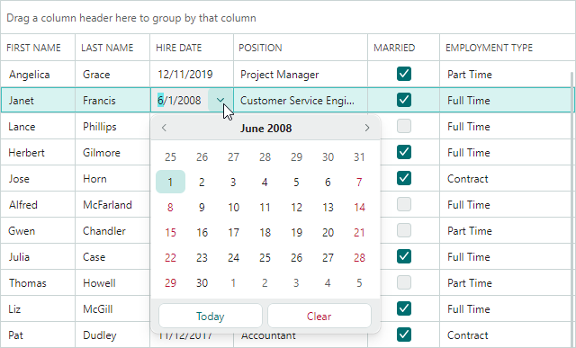

# Data Editing

## Default In-place Eremex Editors

The DataGrid control's default behavior is to use Eremex in-place editors to display and edit cell values of common data types.



The following list shows Eremex editors associated with individual data types:

- Boolean values — `CheckEditor`
- Double values — `SpinEditor`
- Enumeration values — `ComboBoxEditor`
- Properties with a `TypeConverter` attribute whose `TypeConverter.GetStandardValuesSupported` method returns `true` — `ComboBoxEditor`
- Other values — `TextEditor`

You can explicitly specify cell editors for DataGrid columns to override the default editor assignment, and to customize settings of in-place editors. The current topic provides more details about editor assignment.

When an edit operation starts in a cell, you can access and modify the active in-place editor. See the [Access the Active In-place Eremex Editor](#access-the-active-in-place-eremex-editor) section for more information.

## Assign In-place Eremex Editors

To explcitly assign an in-place Eremex editor to cells (columns), use the `GridColumn.EditorProperties` property.

You can set the `EditorProperties` property to the following objects that specify the in-place editor type (all of these objects are `BaseEditorProperties` descendants):

- `ButtonEditorProperties` — Contains settings specific to the `ButtonEditor` control.
- `CheckEditorProperties` — Contains settings specific to the `CheckEditor` control.
- `ComboBoxEditorProperties` — Contains settings specific to the `ComboBoxEditor` control.
- `DateEditorProperties` — Contains settings specific to the `DateEditor` control.
- `HyperlinkEditorProperties` — Contains settings specific to the `HyperlinkEditor` control.
- `MemoEditorProperties` — Contains settings specific to the `MemoEditor` control.
- `PopupColorEditorProperties` — Contains settings specific to the `PopupColorEditor` control.
- `SegmentedEditorProperties` — Contains settings specific to the `SegmentedEditor` control.
- `SpinEditorProperties` — Contains settings specific to the `SpinEditor` control.
- `TextEditorProperties` — Contains settings specific to the `TextEditor` control.

Assume that you set the `EditorProperties` property to a `SpinEditorProperties` object. In display mode (cell editing is not active), the DataGrid control emulates a `SpinEditor` in the target column's cells, using the settings of the `SpinEditorProperties` object. No real `SpinEditor` is created until an edit operation starts in a cell. When a user starts cell editing, the DataGrid control creates a real `SpinEditor` in-place editor in the focused cell. After the edit operation is complete, the control destroys the real `SpinEditor` and starts emulating a `SpinEditor` in this cell. See [Access the Active In-place Eremex Editor](#access-the-active-in-place-eremex-editor) to learn how to access the real cell editor.

### Example - How to use ButtonEditor as an in-place editor in a DataGrid column

The following code assigns a `ButtonEditor` in-place editor to a DataGrid column. 

``` xml
xmlns:mxdg="https://schemas.eremexcontrols.net/avalonia/datagrid" 
xmlns:mxe="https://schemas.eremexcontrols.net/avalonia/editors"

<mxdg:DataGridControl.Columns>
    <mxdg:GridColumn Header="Name" FieldName="Name">
        <mxdg:GridColumn.EditorProperties>
            <mxe:ButtonEditorProperties>
                <mxe:ButtonEditorProperties.Buttons>
                    <mxe:ButtonSettings Content="Clear" 
                     Command="{Binding 
                      $parent[mxdg:CellControl].DataControl.DataContext.ClearValueCommand}"/>
                </mxe:ButtonEditorProperties.Buttons>
            </mxe:ButtonEditorProperties>
        </mxdg:GridColumn.EditorProperties>
    </mxdg:GridColumn>
</mxdg:DataGridControl.Columns>
```

## Assign In-place Eremex Editors Using Templates

You can use templates to assign Eremex editors to DataGrid columns. Cell templates allow you to supply different editors for different rows in the same column.

!!! Note 

    Using templates has the following limitations:

    - Display text provided via cell templates is not used for sorting, grouping, and filtering data.
    - Cell templates are not [exported](../export.md).


To supply an in-place editor for a column in a cell template, use the `GridColumn.CellTemplate` property.

Set the `x:Name` property to **"PART_Editor"** for the Eremex editor defined in a template. This ensures automatic binding of the editor's value (`BaseEditor.EditorValue`) to the column's field. Additionally, 
the editor's appearance settings (border visibility and foreground colors in the active and inactive states) will be managed by the DataGrid control.

``` xml
xmlns:mxdg="https://schemas.eremexcontrols.net/avalonia/datagrid"
xmlns:mxe="https://schemas.eremexcontrols.net/avalonia/editors"
...
<mxdg:GridColumn Header="Phone" FieldName="Phone">
    <mxdg:GridColumn.CellTemplate>
        <DataTemplate>
            <mxe:ButtonEditor x:Name="PART_Editor">
                <mxe:ButtonEditor.Buttons>
                    <mxe:ButtonSettings Content="..."/>
                </mxe:ButtonEditor.Buttons>
            </mxe:ButtonEditor>
        </DataTemplate>
    </mxdg:GridColumn.CellTemplate>
</mxdg:GridColumn>
```


## Custom Editors

You can use cell templates to embed custom editors in DataGrid columns. The following approaches are available:

- Assign an editor directly to a specific column.
- Dynamically assign editors to columns based on the data type of the column's underlying object. 

See the [Custom Editors](custom-editors.md) topic for more information.


## Get and Set Cell Values

Use the following API to obtain and set cell values:

- `DataGridControl.GetCellValue`
- `DataGridControl.SetCellValue`

<!-- TODO
- `DataGridControl.GetCellDisplayText` -->


## Access the Active In-place Eremex Editor

- `ActiveEditor` property — Returns the active in-place editor. 
  
  When an in-place Eremex editor is assigned to a Data Grid column (implicitly, or explicitly using the `EditorProperties` property and templates), the control emulates the specified in-place editor in this column's cells in display mode (when cell editing is not active). No real in-place editor exists at this moment. The emulation of cell editors in display mode improves application performance.

  When a user starts editing a cell, the control creates a real in-place editor. At this moment, you can use the control's `ActiveEditor` property to access the real Eremex editor instance. When a cell loses focus, the real editor is destroyed, and the `ActiveEditor` property returns `null`.

- `ShownEditor` event — Raised after an in-place editor has been created for a cell and edit operation has started. You can access the active editor using the event's `Editor` parameter or the control's `ActiveEditor` property.

## Show Cell Editors

- `ShowEditor` method — Activates a cell editor in the focused cell.
- `ShowingEditor` event — Allows you to prevent a cell editor from being activated by users in specific cases. While handling the `ShowingEditor` event, set the `Cancel` event parameter to `true` to disable editor activation. See [Make Cells Non-Editable (Prevent Copying)](#make-cells-non-editable-prevent-copying).


### Show Cell Editors by Users

When cell editing is enabled, a click on a row cell activates a cell editor. Use the `DataControlBase.EditorShowMode` property to specify which mouse action triggers the editor. You can set this property to the following values:

- `EditorShowMode.PointerPressed` (default) — A cell editor is activated when the mouse button is pressed.

    When [row drag-and-drop](../row-drag-and-drop.md) is enabled and `RowDragMode` is set to `RowDragMode.Row`, the `EditorShowMode.PointerPressed` mode is not supported. In this configuration, the default mode is `EditorShowMode.PointerPressedInFocusedCell`.

- `EditorShowMode.PointerPressedInFocusedCell` — A cell editor is activated when the mouse button is pressed in the focused cell.

    This mode is the default if row drag-and-drop is active and the control's `RowDragMode` property is set to `RowDragMode.Row`.

- `EditorShowMode.PointerReleased` — A cell editor is activated when the mouse button is released.
- `EditorShowMode.PointerReleasedInFocusedCell` — A cell editor is activated when the mouse button is released in the focused cell.


## Close the Active In-place Editor

- `CloseEditor` method — Saves changes made in the cell editor and closes the editor.
- `HideEditor` method — Closes the cell editor without saving any changes.

- `HiddenEditor` event — Fires after the active cell editor is closed.


## Save the Changes Made in an In-place Editor

- `CloseEditor` method — Saves changes made in the cell editor and closes the editor.
- `PostEditor` method — Saves changes made in the active cell editor without closing the editor.

## Make Cells Read-Only (Copyable)

You can make column cells read-only, while allowing users to copy cell values. To achieve this:

- Set the column's `ReadOnly` property to `true`.
- Keep the column's `AllowEditing` property set to `true` (default).

``` xml
<mxdg:GridColumn FieldName="FirstName" ReadOnly="True"/>
```


## Make Cells Non-Editable (Prevent Copying)


### Entire Grid

To make the entire grid non-editable, set the control's `AllowEditing` property to `false`.

``` xml
<mxdg:DataGridControl x:Name="dataGrid" AllowEditing="False">
```

### Specific Columns

To make all cells in a specific column non-editable, use one of the following approaches:

- Set the column's `AllowEditing` property to `false`.

    ``` xml
    <mxdg:GridColumn FieldName="HireDate" AllowEditing="False"/>
    ```

    

- Set the column's `AllowFocus` property to `false`. This setting prevents the column from receiving focus.

### Specific Cells

To make individual cells non-editable, handle the `ShowingEditor` event. This event fires when a cell editor is about to be activated. Set the `Cancel` event parameter to `true` to prevent cell editor activation.

``` cs
private void DataGrid_ShowingEditor(object sender, DataGridShowingEditorEventArgs e)
{
    DataGridControl grid = sender as DataGridControl;
    // Your condition to prevent cell editor activation
    if(grid.FocusedRowIndex == 0) 
        e.Cancel = true;
}
```