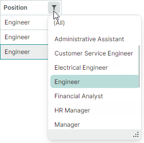
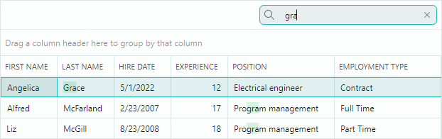
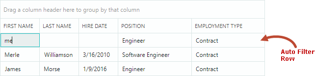
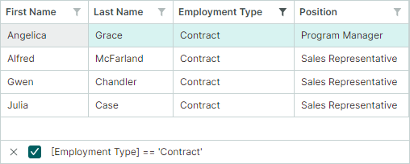
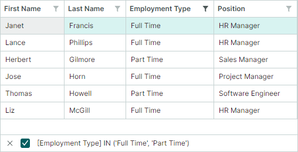

# Filter and Search

Data Grid supports the data filtering and searching features, which allow you to locate rows that contain specific text.

## Column Filters

Users can filter grid columns using filter menus. 
To open a filter menu for a column, hover over the column header with the mouse until a filter button appears, and then click it. The opened filter menu contains all unique values from that column. Select an item in the filter menu to filter the column against this value.


Users can filter the grid against multiple columns. Filters applied to multiple columns are combined by the AND operator.


### 'List' and 'Checked List' Display Modes

Filter menus can present items (column values) using one of two display modes:

- `List` (default) — A regular list that allows a single item to be selected at a time.

    


- `CheckedList` — A list with checkboxes that allow users to select multiple items simultaneously.

    


You can set filter menu display mode globally for all columns, or set it for individual columns, using the following properties:

- `DataGridControl.ColumnFilterPopupMode` (default value is `List`) — Specifies default display mode for all column filter menus. This setting is applied to the columns that have their `GridColumn.FilterPopupMode` property set to `null`.

- `GridColumn.FilterPopupMode` (default value is `null`) — Specifies filter menu display mode for individual columns. When set, this property overrides the global setting (`DataGridControl.ColumnFilterPopupMode`).

The following example applies `CheckedList` display mode to all columns, and `List` display mode to the _City_ column.

``` cs
dataGrid.ColumnFilterPopupMode = Eremex.AvaloniaUI.Controls.DataControl.FilterPopupMode.CheckedList;
dataGrid.Columns["City"].FilterPopupMode = Eremex.AvaloniaUI.Controls.DataControl.FilterPopupMode.List;
```


### Filter Panel

Once a filter is applied, the filter panel appears at the bottom. It displays the currently applied filter criteria, and allows you to temporarily disable and clear the filter.


To learn how to filter programmatically, see the following section:

- [Filter in Code](#filter-in-code)


### Related API

**DataGrid Control Members**

- `AllowColumnFiltering` — Gets or sets whether filter buttons are allowed for all columns. You can use a column's `ColumnBase.AllowColumnFiltering` property to override the global setting for individual columns.

    For instance, to disable filter buttons for all columns except one, set the `DataGridControl.AllowColumnFiltering` property to `false`, and the target column's `ColumnBase.AllowColumnFiltering` property to `true`.

- `ColumnFilterButtonDisplayMode` — Gets or sets whether filter buttons are always visible, or only appear when a user hovers a column header with the mouse (default).

- `ColumnFilterPopupMode` — Gets or sets default display mode (`List` or `CheckedList`) for all column filter menus. Use a column's `FilterPopupMode` property to override this setting for individual columns.

- `CustomColumnDisplayText` event — Allows you to provide custom display text for column values, including those in filter menus and the filter panel. When the `CustomColumnDisplayText` event fires for values in the filter panel, the event's `SourceItemIndex` parameter returns `-1`.

- `FilterPanelText` — Gets the text representation of the filter displayed in the filter panel.

- `FilterPanelDisplayMode` — Gets or sets the filter panel's visibility mode. Available options include: 

    - `Auto` (default) — The filter panel appears when a filter is applied to any column.
    - `Never` — The filter panel is always hidden.

- `FilterString` — Gets or sets the filter criteria applied to the control. You can use this property to [construct a filter in code](#filter-in-code).

- `IsFilterEnabled` — Gets or sets whether the filter is active.

- `IsFilterPanelVisible` — Gets whether the filter panel is currently visible.


**Column Members**

 - `ColumnBase.AllowColumnFiltering` — Gets or sets whether a filter button is allowed for the current column. To enable or disable filter buttons for all columns, see the `DataGridControl.AllowColumnFiltering` setting. The `ColumnBase.AllowColumnFiltering` option allows you to override the  `DataGridControl.AllowColumnFiltering` setting for individual columns.
 - `ColumnBase.ColumnFilterMode` — Gets or sets how a column's data is filtered. Available options include:

    - `Value` (default) — A column's data is filtered by underlying values.
    - `DisplayText` — A column's data is filtered by cell display text.

<!-- TODO 
Example for ColumnFilterMode.DisplayText.
-->

- `ColumnBase.FilterPopupMode` — Gets or sets filter menu display mode (`List` or `CheckedList`) for individual columns. When set, this property overrides the control's `ColumnFilterPopupMode` property.

 - `ColumnBase.IsFiltered` — Gets whether a filter is applied to the current column.
 - `ColumnBase.RoundDateTimeForColumnFilter` — Gets or sets whether to ignore the time portion of DateTime values when constructing filters for columns that display DateTime values. This property is in effect for filters created using column filter menus and the [auto filter row](#auto-filter-row).

<!-- TODO
Add screenshots for RoundDateTimeForColumnFilter
 -->
 

## Search Panel

The Search Panel helps a user quickly locate rows by the data they contain. When a user types text in the Search Panel, the Data Grid control displays those rows that contain the typed text.



- The search functionality is case-insensitive.
- The **Contains** comparison operator is used for data searching.
- Data search is performed across all columns.

Set the control's `SearchPanelDisplayMode` property (inherited from the `DataControlBase` class) to one of the following values to enable the Search Panel:

- `SearchPanelDisplayMode.Always` — The control permanently displays the Search Panel.
- `SearchPanelDisplayMode.HotKey` — The control displays the Search Panel when a user presses the CTRL+F hotkey. The ESC shortcut clears the Search Panel. A subsequent ESC key press closes the panel. A user can also activate the Search Panel from a column header's context menu.


### Related API

- `DataControlBase.IsSearchPanelVisible` — Gets whether the Search Panel is currently visible.
- `DataControlBase.SearchPanelHighlightResults` — Specifies whether to highlight the search text in the found rows. The property's default value is `true`.
- `DataControlBase.SearchText` — Gets or sets the search text. You can assign a value to this property to filter the control in code. This filtering functionality is supported even if the Search Panel is hidden or disabled (the `SearchPanelDisplayMode` property is set to `SearchPanelDisplayMode.Never`).
- `DataControlBase.ShowSearchPanelCloseButton` — Allows you to hide the Search Panel's built-in Close button.

### Example
The following code enables the Search Panel. The `SearchText` property is used to set the search text.

``` csharp
dataGrid.SearchPanelDisplayMode = SearchPanelDisplayMode.Always;
dataGrid.SearchText = "search";
```

## Auto Filter Row

The Auto Filter Row is a special row displayed above all grid rows. It allows a user to type text in its cells to filter data against corresponding columns.



- The filter functionality is case-insensitive.

### Enable Auto Filter Row

Set the `DataGridControl.ShowAutoFilterRow` property to `true`.


### Enable Runtime Filter Operator Selectors

You can allow users to choose filter logic for Auto Filter Row cells at runtime. When this feature is active, a filter operator icon appears in each Auto Filter Row cell. Users can click this icon to open a dropdown menu and select the desired operator.


Use the following properties to enable filter operator selectors:

- `DataGridControl.ShowConditionInAutoFilterRow` (default is `false`) — Specifies the default visibility of filter operator selectors for all Auto Filter Row cells (columns). 
- `ColumnBase.ShowConditionInAutoFilterRow` — Enables or disables the filter operator selector for an individual column. This property overrides the `DataGridControl.ShowConditionInAutoFilterRow` setting.

### Specify Filter Operators in Code

Use the `ColumnBase.AutoFilterCondition` property to programmatically specify filter operators for individual Auto Filter Row cells (columns). The following filter operators are supported:

- `Contains` (applicable to string values) — Row values must contain the entered text.
- `Default` — Default mode. 

    - `Default` is equivalent to the `Contains` option for the String and Object data types. 
    - `Default` is equivalent to the `Equals` option for other data types.

- `DoesNotContain` (applicable to string values) — Row values must not contain the entered text. 
- `DoesNotEqual` — Row values in the target column must not match the entered value.
- `EndsWith` (applicable to string values) — Row values must end with the entered text. 
- `Equals` — Row values must match the entered value.
- `Greater` — Row values must be greater than the entered value.
- `GreaterOrEqual` — Row values must be greater than or equal to the entered value.
- `Less` — Row values must be less than the entered value.
- `LessOrEqual` — Row values must be less than or equal to the entered value.
- `StartsWith` (applicable to string values) — Row values must start with the entered text. 

### Specify Filter Values

The `ColumnBase.AutoFilterValue` property allows you to set a value for a specific Auto Filter Row cell in code. You can use the `ColumnBase.AutoFilterValue` property to filter the Data Grid even if the Auto Filter Row is hidden.

### Example

The following code activates the Auto Filter Row and displays rows whose values in the 'Name' column start with "M".

``` csharp
using Eremex.AvaloniaUI.Controls.DataControl;
using Eremex.AvaloniaUI.Controls.DataGrid;

dataGrid1.ShowAutoFilterRow = true;
GridColumn colName = dataGrid1.Columns["Name"];
colName.AutoFilterCondition = AutoFilterCondition.StartsWith;
colName.AutoFilterValue = "M";
```

## Filter Rows Dynamically Using an Event

You can handle the `CustomRowFilter` event to hide specific rows based on a custom condition. 

The `CustomRowFilter` event fires for each item in the bound item source in the following cases:

- The control's item source changes.
- The control's rows are filtered (for instance, using the Search Panel and Auto Filter Row).
- The control's `RefreshData` method is called.

Use the `SourceItemIndex` event parameter to identify the currently processed item. To hide the corresponding row, set the `Visible` event parameter to `false`.

### Example - Filter Rows with an Event

In the following example, a Data Grid control displays a list of _EmployeeInfo_ objects. The `CustomRowFilter` event is handled to implement custom filtration of rows. Rows are hidden according to a value of the _EmployeeInfo.EmploymentType_ property.

It is assumed that the example contains the "Enable Filter" toggle button that activates and deactivates the custom filtration. When the button is clicked, the `ToggleButton.IsCheckedChanged` event handler calls the `RefreshData` method to refresh grid rows and re-raise the `CustomRowFilter` event.

``` xml
<ToggleButton Name="btnEnableFilter" Content="Enable Filter" IsCheckedChanged="BtnEnableFilter_IsCheckedChanged" />

<mxdg:DataGridControl x:Name="dataGrid" Grid.Row="1" ItemsSource="{Binding Employees}" 
    CustomRowFilter="DataGrid_CustomRowFilter">
<!-- ... -->
```

``` cs
using Eremex.AvaloniaUI.Controls.DataGrid;

private void BtnEnableFilter_IsCheckedChanged(object sender, Avalonia.Interactivity.RoutedEventArgs e)
{
    dataGrid.RefreshData();
}

private void DataGrid_CustomRowFilter(object sender, DataGridCustomRowFilterEventArgs e)
{
    bool filterEnabled = btnEnableFilter.IsChecked == true;
    if (!filterEnabled)
        return;
    DataGridControl grid = sender as DataGridControl;
    IList<EmployeeInfo> dataSource = grid.ItemsSource as IList<EmployeeInfo>;
    EmployeeInfo employee = dataSource[e.SourceItemIndex];
    e.Visible = employee.EmploymentType != EmploymentType.Contract;
}
```


## Filter in Code

Starting with version 1.2, you can use the `DataGridControl.FilterString` property to filter the control's data in code.

``` cs
dataGrid.FilterString = "[FirstName] = 'Julia' && [Position] = 'Sales Representative'";
```


A filter string consists of individual filter expressions combined by [logical operators (AND or OR)](#logical-operators).


### Clear and Disable the Filter

- To clear the filter, set the `FilterString` property to `null` or an empty string.
- To temporarily disable the filter, use the `DataControlBase.IsFilterEnabled` property.

### Specify Columns

In the filter string, columns should be referenced by their field names enclosed in square brackets. Examples:

- `[FirstName]`
- `[Position]`

### Specify Constants

- Numeric constants must specified using common numeric formats. Examples: 

    - `500`, `0`
    - `10.314`, `.5` 
    - `12.0m`/`12.0M`, `12d`/`12D`, `12f`/`12F`
    - `-32.5`

- String constants must be wrapped in single quote characters (`'`). To insert `'` as a literal, use the `''` notation. Examples: 

    - `'Research and Development'`
    - `'Clair de lune'`
    - `'O''Neil'`

- DateTime and DateTimeOffset constants must be wrapped with the `#` characters and specified using an invariant culture. Examples:

    - `#2018-03-22#`
    - `#2018-03-22 13:18:51#`
    - `#2018-03-22 13:18:51.94944#`

- DateOnly and TimeOnly constants must be enclosed between `#!` and `!#` strings. Examples:

    - `#!2026-01-01!#`
    - `#!12:23:45!#`

- Boolean constants:
    - `true`, `True`, or `TRUE` 
    - `false`, `False`, or `FALSE`


### Logical Operators

You can use the following logical operators to combine individual expressions in a filter string:

- `&&`, `and`, `And` or `AND`
- `||`, `or`, `Or` or `OR`

``` cs
dataGrid.FilterString = "[Price] < 5 OR [Price] > 15";
```

### Operators and Functions

The following table lists available operators and functions to construct filter expressions:

| Operators and Functions | Description | Example |
| --- | --- | --- |
| `=` or `==` | Equal to | `[Price] = 500` |
| `!=` or `<>` | Not equal to | `[Price] != 500` |
| `<` | Less than | `[Price] < 700` |
| `>` | Greater than | `[Price] > 600` |
| `<=` | Less than or equal to | `[Price] <= 600` |
| `>=` | Greater than or equal to | `[Price] >= 800` |
| `is null` | Selects null values | `[Region] is null` |
| `is not null` | Selects non-null values | `[Region] is not null` |
| `IsNull` | Selects null values | `IsNull([Region])` |
| `IsNullOrEmpty` | Selects null values and empty strings | `IsNullOrEmpty([Region])` |
| `In` | Selects items that have any of the specified values. | `[City] In ('Beijing', 'Shenzhen', 'Chengdu')` |
| `Contains` | Selects items that contain the specified string. The Contains operator is case-insensitive. | `Contains([Name], 'lan')` |
| `StartsWith` | Selects items that start with the specified string. The StartsWith operator is case-insensitive. | `StartsWith([Product], 'CPU')` |
| `EndsWith` | Selects items that end with the specified string. The EndsWith operator is case-insensitive. | `EndsWith([Product], '9950X')` |
| `!`, `not`, `Not` or `NOT` | Negation operator | `!Contains([Maker], 'amd')` |

### Advanced Filter Expressions

You can use the `Eremex.AvaloniaUI.Controls.Data.Filtering.ExprStringBuilder` class to create advanced filter criteria. These filter criteria can include operations on operands, calls of supported functions, and more. To construct filter criteria, use members of the `ExprStringBuilder` class.

To get a filter string, call the `ToString` method of a resulting `ExprStringBuilder` object. You can then assign this filter string to a target control's `DataControlBase.FilterString` property.


``` cs
// [Price] * [Stock] > 5000m
// Note: All operands ([Price], [Stock] and '5000') must be of the same data type (e.g., decimal). Otherwise, the control will fail to evaluate the expression.
var filter = ExprStringBuilder.Property("Price").Multiply(ExprStringBuilder.Property("Stock")).GreaterThanValue(5000m);
var filterString = filter.ToString();
control.FilterString = filterString;
```

!!! Important

    Currently, expression operands (column data types and constants) must be of the same data type. Using different data types (e.g., decimal and integer) in the same expression is not currently supported.


``` cs 
// [PropertyA] IN (([PropertyB] + 2m) % 3.0, 'ABC', null)
var filterString = ExprStringBuilder.Property("PropertyA").In(ExprStringBuilder.Property("PropertyB").AddValue(2m) .ModuloValue(3d), ExprStringBuilder.Constant("ABC"), ExprStringBuilder.Null()).ToString();
control.FilterString = filterString;
```

### Specify Enumeration Values

To specify enumeration values in a filter string, you should construct filter criteria using the `Eremex.AvaloniaUI.Controls.Data.Filtering.ExprStringBuilder` class.
The `ExprStringBuilder.ToString` method allows you to get a filter string, which you can assign to a target control's `FilterString` property.

You also need to register the enumeration type using the `EnumProcessingHelper.RegisterEnum` method before the filter string is assigned to the target control.

#### Examples - Use Enumeration Values in Filter Expressions

The following two examples create filter expressions against the _EmploymentType_ column. This column displays _EmploymentKind_ enumeration values.

``` cs
public enum EmploymentKind
{
    [Display(Name = "Full Time")]
    FullTime,
    [Display(Name = "Part Time")]
    PartTime,
    Contract
}
```
##### Example 1

The expression below uses the `ExprStringBuilder.EqualValue` function to select rows where the _EmploymentType_ column is equal to _EmploymentKind.Contract_.
Take note of the `EnumProcessingHelper.RegisterEnum` method used to register the _EmploymentKind_ enumeration.

``` cs
using Eremex.AvaloniaUI.Controls.Data.Filtering;

EnumProcessingHelper.RegisterEnum(typeof(EmploymentKind));

// [EmploymentType] = 'Contract'
var filterString1 = ExprStringBuilder.Property("EmploymentType").EqualValue(EmploymentKind.Contract).ToString();
control.FilterString = filterString1;
```



##### Example 2

The following expression uses the `ExprStringBuilder.InValues` function to generate the _In_ operator. This expression checks whether the _EmploymentType_ column is equal to _EmploymentKind.FullTime_ or _EmploymentKind.PartTime_.

``` cs
// [EmploymentType] IN ('FullTime', 'PartTime')
var filterString2 = ExprStringBuilder.Property("EmploymentType").InValues(EmploymentKind.FullTime, EmploymentKind.PartTime).ToString();
control.FilterString = filterString2;
```




