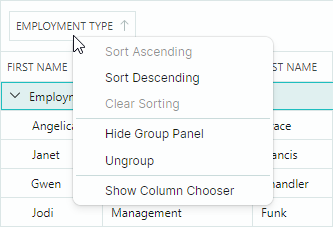
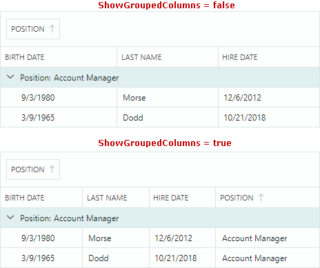
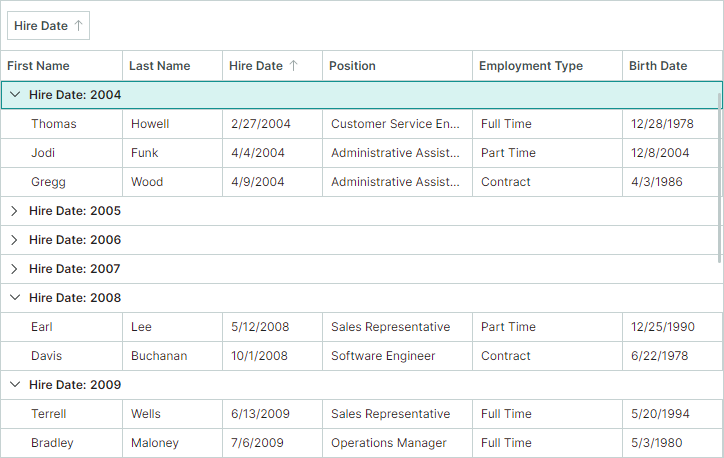

# Grouping

Data Grid can group data against one or multiple columns. Data grouping combines rows with identical column values into the same data groups. 


A user can group data as follows:

- Drag a column header to the group panel. 
- Right-click a column header and select the "Group By This Column" command.

    

To ungroup data, a user can do one of the following actions:

- Drag a group column header from the group panel.
- Right-click a group column header and select the "Ungroup" command.

    

When you apply grouping by a column, this column's data is [sorted](sorting.md). A user can click the group column header to toggle the sort order.


## Group Panel 

A grid control's group panel displays headers of group columns. A user can drag a column header onto the group panel to group by this column. 


Use the DataGrid's `ShowGroupPanel` property to specify the visibility of the group panel. A user can hide and then restore the group panel using the context menu for column headers:


## Group Columns

When you group by a column, this column is moved from the grid to the group panel. Set the `ShowGroupedColumns` property to `true` to display group columns in the group panel and grid at the same time. The following image illustrates the `ShowGroupedColumns` setting:



## Prevent Grouping

You can disable a column's `AllowSorting` property to prevent a user from performing sort and group operations on this column.

The `DataGridControl.AllowSorting` property allows you to prohibit [sort](sorting.md) and group operations by users for any column.

If a column does not support sorting (for instance, when a column displays image data or bound to an object that does not implement the `IComparable` interface), data cannot be grouped by this column. You can change this default behavior, as covered in the following section: [Customize Grouping Logic](#customize-grouping-logic).

## Customize Grouping Logic

Group columns are always [sorted](sorting.md), in ascending or descending order, as specified by the `ColumnBase.SortDirection` property. 

During a grouping operation, grid rows are combined into groups according to edit values or display values of group columns. Default group and sort logic is dependent on the column's in-place editor and the bound property's data type:

- Grouping/sorting by edit values — All columns except those with an embedded ComboBoxEditor.
- Grouping/sorting by display text — Columns with an embedded ComboBoxEditor.
- No grouping/sorting — Columns bound to objects that do not implement the `IComparable` interface. For instance, image data types do not implement this interface, thus corresponding columns do not support sort and group operations, by default. To forcibly sort and group these columns, implement [custom sorting](sorting.md#custom-sorting) and [custom grouping](#custom-grouping) for these columns.


The `ColumnBase.SortMode` property allows you to change sort/group mode for a column. The following options are available:

- `SortMode.Value` — Sort/group by cell edit values.
- `SortMode.DisplayText` — Sort/group by cell display text.
- `SortMode.Custom` — Enables custom sorting and grouping. Set the `SortMode` property to `Custom`, and then handle the `DataGridControl.CustomColumnGroup` and/or `DataGridControl.CustomColumnSort` event to implement custom grouping and/or custom sorting logic. See the following links for more information:

    - [Custom Sorting](sorting.md#custom-sorting)
    - [Custom Grouping](#custom-grouping)

### Custom Grouping

To implement custom grouping rules for a specific column(s), set the column's `ColumnBase.SortMode` property to `Custom`, and handle the `DataGridControl.CustomColumnGroup` event.

The `CustomColumnGroup` event fires for each group column to compare pairs of adjacent grid rows. When handling this event, you should specify whether to combine the rows into the same group. 

The following event parameters allow you to identify group rows, values, and set the comparison result:

- `Column` — The currently processed group column.
- `SourceItemIndex1` and `SourceItemIndex2` — The indexes in the bound item source (`DataGridControl.ItemsSource`) of the items (business objects) that correspond to the currently processed grid rows.
- `Value1` and `Value2` — The values of the group column in the currently processed grid rows.
- `Result` — The result of a custom comparison. Set `Result` to `true` to place the rows into the same group. Set `Result` to `false` if rows need to be placed in different groups. Set `Result` to `null` to apply the default grouping logic.


<!-- TODO
Result can be set to null. What's this for?
 -->

To improve the control's performance, the `CustomColumnGroup` event fires to compare a row with a small set of adjacent grid rows (according to the current sort order). This event does not fire for all possible combinations of two grid rows. If you need to change the default row sorting logic and place specific rows near each other, handle the `ColumnView.CustomColumnSort` event.

#### Example - Group by Years When you Group by a Date-Time Column

Assume that a Data Grid control contains the _HireDate_ column that displays DateTime values. When you group by this column, the control's default grouping behavior is to combine rows with unique DateTime values.

This example applies custom grouping rules: rows are grouped by the Year part of _HireDate_ values. To accomplish this task, the _HireDate_ column's `SortOrder` property is set to `Custom`, and the following  events are handled:

- `DataGridControl.CustomColumnGroup` — Implements custom grouping logic.
- `DataGridControl.CustomGroupValueDisplayText` — Displays the Year part of a date-time value in group rows. See [Group Row Text](#group-row-text).

For demonstration purposes, the `ShowGroupedColumns` property is enabled to display the grouped _HireDate_ column in the group panel and grid at the same time.



``` cs
dataGrid.Columns["HireDate"].SortMode = Eremex.AvaloniaUI.Controls.DataControl.SortMode.Custom;
dataGrid.CustomColumnGroup += DataGrid_CustomColumnGroup;
dataGrid.CustomGroupValueDisplayText += DataGrid_CustomGroupValueDisplayText;        
dataGrid.ShowGroupedColumns = true;

private void DataGrid_CustomColumnGroup(object sender, DataGridCustomColumnGroupEventArgs e)
{
    if (e.Column.FieldName != "HireDate")
        return;
    DateTime employeeHireDate1 = (DateTime)e.Value1;
    DateTime employeeHireDate2 = (DateTime)e.Value2;
    e.Result = employeeHireDate1.Year == employeeHireDate2.Year;
}

private void DataGrid_CustomGroupValueDisplayText(object sender, DataGridCustomGroupValueDisplayTextEventArgs e)
{
    if (e.Column.FieldName != "HireDate")
        return;
    DateTime hireDate = (DateTime)e.Value;
    e.DisplayText = hireDate.Year.ToString();
}
```


## Group in Code

To group data by a column(s) in code, do the following:

1. Sort this column(s), and position it (them) at the beginning of the sorted column collection. You can sort a column using the `SortIndex` and `SortDirection` properties. See [Sorting](sorting.md) for more information.
2. Set the `DataGridControl.GroupCount` property to the number of group columns.

The following code groups data by two columns.

``` csharp
GridColumn column1 = dataGrid.Columns["EmploymentType"];
GridColumn column2 = dataGrid.Columns["Position"];

if(column1 != null && column2 != null)
{
    dataGrid.BeginDataUpdate();
    column1.SortIndex = 0;
    column2.SortIndex = 1;
    column2.SortDirection = System.ComponentModel.ListSortDirection.Descending;
    dataGrid.GroupCount = 2;
    dataGrid.EndDataUpdate();
}
```

<!--TODO
Add the ClearGrouping method after BeginDataUpdate in the example above
the ClearGrouping member need to be published
-->

This example uses the `BeginDataUpdate` and `EndDataUpdate` methods to prevent superfluous updates when you change multiple group/sort settings. The Data Grid is only updated after the `EndDataUpdate` method call. 

Without using the `BeginDataUpdate` and `EndDataUpdate` methods, the Data Grid is updated after each change to any group/sort setting. 

Each call to the `BeginDataUpdate` method must be followed by a call to the `EndDataUpdate` method.


## Group Rows

Group rows are used to form a row hierarchy when data is grouped. They display values of corresponding group columns. Group rows do not exist in the bound item source. 

### Identify Group Rows

[Row indexes](rows.md#identify-and-get-rows) allow you to identify grid rows in code. Group rows have negative row indexes, while row indexes of data rows are non-negative.

The `FocusedRowIndex` property allows you to obtain the currently focused group or data row, or move focus to a specific group or data row. The following code moves focus to the first group row:

``` cs
// If data is grouped, focus the first group row.
if (dataGrid.GroupCount > 0)
    dataGrid.FocusedRowIndex = -1;
```

See also: [Traverse Through Group Rows](#traverse-through-group-rows).

### Expand and Collapse Group Rows 

A user can expand and collapse group rows as follows:

- Click a group row's expand button

- Press the "+"/"-" and "&rarr;"/"&larr;" keys on the keyboard


In code, you can control group row expansion with the following API members:

- `AutoExpandAllGroups` — Specifies whether to automatically expand group rows after each data grouping operation.
- `CollapseAllGroups` — Collapses all group rows.
- `CollapseGroupRow` — Collapses a group row. 
- `ExpandAllGroups` — Expands all group rows.
- `ExpandGroupRow` — Expands a group row.
- `IsGroupRow` — Specifies whether a specific row is a group row.
- `IsGroupRowExpanded` — Specifies whether a group row is expanded.


### Traverse Through Group Rows

Group rows own child data rows, and they can also own other group rows if data is grouped by two or more columns.

Use the following methods to iterate through group rows and their children:

- `GetGroupChildRowCount` — Gets the number of immediate child rows of the specified group row. This method returns `-1` if the specified row is a data row, since data rows have no children.

    The `GetGroupChildRowCount` method without parameters returns the number of group rows at the root level. If data is not grouped, this overload returns `-1`.

- `GetGroupChildRowIndex` — Returns the [row index](rows.md#get-and-set-row-values) of the specified child row. The `GetGroupChildRowIndex` method has two overloads:

    - `GetGroupChildRowIndex(int rowIndex, int childIndex)` — Gets the row index of a child row owned by the specified group row. The child row must be an immediate child of the specified group row. The `rowIndex` parameter specifies the parent group row. The `childIndex` parameter specifies the target child row's visual position among its siblings.
    
    - `GetGroupChildRowIndex(int childIndex)` — Gets the row index of a root group row displayed at the `childIndex` position. The `childIndex` parameter identifies the visual position of a target root group row among other root group rows.

- `GetParentRowIndex` — Gets the [row index](rows.md#get-and-set-row-values) of a row's parent group row. This method returns the `DataGridControl.InvalidRowIndex` constant for rows that have no parents.

### Group Row Values

Use the `GetGroupRowValue` method to retrieve a group value of a specific group row.

<!--TODO
there is no GetGroupRowValue(Int32, GridColumn) overload with the GridColumn parameter

Add example
-->

### Group Row Text

The default text displayed in group rows is specified by values of corresponding group columns. The `CustomGroupValueDisplayText` event allows you to specify custom display text for group rows.
This event fires repeatedly for each group row. Use the event's arguments to identify the currently processed group row and its value. To specify a custom display value, set the `DisplayText` event argument.

