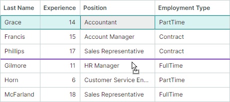

# Row Drag-and-Drop

Data Grid supports the row drag-and-drop functionality within the grid control and to external controls. 


When you drag rows, row previews are shown. However, if you enable platform-based row drag-and-drop (required for [dragging rows between applications](#enable-row-drag-and-drop-between-applications)), row previews are not available.

## Enable Row Drag-and-Drop

Set the `DataGridControl.AllowDragDrop` property to `true` to enable row drag-and-drop. In this mode a user can drag a row within the Data Grid control and outside the control.
A drag-and-drop operation moves a row to another position, and also changes the position of a corresponding business object in the data source.

If a row is dragged to an external control, the Data Grid's default behavior is to remove the row from the current control, and delete the corresponding business object from the control's data source. See [Row Drag-and-Drop Between Controls](#row-drag-and-drop-between-controls) for information on how to prevent rows and business objects from being deleted.

Drag-and-drop of multiple rows is supported if you enable multiple row selection using the `DataControlBase.SelectionMode` property (see [Rows - Multiple Row Selection (Highlight)](rows.md#multiple-row-selection-highlight)).

Data Grid does not maintain automatic copy operations during drag-and-drop. Pressing the CTRL key is not in effect. 


### Enable Row Drag-and-Drop Between Applications

To allow rows to be dragged between applications, enable the `UsePlatformRowDragDrop` property for the control that is the source of drag-and-drop operations.

!!! Tip

    The `UsePlatformRowDragDrop` property enables a drag-and-drop mode in which operations are handled by the Avalonia platform. No row previews are shown during platform-based row drag operations.

## Row Drag Mode – Start Drag Operations in Cells or Use Special Drag Handles

Data Grid supports two row drag-and-drop modes that differ in how drag-and-drop operations are initiated. You can select the required mode using the control's `RowDragMode` property.

- `RowDragMode.Row` mode (default) — Users can initiate a drag-and-drop operation in any row cell.

    


    In this mode, the default cell editor activation behavior is as follows:
    
    1. A user needs to focus a cell first.
    
    2. A click within the focused cell then activates the cell editor.
    
    To activate a cell editor on a single click, enable cell editor activation on mouse button release. To do this, set the control's `DataControlBase.EditorShowMode` property to `EditorShowMode.PointerReleased`.

- `RowDragMode.DragHandle` mode — Users can initiate a drag-and-drop operation by dragging a special drag handle. Drag handles are displayed in the Row Indicator region, which automatically appears to the left of the rows when you activate `RowDragMode.DragHandle` mode. 

    

    In `DragHandle` mode, cell editors are activated on a single press within a cell, by default. You can use the control's `DataControlBase.EditorShowMode` property to change this behavior.

    When multiple row selection is enabled, drag handles are shown for each selected row.


**Related API:**

- `RowIndicatorWidth` — Specifies the width of the Row Indicator region, which displays drag handles.


## Drag-and-Drop of Sorted and Grouped Data

When the grid control's data is [sorted](sorting.md) or [grouped](grouping.md), row drag-and-drop operations are disabled by default. Set the `DataGridControl.AllowDragDropSortedRows` property to `true` to enable drag-and-drop operations within sorted/grouped controls.

If data is sorted and a row is dragged to a position before or after another row, the control automatically updates the dragged row's value(s) in the sorted column(s) to keep the current sort order. The dragged row's values in the sorted columns are set to corresponding values of the target row. 

## Handle Drag-and-Drop Operations with Events

The Data Grid control contains events to manage and respond to row drag-and-drop operations.

### Start Drag-and-Drop

The `DataGridControl.StartDrag` event fires when a drag-and-drop operation is about to start. Use the following event parameters to get information about the current drag-and-drop operation.

- `e.Data` — Specifies the `DragDropData` object that contains the data of the current drag-and-drop operation.
- `e.DragElement` — The control's internal visual element being dragged.
- `e.Effects` — Specifies the drag-and-drop effect. Set this parameter to `DragDropEffects.None` to cancel the current drag-and-drop operation. The drag-and-drop effect also determines the mouse pointer icon. 
- `e.Items` — An array of data source items (business objects) corresponding to rows being dragged. If a group row is being dragged, the `e.Items` array contain business objects that correspond to data rows displayed inside this group row. To identify whether a group row is being dragged, see `e.DragRowIndexes`.
- `e.DragRowIndexes` — An array of indexes of rows being dragged. Data rows have non-negative indexes, while indexes of group rows are negative. See the following topic for more information: [Identify and Get Rows](rows.md#identify-and-get-rows)


#### Example - Prevent a drag-and-drop operation from starting for specific data rows

The following `StartDrag` event handler disables drag-and-drop operations for rows that contain the "Manager" string in the _Position_ column. 

``` cs
private void DataGrid_StartDrag(object sender, DataGridStartDragEventArgs e)
{
    // It is assumed that items in the grid's data source are EmployeeInfo objects. 
    // The EmployeeInfo class contains the Position property of the string type.
    foreach(EmployeeInfo item in e.Items)
    {
        if(item.Position.Contains("Manager"))
        {
            e.Effects = Avalonia.Input.DragDropEffects.None;
            return;
        }
    }
}
```

#### Example - Prevent drag-and-drop operations for group rows

The following example handles the `StartDrag` event to disable drag-and-drop operations for group rows. Group rows have negative indexes, so the `StartDrag` event handler checks if the `e.DragRowIndexes` array contains negative indexes.

``` cs
private void DataGrid_StartDrag(object sender, DataGridStartDragEventArgs e)
{
    foreach(int rowIndex in e.DragRowIndexes)
        if(rowIndex < 0) e.Effects = Avalonia.Input.DragDropEffects.None;
}
```

### Handle the Drag-Over Stage

The `DataGridControl.DragOver` event is raised repeatedly while a user drags a row (or rows) over another row. The event's arguments allow you to identify information related to the current drag-and-drop operation:

- `e.Items` — An array of data source items (business objects) that correspond to the rows being dragged. If a group row is being dragged, the `e.Items` array contains the business objects for all data rows within that group.
- `e.TargetRowIndex` — The [index](rows.md#identify-and-get-rows) of the row over which the rows are dragged.
- `e.DropPosition` — Gets or sets the potential drop position relative to the target row. Available options include: 
    - `DropPosition.Before` — Dragged rows, if dropped, will be added at the same hierarchy level before the target row.
    - `DropPosition.After` — Dragged rows, if dropped, will be added at the same hierarchy level after the target row.
    - `DropPosition.Inside` — Dragged rows, if dropped, will be added as a child of the target group row. This option is in effect when dragging over group rows.
    - `DropPosition.EmptyArea` (new in v1.5) — Rows are dragged over the empty area below all grid rows. 
    
        
    
        The `e.Effects` parameter is initially set to `DragDropEffects.None` when rows are dragged over the empty area, thus preventing them from being dropped here. 
    
        Set the `e.Effects` parameter to `DragDropEffects.Move` or `DragDropEffects.Copy` to allow row drop operations over the empty area. When rows are dropped over this area, they are inserted at the end of all rows. 

    You can modify the `e.DropPosition` parameter to change how dragged rows are inserted. For instance, to always append dragged rows at the end of all rows, set the `e.DropPosition` parameter to `DropPosition.EmptyArea`, and ensure the `e.Effects` parameter is not set to `None`.

- `e.KeyModifiers` — Specifies whether the ALT, SHIFT, and/or CTRL key is pressed during the `DragOver` event.
- `e.Data` — Specifies the `DragDropData` object that contains the data of the current drag-and-drop operation.
- `e.Effects` — Specifies the drag-and-drop effect. Set this parameter to `DragDropEffects.None` to cancel the current drag-and-drop operation. The drag-and-drop effect also determines the mouse pointer icon. 

#### Example - Allow rows to be dropped within the empty area

The following `DataGridControl.DragOver` event handler sets the `e.Effects` parameter to `Move` to allow rows to be dropped within the control's empty area.

``` cs 
private void ProductsInStockGrid_DragOver(object sender, DataGridDragEventArgs e)
{
    if (e.DropPosition == DropPosition.EmptyArea)
        e.Effects = Avalonia.Input.DragDropEffects.Move;
}
```

#### Example - Insert dragged rows always at the end

The following `DataGridControl.DragOver` event handler ensures dragged rows are always inserted at the end of all rows when dropped. To do this, the `e.DropPosition` event parameter is forcibly set to `DropPosition.EmptyArea`, and the `e.Effects` parameter is set to `Move`.

``` cs
private void ProductsInStockGrid_DragOver(object sender, DataGridDragEventArgs e)
{
    e.DropPosition = DropPosition.EmptyArea;
    e.Effects = Avalonia.Input.DragDropEffects.Move;
}
```


#### Example - Prevent rows from being dropped over group rows

The following `DragOver` event handler prevents rows from being dropped over group rows.

``` cs
private void DataGrid_DragOver(object sender, DataGridDragEventArgs e)
{
    if(e.TargetRowIndex < 0) 
        e.Effects = Avalonia.Input.DragDropEffects.None;
}
```


### Finish Drag-and-Drop

You can handle two events to perform actions when a row is dropped during a drag-and-drop operation: 

- `DataGridControl.Drop` — Fires when a row is about to be dropped over another grid row. The event's arguments match those of the `DataGridControl.DragOver` event.

    To cancel a drop operation in specific cases, handle the `Drop` event and set its `e.Handled` parameter to `true`. 

    If a row is dropped outside the current Data Grid control, the `Drop` event does not fire for this control. See the `DataGridControl.CompleteDragDrop` event's description below for more information.

    #### Example - Modify a dropped row's values 

    The following `Drop` event handler changes a value of a dragged row(s) when it is dropped. It is assumed that the data source contains the _"EmploymentType"_ field. The code below sets the dropped row's _"EmploymentType"_ field to the target row's _"EmploymentType"_ field value.

    ``` cs
    private void DataGrid_Drop(object sender, DataGridDragEventArgs e)
    {
        DataGridControl grid = sender as DataGridControl;
        GridColumn colEmploymentType = grid.Columns["EmploymentType"];
        EmploymentType newEmploymentType = (EmploymentType)grid.GetCellValue(e.TargetRowIndex, colEmploymentType);
        foreach (EmployeeInfo item in e.Items)
        {
            item.EmploymentType = newEmploymentType;
        }
    }
    ```

<!-- TODO
Почему передаются айтемы, а не row indexы?
В ивент надо добавить e.DragRowIndexes (по аналогии с StartDrag) ?
 -->


- `DataGridControl.CompleteDragDrop` — Fires after a drag-and-drop operation has been finished within the current control or outside the current control.

    The `DataGridControl.CompleteDragDrop` event fires after the `DataGridControl.Drop` event.

    The following arguments are available for the `DataGridControl.CompleteDragDrop` event:

    - `e.Items` — An array of items (business objects) that correspond to dropped rows.
    - `e.Effects` — Returns the drag-and-drop effect that has been set in a `Drop` event handler of the control on which the row has been dropped.

    See also: [Row Drag-and-Drop Between Controls](#row-drag-and-drop-between-controls)

    
## Drag-and-Drop Options

The Data Grid contains the following options to customize row drag-and-drop operations:

- `DataGridControl.AutoExpandOnDrag` — Gets or sets whether collapsed group rows are automatically expanded when hovered during a drag-and-drop operation.
- `DataGridControl.AutoExpandDelayOnDrag` — Gets or sets the delay before collapsed group rows are automatically expanded when the mouse is over them during a drag-and-drop operation.
- `DataGridControl.AllowScrollingOnDrag` — Gets or sets whether the Data Grid automatically scrolls rows when you drag a row at the control's top or bottom edge.


## Row Drag-and-Drop Between Controls

Drag-and-Drop of rows is automatically supported between `DataGridControl`, `TreeListControl` and `TreeViewControl` controls. Use the `AllowDragDrop` option exposed by these controls to enable the drag-and-drop functionality for them.

### Visual Indication of Drag-and-Drop

When a row is dragged, `DataGridControl`, `TreeListControl` and `TreeViewControl` controls visually indicate a potential drop position.



### Automatic Movement of a Row and Its Item from the Source to the Target Control

`DataGridControl`, `TreeListControl` and `TreeViewControl` support automatic movement of a dragged row between these controls during a drag-and-drop operation: a new row containing dragged data is added to the target control, and the dragged row is then removed from the source control. The corresponding item (business object) is transferred between the source and target controls' item sources, as well.

Automatic movement of a row and the corresponding item occurs if the data type of items in the source control matches or compatible with the data type of items in the target control. See the `Type.IsAssignableFrom` method, used to check the compatibility of data types.

To prevent a row and item from being deleted in the source control during a drag-and-drop operation to external controls, you can do one of the following:

- Handle the target control's `Drop` event and set its `e.Effects` event parameter to `Avalonia.Input.DragDropEffects.None`.

- Handle the source control's `DataGridControl.CompleteDragDrop` event, and set the `e.Handled` event parameter to `true`.

    ``` cs
    private void DataGrid_CompleteDragDrop(object sender, DataGridCompleteDragDropEventArgs e)
    {
        e.Handled = true;
    }
    ```

### Drag-and-Drop to Other Controls

The `DataGridControl`, `TreeListControl` and `TreeViewControl` controls do not maintain automatic drag-and-drop of rows to other controls (for instance, the standard Avalonia `DataGrid`). To allow rows to be dragged to these controls, enable the drag-and-drop functionality for them using the `Avalonia.Input.DragDrop.AllowDrop` attached property. Handle the target control's `Avalonia.Input.DragDrop.Drop` attached event to accept dragged rows. While handling the `DragDrop.Drop` event, you can access the dragged rows from the `Data` event parameter.