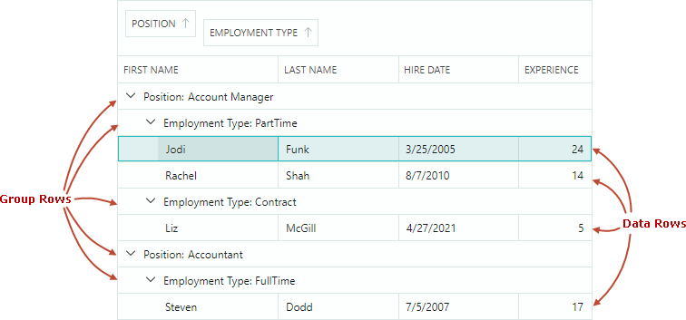
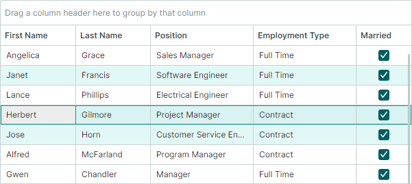

# Rows

Data rows represent items from the bound item source. When you group data, Data Grid creates group rows to combine rows with identical group values. Group rows do not exist in the item source.



## Row Height

All rows initially have the same height sufficient to display a single line of text. Data Grid allows you to set a custom row height, as well as enable automatic row height calculation for displaying large text data in cells.

### Custom Row Height

- `DataControlBase.RowMinHeight` property — Gets or sets the minimum row height. 

  If the automatic row height feature is disabled, all rows have the same height specified by the `DataControlBase.RowMinHeight` property.

### Row Auto-Height

For columns containing lengthy text, you can enable text wrapping to dynamically adjust row heights and display complete cell contents.


To enable text wrapping for column cells, assign a `TextEditorProperties` object (or its descendant; for example, `ButtonEditorProperties`) to the `GridColumn.EditorProperties` property, and set the `TextEditorProperties.TextWrapping` option to `Wrap`.

!!! tip

    A `TextEditorProperties` object is used to configure an in-place `TextEditor` editor for a column. At runtime, the editor is instantiated using these settings. See [Data Editing](data-editing/index.md) for more information.

The following code enables text wrapping for a grid column.

``` xml
<mxdg:GridColumn FieldName="Notes" Width="*" MinWidth="80">
    <mxdg:GridColumn.EditorProperties>
        <mxe:TextEditorProperties TextWrapping="Wrap"/>
    </mxdg:GridColumn.EditorProperties>
</mxdg:GridColumn>
```

#### Automatic Row Height Adjustment During Horizontal Scrolling 

DataGrid's horizontal [virtualization](performance-and-data-virtualization.md) enhances the control's performance by reducing the load time.

With this feature enabled (default), row heights are calculated automatically according to the contents of the currently visible cells. Cells outside the viewport do not affect row height calculation. When you scroll to the cells with different content heights, the row height is adjusted dynamically. To prevent dynamic row height changes during horizontal scrolling, use the `DataGridControl.AllowHorizontalVirtualization` property to disable horizontal virtualization.

``` xml
<mxdg:DataGridControl x:Name="dataGrid" AllowHorizontalVirtualization="False">
```


## Identify and Get Rows

To allow row identification, Data Grid assigns **row indexes** to data and group rows. Row indexes identify rows in API members used to [retrieve and set cell values](#get-and-set-row-values), move focus between rows, and iterate through rows.


- Row indexes reflect the order of data and group rows in the Data Grid.
- Data rows are numbered using zero-based non-negative row indexes. The top data row has a row index of **0**, the second data row has a row index of **1**, and so on.
- Group rows are numbered using negative row indexes. The top group row has a row index of **-1**, the second group row has a row index of **-2**, and so on
- Row indexes are used to identify both visible and hidden (within collapsed groups) rows.
- When the order of rows changes (for example, when data is sorted or grouped), rows are given new row indexes according to their new positions.
- Row indexes are not assigned to rows that are hidden due to data filtering.

When data is not grouped, row indexes match visible row indexes:


When data is grouped, row indexes and visible row indexes do not match:


### Special Row Indexes

Data Grid reserves the following predefined row indexes to identify special rows:

- `DataControlBase.AutoFilterRowIndex` constant — Identifies the **Auto Filter Row**. This row allows a user to type text in its cells to filter data against corresponding columns. See the following topic for more information: [Search and Filtering](filter-and-search.md). 

  **Example**: You can assign the `DataControlBase.AutoFilterRowIndex` value to the `DataGridControl.FocusedRowIndex` property to focus the **Auto Filter Row**.

  <!-- TODO
  The following code does not work:
  dataGrid.FocusedRowIndex = DataGridControl.AutoFilterRowIndex;
  dataGrid.SetCellValue(DataGridControl.AutoFilterRowIndex, "FirstName", "Alex");
   -->

- `DataGridControl.InvalidRowIndex` constant — Identifies a row that does not exist in the Data Grid control. This constant may be returned by DataGrid methods used to obtain row indexes.

  **Example**: The `GetParentRowIndex` method allows you to return a row's parent group row when data is grouped. This method returns the `DataGridControl.InvalidRowIndex` value for a row that does not have a parent group row.

### Source Items and Source Item Indexes

Data rows correspond to items (business objects) in the bound item source (`DataControlBase.ItemsSource`). An item's position in the item source is called **source item index**.

You can use the following methods to obtain a data row's underlying source item and source item index. 

- `GetSourceItemByRowIndex` — Returns the source item (business object) of the row specified by its row index.
- `GetSourceItemByVisibleRowIndex` — Returns the source item (business object) of the row specified by its visible index.
- `GetSourceItemIndexByRowIndex` — Returns the source item index (index of the business object in the item source) of the row specified by its row index. 
- `GetSourceItemIndexByVisibleRowIndex` — Returns the source item index (index of the business object in the item source) of the row specified by its visible index. 

To perform the opposite conversion of indexes, see the following methods:

- `GetRowIndexBySourceItemIndex` — Returns the row index of the row specified by its source item index.
- `GetVisibleRowIndexBySourceItemIndex` — Returns the visible index of the row specified by its source item index (index of the business object in the item source). 


Source item indexes are zero-based. When you sort, group or filter rows, source item indexes of the grid rows do not change.

Group rows do not have corresponding items in the item source, so they cannot be addressed using source items and source item indexes.

### Related API

Data Grid provides API members to retrieve rows by indexes, and to convert between row indexes, visible row indexes and indexes of data source items. The following list summarizes these API members:

- `FocusedRowIndex` — Gets or sets the index of the focused row. You can use this property to move focus to a specific row.
- `GetRowIndexBySourceItemIndex` — Returns the row index of the row specified by its source item index.
- `GetRowIndexByVisibleRowIndex` — Returns the row index of the row specified by its visible index. 
- `GetSourceItemByRowIndex` — Returns the source item (business object) of the row specified by its row index. 
- `GetSourceItemByVisibleRowIndex` — Returns the source item (business object) of the row specified by its visible index. 
- `GetSourceItemIndexByRowIndex` — Returns the source item index (index of the business object in the item source) of the row specified by its row index. 
- `GetSourceItemIndexByVisibleRowIndex` — Returns the source item index (index of the business object in the item source) of the row specified by its visible index. 
- `GetVisibleRowIndexByRowIndex` — Returns the visible index of the row specified by its row index. 
- `GetVisibleRowIndexBySourceItemIndex` — Returns the visible index of the row specified by its source item index (index of the business object in the item source). 
- `VisibleRowCount`

Methods to iterate through group rows and their children:

- [Traverse Through Group Rows](grouping.md#traverse-through-group-rows)

Methods to obtain and set cell values:

- [Get and Set Row Values](#get-and-set-row-values)

## Focused Row

Use the `DataGridControl.FocusedRowIndex` property to retrieve the focused row's index. The `DataGridControl.FocusedItem` property allows you to retrieve the focused row's underlying data object.

To move focus to a specific row, you can assign this row's index to the `DataGridControl.FocusedRowIndex` property.


## Multiple Row Selection (Highlight)

Data Grid supports multiple row selection mode, which allows you and your user to select (highlight) multiple rows at one time.



Set the `SelectionMode` property to `Multiple` to enable multiple row selection mode.

### Select Rows Using the Mouse and Keyboard

Users can select multiple rows with the mouse and keyboard. They need to click rows while holding the CTRL and/or SHIFT key down.

### Work with Row Selection in Code

The following API allows you to select/deselect rows, and identify whether a row is selected:

- `SelectAll`
- `SelectRow`
- `SelectRange`
- `UnselectRow`
- `ClearSelection`
- `IsRowSelected`

To retrieve the row selection, use the following members:

- `GetSelectedRowIndexes` — Returns a collection of [indexes](#identify-and-get-rows) of currently selected rows.
- `SelectedItems` — Specifies the collection of data (business) objects that correspond to selected rows.

Handle the `SelectionChanged` event to respond to changes to the row selection.

A call to any method that changes a row's selected state causes an update of the DataGrid control, and raises the `SelectionChanged` event. 

To perform batch modifications to the row selection and prevent superfluous updates, you can wrap the code that modifies rows' selected states with the `BeginSelection` and `EndSelection` method pair. In this case, the control redraws the selection, and the `SelectionChanged` event fires after the call to the `EndSelection` method.

``` csharp
dataGrid1.SelectionMode = Eremex.AvaloniaUI.Controls.DataControl.RowSelectionMode.Multiple;
// Start a batch update of the row selection.
dataGrid1.BeginSelection();
dataGrid1.ClearSelection();
dataGrid1.SelectRow(row1);
dataGrid1.SelectRow(row2);
//...
// Finish the batch update.
dataGrid1.EndSelection();
```
### Focused Row vs Selected Rows

The focused row is the row that receives user input. The focused row may not be in sync with the selected (highlighted) row in multiple selection mode. See the following sections for mode details.

#### Focused Row in Single Selection Mode

In single selection mode, the focused row automatically gets the selected state. You can use the `FocusedRowIndex` property and `GetSelectedRowIndexes` method to retrieve the focused row.


#### Focused Row in Multiple Selection Mode

The focused and selected states are different in multiple row selection mode. 
Whether a row is selected or not, can be determined by the row's highlight. Only selected rows are highlighted.

In multiple selection mode, a click on a row focuses and selects this row at the same time. A user, however, can toggle the focused row's selected state using the following actions:

- Press CTRL+SPACE.
- Click the focused row while holding the CTRL key down.

When you select a row in code, this row does not get the focused state in multiple selection mode, and vice versa.   


## Get and Set Row Values

Data Grid provides the following methods to retrieve and set values in row cells:

- `DataGridControl.GetCellValue` — Returns a value in a specific cell, addressed by a row and column (or field name).

    The following code retrieves a value from the focused row for the column bound to the _FirstName_ field:

    ``` csharp
    string firstName = dataGrid.GetCellValue(dataGrid.FocusedRowIndex, "FirstName") as String;
    ```

- `DataGridControl.SetCellValue` — Sets a value in a specific cell.

- `DataGridControl.GetCellDisplayText` — Returns the display text of a specific cell, addressed by a row and column (or field name). The display text is formed according to formatting options applied to in-place editors. You can also handle the `CustomColumnDisplayText` event to supply custom display text for cells. To supply custom value display text for group rows, handle the `DataGridControl.CustomGroupValueDisplayText` event.

You can also retrieve source items and their values using the following API members:

- `DataControlBase.FocusedItem` — Allows you to retrieve the source item object of the currently focused row. 
- `GetSourceItem` — Returns the source object by its index in the data source. 
- `GetSourceItemValue` — Returns the value of a specific field in the data source at the specified index.
- `DataGridControl.GetSourceItemByRowIndex` — Returns a source item object by a row's index.
- `DataGridControl.GetSourceItemByVisibleRowIndex` — Returns a source item object by a row's visible index.

The following code sets the _HiredDate_ property for the focused row's business object:

``` csharp
EmployeeInfo emp = dataGrid.FocusedItem as EmployeeInfo;
if (employee != null )
{
    employee.HiredDate = DateTime.Today;
}
```

## Handle Row Clicks and Double-Clicks

The `DataGridControl.RowClick` event allows you to perform actions when a user clicks a row/cell once or multiple times in succession. The event's `e.ClickCount` parameter returns the number of successive mouse clicks.

Note that a single click on a cell activates the cell editor by default. Subsequent clicks within this cell are intercepted by the active cell editor, and the `DataGridControl.RowClick` event is not raised for those clicks. See the following section to learn how to handle this scenario: [Example - Handle a row double-click when cell editing is enabled](#example-handle-a-row-double-click-when-cell-editing-is-enabled)

### Example - Handle a row double-click when cell editing is disabled

The following example handles the `RowClick` event to detect a row double-click when cell edit operations are disabled.

``` cs
dataGrid.AllowEditing = false;
//...
private void DataGrid_RowClick(object sender, Eremex.AvaloniaUI.Controls.DataGrid.DataGridRowClickEventArgs e)
{
    if (e.ClickCount == 2)
    {
        //Row double-clicked
        //...
    }
}
```

### Example - Handle a row double-click when cell editing is enabled

The example below shows how you can handle row double-clicks when cell edit operations are enabled. This example uses a combination of the `RowClick` and `ShowingEditor` events to manually control cell editor activation.
The following scenario is implemented:

- A single click activates a cell editor (after a short delay). The editor is activated using a timer started in the `RowClick` event handler.
- A double-click (and multiple successive clicks) prevents the cell editor from being activated. Perform custom actions when a row/cell is double-clicked in the `RowClick` event handler.


``` xml
<mxdg:DataGridControl x:Name="dataGrid" 
                      RowClick="DataGrid_RowClick"
                      ShowingEditor="DataGrid_ShowingEditor"
                      AllowEditing="True"
                      >
```

``` cs
using Avalonia.Input;

public partial class MainView : UserControl 
{
    public MainView() 
    {
        InitializeComponent();
        this.Loaded += MainView_Loaded;
        dataGrid.EditorShowMode = Eremex.AvaloniaUI.Controls.DataControl.EditorShowMode.PointerPressed;
    }

    bool canShowEditor = false;
    DispatcherTimer clickTimer;

    private void MainView_Loaded(object sender, Avalonia.Interactivity.RoutedEventArgs e)
    {
        var root = (IInputRoot)this.GetVisualRoot();
        var settings = root.PlatformSettings;
        var doubleClickTimeSpan = settings.GetDoubleTapTime(PointerType.Mouse);

        clickTimer = new DispatcherTimer() { Interval = doubleClickTimeSpan };
        clickTimer.Tick += ClickTimer_Tick;

        dataGrid.ShowingEditor += DataGrid_ShowingEditor;
    }

    private void DataGrid_ShowingEditor(object sender, Eremex.AvaloniaUI.Controls.DataGrid.DataGridShowingEditorEventArgs e)
    {
        e.Cancel = !canShowEditor;
    }

    private void DataGrid_RowClick(object sender, Eremex.AvaloniaUI.Controls.DataGrid.DataGridRowClickEventArgs e)
    {
        canShowEditor = false;
        if (e.ClickCount > 1)
        {
            clickTimer.Stop();
            if (e.ClickCount == 2)
            {
                // Do something when a row is double-clicked
            }
        }
        else
        {
            clickTimer.Start();
        }
    }

    private void ClickTimer_Tick(object sender, EventArgs e)
    {
        clickTimer.Stop();
        canShowEditor = true;
        dataGrid.ShowEditor();
    }
}
```