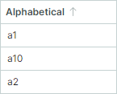

# Sorting

Data Grid allows you to sort data against an unlimited number of columns. A user can sort column data by clicking the column header or using the column header's context menu. 

## End User Actions

At runtime, a user can click a column header once to sort data in ascending order. A subsequent click reverses the sort order. To clear sorting, hold down the CTRL key and click the column header.


If data is sorted and additional sorting is required on another column, click this column header while holding the SHIFT key down. The control will sort data against the first clicked column, then against the second column, and so on.

To sort data by a specific column, users can also use the column header's context menu. The menu contains the "Sort Ascending" and "Sort Descending" commands. If a column is sorted, the menu contains the "Clear Sorting" command.


You can prevent specific columns from being sorted by users. Use the following properties for this purpose:

- `DataGridControl.AllowSorting` — Specifies whether a user can sort/group by any column.
- `ColumnBase.AllowSorting` — Specifies whether a user can sort and group a specific column.

These properties do not prevent you from sorting data in code.

## Alphanumeric Sorting

For columns that display text, you can use the `DataGridControl.TextSortMode` property to choose between alphabetical and alphanumeric sorting.

- `Alphabetical` Sort (default): This mode compares strings character by character. If the text contains numbers, the sorting algorithm treats them as individual characters, but not as numbers. For example:

    


- `Alphanumeric` Sort (natural ordering): This mode is suitable for strings that contain a mix of text and numbers. The sorting algorithm arranges strings in a human-friendly, logical order by treating numbers as numerical values instead of just characters. For example:

    

    The following code applies the alphanumeric sort order:

    ``` xml
    <mxdg:DataGridControl Name="dataGrid1" AutoGenerateColumns="True" ItemsSource="{Binding MyData}"
                        TextSortMode="Alphanumeric"
                        />
    ```

The `DataGridControl.TextSortMode` property affects sorting for all columns that display text values.

The following image demonstrates more examples that compare alphabetical and alphanumeric sort modes:


## Sort in Code

You can use the following properties to specify sort settings for columns:

- `ColumnBase.SortDirection` — Specifies the sort order. You can set this property to `Ascending` or `Descending` to sort the column. When you initialize this property the column is added to the Data Grid's internal sorted column collection. Set the `SortDirection` property to `null` to clear sorting for this column, and remove the column from the sorted column collection.

- `ColumnBase.SortIndex` — Specifies the zero-based index of the column within the sorted column collection. The Data Grid control sorts data first by the first sorted column, then by the second sorted column, and so on. You can set the `SortIndex` property to a non-negative value to sort this column in ascending order. Set `SortIndex` to `-1` to clear sorting by this column.

Call the control's inherited `DataControlBase.ClearSorting` method to remove sorting applied to all columns.

The following code clears sorting and then sorts data by two columns:

``` csharp
dataGrid1.ClearSorting();
gridColumn1.SortDirection = ListSortDirection.Ascending;
gridColumn3.SortDirection = ListSortDirection.Descending;
```

You can wrap your code with the `BeginDataUpdate` and `EndDataUpdate` methods to prevent superfluous updates when changing the control's multiple settings (including sort settings).

``` csharp
dataGrid1.BeginDataUpdate();
dataGrid1.ClearSorting();
gridColumn1.SortIndex = 0;
gridColumn3.SortIndex = 1;
gridColumn2.SortDirection = ListSortDirection.Descending;
dataGrid1.EndDataUpdate();
```

## Customize Sorting Logic

Data Grid can sort (and [group](grouping.md)) columns by edit values, display values, or according to a custom sorting algorithm. Default sort (and group) mode is dependent on the column's in-place editor and the bound property's data type:

- Sorting/grouping by edit values — All columns except those with an embedded ComboBoxEditor.
- Sorting/grouping by display text — Columns with an embedded ComboBoxEditor.
- No sorting/grouping — Columns bound to objects that do not implement the `IComparable` interface. For instance, image data types do not implement this interface, thus no sorting is available for corresponding columns, by default. See the [Custom Sorting](#custom-sorting) section below for information, on how to forcibly sort these columns.

Use the `ColumnBase.SortMode` property to change sort/group mode for a column. The following options are available:

- `SortMode.Value` — Sort/group by cell edit values.
- `SortMode.DisplayText` — Sort/group by cell display text.
- `SortMode.Custom` — Enables custom sorting and grouping. Set the `SortMode` property to `Custom`, and then handle the `DataGridControl.CustomColumnSort` and/or `DataGridControl.CustomColumnGroup` event to implement custom sorting and/or custom grouping logic. See the following links for more information:

    - [Custom Sorting](#custom-sorting)
    - [Custom Grouping](grouping.md#custom-grouping)

### Custom Sorting

The `CustomColumnSort` event allows you to implement custom sorting logic for a specific column. Set the `ColumnBase.SortMode` property to `Custom` to enable this event.

If a column's bound data type does not implement the `IComparable` interface (for instance, an image data type), the Data Grid defaults to preventing sorting for this column. You can, however, enable sorting for this column, as follows:

- Set the column's `AllowSorting` property to `true` (this property's default value is `null`).
- Set the column's `SortMode` property to `Custom`.
- Handle the `CustomColumnSort` event to implement custom sorting.

When you handle the `CustomColumnSort` event, you should compare two rows specified in the event arguments. Assign the result of the comparison to the `Result` event parameter as follows:

- Set `Result` to `-1` if the first row should be displayed above the second row when data is sorted in ascending order. 

- Set `Result` to `1` if the first row should be displayed below the second row when data is sorted in ascending order. 

 - Set `Result` to `0` if the two rows are equal. 
 

The following example handles the `DataGridControl.CustomColumnSort` event to sort data in the "_FileName_" column in a custom manner. The "_FileName_" column stores file names in the standard "_filename.ext_" format. The custom sorting routine sorts file names by their extensions.

``` csharp
<mxdg:DataGridControl Name="dataGrid1" CustomColumnSort="DataGrid_CustomColumnSort">
    <mxdg:DataGridControl.Columns>
        <mxdg:GridColumn  Width="*" FieldName="FileName"  SortMode="Custom" />
    </mxdg:DataGridControl.Columns>
</mxdg:DataGridControl>

private void DataGrid_CustomColumnSort(object? sender, DataGridCustomColumnSortEventArgs e)
{
    if (e.Column.FieldName == "FileName")
    {
        string fileName1 = Convert.ToString(e.Value1);
        string fileName2 = Convert.ToString(e.Value2);

        string newfileName1 = extractFileExtension(fileName1) + "." + fileName1;
        string newfileName2 = extractFileExtension(fileName2) + "." + fileName2;
        e.Result = String.Compare(newfileName1, newfileName2);
    }
}

string extractFileExtension(string fileName)
{
    string res = "";
    int dotIndex = fileName.LastIndexOf('.');
    if (dotIndex > 0)
        res = fileName.Substring(dotIndex + 1);
    return res;
}
```

## Respond to Data Sorting

Handle the following events to perform custom actions when data is sorted:

- `DataControlBase.StartSorting` — Fires when data is about to be sorted.
- `DataControlBase.EndSorting` — Fires when data sorting is complete.