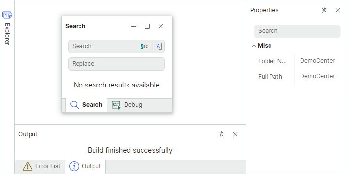
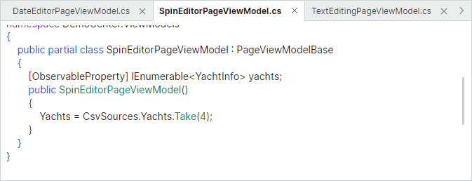
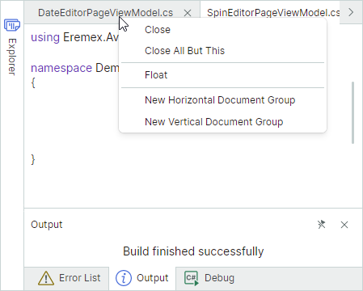

# Dock Manager and Dock Items

The [`DockManager`](../../API/Eremex.AvaloniaUI.Controls.Docking/DockManager.md) component allows you to create the Visual Studio-inspired docking UI. Dock Panes and Document Panes are basic elements of a docking UI. Dock Panes are used to implement tool panels. Document Panes are tailored to display the main content of the window. You can combine multiple Document Panes in a special container to implement a tabbed MDI (Multiple Document Interface).

The Docking library supports runtime operations on dock items (panels and documents) by users and in code. Users can rearrange the layout of dock items and make them floating using drag-and-drop operations and context menus. Splitters between adjacent items allow runtime resizing operations. 'Pin' buttons in panel headers maintain the auto-hide feature, which lets a user to collapse and restore panels. 

With the Docking library, you can use the MVVM design pattern to populate the docking interface with Dock Panes and Document Panes, and provide content for the panes.

## Get Started with Docking UI

The following topics demonstrate how to create sample docking interfaces from scratch:

- [Get Started With a Docking Interface](get-started-with-docking.md) 
- [How to Create a Complex Docking Layout in Code Behind](examples/how-to-create-a-complex-docking-layout-in-code-behind.md)

## Dock Panes

Dock Panes ([`DockPane`](../../API/Eremex.AvaloniaUI.Controls.Docking/DockPane.md) objects) allow you to create dockable and floating tool panels. Panels can be displayed side-by-side or as tabs. They also support the auto-hide feature.

To create a Docking UI in XAML or code-behind, Dock Panes need to be combined in containers (groups). For instance, you can combine items in a [`DockGroup`](../../API/Eremex.AvaloniaUI.Controls.Docking/DockGroup.md) container to display them next to each other, either horizontally or vertically. If you combine panels in a [`TabbedGroup`](../../API/Eremex.AvaloniaUI.Controls.Docking/TabbedGroup.md) container, they are displayed as tabs. Containers can also include other containers as children.

See the following topic to learn more: [Dock Panes and Containers](dock-panes-and-containers.md)

## Document Panes

Use Document Panes ([`DocumentPane`](../../API/Eremex.AvaloniaUI.Controls.Docking/DocumentPane.md) objects) to display the main content of your Window. If you create multiple Document Panes, you can combine them in a [`DocumentGroup`](../../API/Eremex.AvaloniaUI.Controls.Docking/DocumentGroup.md) container. [`DocumentGroup`](../../API/Eremex.AvaloniaUI.Controls.Docking/DocumentGroup.md) is a special container that presents Document Panes as tabs (similar to the [`TabbedGroup`](../../API/Eremex.AvaloniaUI.Controls.Docking/TabbedGroup.md) container used to present Dock Panes as tabs).

Document Panes can be made floating. Unlike Dock Panes, Document Panes do not support the auto-hide functionality.

You can create two or more [`DocumentGroup`](../../API/Eremex.AvaloniaUI.Controls.Docking/DocumentGroup.md) containers, each displaying its own set of Document Panes.

<animated gif>

See the following topic to learn more: [Document Panes](document-panes.md)

## Dock Hints

When a user drags a Dock Pane or Document Pane over another panel or container, the DockMager shows dock hints that help perform docking operations. Dropping an item over a specific hint docks the item at the corresponding position.

If a user drops an item outside a dock hint, the item is made floating.

## Context Menus

The Docking library provides built-in context menus for Dock Panes and Document Panes. These menus contain commands to perform common dock operations on panes.

Handle the [`DockManager.DockItemContextMenuOpening`](../../API/Eremex.AvaloniaUI.Controls.Docking/DockManager/DockItemContextMenuOpening.md) event to customize the context menus, or to prevent them from being displayed.

<!-- TODO
example for the [`DockManager.DockItemContextMenuOpening`](../../API/Eremex.AvaloniaUI.Controls.Docking/DockManager/DockItemContextMenuOpening.md) event 
 -->

## Prevent Certain Operations on Dock Items

Dock Panes and Document Panes display predefined buttons in their headers used to perform common operations on the panes.

The DockManager provides options and events to control dock operations on panes. See the following section for more details: [Dock Panes and Containers - Runtime Options for Dock Panels](dock-panes-and-containers.md#runtime-options-for-dock-panels)

## Save and Restore the Layout of Panes

You can save the current dock layout to a stream, and then restore it when required. This feature allows you to save the layout when a user closes the application, and reload the saved layout the next time the application runs. See the following topic for more information: [Save and Restore the Layout of Panels](save-and-restore-layout.md)

## See Also

- [How to Create a Complex Docking Layout in Code Behind](examples/how-to-create-a-complex-docking-layout-in-code-behind.md)