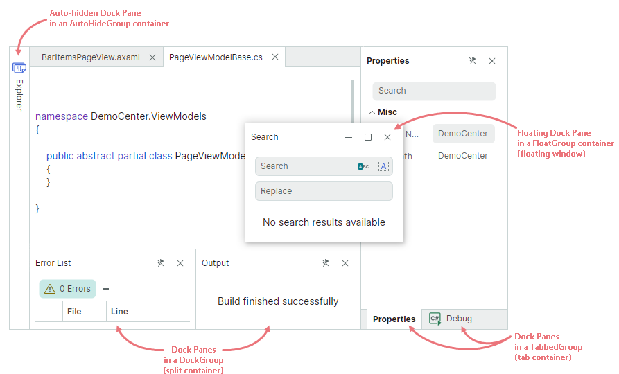
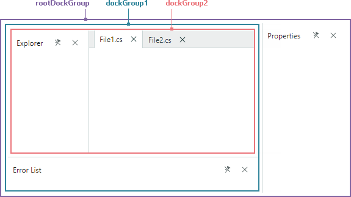
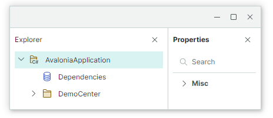
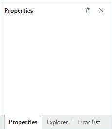
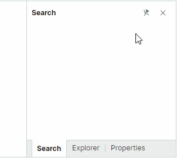

# Dock Panes and Containers

A Dock Pane ([`Eremex.AvaloniaUI.Controls.Docking.DockPane`](../../API/Eremex.AvaloniaUI.Controls.Docking/DockPane.md)) is a panel that can be docked, made floating, auto-hidden, and combined in a tabbed group (container).

Dock Panes and [Document Panes](document-panes.md) are basic elements of the Docking UI. Dock Panes allow you to create tool panels, while Document Panes allow you to create a tabbed MDI (Multiple Document Interface).


At runtime, users can rearrange the layout of panels using drag-and-drop operations and context menus: panels can be docked side by side, auto-hidden, displayed as tabs, or in floating windows. All these runtime actions reorganize the internal structure of dock items.

When you define a layout of panels in XAML or code-behind, you typically need to use special dock containers to combine panels, and present them in a specific manner.



The following dock containers are supported:

- [`DockGroup`](../../API/Eremex.AvaloniaUI.Controls.Docking/DockGroup.md) (split container) — Displays dock items (Dock Panes and containers) side by side, either horizontally or vertically. Child dock items are delimited by splitters that enable panel resizing.
- [`TabbedGroup`](../../API/Eremex.AvaloniaUI.Controls.Docking/TabbedGroup.md) (tab container) — Displays dock items as tabs.
- [`AutoHideGroup`](../../API/Eremex.AvaloniaUI.Controls.Docking/AutoHideGroup.md) — Child Dock Panes of this container feature the automatic hiding functionality. An auto-hidden panel appears when a user clicks the panel's header. 
- [`FloatGroup`](../../API/Eremex.AvaloniaUI.Controls.Docking/FloatGroup.md) — Displays dock items in a floating window.

Dock containers are automatically created and destroyed when a user rearranges panels at runtime.


The following XAML file demonstrates how to create the structure of dock items shown in the image above:

``` xml
xmlns:mxd="https://schemas.eremexcontrols.net/avalonia/docking"

<mxd:DockManager>
    <mxd:DockGroup Orientation="Horizontal">
        <mxd:DockGroup Orientation="Vertical" DockWidth="3*">
            <mxd:DocumentGroup DockHeight="2*">
                <mxd:DocumentPane Header="BarItemsPageView.axaml"/>
                <mxd:DocumentPane Header="PageViewModelBase.cs"/>
            </mxd:DocumentGroup>
            <mxd:DockGroup Orientation="Horizontal" DockHeight="*">
                <mxd:DockPane Header="Error List"/>
                <mxd:DockPane Header="Output"/>
            </mxd:DockGroup>
        </mxd:DockGroup>
        <mxd:TabbedGroup DockWidth="*">
            <mxd:DockPane Header="Properties"/>
            <mxd:DockPane Header="Debug"/>
        </mxd:TabbedGroup>
    </mxd:DockGroup>
    <mxd:DockManager.AutoHideGroups>
        <mxd:AutoHideGroup Dock="Left">
            <mxd:DockPane Header="Explorer"/>
        </mxd:AutoHideGroup>
    </mxd:DockManager.AutoHideGroups>
    <mxd:DockManager.FloatGroups>
        <mxd:FloatGroup FloatLocation="300,300">
            <mxd:DockPane Header="Search"/>
        </mxd:FloatGroup>
    </mxd:DockManager.FloatGroups>
</mxd:DockManager>
```

## Using MVVM to Create a Docking UI

You can use the MVVM design pattern to populate a Docking UI with dock items (Dock Panes and Document Panes). Use the following API members for this purpose:

- [`DockManager.ItemsSource`](../../API/Eremex.AvaloniaUI.Controls.Docking/DockManager/ItemsSource.md) — Specifies a list of objects that need to be rendered as dock items.
- [`DockManager.ItemTemplate`](../../API/Eremex.AvaloniaUI.Controls.Docking/DockManager/ItemTemplate.md) — Specifies the template used to render objects from the [`DockManager.ItemsSource`](../../API/Eremex.AvaloniaUI.Controls.Docking/DockManager/ItemsSource.md) list as dock items.

See [Use MVVM Pattern to Populate Dock Items](use-mvvm-pattern-to-populate-dock-items.md) more information.


## Dock Pane Content and Size

### Specify Content

You can use the [`DockPane.Content`](../../API/Eremex.AvaloniaUI.Controls.Docking/DockPane/Content.md) property to define a panel's content. In XAML, you can define the panel's content between the start and end __&lt;DockPane&gt;__ tags.

The [`DockPane.ContentTemplate`](../../API/Eremex.AvaloniaUI.Controls.Docking/DockPane/ContentTemplate.md) property allows you to specify the template used to render the [`Content`](../../API/Eremex.AvaloniaUI.Controls.Docking/DockPane/Content.md) object.


### Specify Size

For dock items (panels and containers) that are displayed within [split containers](#split-panels) ([`DockGroup`](../../API/Eremex.AvaloniaUI.Controls.Docking/DockGroup.md)), the following properties allow you to set item size:

- [`DockWidth`](../../API/Eremex.AvaloniaUI.Controls.Docking/DockItemBase/DockWidth.md) (for panels that are horizontally arranged in their parent containers)
- [`DockHeight`](../../API/Eremex.AvaloniaUI.Controls.Docking/DockItemBase/DockHeight.md) (for panels that are vertically arranged in their parent containers)

These properties do not affect size of panels in floating and auto-hide modes. 
See the following links to learn more:

- [Set Floating Bounds](#set-floating-bounds)
- [Set Size for Expanded Auto-Hide Panels](#set-size-for-expanded-auto-hide-panels)


### Specify Header Text and Glyphs

Use the [`DockPane.Header`](../../API/Eremex.AvaloniaUI.Controls.Docking/DockPane/Header.md) and [`DockPane.HeaderTemplate`](../../API/Eremex.AvaloniaUI.Controls.Docking/DockPane/HeaderTemplate.md) properties to set headers for dock panels. To display images, use the [`DockPane.Glyph`](../../API/Eremex.AvaloniaUI.Controls.Docking/DockPane/Glyph.md) and [`DockPane.GlyphSize`](../../API/Eremex.AvaloniaUI.Controls.Docking/DockPane/GlyphSize.md) properties.

You can specify different header options for a panel when it is hosted within a tab container. Use the [`DockPane.TabHeader`](../../API/Eremex.AvaloniaUI.Controls.Docking/DockPane/TabHeader.md), [`DockPane.TabHeaderTemplate`](../../API/Eremex.AvaloniaUI.Controls.Docking/DockPane/TabHeaderTemplate.md), [`DockPane.TabGlyph`](../../API/Eremex.AvaloniaUI.Controls.Docking/DockPane/TabGlyph.md), and [`DockPane.TabGlyphSize`](../../API/Eremex.AvaloniaUI.Controls.Docking/DockPane/TabGlyphSize.md) properties for this purpose.

#### Related API

- [`DockPane.ShowGlyphMode`](../../API/Eremex.AvaloniaUI.Controls.Docking/DockPane/ShowGlyphMode.md) — Specifies the visibility and position of a glyph in a panel's header.
- [`DockPane.ShowTabGlyphMode`](../../API/Eremex.AvaloniaUI.Controls.Docking/DockPane/ShowTabGlyphMode.md) — Specifies the visibility and position of a glyph in a tab when the panel is hosted within a tabbed group.

## Activate Panels

The [`DockPane.IsActive`](../../API/Eremex.AvaloniaUI.Controls.Docking/DockPane/IsActive.md) property allows you to move focus to a specific panel. For instance, if a panel is auto-hidden, it is expanded and focused when you set the [`DockPane.IsActive`](../../API/Eremex.AvaloniaUI.Controls.Docking/DockPane/IsActive.md) property to `true`.

Use the [`DockManager.ActiveDockItem`](../../API/Eremex.AvaloniaUI.Controls.Docking/DockManager/ActiveDockItem.md) property to get the active dock item.

When panels are combined in a tab container ([`TabbedGroup`](../../API/Eremex.AvaloniaUI.Controls.Docking/TabbedGroup.md)), you can use the [`TabbedGroup.SelectedIndex`](../../API/Eremex.AvaloniaUI.Controls.Docking/TabbedGroup/SelectedIndex.md) property to select a specific panel.

## Close Panels

Each Dock Panel displays the 'Close' button that allows a user to close the panel. In code, you can close a panel with the [`DockManager.Close`](../../API/Eremex.AvaloniaUI.Controls.Docking/DockManager/Close.md) method.


Use the [`DockPane.AllowClose`](../../API/Eremex.AvaloniaUI.Controls.Docking/DockPane/AllowClose.md) property to hide the 'Close' button for a panel, and thus prevent the panel from being closed using this button.

When a panel is closed, the [`DockPane.CloseCommand`](../../API/Eremex.AvaloniaUI.Controls.Docking/DockPane/CloseCommand.md) command is activated. Closed panels can be accessed from the [`DockManager.ClosedPanes`](../../API/Eremex.AvaloniaUI.Controls.Docking/DockManager/ClosedPanes.md) collection. 

When panels are combined in a tab container, the container's `CloseButtonShowMode` property allows you to display additional 'Close' buttons in the tab strip region. You can display the 'Close' buttons in all tabs, in the active tab, or in the tab strip region. 


For floating tab containers, the 'Close' button in a tab container's header can close either the active panel or all panels. Use the [`DockManager.CloseOnlyActivePane`](../../API/Eremex.AvaloniaUI.Controls.Docking/DockManager/CloseOnlyActivePane.md) property to choose the required behavior.

The [`DockManager.DockOperationStarting`](../../API/Eremex.AvaloniaUI.Controls.Docking/DockManager/DockOperationStarting.md) event allows you to prevent specific panels from being closed, or perform custom actions when panels are closed.


## Runtime Options for Dock Panels

[`DockPane`](../../API/Eremex.AvaloniaUI.Controls.Docking/DockPane.md) objects contain settings that allow you to disable specific user operations at runtime:

- [`DockPane.AllowAutoHide`](../../API/Eremex.AvaloniaUI.Controls.Docking/DockPane/AllowAutoHide.md) — Gets or sets whether the 'Pin' button and 'Auto Hide' context menu item are available for a panel. Set this property to `false` to prevent a user from enabling [auto-hide mode](#auto-hide-panels) for a specific panel.
- [`DockPane.AllowClose`](../../API/Eremex.AvaloniaUI.Controls.Docking/DockPane/AllowClose.md) — Gets or sets whether a user can close a panel. Set this property to `false` to hide the panel's `x` (close) button. See [Close Panels](#close-panels).
- [`DockPane.AllowFloat`](../../API/Eremex.AvaloniaUI.Controls.Docking/DockPane/AllowFloat.md) — Gets or sets whether a user can make a panel floating. See [Floating Panels](#floating-panels).
- [`DockPane.AllowMaximize`](../../API/Eremex.AvaloniaUI.Controls.Docking/DockPane/AllowMaximize.md) — Specifies the visibility of the 'Maximize' button for a panel in the floating state.
- [`DockPane.AllowMinimize`](../../API/Eremex.AvaloniaUI.Controls.Docking/DockPane/AllowMinimize.md) — Specifies the visibility of the 'Minimize' button for a panel in the floating state.

These options do not prevent you from performing corresponding operations on panels in code.

You can also handle the [`DockManager.DockOperationStarting`](../../API/Eremex.AvaloniaUI.Controls.Docking/DockManager/DockOperationStarting.md) event to dynamically prevent certain dock operations, or run custom logic when these operations occur.

## Split Panels

Dock items (panels and groups) can be arranged side-by-side, either horizontally or vertically. To create this layout, dock items are combined in a [`DockGroup`](../../API/Eremex.AvaloniaUI.Controls.Docking/DockGroup.md) container (split container). 


A user can drag-and-drop a panel over the left, right, top or bottom dock hint of another panel to dock the panel at the corresponding position. The splitter between dock items allows for item resizing.


A [`DockGroup`](../../API/Eremex.AvaloniaUI.Controls.Docking/DockGroup.md) container's children can be panels ([`DockPane`](../../API/Eremex.AvaloniaUI.Controls.Docking/DockPane.md) and [`DocumentPane`](../../API/Eremex.AvaloniaUI.Controls.Docking/DocumentPane.md)), and other containers ([`DockGroup`](../../API/Eremex.AvaloniaUI.Controls.Docking/DockGroup.md) and [`DocumentGroup`](../../API/Eremex.AvaloniaUI.Controls.Docking/DocumentGroup.md)).

The default item arrangement in a [`DockGroup`](../../API/Eremex.AvaloniaUI.Controls.Docking/DockGroup.md) is horizontal. Set the [`DockGroup.Orientation`](../../API/Eremex.AvaloniaUI.Controls.Docking/DockGroup/Orientation.md) property to `Vertical` to arrange items vertically.


### Example - Create a simple layout of Dock Panels

The XAML code below creates a layout of dock panels shown below.



``` xml
<mxd:DockManager Grid.Column="0" Grid.Row="1">
    <mxd:DockGroup Name="rootDockGroup">
        <mxd:DockGroup Name="dockGroup1" DockWidth="3*" Orientation="Vertical">
            <mxd:DockGroup Name="dockGroup2" DockHeight="4*">
                <mxd:DockPane DockWidth="*" Header="Explorer"/>
                <mxd:DocumentGroup DockWidth="3*">
                    <mxd:DocumentPane Header="File1.cs"/>
                    <mxd:DocumentPane Header="File2.cs"/>
                </mxd:DocumentGroup>
            </mxd:DockGroup>
            <mxd:DockPane Header="Error List" DockHeight="*"/>
        </mxd:DockGroup>
        <mxd:DockPane Header="Properties" DockWidth="*"/>
    </mxd:DockGroup>
</mxd:DockManager>
```

### Split Panels in Code-Behind

To dock a panel next to another panel (or group) in code-behind, use the [`DockManager.Dock`](../../API/Eremex.AvaloniaUI.Controls.Docking/DockManager/Dock.md) method with the _dockType_ parameter set to [`DockType.Left`](../../API/Eremex.AvaloniaUI.Controls.ApplicationServices/DockType.md), [`DockType.Right`](../../API/Eremex.AvaloniaUI.Controls.ApplicationServices/DockType.md), [`DockType.Top`](../../API/Eremex.AvaloniaUI.Controls.ApplicationServices/DockType.md) or [`DockType.Bottom`](../../API/Eremex.AvaloniaUI.Controls.ApplicationServices/DockType.md).

The [`DockManager.Dock`](../../API/Eremex.AvaloniaUI.Controls.Docking/DockManager/Dock.md) method does not necessarily create a new [`DockGroup`](../../API/Eremex.AvaloniaUI.Controls.Docking/DockGroup.md). If the required orientation and target group orientation match, a source panel is added to the target panel's parent group. A new [`DockGroup`](../../API/Eremex.AvaloniaUI.Controls.Docking/DockGroup.md) is created if the orientation of the new group does not match the orientation of the target group.

Assume that a target panel resides within a [`DockGroup`](../../API/Eremex.AvaloniaUI.Controls.Docking/DockGroup.md) that has the horizontal arrangement of child items. When you dock another (source) panel at the left or right side of the target panel, a new [`DockGroup`](../../API/Eremex.AvaloniaUI.Controls.Docking/DockGroup.md) is not created. Instead, the source panel is added to the target panel's parent group. When you dock the source panel at the top or bottom edge of the target panel, a new vertical [`DockGroup`](../../API/Eremex.AvaloniaUI.Controls.Docking/DockGroup.md) is created. 

### Example - Display Panels Side-by-side in Code-Behind

The following code docks the _Explorer_ and _Error List_ panels next to the _Properties_ panel.


``` csharp
using Eremex.AvaloniaUI.Controls.Docking;

dockManager1.Dock(dockPaneExplorer, dockPaneProperties, DockType.Left);
dockManager1.Dock(dockPaneErrorList, dockPaneProperties, DockType.Bottom);
```

### Related API

- [`DockManager.Dock`](../../API/Eremex.AvaloniaUI.Controls.Docking/DockManager/Dock.md) — Allows you to dock a dock item (for example, a panel) next to another dock item. Set the _dockType_ parameter to [`DockType.Left`](../../API/Eremex.AvaloniaUI.Controls.ApplicationServices/DockType.md), [`DockType.Right`](../../API/Eremex.AvaloniaUI.Controls.ApplicationServices/DockType.md), [`DockType.Top`](../../API/Eremex.AvaloniaUI.Controls.ApplicationServices/DockType.md) or [`DockType.Bottom`](../../API/Eremex.AvaloniaUI.Controls.ApplicationServices/DockType.md) to create a split container.
- [`DockItemBase.DockParent`](../../API/Eremex.AvaloniaUI.Controls.Docking/DockItemBase/DockParent.md) — Allows you to get the immediate parent of a [`DockPane`](../../API/Eremex.AvaloniaUI.Controls.Docking/DockPane.md) object, or another dock item.


## Floating Panels 

The Docking Library supports floating panels, which can be freely moved within the available screen space. Floating panels are hosted within floating windows.


A user can drag a panel with the mouse from its docked state to make the panel floating. 


### Access a Floating Window 

When a panel is made floating, a floating window (container) is created that hosts this panel. Floating windows are encapsulated by [`FloatGroup`](../../API/Eremex.AvaloniaUI.Controls.Docking/FloatGroup.md) objects. You can access a panel's parent floating window with the panel's [`DockItemBase.FloatGroup`](../../API/Eremex.AvaloniaUI.Controls.Docking/DockItemBase/FloatGroup.md) property. This property returns **null** if the panel is not in the floating state.

You can use the following API members to specify the floating window's location, size, header and glyph:

- [`FloatGroup.FloatHeight`](../../API/Eremex.AvaloniaUI.Controls.Docking/FloatGroup/FloatHeight.md)
- [`FloatGroup.FloatLocation`](../../API/Eremex.AvaloniaUI.Controls.Docking/FloatGroup/FloatLocation.md)
- [`FloatGroup.FloatWidth`](../../API/Eremex.AvaloniaUI.Controls.Docking/FloatGroup/FloatWidth.md)
- [`FloatGroup.Glyph`](../../API/Eremex.AvaloniaUI.Controls.Docking/FloatGroup/Glyph.md)
- [`FloatGroup.Header`](../../API/Eremex.AvaloniaUI.Controls.Docking/FloatGroup/Header.md)
- [`FloatGroup.HeaderTemplate`](../../API/Eremex.AvaloniaUI.Controls.Docking/FloatGroup/HeaderTemplate.md)


### Make Panels Floating

To define a floating panel in XAML, add a [`FloatGroup`](../../API/Eremex.AvaloniaUI.Controls.Docking/FloatGroup.md) container to the [`DockManager.FloatGroups`](../../API/Eremex.AvaloniaUI.Controls.Docking/DockManager/FloatGroups.md) collection, and then add a [`DockPane`](../../API/Eremex.AvaloniaUI.Controls.Docking/DockPane.md) panel to the [`FloatGroup`](../../API/Eremex.AvaloniaUI.Controls.Docking/FloatGroup.md) container.

Use the [`DockManager.Float`](../../API/Eremex.AvaloniaUI.Controls.Docking/DockManager/Float.md) method to create a floating dock item in code-behind.

#### Example - Define Floating Panel in XAML

The following example creates a floating panel in XAML, and sets the position and size of the created floating window.

``` xml
<mxd:DockManager.FloatGroups>
    <mxd:FloatGroup FloatLocation="600,600">
        <mxd:DockPane Name="dockPaneExplorer1" Header="Explorer-float">
            ...
        </mxd:DockPane>
    </mxd:FloatGroup>
</mxd:DockManager.FloatGroups>
```

#### Example - Create Floating Panels and Customize Floating Window in Code Behind

The code below makes a panel floating and then docks another panel next to the floating panel. This creates a floating window ([`FloatGroup`](../../API/Eremex.AvaloniaUI.Controls.Docking/FloatGroup.md)) that hosts two panels. The created [`FloatGroup`](../../API/Eremex.AvaloniaUI.Controls.Docking/FloatGroup.md) is positioned at the right bottom corner of the DockManager. 

``` csharp
dockManager1.Float(dockPaneExplorer);
dockManager1.Dock(dockPaneSearch, dockPaneExplorer, DockType.Right);
FloatGroup floatingWindow = dockPaneExplorer.FloatGroup;
floatingWindow.Header = "My App";
floatingWindow.FloatWidth = 300;
floatingWindow.FloatHeight = 200;
floatingWindow.FloatLocation = dockManager1.PointToScreen(
    new Point(dockManager1.Bounds.Right - floatingWindow.FloatWidth, 
    dockManager1.Bounds.Bottom - floatingWindow.FloatHeight));
```


### Set a Floating Window's Header and Image

When two or more panels are docked side by side in the floating state, the floating window ([`FloatGroup`](../../API/Eremex.AvaloniaUI.Controls.Docking/FloatGroup.md)) initially displays an empty header. 



You can use the following properties to specify a floating window's header content:

- [`FloatGroup.Glyph`](../../API/Eremex.AvaloniaUI.Controls.Docking/FloatGroup/Glyph.md) — An image to display in the header.
- [`FloatGroup.GlyphSize`](../../API/Eremex.AvaloniaUI.Controls.Docking/FloatGroup/GlyphSize.md) — The image size.
- [`FloatGroup.Header`](../../API/Eremex.AvaloniaUI.Controls.Docking/FloatGroup/Header.md) — An object to render in the header. Use [`FloatGroup.WindowTitle`](../../API/Eremex.AvaloniaUI.Controls.Docking/FloatGroup/WindowTitle.md) to specify a string to display in the header instead of an object.
- [`FloatGroup.HeaderTemplate`](../../API/Eremex.AvaloniaUI.Controls.Docking/FloatGroup/HeaderTemplate.md) — The template to render the [`FloatGroup.Header`](../../API/Eremex.AvaloniaUI.Controls.Docking/FloatGroup/Header.md) object.
- [`FloatGroup.ShowGlyphMode`](../../API/Eremex.AvaloniaUI.Controls.Docking/FloatGroup/ShowGlyphMode.md) — Gets or sets the position and visibility of the [`FloatGroup.Glyph`](../../API/Eremex.AvaloniaUI.Controls.Docking/FloatGroup/Glyph.md) image in the header.
- [`FloatGroup.WindowIcon`](../../API/Eremex.AvaloniaUI.Controls.Docking/FloatGroup/WindowIcon.md) — A [`WindowIcon`](../../API/Eremex.AvaloniaUI.Controls.Docking/FloatGroup/WindowIcon.md) object that represents the icon to render in the header. If [`WindowIcon`](../../API/Eremex.AvaloniaUI.Controls.Docking/FloatGroup/WindowIcon.md) is not specified, the header displays the image specified by the `Glyph` property.
- [`FloatGroup.WindowTitle`](../../API/Eremex.AvaloniaUI.Controls.Docking/FloatGroup/WindowTitle.md) — The text to render in the header. If [`WindowTitle`](../../API/Eremex.AvaloniaUI.Controls.Docking/FloatGroup/WindowTitle.md) is not specified, the header displays the text representation of the `Header` object.


Floating windows are dynamically created when panels are made floating. To initialize properties of dynamically created floating windows, handle the [`DockManager.RegisterDockItem`](../../API/Eremex.AvaloniaUI.Controls.Docking/DockManager/RegisterDockItem.md) event.


``` cs
private void DockManager1_RegisterDockItem(object sender, Eremex.AvaloniaUI.Controls.Docking.DockItemEventArgs e)
{
    if (e.Item is FloatGroup floatGroup)
    {
        floatGroup.Header = "Demo App";
    }
}
```


### Set Floating Bounds 

When a panel is made floating, its previous size determines the floating window's initial floating size. You can set the [`FloatGroup.FloatWidth`](../../API/Eremex.AvaloniaUI.Controls.Docking/FloatGroup/FloatWidth.md), [`FloatGroup.FloatHeight`](../../API/Eremex.AvaloniaUI.Controls.Docking/FloatGroup/FloatHeight.md) and [`FloatGroup.FloatLocation`](../../API/Eremex.AvaloniaUI.Controls.Docking/FloatGroup/FloatLocation.md) attached properties to specify custom floating bounds.

``` xml
<mxd:DockPane DockWidth="*" Header="Properties"
              mxd:FloatGroup.FloatWidth="300"
              mxd:FloatGroup.FloatHeight="150"
              />
```

After a dock item becomes floating, you can access its parent floating window ([`FloatGroup`](../../API/Eremex.AvaloniaUI.Controls.Docking/FloatGroup.md)) and set its bounds.

The following example makes a Dock Pane floating, accesses the created floating window, and sets its size.

``` csharp
using Eremex.AvaloniaUI.Controls.Docking;

dockManager1.Float(dockPane1);
FloatGroup floatingWindow = dockPane1.FloatGroup;
floatingWindow.FloatWidth = 400;
floatingWindow.FloatHeight = 300;
floatingWindow.FloatLocation = dockManager1.PointToScreen(new Point(100, 100));
```

Another way to specify settings for created FloatGroup objects is to handle the [`DockOperationCompleted`](../../API/Eremex.AvaloniaUI.Controls.Docking/DockManager/DockOperationCompleted.md) event to access newly created [`FloatGroup`](../../API/Eremex.AvaloniaUI.Controls.Docking/FloatGroup.md) objects, and customize their settings.


<!-- TODO
DockOperationCompleted does not work
 -->


<!-- TODO

#### Example - Customize Floating Window Dynamically

-->


### Related API

- [`DockPane.FloatGroup`](../../API/Eremex.AvaloniaUI.Controls.Docking/DockItemBase/FloatGroup.md) — Returns the floating window (a [`FloatGroup`](../../API/Eremex.AvaloniaUI.Controls.Docking/FloatGroup.md) object) that contains the current panel when the panel is floating. Returns **null** if the panel is not floating.
- [`FloatGroup.FloatLocation`](../../API/Eremex.AvaloniaUI.Controls.Docking/FloatGroup/FloatLocation.md) — Specifies the position of the float group relative to the top left corner of the screen.
- [`FloatGroup.FloatHeight`](../../API/Eremex.AvaloniaUI.Controls.Docking/FloatGroup/FloatHeight.md) — Specifies the [`FloatGroup`](../../API/Eremex.AvaloniaUI.Controls.Docking/FloatGroup.md)'s height.
- `FloatGroup.FloatWeight` — Specifies the [`FloatGroup`](../../API/Eremex.AvaloniaUI.Controls.Docking/FloatGroup.md)'s width.
- [`FloatGroup.Header`](../../API/Eremex.AvaloniaUI.Controls.Docking/FloatGroup/Header.md) — Specifies the [`FloatGroup`](../../API/Eremex.AvaloniaUI.Controls.Docking/FloatGroup.md)'s header text.
- [`FloatGroup.HeaderTemplate`](../../API/Eremex.AvaloniaUI.Controls.Docking/FloatGroup/HeaderTemplate.md) — Specifies the [`FloatGroup`](../../API/Eremex.AvaloniaUI.Controls.Docking/FloatGroup.md)'s header template.
- [`FloatGroup.Glyph`](../../API/Eremex.AvaloniaUI.Controls.Docking/FloatGroup/Glyph.md) — Specifies the [`FloatGroup`](../../API/Eremex.AvaloniaUI.Controls.Docking/FloatGroup.md)'s glyph.
- [`DockManager.Float`](../../API/Eremex.AvaloniaUI.Controls.Docking/DockManager/Float.md) — Makes a dock item (for example, a [`DockPane`](../../API/Eremex.AvaloniaUI.Controls.Docking/DockPane.md) object) floating.
- [`DockManager.FloatGroups`](../../API/Eremex.AvaloniaUI.Controls.Docking/DockManager/FloatGroups.md) — A collection of floating groups (floating windows).


## Tabs

A user can drag-and-drop a panel at the center of another panel to combine the panels into a tab container.


To arrange panels as tabs in code, combine them in a [`TabbedGroup`](../../API/Eremex.AvaloniaUI.Controls.Docking/TabbedGroup.md) container.


### Example - Display Dock Panels as Tabs in XAML 

The XAML code below creates a layout of dock panels shown below.

``` xml
<mxd:DockManager Grid.Column="0" Grid.Row="1">
    <mxd:DockGroup Name="rootDockGroup">
        <mxd:DockGroup Name="dockGroup1" DockWidth="3*" Orientation="Vertical">
            <mxd:DockGroup Name="dockGroup2" DockHeight="4*">
                <mxd:DockPane DockWidth="*" Header="Explorer"/>
                <mxd:DocumentGroup DockWidth="3*">
                    <mxd:DocumentPane Header="File1.cs"/>
                    <mxd:DocumentPane Header="File2.cs"/>
                </mxd:DocumentGroup>
            </mxd:DockGroup>
            <mxd:DockPane Header="Error List" DockHeight="*"/>
        </mxd:DockGroup>
        <mxd:DockPane Header="Properties" DockWidth="*"/>
    </mxd:DockGroup>
</mxd:DockManager>
```

To combine panels in a tab container in code-behind, use the the [`DockManager.Dock`](../../API/Eremex.AvaloniaUI.Controls.Docking/DockManager/Dock.md) method with the _dockType_ parameter set to [`DockType.Fill`](../../API/Eremex.AvaloniaUI.Controls.ApplicationServices/DockType.md). If you dock a source panel to another panel that is already hosted within a tab container, the source panel is displayed as an additional tab within the tab container.

### Example - Display Dock Panels as Tabs in Code-Behind

The following code creates a tab container that owns three dock panels.



``` csharp
using Eremex.AvaloniaUI.Controls.Docking;

dockManager1.Dock(dockPaneExplorer, dockPaneProperties, DockType.Fill);
dockManager1.Dock(dockPaneErrorList, dockPaneProperties, DockType.Fill);
```

### Access a Tab Container

For panels that reside in a tab container, use the [`DockPane.DockParent`](../../API/Eremex.AvaloniaUI.Controls.Docking/DockItemBase/DockParent.md) property to return the parent tab container (a [`TabbedGroup`](../../API/Eremex.AvaloniaUI.Controls.Docking/TabbedGroup.md) object).


### Related API

- [`DockManager.Dock`](../../API/Eremex.AvaloniaUI.Controls.Docking/DockManager/Dock.md) — Allows you to dock an item (for example, a panel) to another item. Set the method's _dockType_ parameter to [`DockType.Fill`](../../API/Eremex.AvaloniaUI.Controls.ApplicationServices/DockType.md) to create a tab container.
- [`DockItemBase.DockParent`](../../API/Eremex.AvaloniaUI.Controls.Docking/DockItemBase/DockParent.md) — Allows you to get the immediate parent of a [`DockPane`](../../API/Eremex.AvaloniaUI.Controls.Docking/DockPane.md) object, or another dock item. For panels combined in a tab container, the [`DockParent`](../../API/Eremex.AvaloniaUI.Controls.Docking/DockItemBase/DockParent.md) property returns a parent [`TabbedGroup`](../../API/Eremex.AvaloniaUI.Controls.Docking/TabbedGroup.md) object.
- [`DockPane.CloseCommand`](../../API/Eremex.AvaloniaUI.Controls.Docking/DockPane/CloseCommand.md) — The command that is invoked when a panel is closed. A panel can be closed by a click on the 'Close' button (see [`DockPane.AllowClose`](../../API/Eremex.AvaloniaUI.Controls.Docking/DockPane/AllowClose.md) and [`TabbedGroup.CloseButtonShowMode`](../../API/Eremex.AvaloniaUI.Controls.Docking/TabbedGroup/CloseButtonShowMode.md)). 
Closed panels can be accessed from the [`DockManager.ClosedPanes`](../../API/Eremex.AvaloniaUI.Controls.Docking/DockManager/ClosedPanes.md) collection.
- [`DockPane.ShowTabGlyphMode`](../../API/Eremex.AvaloniaUI.Controls.Docking/DockPane/ShowTabGlyphMode.md) — Specifies the visibility and position of a glyph in a panel's header (tab) when the panel is hosted within a tab container.
- [`DockPane.TabGlyphSize`](../../API/Eremex.AvaloniaUI.Controls.Docking/DockPane/TabGlyphSize.md) — Specifies size of the tab glyph ([`DockPane.TabGlyph`](../../API/Eremex.AvaloniaUI.Controls.Docking/DockPane/TabGlyph.md)). This property is in effect when the panel is hosted within a tab container.
- [`DockPane.TabGlyph`](../../API/Eremex.AvaloniaUI.Controls.Docking/DockPane/TabGlyph.md) — Specifies the glyph displayed in the tab. This property is in effect when the panel is hosted within a tab container.
- [`DockPane.TabHeaderTemplate`](../../API/Eremex.AvaloniaUI.Controls.Docking/DockPane/TabHeaderTemplate.md) — Specifies the template to render a tab. This property is in effect when the panel is hosted within a tab container.
- [`DockPane.TabHeader`](../../API/Eremex.AvaloniaUI.Controls.Docking/DockPane/TabHeader.md) — Specifies text to display in a tab. This property is in effect when the panel is hosted within a tab container.

- [`TabbedGroup.AllowFloat`](../../API/Eremex.AvaloniaUI.Controls.Docking/TabbedGroup/AllowFloat.md) — Specifies whether the tab container can be made floating by a user.
- [`TabbedGroup.CloseButtonShowMode`](../../API/Eremex.AvaloniaUI.Controls.Docking/TabbedGroup/CloseButtonShowMode.md) — Specifies whether and where to display 'Close' buttons for child panels in the tab region: nowhere in the tab region, in each panel, in the active panel, or in the tab strip region. The [`TabbedGroup.CloseButtonShowMode`](../../API/Eremex.AvaloniaUI.Controls.Docking/TabbedGroup/CloseButtonShowMode.md) property does not affect the display of the 'Close' button in a panel's header. See [Closing Panels](#close-panels).
- [`TabbedGroup.SelectTabOnClose`](../../API/Eremex.AvaloniaUI.Controls.Docking/TabbedGroup/SelectTabOnClose.md) — Specifies which tab is selected when you close a tab: the recently opened tab, the following tab, or preceding tab.
- [`TabbedGroup.SelectedIndex`](../../API/Eremex.AvaloniaUI.Controls.Docking/TabbedGroup/SelectedIndex.md) — Specifies the zero-based index of the selected tab in the current tab container. You can use the [`SelectedIndex`](../../API/Eremex.AvaloniaUI.Controls.Docking/TabbedGroup/SelectedIndex.md) property to select a specific tab.
- [`TabbedGroup.ShowTabStripForSingleChild`](../../API/Eremex.AvaloniaUI.Controls.Docking/TabbedGroup/ShowTabStripForSingleChild.md) — Specifies whether to display the tab strip when the tab container contains one child. If this property is set to `true`, the tab strip is only displayed if the container owns two or more children.
- [`TabbedGroup.TabHeaderOrientation`](../../API/Eremex.AvaloniaUI.Controls.Docking/TabbedGroup/TabHeaderOrientation.md) — Specifies whether to arrange tabs horizontally or vertically. In `TabHeaderOrientation.Auto` mode, tabs are arranged horizontally if the [`TabbedGroup.TabStripPlacement`](../../API/Eremex.AvaloniaUI.Controls.Docking/TabbedGroup/TabStripPlacement.md) property is set to `Top` or `Bottom`. The tabs are arranged vertically, if the [`TabbedGroup.TabStripPlacement`](../../API/Eremex.AvaloniaUI.Controls.Docking/TabbedGroup/TabStripPlacement.md) property is set to `Left` or `Right`.
- [`TabbedGroup.TabStripLayoutType`](../../API/Eremex.AvaloniaUI.Controls.Docking/TabbedGroup/TabStripLayoutType.md) — Specifies how tabs are displayed. `TabStripLayoutType.Scroll` - Tab headers are wide enough to display tab headers' contents. Scroll buttons appear in the tab header region if there is not enough space to display all tab headers in their entirety. `TabStripLayoutType.Stretch` - All tab headers are arranged in a line, stretching to fit the control's width. They have the same width or height depending on the tab strip position (see [`TabbedGroup.TabStripPlacement`](../../API/Eremex.AvaloniaUI.Controls.Docking/TabbedGroup/TabStripPlacement.md)). `TabStripLayoutType.MultiLine` - Tab headers are arranged in multiple lines if there is not enough space to display them in a single line.
- [`TabbedGroup.TabStripPlacement`](../../API/Eremex.AvaloniaUI.Controls.Docking/TabbedGroup/TabStripPlacement.md) — Specifies the edge along which tabs are displayed.

## Auto-Hide Panels

At runtime, a user can click a panel's 'Pin' button () or select the 'Auto Hide' command from the context menu to enable auto-hide mode for the panel.


In default mode, auto-hide panels are automatically collapsed when focus is moved to another panel. Only the headers of collapsed auto-hide panels remain visible. Clicking a collapsed panel's header expands it. See also: [Inline Auto-Hide Panels](#inline-auto-hide-panels).

To create auto-hide panels in code, use [`AutoHideGroup`](../../API/Eremex.AvaloniaUI.Controls.Docking/AutoHideGroup.md) containers. See [Create Auto-Hide Panels](#create-auto-hide-panels).

### Hide 'Pin' Buttons
Set the [`DockPane.AllowAutoHide`](../../API/Eremex.AvaloniaUI.Controls.Docking/DockPane/AllowAutoHide.md) option to `false` to prevent a user from enabling auto-hide mode for a specific panel. This option hides the 'Pin' button and 'Auto Hide' context menu item for the panel. 

'Pin' buttons are not available for floating panels.


### Auto-Hide Tabbed Panels

When panels are displayed as tabs at a specific edge of the DockManager, a click on the 'Pin' button of any panel enables the auto-hide functionality for all panels of the current tab container, by default. This action creates an [`AutoHideGroup`](../../API/Eremex.AvaloniaUI.Controls.Docking/AutoHideGroup.md) container at the specified edge of the DockManager, and moves all panels from the tab container to the [`AutoHideGroup`](../../API/Eremex.AvaloniaUI.Controls.Docking/AutoHideGroup.md) container. Conversely, when you unpin any panel in this [`AutoHideGroup`](../../API/Eremex.AvaloniaUI.Controls.Docking/AutoHideGroup.md), the [`AutoHideGroup`](../../API/Eremex.AvaloniaUI.Controls.Docking/AutoHideGroup.md) is transformed into a tab container (`TabGroup`). 



Set the [`DockManager.AutoHideOnlyActivePane`](../../API/Eremex.AvaloniaUI.Controls.Docking/DockManager/AutoHideOnlyActivePane.md) property to `true` to toggle the auto-hide feature only for the active panel, while keeping other panels of the tab container/auto-hide container intact.

### Create Auto-Hide Panels

To create auto-hide panels in XAML, add [`AutoHideGroup`](../../API/Eremex.AvaloniaUI.Controls.Docking/AutoHideGroup.md) containers with panels to the [`DockManager.AutoHideGroups`](../../API/Eremex.AvaloniaUI.Controls.Docking/DockManager/AutoHideGroups.md) collection. The [`AutoHideGroup.Dock`](../../API/Eremex.AvaloniaUI.Controls.Docking/AutoHideGroup/Dock.md) property allows you to specify the edge of the DockManager at which the auto-hide container will be displayed.

To enable the auto-hide functionality for a panel in code-behind, use the [`DockManager.AutoHide`](../../API/Eremex.AvaloniaUI.Controls.Docking/DockManager/AutoHide.md) method. 


#### Example - Create Auto-Hide Panels in XAML

The following code creates two auto-hide containers at the left and right edges of the DockManager.

<!--TODO
 AutoHideGroup.AutoHideWidth should be defined as a simple, but not attached property -->


``` xml
<mxd:DockManager Name="dockManager1" Grid.Column="0" Grid.Row="1">
    <mxd:DockManager.AutoHideGroups>
        <mxd:AutoHideGroup Dock="Right">
            <mxd:DockPane Name="dockPaneExplorer1" Header="Explorer" mxd:AutoHideGroup.AutoHideWidth="200" />
            <mxd:DockPane Name="dockPaneErrors1" Header="Error List" mxd:AutoHideGroup.AutoHideWidth="200"/>
            <mxd:DockPane Name="dockPaneProperties1" Header="Properties" mxd:AutoHideGroup.AutoHideWidth="200"/>
        </mxd:AutoHideGroup>
        <mxd:AutoHideGroup Dock="Left">
            <mxd:DockPane Name="dockPaneCallStack1" Header="Call Stack" mxd:AutoHideGroup.AutoHideWidth="200"/>
            <mxd:DockPane Name="dockPaneWatch1" Header="Watch" mxd:AutoHideGroup.AutoHideWidth="200"/>
        </mxd:AutoHideGroup>
    </mxd:DockManager.AutoHideGroups>

    <mxd:DockGroup Margin="6" Name="rootDockGroup">
        <mxd:DocumentGroup DockWidth="*">
            <mxd:DocumentPane Header="File1.cs"/>
            <mxd:DocumentPane Header="File2.cs"/>
        </mxd:DocumentGroup>
    </mxd:DockGroup>
</mxd:DockManager>
```

### Example - Enable Auto-Hide Feature for Panels in Code-Behind

The following code applies the auto-hide feature to a panel, and then expands it.

``` csharp
dockManager1.AutoHide(dockPaneExplorer1);
dockManager1.ExpandAutoHidePanel(dockPaneExplorer1);
```

### Access Auto-Hide Container

To access the [`AutoHideGroup`](../../API/Eremex.AvaloniaUI.Controls.Docking/AutoHideGroup.md) container that hosts an auto-hide panel, use the [`DockItemBase.AutoHideGroup`](../../API/Eremex.AvaloniaUI.Controls.Docking/DockItemBase/AutoHideGroup.md) property.

### Expand and Collapse Auto-Hide Panel

The [`DockManager.ExpandAutoHidePanel`](../../API/Eremex.AvaloniaUI.Controls.Docking/DockManager/ExpandAutoHidePanel.md) and [`DockManager.CollapseAutoHidePanel`](../../API/Eremex.AvaloniaUI.Controls.Docking/DockManager/CollapseAutoHidePanel.md) methods allow you to display and collapse an auto-hide panel. The [`DockPane.IsActive`](../../API/Eremex.AvaloniaUI.Controls.Docking/DockPane/IsActive.md) property allows you to focus any panel. For an auto-hide panel, this property expands the panel (if it is collapsed), and then focuses it.

### Set Size for Expanded Auto-Hide Panels 

When a panel becomes auto-hidden, its previous width/height is used as the default size for the auto-hide panel in the expanded state.
You can use the `AutoHideGroup.AutoHideWidth` and `AutoHideGroup.AutoHideHeight` attached properties to set custom expanded width/height for auto-hide panels.

``` xml
<mxd:DockPane Name="dockPane1" DockWidth="*" Header="Properties"
             mxd:AutoHideGroup.AutoHideWidth="200" />
```

If a user resizes a panel in the expanded state, the new size is saved to the `AutoHideGroup.AutoHideWidth` or `AutoHideGroup.AutoHideHeight` property and re-applied the next time the panel is expanded.


### Inline Auto-Hide Panels

The [`DockManager.AutoHideMode`](../../API/Eremex.AvaloniaUI.Controls.Docking/DockManager/AutoHideMode.md) property allows you to specify how an auto-hide panel is displayed when expanded. The following display modes are supported:

- `AutoHideMode.Default` (default mode) - When expanded, an auto-hide panel overlaps other dock items.
  
  

- `AutoHideMode.Inline` — When expanded, an auto-hide panel shifts adjacent dock items.

  

### Related API

- [`DockManager.AutoHideGroups`](../../API/Eremex.AvaloniaUI.Controls.Docking/DockManager/AutoHideGroups.md) — A collection of [`AutoHideGroup`](../../API/Eremex.AvaloniaUI.Controls.Docking/AutoHideGroup.md) objects that host auto-hide panels. Use this collection to add and access auto-hide panels.
- [`DockManager.AutoHideMode`](../../API/Eremex.AvaloniaUI.Controls.Docking/DockManager/AutoHideMode.md) — Specifies whether an expanded auto-hide panel overlaps adjacent dock items or shifts them.
- [`DockManager.AutoHideOnlyActivePane`](../../API/Eremex.AvaloniaUI.Controls.Docking/DockManager/AutoHideOnlyActivePane.md) — Specifies whether a click on a panel's 'Pin' button toggles the auto-hide feature only for this panel. If this property is set to `false` (default value), and the current panel belongs to a tabbed group, the auto-hide feature is enabled for all panels in this tabbed group.
- [`DockPane.AutoHideGroup`](../../API/Eremex.AvaloniaUI.Controls.Docking/DockItemBase/AutoHideGroup.md) — Returns the [`AutoHideGroup`](../../API/Eremex.AvaloniaUI.Controls.Docking/AutoHideGroup.md) container that contains a panel. Returns **null** if the panel is not in an auto-hide group.
- [`DockPane.AllowAutoHide`](../../API/Eremex.AvaloniaUI.Controls.Docking/DockPane/AllowAutoHide.md) — Gets or sets whether the 'Pin' button and 'Auto Hide' context menu item are available for a panel. Set this property to `false` to prevent a user from enabling auto-hide mode for a specific panel.
- [`AutoHideGroup.Dock`](../../API/Eremex.AvaloniaUI.Controls.Docking/AutoHideGroup/Dock.md) — Specifies the DockManager's edge along which the [`AutoHideGroup`](../../API/Eremex.AvaloniaUI.Controls.Docking/AutoHideGroup.md) container is displayed. 
- `AutoHideGroup.AutoHideHeight` — Attached property. When applied to a panel, specifies the panel's height when the auto-hide feature is enabled, and the parent [`AutoHideGroup`](../../API/Eremex.AvaloniaUI.Controls.Docking/AutoHideGroup.md) is docked to the top or bottom edge of the DockManager.
- `AutoHideGroup.AutoHideWidth` — Attached property. When applied to a panel, specifies the panel's width when the auto-hide feature is enabled, and the parent [`AutoHideGroup`](../../API/Eremex.AvaloniaUI.Controls.Docking/AutoHideGroup.md) is docked to the left or right edge of the DockManager.

<!--TODO
 AutoHideGroup.AutoHideWidth should be defined as a simple, but not attached property -->

<!-- TODO
To be implemented:
- DockManager.AutoHideSelectionMode 
-->

## See Also

- [How to Create a Complex Docking Layout in Code Behind](examples/how-to-create-a-complex-docking-layout-in-code-behind.md)