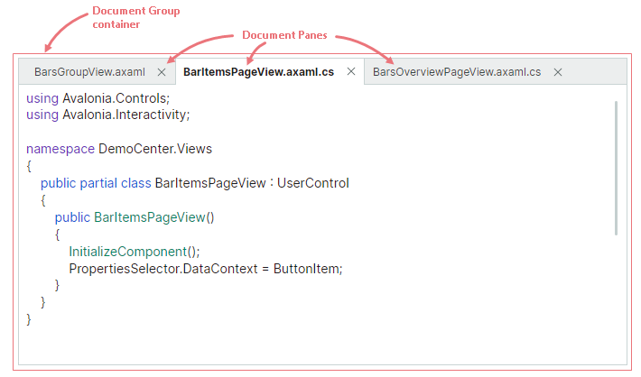
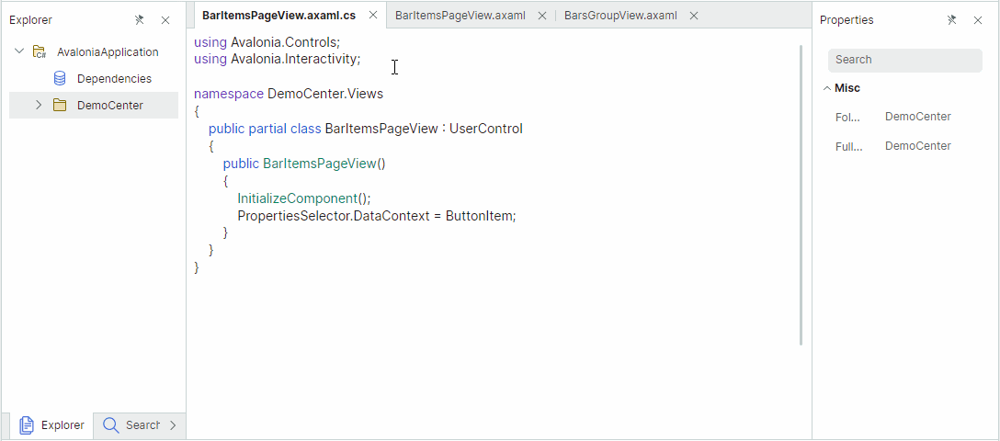
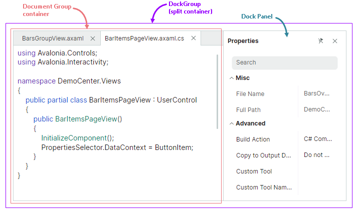
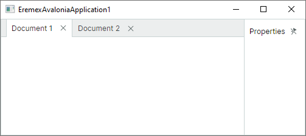
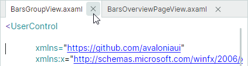
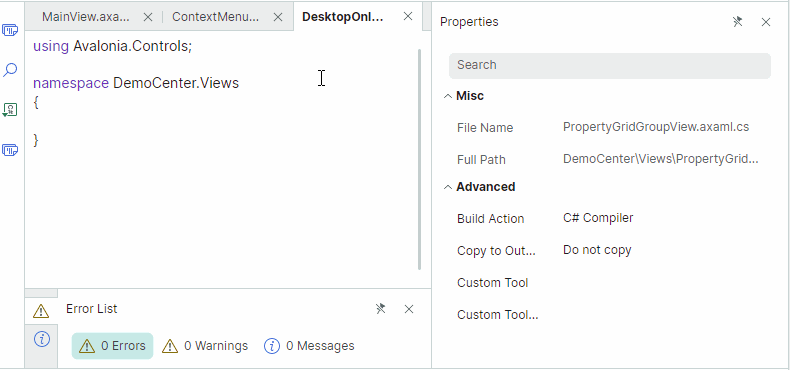
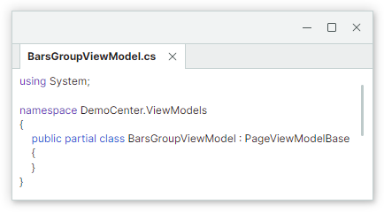

# Document Panes

Document Pane objects ([`DocumentPane`](../../API/Eremex.AvaloniaUI.Controls.Docking/DocumentPane.md)) allow you to create a tabbed MDI (Multiple Document Interface) in your application. Document Panes are tailored to display the main content of your window. 
When you combine them in a [`DocumentGroup`](../../API/Eremex.AvaloniaUI.Controls.Docking/DocumentGroup.md) container, they are rendered as tabs.



Drag-and-drop operations and context menus allow you to change the order of Document Panes, move Document Panes to another container, or make them floating.



You can also add regular [Dock Panes](dock-panes-and-containers.md) to a [`DocumentGroup`](../../API/Eremex.AvaloniaUI.Controls.Docking/DocumentGroup.md) container. All items added to a [`DocumentGroup`](../../API/Eremex.AvaloniaUI.Controls.Docking/DocumentGroup.md) container are rendered as tabs.

[`DocumentPane`](../../API/Eremex.AvaloniaUI.Controls.Docking/DocumentPane.md) and [`DockPane`](../../API/Eremex.AvaloniaUI.Controls.Docking/DockPane.md) objects share multiple features, as [`DocumentPane`](../../API/Eremex.AvaloniaUI.Controls.Docking/DocumentPane.md) is a [`DockPane`](../../API/Eremex.AvaloniaUI.Controls.Docking/DockPane.md) class descendant. [`DocumentGroup`](../../API/Eremex.AvaloniaUI.Controls.Docking/DocumentGroup.md) is a [TabbedGroup](dock-panes-and-containers.md#tabs) descendant. Thus, these objects have many features in common.

Like dock panels, [`DocumentPane`](../../API/Eremex.AvaloniaUI.Controls.Docking/DocumentPane.md) and [`DocumentGroup`](../../API/Eremex.AvaloniaUI.Controls.Docking/DocumentGroup.md) objects can be combined with other dock items in a [split container](dock-panes-and-containers.md#split-panels) (a [`DockGroup`](../../API/Eremex.AvaloniaUI.Controls.Docking/DockGroup.md) container), which arranges its children side-by-side, either horizontally or vertically.



The following XAML code creates the layout of dock items shown in the image above.

``` xml
xmlns:mxd="https://schemas.eremexcontrols.net/avalonia/docking"

<mxd:DockManager>
    <mxd:DockGroup Orientation="Horizontal">
        <mxd:DocumentGroup>
            <mxd:DocumentPane Header="BarsGroupView.axaml"/>
            <mxd:DocumentPane Header="BarItemsPageView.axaml"/>
        </mxd:DocumentGroup>
        <mxd:DockPane Header="Properties"/>
    </mxd:DockGroup>
</mxd:DockManager>
```

The auto-hide feature is not supported for [`DocumentPane`](../../API/Eremex.AvaloniaUI.Controls.Docking/DocumentPane.md) and [`DocumentGroup`](../../API/Eremex.AvaloniaUI.Controls.Docking/DocumentGroup.md) objects.

## Using MVVM to Create a Docking UI

You can use the MVVM design pattern to populate a Docking UI with dock items (Dock Panes and Document Panes). Use the following API members for this purpose:

- [`DockManager.ItemsSource`](../../API/Eremex.AvaloniaUI.Controls.Docking/DockManager/ItemsSource.md) — Specifies a list of objects that need to be rendered as dock items.
- [`DockManager.ItemTemplate`](../../API/Eremex.AvaloniaUI.Controls.Docking/DockManager/ItemTemplate.md) — Specifies the template used to render objects from the [`DockManager.ItemsSource`](../../API/Eremex.AvaloniaUI.Controls.Docking/DockManager/ItemsSource.md) list as dock items.

See [Use MVVM Pattern to Populate Dock Items](use-mvvm-pattern-to-populate-dock-items.md) for more information.


## Document Pane Content and Size


### Specify Content

You can use the inherited [`DockPane.Content`](../../API/Eremex.AvaloniaUI.Controls.Docking/DockPane/Content.md) property to define a Document Pane's content in code. In XAML, you can define the pane's content between the start and end __&lt;DocumentPane&gt;__ tags.

The inherited [`DockPane.ContentTemplate`](../../API/Eremex.AvaloniaUI.Controls.Docking/DockPane/ContentTemplate.md) property allows you to specify the template used to render the [`Content`](../../API/Eremex.AvaloniaUI.Controls.Docking/DockPane/Content.md) object.


### Specify Size

For dock items (panels and containers) that are displayed within [split containers](dock-panes-and-containers.md#split-panels) ([`DockGroup`](../../API/Eremex.AvaloniaUI.Controls.Docking/DockGroup.md) objects), the following properties allow you to set item size:

- [`DockWidth`](../../API/Eremex.AvaloniaUI.Controls.Docking/DockItemBase/DockWidth.md) (for panels that are horizontally arranged in their parent containers)
- [`DockHeight`](../../API/Eremex.AvaloniaUI.Controls.Docking/DockItemBase/DockHeight.md) (for panels that are vertically arranged in their parent containers)

!!! note

    Document Panes are rendered as tabs when they reside within a Document Group container. You can only change size of the Document Group container, not the size of its child Document Panes. You can set size of individual Document Panes if they are not rendered as tabs.

The following example arranges a [`DocumentGroup`](../../API/Eremex.AvaloniaUI.Controls.Docking/DocumentGroup.md) and [`DockPane`](../../API/Eremex.AvaloniaUI.Controls.Docking/DockPane.md) horizontally in a split container, and sets a [`DocumentGroup`](../../API/Eremex.AvaloniaUI.Controls.Docking/DocumentGroup.md)'s width to 4 times the width of a [`DockPane`](../../API/Eremex.AvaloniaUI.Controls.Docking/DockPane.md).



``` xml
xmlns:mxd="https://schemas.eremexcontrols.net/avalonia/docking"

<mxd:DockManager Grid.Row="1" Name="dockManager1">
    <mxd:DockGroup Orientation="Horizontal">
        <mxd:DocumentGroup DockWidth="4*">
            <mxd:DocumentPane Name="documentPane1" Header="Document 1"/>
            <mxd:DocumentPane Name="documentPane2" Header="Document 2"/>
        </mxd:DocumentGroup>
        <mxd:DockPane DockWidth="*" Header="Properties"/>
    </mxd:DockGroup>
</mxd:DockManager>
```

The [`DockWidth`](../../API/Eremex.AvaloniaUI.Controls.Docking/DockItemBase/DockWidth.md) and [`DockHeight`](../../API/Eremex.AvaloniaUI.Controls.Docking/DockItemBase/DockHeight.md) properties do not affect size of Document Panes in the floating state. See the following link to learn more:

- [Set Floating Bounds](#set-floating-bounds)


### Specify Header Settings

Use the inherited [`DockPane.Header`](../../API/Eremex.AvaloniaUI.Controls.Docking/DockPane/Header.md) and [`DockPane.HeaderTemplate`](../../API/Eremex.AvaloniaUI.Controls.Docking/DockPane/HeaderTemplate.md) properties to set headers for Document Panes. To display images, use the inherited [`DockPane.Glyph`](../../API/Eremex.AvaloniaUI.Controls.Docking/DockPane/Glyph.md) and [`DockPane.GlyphSize`](../../API/Eremex.AvaloniaUI.Controls.Docking/DockPane/GlyphSize.md) properties.

Typically, Document Panes are placed within a [`DocumentGroup`](../../API/Eremex.AvaloniaUI.Controls.Docking/DocumentGroup.md) container in which they are rendered as tabs. In this case, you can also use the inherited [`DockPane.TabHeader`](../../API/Eremex.AvaloniaUI.Controls.Docking/DockPane/TabHeader.md), [`DockPane.TabHeaderTemplate`](../../API/Eremex.AvaloniaUI.Controls.Docking/DockPane/TabHeaderTemplate.md), [`DockPane.TabGlyph`](../../API/Eremex.AvaloniaUI.Controls.Docking/DockPane/TabGlyph.md) and [`DockPane.TabGlyphSize`](../../API/Eremex.AvaloniaUI.Controls.Docking/DockPane/TabGlyphSize.md) properties to specify the header text and images. If these properties are not set, the [`DockPane.Header`](../../API/Eremex.AvaloniaUI.Controls.Docking/DockPane/Header.md), [`DockPane.HeaderTemplate`](../../API/Eremex.AvaloniaUI.Controls.Docking/DockPane/HeaderTemplate.md), [`DockPane.Glyph`](../../API/Eremex.AvaloniaUI.Controls.Docking/DockPane/Glyph.md) and [`DockPane.GlyphSize`](../../API/Eremex.AvaloniaUI.Controls.Docking/DockPane/GlyphSize.md) properties specify text and images displayed in tabs.


#### Related API

- [`DockPane.ShowGlyphMode`](../../API/Eremex.AvaloniaUI.Controls.Docking/DockPane/ShowGlyphMode.md) — Specifies the visibility and position of a glyph in a panel's header.
- [`DockPane.ShowTabGlyphMode`](../../API/Eremex.AvaloniaUI.Controls.Docking/DockPane/ShowTabGlyphMode.md) — Specifies the visibility and position of a glyph in a tab when the panel is hosted within a tabbed container (for instance, [`DocumentGroup`](../../API/Eremex.AvaloniaUI.Controls.Docking/DocumentGroup.md)).


## Create a Tabbed UI

You can combine Document Panes in a [`DocumentGroup`](../../API/Eremex.AvaloniaUI.Controls.Docking/DocumentGroup.md) container to create a tabbed MDI (Multiple Document Interface). [`DocumentGroup`](../../API/Eremex.AvaloniaUI.Controls.Docking/DocumentGroup.md), like its ancestor ([`TabbedGroup`](../../API/Eremex.AvaloniaUI.Controls.Docking/TabbedGroup.md)) is a container that presents its children as tabs. 


The following example creates a [`DocumentGroup`](../../API/Eremex.AvaloniaUI.Controls.Docking/DocumentGroup.md) container with three [`DocumentPane`](../../API/Eremex.AvaloniaUI.Controls.Docking/DocumentPane.md) objects.

``` xml
xmlns:mxd="https://schemas.eremexcontrols.net/avalonia/docking"

<mxd:DocumentGroup Name="documentGroup1" DockWidth="5*" >
    <mxd:DocumentPane Name="document1" Header="Document 1"></mxd:DocumentPane>
    <mxd:DocumentPane Name="document2" Header="Document 2"></mxd:DocumentPane>
    <mxd:DocumentPane Name="document3" Header="Document 3"></mxd:DocumentPane>
</mxd:DocumentGroup>
```

To combine Document Panes in a tab container in code-behind, use the the [`DockManager.Dock`](../../API/Eremex.AvaloniaUI.Controls.Docking/DockManager/Dock.md) method with the _dockType_ parameter set to [`DockType.Fill`](../../API/Eremex.AvaloniaUI.Controls.ApplicationServices/DockType.md). If you dock a document to another document that is already hosted within a tab container, the source panel is displayed as an additional tab within the tab container.

``` csharp
// Dock a document to another document
dockManager1.Dock(document4, document1, DockType.Fill);
// or dock a document to a group:
dockManager1.Dock(document5, documentGroup1, DockType.Fill);
```

### Access a Tab Container

For Document Panes that reside in a [`DocumentGroup`](../../API/Eremex.AvaloniaUI.Controls.Docking/DocumentGroup.md) container, use the inherited [`DockPane.DockParent`](../../API/Eremex.AvaloniaUI.Controls.Docking/DockItemBase/DockParent.md) property to return the parent tab container.


### Related API

The following list shows frequently used API members that allow you to customize [`DocumentPane`](../../API/Eremex.AvaloniaUI.Controls.Docking/DocumentPane.md) and [`DocumentGroup`](../../API/Eremex.AvaloniaUI.Controls.Docking/DocumentGroup.md) objects. Most of these settings are inherited from the objects' base classes.

- [`DockManager.Dock`](../../API/Eremex.AvaloniaUI.Controls.Docking/DockManager/Dock.md) — Allows you to dock an item (for example, a [`DocumentPane`](../../API/Eremex.AvaloniaUI.Controls.Docking/DocumentPane.md) object) to another item. Set the method's _dockType_ parameter to [`DockType.Fill`](../../API/Eremex.AvaloniaUI.Controls.ApplicationServices/DockType.md) to create a tab container.
- [`DockItemBase.DockParent`](../../API/Eremex.AvaloniaUI.Controls.Docking/DockItemBase/DockParent.md) — Allows you to get the immediate parent of a dock object. For [`DocumentPane`](../../API/Eremex.AvaloniaUI.Controls.Docking/DocumentPane.md) objects combined in a [`DocumentGroup`](../../API/Eremex.AvaloniaUI.Controls.Docking/DocumentGroup.md) container, the [`DockParent`](../../API/Eremex.AvaloniaUI.Controls.Docking/DockItemBase/DockParent.md) property returns this container.
- [`DockPane.CloseCommand`](../../API/Eremex.AvaloniaUI.Controls.Docking/DockPane/CloseCommand.md) — The command that is invoked when a panel is closed. A panel can be closed by a click on the 'Close' button (see [`DockPane.AllowClose`](../../API/Eremex.AvaloniaUI.Controls.Docking/DockPane/AllowClose.md) and [`TabbedGroup.CloseButtonShowMode`](../../API/Eremex.AvaloniaUI.Controls.Docking/TabbedGroup/CloseButtonShowMode.md)). 
Closed panels can be accessed from the [`DockManager.ClosedPanes`](../../API/Eremex.AvaloniaUI.Controls.Docking/DockManager/ClosedPanes.md) collection.
- [`DockPane.ShowTabGlyphMode`](../../API/Eremex.AvaloniaUI.Controls.Docking/DockPane/ShowTabGlyphMode.md) — Specifies the visibility and position of a glyph in a panel's header (tab) when the panel is hosted within a tab container.
- [`DockPane.TabGlyphSize`](../../API/Eremex.AvaloniaUI.Controls.Docking/DockPane/TabGlyphSize.md) — Specifies size of the tab glyph ([`DockPane.TabGlyph`](../../API/Eremex.AvaloniaUI.Controls.Docking/DockPane/TabGlyph.md)). This property is in effect when the panel is hosted within a tab container.
- [`DockPane.TabGlyph`](../../API/Eremex.AvaloniaUI.Controls.Docking/DockPane/TabGlyph.md) — Specifies the glyph displayed in the tab. This property is in effect when the panel is hosted within a tab container.
- [`DockPane.TabHeaderTemplate`](../../API/Eremex.AvaloniaUI.Controls.Docking/DockPane/TabHeaderTemplate.md) — Specifies the template to render a tab. This property is in effect when the panel is hosted within a tab container.
- [`DockPane.TabHeader`](../../API/Eremex.AvaloniaUI.Controls.Docking/DockPane/TabHeader.md) — Specifies text to display in a tab. This property is in effect when the panel is hosted within a tab container.

- [`TabbedGroup.AllowFloat`](../../API/Eremex.AvaloniaUI.Controls.Docking/TabbedGroup/AllowFloat.md) — Specifies whether the tab container can be made floating by a user.
- [`TabbedGroup.CloseButtonShowMode`](../../API/Eremex.AvaloniaUI.Controls.Docking/TabbedGroup/CloseButtonShowMode.md) — Specifies whether and where to display 'Close' buttons for child panels in the tab region: nowhere in the tab region, in each panel, in the active panel, or in the tab strip region. The [`TabbedGroup.CloseButtonShowMode`](../../API/Eremex.AvaloniaUI.Controls.Docking/TabbedGroup/CloseButtonShowMode.md) property does not affect the display of the 'Close' button in a panel's header. See [Closing Panels](#close-document-panes).
- [`TabbedGroup.SelectTabOnClose`](../../API/Eremex.AvaloniaUI.Controls.Docking/TabbedGroup/SelectTabOnClose.md) — Specifies which tab is selected when you close a tab: the recently opened tab, the following tab, or preceding tab.
- [`TabbedGroup.SelectedIndex`](../../API/Eremex.AvaloniaUI.Controls.Docking/TabbedGroup/SelectedIndex.md) — Specifies the zero-based index of the selected tab in the current tab container. You can use the [`SelectedIndex`](../../API/Eremex.AvaloniaUI.Controls.Docking/TabbedGroup/SelectedIndex.md) property to select a specific tab.
- [`TabbedGroup.ShowTabStripForSingleChild`](../../API/Eremex.AvaloniaUI.Controls.Docking/TabbedGroup/ShowTabStripForSingleChild.md) — Specifies whether to display the tab strip when the tab container contains one child. If this property is set to `true`, the tab strip is only displayed if the container owns two or more children.
- [`TabbedGroup.TabHeaderOrientation`](../../API/Eremex.AvaloniaUI.Controls.Docking/TabbedGroup/TabHeaderOrientation.md) — Specifies whether to arrange tabs horizontally or vertically. In `TabHeaderOrientation.Auto` mode, tabs are arranged horizontally if the [`TabbedGroup.TabStripPlacement`](../../API/Eremex.AvaloniaUI.Controls.Docking/TabbedGroup/TabStripPlacement.md) property is set to `Top` or `Bottom`. The tabs are arranged vertically, if the [`TabbedGroup.TabStripPlacement`](../../API/Eremex.AvaloniaUI.Controls.Docking/TabbedGroup/TabStripPlacement.md) property is set to `Left` or `Right`.
- [`TabbedGroup.TabStripLayoutType`](../../API/Eremex.AvaloniaUI.Controls.Docking/TabbedGroup/TabStripLayoutType.md) — Specifies how tabs are displayed. `TabStripLayoutType.Scroll` - Tab headers are wide enough to display tab headers' contents. Scroll buttons appear in the tab header region if there is not enough space to display all tab headers in their entirety. `TabStripLayoutType.Stretch` - All tab headers are arranged in a line, stretching to fit the control's width. They have the same width or height depending on the tab strip position (see [`TabbedGroup.TabStripPlacement`](../../API/Eremex.AvaloniaUI.Controls.Docking/TabbedGroup/TabStripPlacement.md)). `TabStripLayoutType.MultiLine` - Tab headers are arranged in multiple lines if there is not enough space to display them in a single line.
- [`TabbedGroup.TabStripPlacement`](../../API/Eremex.AvaloniaUI.Controls.Docking/TabbedGroup/TabStripPlacement.md) — Specifies the edge along which tabs are displayed.


## Activate Document Panes

A Document Pane's inherited [`DockPane.IsActive`](../../API/Eremex.AvaloniaUI.Controls.Docking/DockPane/IsActive.md) property allows you to move focus to a specific Document Pane. Use the [`DockManager.ActiveDockItem`](../../API/Eremex.AvaloniaUI.Controls.Docking/DockManager/ActiveDockItem.md) property to get the active dock item.

When Document Panes are combined in a [`DocumentGroup`](../../API/Eremex.AvaloniaUI.Controls.Docking/DocumentGroup.md) container, you can use the [`DocumentGroup.SelectedIndex`](../../API/Eremex.AvaloniaUI.Controls.Docking/TabbedGroup/SelectedIndex.md) property to select a specific Document Pane.

## Close Document Panes

When Document Panes are placed within a [`DocumentGroup`](../../API/Eremex.AvaloniaUI.Controls.Docking/DocumentGroup.md) container, they display 'Close' buttons in tabs. The 'Close' buttons allow a user to close the panels. In code, you can close a panel with the [`DockManager.Close`](../../API/Eremex.AvaloniaUI.Controls.Docking/DockManager/Close.md) method.



Use the [`DockPane.AllowClose`](../../API/Eremex.AvaloniaUI.Controls.Docking/DockPane/AllowClose.md) property to hide the 'Close' button for a panel, and thus prevent the panel from being closed using this button.

When a panel is closed, the inherited [`DockPane.CloseCommand`](../../API/Eremex.AvaloniaUI.Controls.Docking/DockPane/CloseCommand.md) command is activated. 

All closed panels can be accessed from the [`DockManager.ClosedPanes`](../../API/Eremex.AvaloniaUI.Controls.Docking/DockManager/ClosedPanes.md) collection. 

The MVVM design pattern allows you to supply Document Panes from the [`DockManager.ItemsSource`](../../API/Eremex.AvaloniaUI.Controls.Docking/DockManager/ItemsSource.md) collection. On closing a Document Pane, you can remove the pane from the [`DockManager.ItemsSource`](../../API/Eremex.AvaloniaUI.Controls.Docking/DockManager/ItemsSource.md) collection. In this case, the pane is removed from the [`DockManager.ClosedPanes`](../../API/Eremex.AvaloniaUI.Controls.Docking/DockManager/ClosedPanes.md) collection as well.

The following code from the "IDE Layout" demo shows specifies a [`CloseCommand`](../../API/Eremex.AvaloniaUI.Controls.Docking/DockPane/CloseCommand.md) command for a newly opened document. This command removes the pane from the _Documents_ collection ([`DockManager.ItemsSource`](../../API/Eremex.AvaloniaUI.Controls.Docking/DockManager/ItemsSource.md)). See the "IDE Layout" demo for a complete example.

``` csharp
public void Open(SolutionFile solutionFile)
{
    var document = Documents.FirstOrDefault(x => x.Uri == solutionFile.Uri);
    if (document == null)
    {
        document = new IdeLayoutDocumentViewModel
        {
            Header = solutionFile.Filename,
            Uri = solutionFile.Uri
        };
        document.CloseCommand = new RelayCommand(() => Documents.Remove(document));
        Documents.Add(document);
    }
    document.IsActive = true;
}
```

A [`DocumentGroup`](../../API/Eremex.AvaloniaUI.Controls.Docking/DocumentGroup.md)'s [`CloseButtonShowMode`](../../API/Eremex.AvaloniaUI.Controls.Docking/TabbedGroup/CloseButtonShowMode.md) property allows you to display additional 'Close' buttons in the tab strip region. You can display the 'Close' buttons in all tabs, in the active tab, or in the tab strip region.  The image below displays the 'Close' button in the tab strip region (the [`CloseButtonShowMode`](../../API/Eremex.AvaloniaUI.Controls.Docking/TabbedGroup/CloseButtonShowMode.md) property is set to `TabControlCloseButtonShowMode.InHeaderPanel`).


The [`DockManager.DockOperationStarting`](../../API/Eremex.AvaloniaUI.Controls.Docking/DockManager/DockOperationStarting.md) event allows you to prevent specific panels from being closed, or perform custom actions when panels are closed. This event does not raise if a panel is removed from the [`DockManager.ItemsSource`](../../API/Eremex.AvaloniaUI.Controls.Docking/DockManager/ItemsSource.md) collection on panel closing.


## Runtime Options for Document Panes

[`DocumentPane`](../../API/Eremex.AvaloniaUI.Controls.Docking/DocumentPane.md) objects contain settings that allow you to disable specific user operations at runtime. These settings are inherited from the base [`DockPane`](../../API/Eremex.AvaloniaUI.Controls.Docking/DockPane.md) class.

- [`DockPane.AllowClose`](../../API/Eremex.AvaloniaUI.Controls.Docking/DockPane/AllowClose.md) — Gets or sets whether a user can close a panel. Set this property to `false` to hide the panel's `x` (close) button. See [Close Document Panes](#close-document-panes).
- [`DockPane.AllowFloat`](../../API/Eremex.AvaloniaUI.Controls.Docking/DockPane/AllowFloat.md) — Gets or sets whether a user can make a panel floating. See [Floating Document Panes](#floating-document-panes).
- [`DockPane.AllowMaximize`](../../API/Eremex.AvaloniaUI.Controls.Docking/DockPane/AllowMaximize.md) — Specifies the visibility of the 'Maximize' button for a panel in the floating state.
- [`DockPane.AllowMinimize`](../../API/Eremex.AvaloniaUI.Controls.Docking/DockPane/AllowMinimize.md) — Specifies the visibility of the 'Minimize' button for a panel in the floating state.

These options do not prevent you from performing corresponding operations on panels in code.

You can also handle the [`DockManager.DockOperationStarting`](../../API/Eremex.AvaloniaUI.Controls.Docking/DockManager/DockOperationStarting.md) event to dynamically prevent certain dock operations, or run custom logic when these operations occur.


### Example - Prevent Document Panes from Floating

This example shows how to disable the floating state for document panes. The code below handles the [`DockManager.RegisterDockItem`](../../API/Eremex.AvaloniaUI.Controls.Docking/DockManager/RegisterDockItem.md) event to disable the [`AllowFloat`](../../API/Eremex.AvaloniaUI.Controls.Docking/DockPane/AllowFloat.md) option for newly created documents.

``` cs
private void DockManager_RegisterDockItem(object sender, Eremex.AvaloniaUI.Controls.Docking.DockItemEventArgs e)
{
    if(e.Item is DocumentPane document)
    {
        document.AllowFloat = false;
    }
}
```


## Floating Document Panes


Like Dock Panes, Document Panes can be made floating. In the floating state, a user can move a Document Pane within the available screen space. Floating documents are hosted within floating windows.



See the following example to learn how to prevent documents from being made floating:

- [Example - Prevent Document Panes from Floating](#example-prevent-document-panes-from-floating)

### Access a Floating Window 

When a panel is made floating, a floating window (container) is created that hosts this panel. Floating windows are encapsulated by [`FloatGroup`](../../API/Eremex.AvaloniaUI.Controls.Docking/FloatGroup.md) objects. You can access a panel's parent floating window with the panel's [`DockItemBase.FloatGroup`](../../API/Eremex.AvaloniaUI.Controls.Docking/DockItemBase/FloatGroup.md) property. This property returns **null** if the panel is not in the floating state.

You can use the following API members to specify the floating window's location, size, header and glyph:

- [`FloatGroup.FloatHeight`](../../API/Eremex.AvaloniaUI.Controls.Docking/FloatGroup/FloatHeight.md)
- [`FloatGroup.FloatLocation`](../../API/Eremex.AvaloniaUI.Controls.Docking/FloatGroup/FloatLocation.md)
- [`FloatGroup.FloatWidth`](../../API/Eremex.AvaloniaUI.Controls.Docking/FloatGroup/FloatWidth.md)
- [`FloatGroup.Glyph`](../../API/Eremex.AvaloniaUI.Controls.Docking/FloatGroup/Glyph.md)
- [`FloatGroup.Header`](../../API/Eremex.AvaloniaUI.Controls.Docking/FloatGroup/Header.md)
- [`FloatGroup.HeaderTemplate`](../../API/Eremex.AvaloniaUI.Controls.Docking/FloatGroup/HeaderTemplate.md)
- `DockManager.DefaultFloatGroupHeader`
- `DockManager.DefaultFloatGroupGlyph`

### Make Document Panes Floating

To define a floating Document Pane in XAML, add a [`FloatGroup`](../../API/Eremex.AvaloniaUI.Controls.Docking/FloatGroup.md) object to the [`DockManager.FloatGroups`](../../API/Eremex.AvaloniaUI.Controls.Docking/DockManager/FloatGroups.md) collection, and then add a [`DocumentPane`](../../API/Eremex.AvaloniaUI.Controls.Docking/DocumentPane.md) panel to the [`FloatGroup`](../../API/Eremex.AvaloniaUI.Controls.Docking/FloatGroup.md) object. You can also wrap a [`DocumentPane`](../../API/Eremex.AvaloniaUI.Controls.Docking/DocumentPane.md) object within a [`DocumentGroup`](../../API/Eremex.AvaloniaUI.Controls.Docking/DocumentGroup.md) container to display the document as a tab.

Use the [`DockManager.Float`](../../API/Eremex.AvaloniaUI.Controls.Docking/DockManager/Float.md) method to create a floating dock item in code-behind.

#### Example - Define Floating Documents in XAML

The following example creates two floating windows. The first window contains a [`DocumentPane`](../../API/Eremex.AvaloniaUI.Controls.Docking/DocumentPane.md) object. The second window displays a [`DocumentGroup`](../../API/Eremex.AvaloniaUI.Controls.Docking/DocumentGroup.md) container with a [`DocumentPane`](../../API/Eremex.AvaloniaUI.Controls.Docking/DocumentPane.md) object.


``` xml
<mxd:DockManager.FloatGroups>
    <mxd:FloatGroup FloatLocation="200,200" FloatWidth="300" FloatHeight="150" >
        <mxd:DocumentPane Header="floating document"></mxd:DocumentPane>
    </mxd:FloatGroup>
    <mxd:FloatGroup FloatLocation="400,400" FloatWidth="300" FloatHeight="150" Header="floating window">
        <mxd:DocumentGroup>
            <mxd:DocumentPane Header="floating document in a container"></mxd:DocumentPane>
        </mxd:DocumentGroup>
    </mxd:FloatGroup>
</mxd:DockManager.FloatGroups>
```

#### Example - Create Floating Documents and Customize Floating Window in Code Behind

The code below makes the active Document floating and sets the bounds and header for the created floating window. 


``` csharp
DocumentPane document = dockManager1.ActiveDockItem as DocumentPane;
if(document != null)
{
    dockManager1.Float(document);
    FloatGroup floatingWindow = document.FloatGroup;
    floatingWindow.FloatWidth = 300;
    floatingWindow.FloatHeight = 200;
    floatingWindow.Header = "floating window";
    document.FloatGroup.FloatLocation = dockManager1.PointToScreen(
        new Point(dockManager1.Bounds.Right - floatingWindow.FloatWidth,
        dockManager1.Bounds.Bottom - floatingWindow.FloatHeight));
}
```


### Set a Floating Window's Header and Glyph

When a Document Pane is made floating, a floating window ([`FloatGroup`](../../API/Eremex.AvaloniaUI.Controls.Docking/FloatGroup.md)) is created to host this document. This floating window's header is initially empty. 




You can use the following properties to specify a floating window's header content:

- [`FloatGroup.Glyph`](../../API/Eremex.AvaloniaUI.Controls.Docking/FloatGroup/Glyph.md) — An image to display in the header.
- [`FloatGroup.GlyphSize`](../../API/Eremex.AvaloniaUI.Controls.Docking/FloatGroup/GlyphSize.md) — The image size.
- [`FloatGroup.Header`](../../API/Eremex.AvaloniaUI.Controls.Docking/FloatGroup/Header.md) — An object to render in the header. Use [`FloatGroup.WindowTitle`](../../API/Eremex.AvaloniaUI.Controls.Docking/FloatGroup/WindowTitle.md) to specify a string to display in the header instead of an object.
- [`FloatGroup.HeaderTemplate`](../../API/Eremex.AvaloniaUI.Controls.Docking/FloatGroup/HeaderTemplate.md) — The template to render the [`FloatGroup.Header`](../../API/Eremex.AvaloniaUI.Controls.Docking/FloatGroup/Header.md) object.
- [`FloatGroup.ShowGlyphMode`](../../API/Eremex.AvaloniaUI.Controls.Docking/FloatGroup/ShowGlyphMode.md) — Gets or sets the position and visibility of the [`FloatGroup.Glyph`](../../API/Eremex.AvaloniaUI.Controls.Docking/FloatGroup/Glyph.md) image in the header.
- [`FloatGroup.WindowIcon`](../../API/Eremex.AvaloniaUI.Controls.Docking/FloatGroup/WindowIcon.md) — A [`WindowIcon`](../../API/Eremex.AvaloniaUI.Controls.Docking/FloatGroup/WindowIcon.md) object that represents the icon to render in the header. If [`WindowIcon`](../../API/Eremex.AvaloniaUI.Controls.Docking/FloatGroup/WindowIcon.md) is not specified, the header displays the image specified by the `Glyph` property.
- [`FloatGroup.WindowTitle`](../../API/Eremex.AvaloniaUI.Controls.Docking/FloatGroup/WindowTitle.md) — The text to render in the header. If [`WindowTitle`](../../API/Eremex.AvaloniaUI.Controls.Docking/FloatGroup/WindowTitle.md) is not specified, the header displays the text representation of the `Header` object.


Floating windows are dynamically created when panels are made floating. To initialize properties of these dynamically created floating windows, handle the [`DockManager.RegisterDockItem`](../../API/Eremex.AvaloniaUI.Controls.Docking/DockManager/RegisterDockItem.md) event.


``` cs
private void DockManager1_RegisterDockItem(object sender, Eremex.AvaloniaUI.Controls.Docking.DockItemEventArgs e)
{
    if (e.Item is FloatGroup floatGroup)
    {
        floatGroup.Header = "Demo App";
    }
}
```


### Set Floating Bounds 

When a Document Pane is made floating, its previous size determines the floating window's initial size. You can set the [`FloatGroup.FloatWidth`](../../API/Eremex.AvaloniaUI.Controls.Docking/FloatGroup/FloatWidth.md), [`FloatGroup.FloatHeight`](../../API/Eremex.AvaloniaUI.Controls.Docking/FloatGroup/FloatHeight.md) and [`FloatGroup.FloatLocation`](../../API/Eremex.AvaloniaUI.Controls.Docking/FloatGroup/FloatLocation.md) attached properties to specify custom floating bounds.

``` xml
<mxd:DocumentPane Name="documentPane1" Header="Document 1"
    mxd:FloatGroup.FloatWidth="500" mxd:FloatGroup.FloatHeight="400"/>
```

After a dock item becomes floating, you can access its parent floating window ([`FloatGroup`](../../API/Eremex.AvaloniaUI.Controls.Docking/FloatGroup.md)) and set its bounds.

The following example makes a Document Pane floating, accesses the created floating window, and sets its size.

``` csharp
using Eremex.AvaloniaUI.Controls.Docking;

dockManager1.Float(documentPane1);
FloatGroup floatingWindow = documentPane1.FloatGroup;
floatingWindow.FloatWidth = 400;
floatingWindow.FloatHeight = 300;
floatingWindow.FloatLocation = dockManager1.PointToScreen(new Point(100,100));
```


### Related API 

- [`DockPane.FloatGroup`](../../API/Eremex.AvaloniaUI.Controls.Docking/DockItemBase/FloatGroup.md) — Returns the floating window (a [`FloatGroup`](../../API/Eremex.AvaloniaUI.Controls.Docking/FloatGroup.md) object) that contains the current panel when the panel is floating. Returns **null** if the panel is not floating.
- [`FloatGroup.FloatLocation`](../../API/Eremex.AvaloniaUI.Controls.Docking/FloatGroup/FloatLocation.md) — Specifies the position of the float group relative to the top left corner of the screen.
- [`FloatGroup.FloatHeight`](../../API/Eremex.AvaloniaUI.Controls.Docking/FloatGroup/FloatHeight.md) — Specifies the [`FloatGroup`](../../API/Eremex.AvaloniaUI.Controls.Docking/FloatGroup.md)'s height.
- `FloatGroup.FloatWeight` — Specifies the [`FloatGroup`](../../API/Eremex.AvaloniaUI.Controls.Docking/FloatGroup.md)'s width.
- [`FloatGroup.Header`](../../API/Eremex.AvaloniaUI.Controls.Docking/FloatGroup/Header.md) — Specifies the [`FloatGroup`](../../API/Eremex.AvaloniaUI.Controls.Docking/FloatGroup.md)'s header text.
- [`FloatGroup.HeaderTemplate`](../../API/Eremex.AvaloniaUI.Controls.Docking/FloatGroup/HeaderTemplate.md) — Specifies the [`FloatGroup`](../../API/Eremex.AvaloniaUI.Controls.Docking/FloatGroup.md)'s header template.
- [`FloatGroup.Glyph`](../../API/Eremex.AvaloniaUI.Controls.Docking/FloatGroup/Glyph.md) — Specifies the [`FloatGroup`](../../API/Eremex.AvaloniaUI.Controls.Docking/FloatGroup.md)'s glyph.
- [`DockManager.Float`](../../API/Eremex.AvaloniaUI.Controls.Docking/DockManager/Float.md) — Makes a dock item (for example, a [`DocumentPane`](../../API/Eremex.AvaloniaUI.Controls.Docking/DocumentPane.md) object) floating.
- [`DockManager.FloatGroups`](../../API/Eremex.AvaloniaUI.Controls.Docking/DockManager/FloatGroups.md) — A collection of floating groups (floating windows).
- [`DockPane.AllowFloat`](../../API/Eremex.AvaloniaUI.Controls.Docking/DockPane/AllowFloat.md) — Gets or sets whether a user can make a panel floating.

## See Also

- [How to Create a Complex Docking Layout in Code Behind](examples/how-to-create-a-complex-docking-layout-in-code-behind.md)