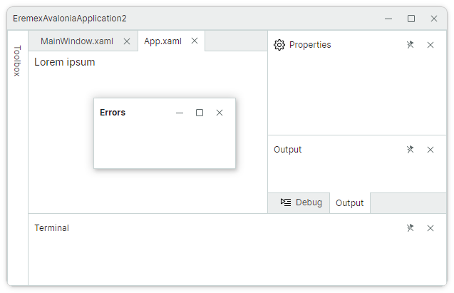

# How to Create a Complex Docking Layout in Code Behind

This example shows how to create docked, floating and auto-hidden panels in code behind, and arrange them as demonstrated in the image below:




It is assumed that the images used in this example have the `Build Action` property set to `AvaloniaResource`.

``` cs
using Eremex.AvaloniaUI.Controls.Common;
using Eremex.AvaloniaUI.Controls.Docking;
using Eremex.AvaloniaUI.Controls.Utils;

public partial class MainWindow : MxWindow
{
    public MainWindow()
    {
        InitializeComponent();

        DockManager dockManager1 = new DockManager();
        this.Content = dockManager1;

        // Initialize the DockManager's root group.
        dockManager1.Root = new DockGroup();

        // Create dock panels
        DockPane paneProperties = new DockPane() 
        { 
            Header = "Properties", 
            Glyph=ImageLoader.LoadSvgImage(Assembly.GetExecutingAssembly(), "Images/settings.svg"), 
            GlyphSize=new Avalonia.Size(16,16) 
        };
        DockPane paneDebug = new DockPane() 
        { 
            Header = "Debug",
            Glyph = ImageLoader.LoadSvgImage(Assembly.GetExecutingAssembly(), "Images/debug2.svg"),
            GlyphSize = new Avalonia.Size(16, 16)
        };
        DockPane paneOutput = new DockPane() { Header = "Output"};
        DockPane paneTerminal = new DockPane() 
        { 
            Header = "Terminal", 
            DockHeight = new GridLength(100, GridUnitType.Pixel) 
        };
        // Create a tabbed group for documents
        DocumentGroup documentGroup = new DocumentGroup();

        // Add the panels to the dock manager
        dockManager1.Root.Add(paneProperties);
        // Dock the document tabbed group to the left of the 'Properties' panel.
        dockManager1.Dock(documentGroup, paneProperties, DockType.Left);
        // Dock the 'Debug' panel at the bottom of the 'Properties' panel.
        dockManager1.Dock(paneDebug, paneProperties, DockType.Bottom);
        // Create a tabbed group from the 'Debug' and 'Output' panels
        dockManager1.Dock(paneOutput, paneDebug, DockType.Fill);

        // Add documents to the tabbed group
        DocumentPane document1 = new DocumentPane() { Header = "MainWindow.xaml" };
        DocumentPane document2 = new DocumentPane() { Header = "App.xaml", Content = new TextBlock() { Text = "Lorem ipsum" } };
        dockManager1.Dock(document1, documentGroup, DockType.Fill);
        dockManager1.Dock(document2, documentGroup, DockType.Fill);
        // Display the 'Terminal' panel at the bottom of the root group.
        dockManager1.Dock(paneTerminal, dockManager1.Root, DockType.Bottom);

        // Set relative size for the 'Properties' panel and the tabbed group (paneDebug.DockParent)
        paneProperties.DockHeight = new GridLength(4, GridUnitType.Star);
        paneDebug.DockParent.DockHeight = new GridLength(3, GridUnitType.Star);

        // Set absolute size for the panel
        paneProperties.DockParent.DockWidth = new GridLength(250, GridUnitType.Pixel);

        // Create an auto-hide panel
        DockPane paneToolbox = new DockPane() { Header = "Toolbox" };
        AutoHideGroup autoHideGroup = new AutoHideGroup() { Dock = Dock.Left };
        dockManager1.AutoHideGroups.Add(autoHideGroup);
        autoHideGroup.Add(paneToolbox);
        AutoHideGroup.SetAutoHideWidth(paneToolbox, 150);

        // Create a floating panel
        DockPane paneErrors = new DockPane() { Header = "Errors" };
        dockManager1.Float(paneErrors);
        paneErrors.FloatGroup.FloatLocation = new PixelPoint(200, 200);
        paneErrors.FloatGroup.FloatWidth = 200;
        paneErrors.FloatGroup.FloatHeight = 100;
    }
}
```