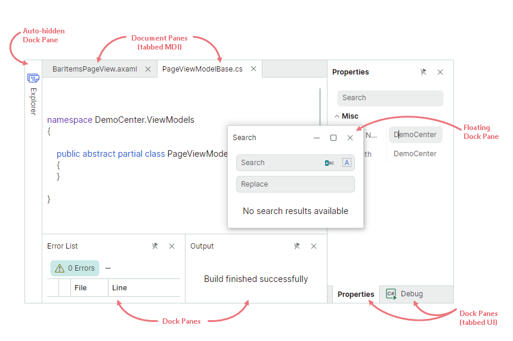
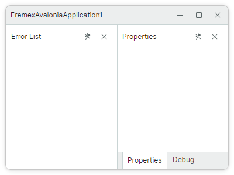
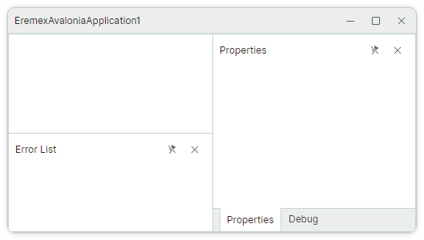
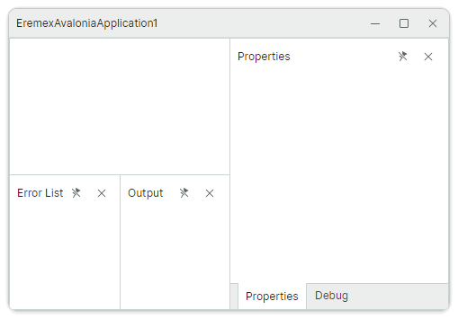
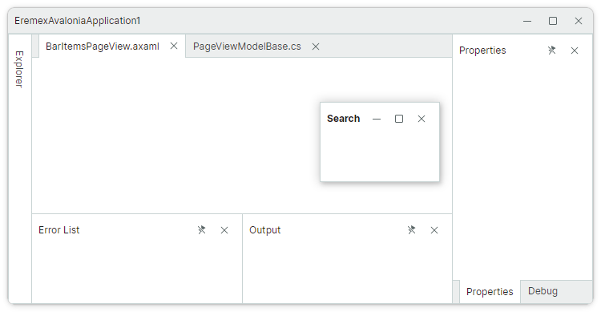
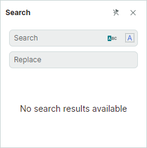

# Get Started with Docking

This tutorial shows how to set up the layout of dock panels displayed in the image below from scratch.
First, we'll create a layout of docked panels, and then show how to define auto-hidden and floating panels.



This example demonstrates dock items that constitute a Docking UI:

- Dock Pane ([`DockPane`](../../API/Eremex.AvaloniaUI.Controls.Docking/DockPane.md)) - A panel that can be docked, made floating, auto-hidden, and combined in a tabbed group (container).

- Document Pane ([`DocumentPane`](../../API/Eremex.AvaloniaUI.Controls.Docking/DocumentPane.md)) - A container for the main content of your window. You can use Document Panes to implement a tabbed MDI (Multiple Document Interface).


To build a layout of docked panels shown above, individual panels need to be combined into groups (containers). Containers specify display mode and behavior for their child items. You can aggregate containers in other containers to create complex layouts of panels. 

The following containers are supported by the Docking Library:

- [`DockGroup`](../../API/Eremex.AvaloniaUI.Controls.Docking/DockGroup.md) (split container) — Displays dock items (Dock Panes and containers) side by side, either horizontally or vertically. Child dock items are delimited by splitters that enable panel resizing.
- [`TabbedGroup`](../../API/Eremex.AvaloniaUI.Controls.Docking/TabbedGroup.md) (tab container) — Displays Dock Panes as tabs.
- [`DocumentGroup`](../../API/Eremex.AvaloniaUI.Controls.Docking/DocumentGroup.md) (tab container) — Displays Document Panes as tabs.
- [`AutoHideGroup`](../../API/Eremex.AvaloniaUI.Controls.Docking/AutoHideGroup.md) — Child Dock Panes of this container feature the automatic hiding functionality. An auto-hidden panel appears when a user clicks the panel's header. 
- [`FloatGroup`](../../API/Eremex.AvaloniaUI.Controls.Docking/FloatGroup.md) — Displays dock items in a floating window.


## 1. Create a DockManager Component

Create a [new Avalonia UI application with Eremex controls](../../get-started/index.md).
Open the MainWindow.axaml file, and define a [`DockManager`](../../API/Eremex.AvaloniaUI.Controls.Docking/DockManager.md) component in XAML. 

``` xml
xmlns:mxd="https://schemas.eremexcontrols.net/avalonia/docking"

<mxd:DockManager>
</mxd:DockManager>
```

[`DockManager`](../../API/Eremex.AvaloniaUI.Controls.Docking/DockManager.md) is a control that manages the creation of dock items (Dock Panes and Document Panes), maintains runtime operations on dock items, provides context menus, and performs Docking UI serialization and deserialization.


## 2. Define a Root Group

Add a [`DockGroup`](../../API/Eremex.AvaloniaUI.Controls.Docking/DockGroup.md) object as a child of the [`DockManager`](../../API/Eremex.AvaloniaUI.Controls.Docking/DockManager.md) control. This object is used to initialize the root dock group (the [`DockManager.Root`](../../API/Eremex.AvaloniaUI.Controls.Docking/DockManager/Root.md) property, which is marked with the `ContentAttribute` attribute).

``` xml
xmlns:mxd="https://schemas.eremexcontrols.net/avalonia/docking"

<mxd:DockManager>
    <mxd:DockGroup>
    </mxd:DockGroup>
</mxd:DockManager>
```

A root dock group is a container for all panels and documents in the docked state.


## 3. Add the 'Properties' and 'Debug' Panels

Add the 'Properties' and 'Debug' [`DockPane`](../../API/Eremex.AvaloniaUI.Controls.Docking/DockPane.md) objects to the root group.

``` xml
xmlns:mxd="https://schemas.eremexcontrols.net/avalonia/docking"

<mxd:DockManager>
    <mxd:DockGroup>
        <mxd:DockPane Header="Properties"/>
        <mxd:DockPane Header="Debug"/>
    </mxd:DockGroup>
</mxd:DockManager>
```

The [`DockGroup`](../../API/Eremex.AvaloniaUI.Controls.Docking/DockGroup.md) container arranges the panels horizontally, by default. You can change the direction to vertical with the [`DockGroup.Orientation`](../../API/Eremex.AvaloniaUI.Controls.Docking/DockGroup/Orientation.md) property.


## 4. Combine Panels in a Tab Container.

Wrap the 'Properties' and 'Debug' panels in a [`TabbedGroup`](../../API/Eremex.AvaloniaUI.Controls.Docking/TabbedGroup.md) container. This container presents its children as tabs.

``` xml
xmlns:mxd="https://schemas.eremexcontrols.net/avalonia/docking"

<mxd:DockManager>
    <mxd:DockGroup>
        <mxd:TabbedGroup>
            <mxd:DockPane Header="Properties"/>
            <mxd:DockPane Header="Debug"/>
        </mxd:TabbedGroup>
    </mxd:DockGroup>
</mxd:DockManager>
```


## 5. Add the 'Error List' Panel

Define the 'Error List' panel before the [`TabbedGroup`](../../API/Eremex.AvaloniaUI.Controls.Docking/TabbedGroup.md) object. 

``` xml
xmlns:mxd="https://schemas.eremexcontrols.net/avalonia/docking"

<mxd:DockManager>
    <mxd:DockGroup>
        <mxd:DockPane Header="Error List"/>
        <mxd:TabbedGroup>
            <mxd:DockPane Header="Properties"/>
            <mxd:DockPane Header="Debug"/>
        </mxd:TabbedGroup>
    </mxd:DockGroup>
</mxd:DockManager>
```

The [`DockGroup`](../../API/Eremex.AvaloniaUI.Controls.Docking/DockGroup.md) container arranges the 'Error List' pane and the [`TabbedGroup`](../../API/Eremex.AvaloniaUI.Controls.Docking/TabbedGroup.md) in a horizontal direction.



## 6. Add a Document Group above the 'Error List' Panel

To display a [`DocumentGroup`](../../API/Eremex.AvaloniaUI.Controls.Docking/DocumentGroup.md) at the top of the 'Error List' panel, first create a new [`DockGroup`](../../API/Eremex.AvaloniaUI.Controls.Docking/DockGroup.md) container with the vertical orientation. Then place the 'Error List' panel and a new [`DocumentGroup`](../../API/Eremex.AvaloniaUI.Controls.Docking/DocumentGroup.md) object to this container.

``` xml
xmlns:mxd="https://schemas.eremexcontrols.net/avalonia/docking"

<mxd:DockManager>
    <mxd:DockGroup>
        <mxd:DockGroup Orientation="Vertical">
            <mxd:DocumentGroup></mxd:DocumentGroup>
            <mxd:DockPane Header="Error List"/>
        </mxd:DockGroup>
        <mxd:TabbedGroup>
            <mxd:DockPane Header="Properties"/>
            <mxd:DockPane Header="Debug"/>
        </mxd:TabbedGroup>
    </mxd:DockGroup>
</mxd:DockManager>
```



## 7. Add the 'Output' Panel

The 'Output' panel has to be displayed to the right of the 'Error List' panel. Currently, the 'Error List' panel belongs to a container that arranges its children vertically. Thus, we need to aggregate the 'Error List' and 'Output' panels into a new container ([`DockGroup`](../../API/Eremex.AvaloniaUI.Controls.Docking/DockGroup.md)) with the horizontal orientation.

``` xml
xmlns:mxd="https://schemas.eremexcontrols.net/avalonia/docking"

<mxd:DockManager>
    <mxd:DockGroup>
        <mxd:DockGroup Orientation="Vertical">
            <mxd:DocumentGroup></mxd:DocumentGroup>
            <mxd:DockGroup Orientation="Horizontal">
                <mxd:DockPane Header="Error List"/>
                <mxd:DockPane Header="Output"/>
            </mxd:DockGroup>
        </mxd:DockGroup>
        <mxd:TabbedGroup>
            <mxd:DockPane Header="Properties"/>
            <mxd:DockPane Header="Debug"/>
        </mxd:TabbedGroup>
    </mxd:DockGroup>
</mxd:DockManager>
```




## 8. Populate a Document Group with Tabs

Add two [`DocumentPane`](../../API/Eremex.AvaloniaUI.Controls.Docking/DocumentPane.md) objects to the [`DocumentGroup`](../../API/Eremex.AvaloniaUI.Controls.Docking/DocumentGroup.md) container. [`DocumentGroup`](../../API/Eremex.AvaloniaUI.Controls.Docking/DocumentGroup.md) displays its children as tabs thus implementing a tabbed MDI.

``` xml
xmlns:mxd="https://schemas.eremexcontrols.net/avalonia/docking"

<mxd:DockManager>
    <mxd:DockGroup>
        <mxd:DockGroup Orientation="Vertical">
            <mxd:DocumentGroup>
                <mxd:DocumentPane Header="BarItemsPageView.axaml"/>
                <mxd:DocumentPane Header="PageViewModelBase.cs"/>
            </mxd:DocumentGroup>
            <mxd:DockGroup Orientation="Horizontal">
                <mxd:DockPane Header="Error List"/>
                <mxd:DockPane Header="Output"/>
            </mxd:DockGroup>
        </mxd:DockGroup>
        <mxd:TabbedGroup>
            <mxd:DockPane Header="Properties"/>
            <mxd:DockPane Header="Debug"/>
        </mxd:TabbedGroup>
    </mxd:DockGroup>
</mxd:DockManager>
```


## 9. Set Size for Docked Panels

The space of any split container ([`DockGroup`](../../API/Eremex.AvaloniaUI.Controls.Docking/DockGroup.md)) is divided equally between its children, by default. You can use the [`DockWidth`](../../API/Eremex.AvaloniaUI.Controls.Docking/DockItemBase/DockWidth.md) and [`DockHeight`](../../API/Eremex.AvaloniaUI.Controls.Docking/DockItemBase/DockHeight.md) properties to set custom size for the container's child dock items. These properties are of the `Avalonia.Controls.GridLength` type, so you can set these properties to the following values:

- A number of pixels (absolute values).
- A weighted proportion of available space, using the 'star (`*`) sizing' notation. For instance, `3*`.
- 'Auto' value — The item is automatically resized to fit its content.

The code below uses the [`DockWidth`](../../API/Eremex.AvaloniaUI.Controls.Docking/DockItemBase/DockWidth.md) and [`DockHeight`](../../API/Eremex.AvaloniaUI.Controls.Docking/DockItemBase/DockHeight.md) properties to set proportional size for the panels and containers.

``` xml
xmlns:mxd="https://schemas.eremexcontrols.net/avalonia/docking"

<mxd:DockManager>
    <mxd:DockGroup>
        <mxd:DockGroup Orientation="Vertical" DockWidth="3*">
            <mxd:DocumentGroup DockHeight="2*">
                <mxd:DocumentPane Header="BarItemsPageView.axaml"/>
                <mxd:DocumentPane Header="PageViewModelBase.cs"/>
            </mxd:DocumentGroup>
            <mxd:DockGroup Orientation="Horizontal" DockHeight="*">
                <mxd:DockPane Header="Error List"/>
                <mxd:DockPane Header="Output"/>
            </mxd:DockGroup>
        </mxd:DockGroup>
        <mxd:TabbedGroup DockWidth="*">
            <mxd:DockPane Header="Properties"/>
            <mxd:DockPane Header="Debug"/>
        </mxd:TabbedGroup>
    </mxd:DockGroup>
</mxd:DockManager>
```


## 10. Create an Auto-Hidden Panel

An auto-hidden panel is automatically collapsed when it loses focus. Only headers are displayed for collapsed auto-hidden panels. 

To create an auto-hidden panel in XAML, add an [`AutoHideGroup`](../../API/Eremex.AvaloniaUI.Controls.Docking/AutoHideGroup.md) container to the [`DockManager.AutoHideGroups`](../../API/Eremex.AvaloniaUI.Controls.Docking/DockManager/AutoHideGroups.md) collection, and then define a [`DockPane`](../../API/Eremex.AvaloniaUI.Controls.Docking/DockPane.md) panel in the [`AutoHideGroup`](../../API/Eremex.AvaloniaUI.Controls.Docking/AutoHideGroup.md) container.

``` xml
xmlns:mxd="https://schemas.eremexcontrols.net/avalonia/docking"

<mxd:DockManager>
    <!--...-->
    <mxd:DockManager.AutoHideGroups>
        <mxd:AutoHideGroup Dock="Left">
            <mxd:DockPane Header="Explorer"/>
        </mxd:AutoHideGroup>
    </mxd:DockManager.AutoHideGroups>
</mxd:DockManager>
```

The [`AutoHideGroup.Dock`](../../API/Eremex.AvaloniaUI.Controls.Docking/AutoHideGroup/Dock.md) property allows you to specify the edge at which the auto-hide container is displayed.


## 11. Create a Floating Panel

A user can drag a panel with the mouse from its docked state to make the panel floating. 

You can also define a floating panel in XAML. For this purpose, add a [`FloatGroup`](../../API/Eremex.AvaloniaUI.Controls.Docking/FloatGroup.md) container to the [`DockManager.FloatGroups`](../../API/Eremex.AvaloniaUI.Controls.Docking/DockManager/FloatGroups.md) collection, and then add a [`DockPane`](../../API/Eremex.AvaloniaUI.Controls.Docking/DockPane.md) panel to the [`FloatGroup`](../../API/Eremex.AvaloniaUI.Controls.Docking/FloatGroup.md) container.

``` xml
xmlns:mxd="https://schemas.eremexcontrols.net/avalonia/docking"

<mxd:DockManager>
    <!--...-->
    <mxd:DockManager.FloatGroups>
        <mxd:FloatGroup FloatLocation="300,300" FloatWidth="150" FloatHeight="100">
            <mxd:DockPane Header="Search"/>
        </mxd:FloatGroup>
    </mxd:DockManager.FloatGroups>
</mxd:DockManager>
```



Use the [`FloatWidth`](../../API/Eremex.AvaloniaUI.Controls.Docking/FloatGroup/FloatWidth.md) and [`FloatHeight`](../../API/Eremex.AvaloniaUI.Controls.Docking/FloatGroup/FloatHeight.md) properties to specify the floating window's size. 
You can also apply the [`FloatGroup.FloatWidth`](../../API/Eremex.AvaloniaUI.Controls.Docking/FloatGroup/FloatWidth.md) and [`FloatGroup.FloatHeight`](../../API/Eremex.AvaloniaUI.Controls.Docking/FloatGroup/FloatHeight.md) attached properties to any panel, even in the docked state. These settings will specify the initial floating size when the panel is made floating.


## 12. Set Panel Headers and Glyphs

You can use the `Header` and `Glyph` properties to specify captions and glyphs for Dock Panes and Document Panes. 

The following XAML initializes captions for the 'Properties' and 'Debug' panels, and displays SVG images in the headers. It is assumed that the SVG images used in this example have their `Build Action` property set to `AvaloniaResource`.

``` xml
<mxd:TabbedGroup DockWidth="*">
    <mxd:DockPane 
        Header="Properties"
        Glyph="{SvgImage 'avares://EremexAvaloniaApplication1/Images/settings.svg'}"
        GlyphSize="16,16"/>
    <mxd:DockPane 
        Header="Debug"
        Glyph="{SvgImage 'avares://EremexAvaloniaApplication1/Images/debug2.svg'}"
        GlyphSize="16,16"/>
</mxd:TabbedGroup>
```


## 13. Specify Panel Contents

Use the [`DockPane.Content`](../../API/Eremex.AvaloniaUI.Controls.Docking/DockPane/Content.md) property to define the content for Dock Panes and Document Panes. In XAML, you can define a panel's content between the start and end __&lt;DockPane&gt;__ and __&lt;DocumentPane&gt;__ tags.

``` xml
xmlns:mxd="https://schemas.eremexcontrols.net/avalonia/docking"
xmlns:mxe="https://schemas.eremexcontrols.net/avalonia/editors"
xmlns:mxi="https://schemas.eremexcontrols.net/avalonia/icons"

<mxd:DockPane Header="Search">
    <Grid RowDefinitions="Auto *">
        <StackPanel>
            <mxe:ButtonEditor Watermark="Search" Margin="5">
                <mxe:ButtonEditor.Buttons>
                    <mxe:ButtonSettings ToolTip.Tip="Match case"
                                        Glyph="{x:Static mxi:Filter.Starts_with }"
                                        ButtonKind="Toggle"/>
                    <mxe:ButtonSettings ToolTip.Tip="Match whole word"
                                        Glyph="{x:Static mxi:Painting.Report_text_column }"
                                        ButtonKind="Toggle"/>
                </mxe:ButtonEditor.Buttons>
            </mxe:ButtonEditor>
            <mxe:ButtonEditor Watermark="Replace" Margin="5"/>
        </StackPanel>
        <TextBlock Grid.Row="1"
                    Text="No search results available"
                    TextWrapping="Wrap"
                    TextAlignment="Center"
                    HorizontalAlignment="Center"
                    VerticalAlignment="Center"/>
    </Grid>
</mxd:DockPane>
```



See the "IDE Layout" demo for an example that creates a complex layout of dock panels and specifies contents for various panels.

## 14. Complete Code

Below you can find the complete code of this tutorial. The SVG images used in this example are included in the project as 'Avalonia Resources'.

_MainWindow.axaml_:

``` xml
<mx:MxWindow xmlns="https://github.com/avaloniaui"
             xmlns:x="http://schemas.microsoft.com/winfx/2006/xaml"
             xmlns:d="http://schemas.microsoft.com/expression/blend/2008"
             xmlns:mc="http://schemas.openxmlformats.org/markup-compatibility/2006"
             xmlns:mx="https://schemas.eremexcontrols.net/avalonia"
             xmlns:mxd="https://schemas.eremexcontrols.net/avalonia/docking"
             xmlns:mxe="https://schemas.eremexcontrols.net/avalonia/editors"
             xmlns:mxi="https://schemas.eremexcontrols.net/avalonia/icons"
             mc:Ignorable="d" d:DesignWidth="800" d:DesignHeight="450"
             x:Class="EremexAvaloniaApplication1.MainWindow"
             Title="EremexAvaloniaApplication1"
             >
    <mxd:DockManager>
        <mxd:DockGroup>
            <mxd:DockGroup Orientation="Vertical" DockWidth="3*">
                <mxd:DocumentGroup DockHeight="2*">
                    <mxd:DocumentPane Header="BarItemsPageView.axaml"/>
                    <mxd:DocumentPane Header="PageViewModelBase.cs"/>
                </mxd:DocumentGroup>
                <mxd:DockGroup Orientation="Horizontal" DockHeight="*">
                    <mxd:DockPane Header="Error List"/>
                    <mxd:DockPane Header="Output"/>
                </mxd:DockGroup>
            </mxd:DockGroup>
            <mxd:TabbedGroup DockWidth="*">
                <mxd:DockPane
                    Header="Properties"
                    Glyph="{SvgImage 'avares://EremexAvaloniaApplication1/Images/settings.svg'}"
                    GlyphSize="16,16"/>
                <mxd:DockPane
                    Header="Debug"
                    Glyph="{SvgImage 'avares://EremexAvaloniaApplication1/Images/debug2.svg'}"
                    GlyphSize="16,16"/>
            </mxd:TabbedGroup>
        </mxd:DockGroup>
        <mxd:DockManager.AutoHideGroups>
            <mxd:AutoHideGroup Dock="Left">
                <mxd:DockPane Header="Explorer"/>
            </mxd:AutoHideGroup>
        </mxd:DockManager.AutoHideGroups>
        <mxd:DockManager.FloatGroups>
            <mxd:FloatGroup FloatLocation="300,300" FloatWidth="200" FloatHeight="250">
                <mxd:DockPane Header="Search">
                    <Grid RowDefinitions="Auto *">
                        <StackPanel>
                            <mxe:ButtonEditor Watermark="Search" Margin="5">
                                <mxe:ButtonEditor.Buttons>
                                    <mxe:ButtonSettings ToolTip.Tip="Match case"
                                                        Glyph="{x:Static mxi:Filter.Starts_with }"
                                                        ButtonKind="Toggle"/>
                                    <mxe:ButtonSettings ToolTip.Tip="Match whole word"
                                                        Glyph="{x:Static mxi:Painting.Report_text_column }"
                                                        ButtonKind="Toggle"/>
                                </mxe:ButtonEditor.Buttons>
                            </mxe:ButtonEditor>
                            <mxe:ButtonEditor Watermark="Replace" Margin="5"/>
                        </StackPanel>
                        <TextBlock Grid.Row="1"
                                    Text="No search results available"
                                    TextWrapping="Wrap"
                                    TextAlignment="Center"
                                    HorizontalAlignment="Center"
                                    VerticalAlignment="Center"/>
                    </Grid>
                </mxd:DockPane>
            </mxd:FloatGroup>
        </mxd:DockManager.FloatGroups>
    </mxd:DockManager>
</mx:MxWindow>
```


## See Also

- [Dock Manager](dock-manager.md)
- [Dock Panes and Containers](dock-panes-and-containers.md)
- [Document Panes](document-panes.md)
- [Use MVVM Pattern to Populate Dock Items](use-mvvm-pattern-to-populate-dock-items.md)
- [Save and Restore the Layout of Panels](save-and-restore-layout.md)