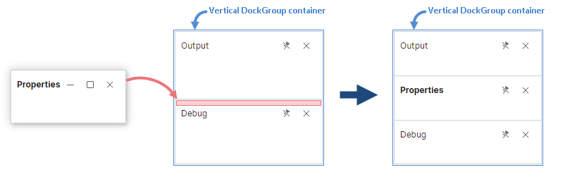
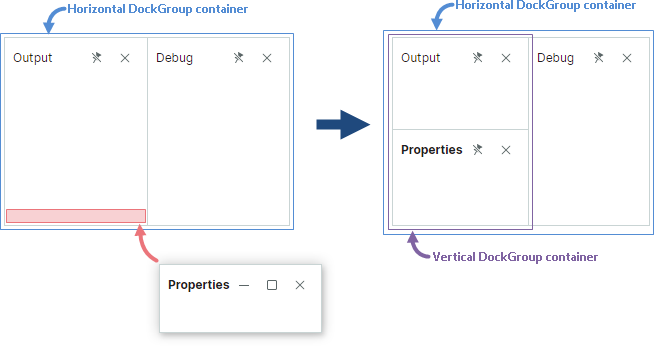
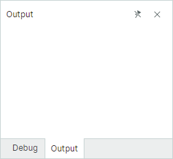

# Perform Dock Operations in Code

This topic describes operations on dock panels in code behind.

## Create Dock Panels

You can create `DockPane` and `DocumentPane` objects using their constructors. After a panel is created you typically need to display it at a specific position relative to another panel or [container (group)](dock-panes-and-containers.md). The `DockManager.Dock` method allows you to dock a panel along an edge of another panel, add a panel to an existing container, and combine panels in a tabbed UI. To add a panel as a child of an existing container, you can also use the container's `Add` method.


The most frequently used overload of the `DockManager.Dock` method is defined as follows:

``` cs
public bool Dock(DockItemBase item, DockItemBase target, DockType dockType)
```

The `target` parameter specifies the panel or container relative to which the source item (passed as the `item` parameter) is docked.

The `dockType` parameter specifies how to dock an item relative to the target item:

- `DockType.Fill` — The source and target panels are combined in a tab container (`TabGroup`). If the target panel already belongs to a tab container, the source panel is added to this container; no extra tab container is created.

- `DockType.Left`, `DockType.Right`, `DockType.Top`, `DockType.Bottom` — A source dock item is docked at the corresponding side of a target dock item. When required, an additional horizontal or vertical split container (`DockGroup`) is created by the `DockManager.Dock` method, as described below. 

  Assume that you dock a source panel at the top or bottom of the target panel that belongs to a **vertical** split container. 
  
  ``` cs
  dockManager1.Dock(paneProperties, paneDebug, DockType.Top);
  ```

  In this case, the source panel is added as a child of the existing container. 

  
  
  If you dock a panel at the left or right of the target panel, an additional horizontal split container is created combining the source and target panels.

  ``` cs
  dockManager1.Dock(paneProperties, paneDebug, DockType.Left);
  ```

  

  The same reasoning applies when a panel is docked next to a target panel that resides in a **horizontal** split container. If you dock the source panel at the left or right of the target panel, the source panel is added as a child of the existing horizontal container. 
  
  ``` cs
  dockManager1.Dock(paneProperties, paneOutput, DockType.Right);
  ```

  

  If you dock a panel at the top or bottom of the target panel, an additional vertical split container is created combining the source and target panels.

  ``` cs
  dockManager1.Dock(paneProperties, paneOutput, DockType.Bottom);
  ```

  
  
  Use the `DockPane.DockWidth` and `DockPane.DockHeight` properties to set size of panels when they are hosted in a split container.


### Example - Create and Display Panels Side-by-side

The following code creates `DockPane` and `DocumentPane` objects and arranges them as shown in the image below. The `DocumentPane` objects are placed in a `DocumentGroup` container to present them as tabs.


``` cs
DockPane paneProperties = new DockPane()
{
    Header = "Properties",
    Glyph = ImageLoader.LoadSvgImage(Assembly.GetExecutingAssembly(), "Images/settings.svg"),
    GlyphSize = new Avalonia.Size(16, 16)
};
DockPane paneDebug = new DockPane()
{
    Header = "Debug",
    Glyph = ImageLoader.LoadSvgImage(Assembly.GetExecutingAssembly(), "Images/debug2.svg"),
    GlyphSize = new Avalonia.Size(16, 16)
};
DockPane paneOutput = new DockPane() { Header = "Output" };

dockManager1.Root = new DockGroup();
dockManager1.Dock(paneProperties, dockManager1.Root, DockType.Right);
paneProperties.DockWidth = new GridLength(150, GridUnitType.Pixel);

dockManager1.Dock(paneOutput, paneProperties, DockType.Left);
dockManager1.Dock(paneDebug, paneOutput, DockType.Bottom);
paneDebug.DockHeight = new GridLength(150, GridUnitType.Pixel);

```


See also:

- [Manage Auto-Hide Panels](#manage-auto-hide-panels)
- [Manage Floating Panels](#manage-floating-panels)

More examples: 

- [How to Create a Complex Docking Layout in Code Behind](examples/how-to-create-a-complex-docking-layout-in-code-behind.md)

### Access a Dock Item's Parent and Children

The `DockPane.DockParent` property allows you to return the immediate parent of any dock item (panel or container). For instance, when a panel resides in a split container (`DockGroup`), the `DockPane.DockParent` returns this split container. For panels combined in a tab container, the `DockPane.DockParent` returns this parent tab container (a `TabbedGroup` or `DocumentGroup` object).

To get immediate children of a dock container, use its `Items` property.

See also: [Access Dock Panels and Containers](#access-dock-panels-and-containers).

#### Example - Access a Parent and Set Its Size

The following code creates a docking UI that consists of three panels. The example sets the relative width for the 'Properties' panel and the vertical split container that combines the 'Output' and 'Debug' panels.


``` cs
DockPane paneProperties = new DockPane() { Header = "Properties" };
DockPane paneDebug = new DockPane() { Header = "Debug" };
DockPane paneOutput = new DockPane() { Header = "Output" };

dockManager1.Root = new DockGroup();
dockManager1.Root.Add(paneProperties);
dockManager1.Dock(paneDebug, paneProperties, DockType.Right);
dockManager1.Dock(paneOutput, paneDebug, DockType.Top);
paneProperties.DockWidth = new GridLength(1, GridUnitType.Star);
paneDebug.DockParent.DockWidth = new GridLength(2, GridUnitType.Star);
```


## Close Panels

The `DockManager.Close` method allows you to temporarily hide a panel or container. This method is called when a user closes a panel by clicking its 'Close' ('x') button.


When called for a container (group), the `Close` method hides all panes of this container.

Closed panels can be accessed from the `DockManager.ClosedPanes` collection.

Use the `DockPane.AllowClose` property to hide the 'Close' button for a panel, and thus prevent the panel from being closed using this button. This option does not prevent a panel from being closed with the `DockManager.Close` method.

When a panel is closed, the `DockPane.CloseCommand` command is activated.

## Remove Panels

You can use the `DockManager.Remove` method to remove a panel from a `DockManager`. This method does not dispose of the panel and its content.

`DockManager` does not store references to removed panels.

## Combine Panels in a Tab Container

You can combine panels in a tab container (`TabGroup`). For this purpose, use the following `DockManager.Dock` method overload:

``` cs
public bool Dock(DockItemBase item, DockItemBase target, DockType dockType)
```

The `target` parameter can be a panel or an existing tab container. 

The `dockType` parameter specifies how to dock a panel. Set this parameter to `DockType.Fill` to combine panels in a tabbed UI.

When you dock a `DockPane` object into another `DockPane` object, a `TabGroup` container is created. A `DocumentGroup` container is created when you dock a `DocumentPane` into another `DocumentPane` object.

You can also use a tab container's `Add` method to add a new item as a tab.

### Example - Create a Tab Container

The following code uses the `DockManager.Dock` method to create a tab container from two panels.



``` cs
dockManager1.Root = new DockGroup();
DockPane paneDebug = new DockPane() 
{ 
    Header = "Debug", 
    DockWidth = new GridLength(250, GridUnitType.Pixel) 
};
dockManager1.Root.Add(paneDebug);
DockPane paneOutput = new DockPane() { Header = "Output" };
dockManager1.Dock(paneOutput, paneDebug, DockType.Fill);
```

### Access the Tab Container

To obtain a parent tab container for a pane, use the pane's `DockParent` property.

See also: [Access Dock Panels and Containers](#access-dock-panels-and-containers).

## Manage Auto-Hide Panels

Auto-hide panels are initially collapsed. A user can click a panel's button to expand the panel.


### Create Auto-Hide Panel

Use the `DockManager.AutoHide` method to enable the auto-hide functionality for a panel in code-behind. This method hides a panel at its current or previous dock position.

``` cs
dockManager1.AutoHide(paneOutput);
```

When a panel is about to become auto-hidden, an `AutoHideGroup` container is created, and the panel is moved to this container.

You can call the `DockManager.AutoHide` method for a `TabGroup` container. In this case, all panels of the tab container become auto-hidden.

#### Example - Auto-Hide Tab Containers

The following code creates two tab containers at the right edge of the `DockManager`, and then enables the auto-hide functionality for these tab containers. Two `AutoHideGroup` containers are created as a result, each displaying panels from a corresponding tab container.


``` cs
dockManager1.Root = new DockGroup();
dockManager1.Root.Add(new DocumentGroup());
DockPane paneDebug = new DockPane() { Header = "Debug" };
dockManager1.Root.Add(paneDebug);
DockPane paneOutput = new DockPane() { Header = "Output" };
// Create a tab container that combines the 'Debug' and 'Output' panels
dockManager1.Dock(paneOutput, paneDebug, DockType.Fill);

DockPane paneTasks = new DockPane() { Header = "Tasks" };
dockManager1.Root.Add(paneTasks);
DockPane paneExplorer = new DockPane() { Header = "Explorer" };
//Create a tab container that combines the 'Tasks' and 'Explorer' panels
dockManager1.Dock(paneExplorer, paneTasks, DockType.Fill);

//Auto-hide the tab containers
dockManager1.AutoHide(paneDebug.DockParent);
dockManager1.AutoHide(paneTasks.DockParent);
```


### Restore a Panel from the Auto-Hidden State

Use the `DockManager.Dock(DockItemBase item)` method overload to restore a panel from the auto-hidden state to its previous dock position.

``` cs
dockManager1.Dock(paneOutput);
```

You can also use the `Dock(DockItemBase item, DockItemBase target, DockType dockType)` overload to restore an auto-hidden panel while moving it to a specific position in a layout.

``` cs
dockManager1.Dock(paneOutput, paneDebug, DockType.Right););
```

### Show and Collapse an Auto-Hide Panel

The `DockManager.ExpandAutoHidePanel` and `DockManager.CollapseAutoHidePanel` methods allow you to display and collapse an auto-hide panel. The `DockPane.IsActive` property allows you to focus any panel. For an auto-hide panel, this property expands the panel (if it is collapsed), and then focuses it.

### Access Auto-Hide Panels

You can use the `DockManager.AutoHideGroups` collection to access all existing `AutoHideGroup` containers. The `AutoHideGroup.Items` property allows you to retrieve all auto-hide panels displayed in a specific container.

To retrieve a parent container for an auto-hide panel, see the `DockPane.AutoHideGroup` property.

See also: [Access Dock Panels and Containers](#access-dock-panels-and-containers).

## Manage Floating Panels


### Create Floating Panels

Use the `DockManager.Float` method to make a panel floating in code-behind. When you make a panel floating, it is moved to a `FloatGroup` container (a floating window). A floating panel's `DockPane.FloatGroup` property allows you to access the parent floating window, and set its bounds (see `FloatGroup.FloatLocation`, `FloatGroup.FloatWidth` and `FloatGroup.FloatHeight`).


``` cs
DockPane paneTasks = new DockPane() { Header = "Tasks" };
dockManager1.Float(paneTasks);
// Set the floating window's bounds
paneTasks.FloatGroup.FloatLocation = new Avalonia.PixelPoint(200, 200);
paneTasks.FloatGroup.FloatWidth = 300;
paneTasks.FloatGroup.FloatHeight = 200;
```

If a panel is floating, you can dock another panel next to it, and thus create a floating container.


``` cs
DockPane paneTasks = new DockPane() { Header = "Tasks" };
dockManager1.Float(paneTasks);
DockPane paneExplorer = new DockPane() { Header = "Explorer" };
dockManager1.Dock(paneExplorer, paneTasks, DockType.Right);
```

### Access Floating Panels

The `DockManager.FloatGroups` collection allows you to retrieve existing floating windows (`FloatGroup` objects). Use the `FloatGroup.Items` property to obtain a list of panels displayed in each floating window.

See also: [Access Dock Panels and Containers](#access-dock-panels-and-containers).

## Access Dock Panels and Containers

The following list summarizes properties and methods you can use to access dock panels and groups (containers).

- DockManager's `GetItems` extension method — Returns a linear list of all docked, auto-hidden and closed panels and groups.
- DockManager's `FindItem` extension method — Returns an item by name.
- `DockGroup.Items` — Gets a list of a container's immediate children.
- `DockPane.DockParent` — Gets a dock item's immediate parent.
- `DockPane.FloatGroup` — Returns the floating window that hosts a panel in the floating state. 
- `DockPane.AutoHideGroup` — Returns the `AutoHideGroup` container that hosts a panel in the auto-hidden state. 
- `DockManager.Root` — Returns the root group (container) that displays all docked panels and containers.
- `DockManager.FloatGroups` — Gets a collection of existing `FloatGroup` objects (floating windows).
- `DockManager.AutoHideGroups` — Gets a collection of existing `AutoHideGroup` objects.
- `DockManager.ClosedPanes` — Returns a collection of closed panels.


## Control Dock Operations

If you need flexible control over dock operations performed by users, you can handle the following events:

- `DockManager.DockOperationStarting` — Fires when a dock operation is about to start.

- `DockManager.DockOperationCompleted` — Fires after a dock operation is complete.

- `DockManager.DockItemActivated` — Fires after a dock item is activated.

- `DockManager.DockItemStartFloatDragging` — Fires when a panel becomes floating, or a floating window is about to be moved.

- `DockManager.DockItemEndFloatDragging` — Fires after a floating window's dragging is complete.

### Example - Prevent a Panel from Being Closed

The following `DockManager.DockOperationStarting` event handler does not allow the 'Output' panel to be closed when a user clicks the panel's 'Close' ('x') button.

``` cs
private void DockManager1_DockOperationStarting(object? sender, DockOperationStartingEventArgs e)
{
    if(e.Item is DockPane pane)
    {
        e.Cancel = e.DockOperation == DockOperation.Close && pane.Header == "Output";
    }
    
}
```