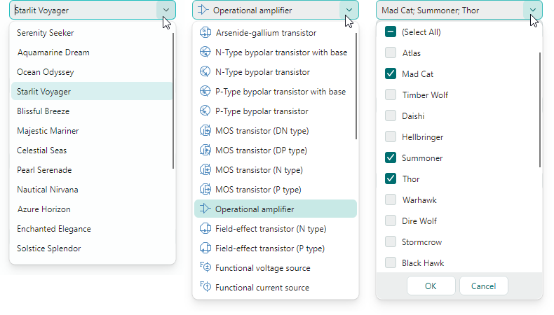
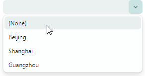
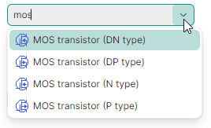

# ComboBoxEditor

The `ComboBoxEditor` control is a control that displays a list of items in its dropdown window. A user can select one or multiple items at a time according to the control's selection mode.



The control's main features include:

- Displaying values from a list of strings, list of business objects, or an enumeration type.
- Single and multiple item selection modes.
- Auto-completion feature.
- Text editing in the edit box in single item selection mode.
- Item templates allow you to render items in a custom manner.
- Use of the control as an in-place editor within container controls (for instance, TreeList, TreeView, and PropertyGrid).

## Specify the Items Source

Use the `ComboBoxEditor.ItemsSource` property to specify a list of items to be displayed in the dropdown. You can bind the editor to a list of strings, list of business objects, or an enumeration type.

## Bind to a List of Strings

The simplest items source is a list of strings.

A user can select one or multiple values according to the current selection mode (see below).
If text editing is enabled in the edit box (see `IsTextEditable`), a user can enter text that does not match any item in the dropdown list.

### Example - How to bind to a String list
The following example populates `ComboBoxEditor` with a list of strings.

``` xml
xmlns:mxe="https://schemas.eremexcontrols.net/avalonia/editors"
xmlns:sys="clr-namespace:System;assembly=mscorlib"
xmlns:local="clr-namespace:ComboBoxTestSample"

<mxe:ComboBoxEditor x:Name="myComboBox1">
    <mxe:ComboBoxEditor.ItemsSource>
        <local:MyItemList>
            <sys:String>Moscow</sys:String>
            <sys:String>Kazan</sys:String>
            <sys:String>Tver</sys:String>
        </local:MyItemList>
    </mxe:ComboBoxEditor.ItemsSource>
</mxe:ComboBoxEditor>
```
``` csharp
public class MyItemList : List<string>
{
}
```

## Bind to a List of Business Objects

You can bind a `ComboBoxEditor` to a list of business objects. In this case, the control's default behavior is as follows:

- A business object's `ToString` method specifies the default text representation of items.
- When you select an item, the editor's value (`ComboBoxEditor.EditorValue`) is set to the corresponding business object.

A typical business object has multiple properties. You can specify which business object properties supply item display text and edit values. Use the following API members for this purpose:

- `ComboBoxEditor.DisplayMember` - Gets or sets the name of the business object's property that specifies item display text. 
- `ComboBoxEditor.ValueMember` - Gets or sets the name of the business object's property that specifies item values. When you select an item, the editor's value (`ComboBoxEditor.EditorValue`) is set to the item's `ValueMember` property value. 

### Example - How to bind to a Business Object list

The following example binds a `ComboBoxEditor` to a list of _Product_ business objects. The _Product.ProductName_ property specifies item display text. The _Product.ProductID_ property specifies item values.

``` xml
xmlns:mxe="https://schemas.eremexcontrols.net/avalonia/editors"
xmlns:local="clr-namespace:ComboBoxTestSample"

<Window.DataContext>
    <local:MainViewModel/>
</Window.DataContext>

<mxe:ComboBoxEditor
    x:Name="myComboBox2"
    ItemsSource="{Binding Products}"
    DisplayMember="ProductName"
    ValueMember="ProductID"
    SelectionMode="Multiple"
/>
```
``` csharp
public MainViewModel()
{
    Products = new ObservableCollection<Product>();
    //...
}

public partial class Product :ObservableObject
{
    public Product(int productID, string productName, string category, int productPrice)
    {
        ProductID = productID;
        ProductName = productName;
        Category = category;
        ProductPrice = productPrice;
    }

    [ObservableProperty]
    public int productID;

    [ObservableProperty]
    public string productName;

    [ObservableProperty]
    public string category;

    [ObservableProperty]
    public decimal productPrice;
}
```

## Bind to an Enumeration

A ComboBoxEditor can display values of an enumeration type in the dropdown. 

The `Eremex.AvaloniaUI.Controls.Common.EnumItemsSource` helper class facilitates binding to an enumeration. Its main features include:

- Images for enumeration members in the dropdown. Apply the `Eremex.AvaloniaUI.Controls.Common.ImageAttribute` attribute to the target enumeration members to specify images.
- Custom display names for enumeration members. Use the `System.ComponentModel.DataAnnotations.DisplayAttribute` attribute or custom converter to change the default item display text.
- Tooltips for dropdown items. A tooltip contains a target item's description that you can supply with the `System.ComponentModel.DataAnnotations.DisplayAttribute` attribute or custom converter.

Use the following `EnumItemsSource` properties to set up binding to an enumeration type:

- `EnumItemsSource.EnumType` — Specifies the enumeration type whose values are displayed in the ComboBoxEditor.
- `EnumItemsSource.ShowImages` — Specifies whether to display images for enumeration members in the dropdown. You can supply images using the `Eremex.AvaloniaUI.Controls.Common.ImageAttribute` attribute.
- `EnumItemsSource.ShowNames` — Specifies whether to display item text. Set `ShowNames` to `false` and `ShowImages` to `true` to render enumeration members using images without text.
- `EnumItemsSource.ImageSize` — Specifies the display size of images assigned to enumeration members.
- `EnumItemsSource.NameToDisplayTextConverter` — Allows you to assign a converter that retrieves custom display text for enumeration members.
- `EnumItemsSource.NameToDescriptionConverter` — Allows you to assign a converter that retrieves enumeration member descriptions, which are displayed as tooltips when a user hovers the mouse over dropdown items.

### Example - How to display enumeration values, and use attributes to supply display text and images for enumeration members.

The following example displays values of a _ProductCategoryEnum_ enumeration in a ComboBoxEditor. It uses the `EnumItemsSource` class for data binding.

The `System.ComponentModel.DataAnnotations.DisplayAttribute` and `Eremex.AvaloniaUI.Controls.Common.ImageAttribute` attributes specify custom display text, descriptions (tooltips) and images for the enumeration members.

``` xml
xmlns:mx="https://schemas.eremexcontrols.net/avalonia"
xmlns:mxe="https://schemas.eremexcontrols.net/avalonia/editors"

<mxe:ComboBoxEditor Name="comboBoxEditorEnum"
 ItemsSource="{mx:EnumItemsSource 
  EnumType=local:ProductCategoryEnum, ImageSize='16, 16', 
  ShowImages=True, ShowNames=True}"
 IsTextEditable="True"
 AutoComplete="True">
</mxe:ComboBoxEditor>
```
``` csharp
using Eremex.AvaloniaUI.Controls.Common;
using System.ComponentModel.DataAnnotations;

public enum ProductCategoryEnum
{
    // The images assigned to the enumeration values below are placed 
    // in the ComboBoxTestSample/Images folder.
    // They have their "Build Action" properties set to "AvaloniaResource".
    [Image($"avares://ComboBoxTestSample/Images/Products/DairyProducts.svg")]
    [Display(Name = "Dairy Products", Description = "Products made from milk")]
    DairyProducts,

    [Image($"avares://ComboBoxTestSample/Images/Products/Beverages.svg")]
    [Display(Description = "Edible drinks")]
    Beverages,

    [Image($"avares://ComboBoxTestSample/Images/Products/Condiments.svg")]
    [Display(Description = "Flavor Enhancers")]
    Condiments,

    [Image($"avares://ComboBoxTestSample/Images/Products/Confections.svg")]
    [Display(Description = "Sweets")]
    Confections
}
```

### Example - How to display enumeration values, and use custom converters to supply display text for enumeration members.

The following example uses the `EnumItemsSource` class to display values of an enumeration type in a ComboBoxEditor. The `EnumItemsSource.NameToDisplayTextConverter` and `EnumItemsSource.NameToDescriptionConverter` objects supply custom display text and descriptions (tooltips) for enumeration members.

``` xml
xmlns:mxe="https://schemas.eremexcontrols.net/avalonia/editors"
xmlns:mx="https://schemas.eremexcontrols.net/avalonia"
xmlns:local="clr-namespace:ComboBoxTestSample"

<mxe:ComboBoxEditor Name="comboBoxEditorEnumWithConverters"
 ItemsSource="{mx:EnumItemsSource EnumType=local:ProductCategoryEnum, 
  ImageSize='16, 16', ShowImages=True, ShowNames=True, 
  NameToDisplayTextConverter={local:EnumMemberNameToDisplayTextConverter}, 
  NameToDescriptionConverter={local:EnumMemberNameToDescriptionConverter}}"
 IsTextEditable="True"
 AutoComplete="True">
</mxe:ComboBoxEditor>
```

``` csharp
using Eremex.AvaloniaUI.Controls.Common;

public enum ProductCategoryEnum
{
    // The images assigned to the enumeration values below are placed 
    // in the ComboBoxTestSample/Images folder.
    // They have their "Build Action" properties set to "AvaloniaResource".
    [Image($"avares://ComboBoxTestSample/Images/Products/DairyProducts.svg")]
    DairyProducts,

    [Image($"avares://ComboBoxTestSample/Images/Products/Beverages.svg")]
    Beverages,

    [Image($"avares://ComboBoxTestSample/Images/Products/Condiments.svg")]
    Condiments,

    [Image($"avares://ComboBoxTestSample/Images/Products/Confections.svg")]
    Confections
}

public class EnumMemberNameToDisplayTextConverter : BaseEnumConverter
{
    protected override void PopulateDictionary()
    {
        TextValueDictionary.Add("ProductCategoryEnum_DairyProducts", "Dairy");
    }
}
public class EnumMemberNameToDescriptionConverter : BaseEnumConverter
{
    protected override void PopulateDictionary()
    {
        TextValueDictionary.Add("ProductCategoryEnum_DairyProducts", "Milk Products");
    }
}

public abstract class BaseEnumConverter : MarkupExtension, IValueConverter
{
    protected Dictionary<string, string> TextValueDictionary;

    public BaseEnumConverter()
    {
        TextValueDictionary = new Dictionary<string, string>();
        PopulateDictionary();
    }

    protected abstract void PopulateDictionary();

    public override object ProvideValue(IServiceProvider serviceProvider)
    {
        return this;
    }
    public object? Convert(object? value, Type targetType, object? parameter, 
     System.Globalization.CultureInfo culture)
    {
        var type = value?.GetType();
        var memberName = value?.ToString();
        if (type == null || !type.IsEnum || string.IsNullOrEmpty(memberName))
            return null;
        return EnumMemberToString(type.Name, memberName);
    }
        
    protected virtual string EnumMemberToString(string enumName, string enumMemberName)
    {
        string fullMemberName = enumName + "_" + enumMemberName;
        if (TextValueDictionary.ContainsKey(fullMemberName))
            return TextValueDictionary[fullMemberName];
        else 
            return enumMemberName;
    }
        
    public object? ConvertBack(object? value, Type targetType, object? parameter, 
     System.Globalization.CultureInfo culture)
    {
        return null;
    }
}
```

## Specify Item Selection Mode

The `SelectionMode` property allows you to choose between single- and multiple item selection modes. 

Single item selection mode is default. If text editing is enabled (see `IsTextEditable`), it is possible to specify the edit value (or text in the edit box) that does not match any item in the dropdown list.

Set the `SelectionMode` property to `ItemSelectionMode.Multiple` to enable item multi-selection. In multi-select mode, the editor displays check boxes before each item in the dropdown list. A user can toggle these check boxes to add and remove items to/from the selection.
Text editing is disabled in the edit box in multi-select mode.

### Get and Set Selected Item (Items)

The `SelectedItem` property allows you to select and retrieve the selected item in single selection mode. The property returns a `null` value if no item is selected.

The `SelectedItems` property specifies a list (an `IList` object) that contains selected items in multiple selection mode. The property returns an empty list if no item is selected.

!!! note

    The  `SelectedItem` and `SelectedItems` properties are in sync in the way described below.

    In single selection mode, the `SelectedItems` property specifies a list that contains one item – the selected item (the value of the `SelectedItem` property). The property returns an empty list if no item is selected.

    In multiple selection mode, the `SelectedItem` property specifies the first selected item (the first item of the `SelectedItems` list). The property returns a `null` value if no item is selected.

### Example - How to select items

The following code selects items in ComboBoxEditors that function in single- and multiple selection modes.

``` csharp
// Select an item in single selection mode
var itemSource1 = myComboBox1.ItemsSource as MyItemList;
if(itemSource1 != null) 
    myComboBox1.SelectedItem = itemSource1[0];

// Select items in multi-select mode
var itemSource2 = myComboBox2.ItemsSource as ObservableCollection<Product>;
if (itemSource2 != null)
    myComboBox2.SelectedItems = new List<Product>() 
     { itemSource2[0], itemSource2[1] };

```

### '(Select All)' Item in Multiple Selection Mode
In multiple selection mode, the editor displays the predefined _(Select All)_ check box at the top of the dropdown. This checkbox allows a user to select/deselect all items. To hide the _(Select All)_ check box, set the `ComboBoxEditor.ShowPredefinedSelectItem` property to `false`.


**Related API**
- `SelectAllItemText` — Allows you to specify custom display text for the '(Select All)' Item.

### '_(None)_' Item in Single Selection Mode

In single selection mode, you can set the `ComboBoxEditor.ShowPredefinedSelectItem` property to `true` to display the predefined _(None)_ item in the dropdown. The _(None)_ item sets the editor's value to `null` and thus clears the selection.



**Related API**
- `ClearValueItemText` — Allows you to specify custom display text for the '(None)' Item.

## Specify the Editor Value

When a user types text, selects an item in the edit box using the auto-complete feature, or picks an item in the dropdown, the editor changes its edit value (the `EditorValue` property value). 

Typically, the edit value matches the value of the `SelectedItem` property (in single selection mode) or the `SelectedItems` property (in multiple selection mode), with the exceptions described in this section.

The edit value is dependent on item selection mode. In single item selection mode, the edit value is a single value, while in multiple item selection mode, the edit value is an `IList` object that specifies a value list.

The `EditorValue` and `SelectedItem/SelectedItems` properties are not in sync in the following cases: 

- A ComboBoxEditor is bound to a list of strings, and the text specified in the edit box does not match any item in the dropdown. In this case, the `SelectedItem` property returns `null`, while the `EditorValue` property specifies the text displayed in the edit box.

    !!! tip
    
        Enable the `ComboBoxEditor.IsTextEditable` option to allow a user to edit text in the edit box.
  
    ### Example - How to set the editor value when ComboBox is bound to a string list

    The following example sets the edit value for a ComboBoxEditor that is bound to a list of strings.

    ``` xml
    xmlns:mxe="https://schemas.eremexcontrols.net/avalonia/editors"
    xmlns:sys="clr-namespace:System;assembly=mscorlib"
    xmlns:local="clr-namespace:ComboBoxTestSample"

    <mxe:ComboBoxEditor x:Name="myComboBox1">
        <mxe:ComboBoxEditor.ItemsSource>
            <local:MyItemList>
                <sys:String>Moscow</sys:String>
                <sys:String>Kazan</sys:String>
                <sys:String>Tver</sys:String>
            </local:MyItemList>
        </mxe:ComboBoxEditor.ItemsSource>
    </mxe:ComboBoxEditor>
    ```

    ``` csharp
    myComboBox1.EditorValue = "Moscow";
    //The SelectedItem property will return "Moscow" as well.

    myComboBox1.EditorValue = "Rostov";
    //The SelectedItem property will return `null`, 
    //since the edit value does not match any item in the bound list.

    //...
    public class MyItemList : List<string>
    {
    }
    ```

- A ComboBoxEditor is bound to a list of business objects, and the `ValueMember` property is set. The `ValueMember` property specifies the name of the business object's property that supplies item values. When you select an item(s), the `SelectedItem/SelectedItems` property contains the selected object(s), while the `EditorValue` property specifies the selected objects' value (values).

    ### Example - How to select an item when ComboBoxEditor is bound to a business object list

    In the following example, a ComboBoxEditor is bound to a list of _Product_ objects in multi-select mode. The `ValueMember` property refers to the _Product.ProductID_ member.
    Thus, product IDs serve as item values. When a user selects items, the `EditorValue` property is set to a list that contains correponding product IDs. The example uses the `EditorValue` property to select items in code.

    ``` xml
    xmlns:mxe="https://schemas.eremexcontrols.net/avalonia/editors"
    xmlns:sys="clr-namespace:System;assembly=mscorlib"
    xmlns:local="clr-namespace:ComboBoxTestSample"

    <mxe:ComboBoxEditor
        x:Name="myComboBox2"
        ItemsSource="{Binding Products}"
        DisplayMember="ProductName"
        ValueMember="ProductID"
        SelectionMode="Multiple"
    />
    ```
    ``` csharp
    // Select items by their product IDs:
    var itemSource2 = myComboBox2.ItemsSource as ObservableCollection<Product>;
    if(itemSource2 != null) 
        myComboBox2.EditorValue = new List<int>() 
        { itemSource2[3].ProductID, itemSource2[5].ProductID };
    //The SelectedItems property will return a list that contains 
    //two Product objects (itemSource2[3] and itemSource2[5]).

    //...
    public partial class Product :ObservableObject
    {
        public Product(int productID, string productName, string category, int productPrice)
        {
            ProductID = productID;
            ProductName = productName;
            Category = category;
            ProductPrice = productPrice;
        }

        [ObservableProperty]
        public int productID;

        [ObservableProperty]
        public string productName;

        [ObservableProperty]
        public string category;

        [ObservableProperty]
        public decimal productPrice;
    }
    ```

## Immediate Update of the Editor Value in Multiple Selection Mode

The editor's default behavior is to display the OK and Cancel buttons in its dropdown in multiple selection mode. These buttons allow users to confirm or cancel their item selection.
In this mode, the editor's value is only updated after the user presses the OK button.


The ComboBoxEditor can update its value immediately as a user checks or unchecks items in the dropdown. To activate this mode, hide the OK and Cancel buttons by setting the `PopupFooterButtons` property to `None`.

``` xml
<mxe:ComboBoxEditor x:Name="MultiSelectComboBox" 
    SelectionMode="Multiple"
    PopupFooterButtons="None"/>
```


## Specify Item Templates

A ComboBoxEditor renders each item in the dropdown list using item display text, by default. The default item display text is specified by items' `ToString` method. When the editor is bound to a business object list, you can use the `DisplayMember` property to specify the property that supplies item display text.

You can use the `ItemTemplate` property to assign a data template that presents items in the dropdown in a custom manner. For instance, a data template helps you to display images for items, as demonstrated in the example below.

Enable the `ComboBoxEditor.ApplyItemTemplateToEditBox` option to apply the specified item template (`ItemTemplate` property) to the edit box. This property is not in effect if text editing is enabled (the `IsTextEditable` option is set to `true`).

### Example - How to display images for ComboBox items using a DataTemplate

The following example uses the `ItemTemplate` property to specify a data template that displays images for ComboBox items in the dropdown list.

A ComboBoxEditor is bound to a list that stores _Product_ objects. The _Product_ object contains the _Category_ property that specifies a product category (Beverages, Condiments, Seafood, or Produce).

It is assumed that the project stores SVG images for the product categories in the "_ComboBoxTestSample/Images/Products_" folder. The images have the following names: "_Beverages.svg_", "_Condiments.svg_", "_Seafood.svg_" and "_Produce.svg_", and they are marked with the "_AvaloniaResource_" flag.

The created item data template displays a product name and an image that corresponds to the product's category.

``` xml
xmlns:mxe="https://schemas.eremexcontrols.net/avalonia/editors"
xmlns:sys="clr-namespace:System;assembly=mscorlib"
xmlns:local="clr-namespace:ComboBoxTestSample"

<Window.DataContext>
    <local:MainViewModel/>
</Window.DataContext>
<Window.Resources>
    <local:NameToSvgConverter x:Key="NameToSvgConverter"/>
    <DataTemplate x:Key="ProductItemTemplate">
        <Grid>
            <Grid.ColumnDefinitions>
                <ColumnDefinition Width="Auto"/>
                <ColumnDefinition Width="*"/>
            </Grid.ColumnDefinitions>
            <Image Width="16" Height="16" Source="{Binding Path=Category, 
             Converter={StaticResource NameToSvgConverter}}"/>
            <TextBlock VerticalAlignment="Center" Grid.Column="1" Margin="6,0,0,0" 
             Text="{Binding Path=ProductName}"/>
        </Grid>
    </DataTemplate>
</Window.Resources>

<mxe:ComboBoxEditor
    x:Name="myComboBox2"
    ItemsSource="{Binding Products}"
    DisplayMember="ProductName"
    ValueMember="ProductID"
    SelectionMode="Multiple"
    ItemTemplate="{StaticResource ProductItemTemplate}"
/>
```

```csharp
using Avalonia.Svg.Skia;
using Eremex.AvaloniaUI.Controls.Utils;

public partial class MainViewModel : ViewModelBase
{
    [ObservableProperty]
    public ObservableCollection<Product> products;

    public MainViewModel()
    {
        Products = new ObservableCollection<Product>();
        Products.Add(new Product(0, "Chai", "Beverages", 200));
        Products.Add(new Product(1, "Chang", "Beverages", 100));
        Products.Add(new Product(2, "Aniseed Syrup", "Condiments", 150));
        Products.Add(new Product(3, "Ikura", "Seafood", 500));
        Products.Add(new Product(4, "Konbu", "Seafood", 390));
        Products.Add(new Product(5, "Tofu", "Produce", 430));
    }
}

public partial class Product :ObservableObject
{
    public Product(int productID, string productName, string category, int productPrice)
    {
        ProductID = productID;
        ProductName = productName;
        Category = category;
        ProductPrice = productPrice;
    }

    [ObservableProperty]
    public int productID;

    [ObservableProperty]
    public string productName;

    [ObservableProperty]
    public string category;

    [ObservableProperty]
    public decimal productPrice;
}

public class NameToSvgConverter : MarkupExtension, IValueConverter
{
    public object? Convert(object? value, Type targetType, object? parameter, 
     CultureInfo culture)
    {
        if(value == null) 
            return null;
        string name = value.ToString();

        return ImageLoader.LoadSvgImage(Assembly.GetExecutingAssembly(), $"Images/Products/{name}.svg");
    }

    public object? ConvertBack(object? value, Type targetType, object? parameter, 
     CultureInfo culture)
    {
        throw new NotImplementedException();
    }

    public override object ProvideValue(IServiceProvider serviceProvider)
    {
        return this;
    }
}
```

## Add Custom Buttons

The ComboBoxEditor is a ButtonEditor control descendant. Thus, you can add custom buttons to the edit box next to the default dropdown button. Use the `ComboBoxEditor.Buttons` collection to add custom buttons.

### Example - How to add custom buttons

The following example adds a regular button and check button to a ComboBoxEditor. The editor is bound to a _ProductCategoryEnum_ enumeration using the `EnumItemsSource` helper class.

The first button is regular (its `ButtonKind` property is set to `Simple`). A click on this button invokes the _ResetValue_ command that sets the editor's value to a default value (the first element of the bound enumeration type).

The second button is a check button (its `ButtonKind` property is set to `Toggle`). A click on this button toggles the editor's `IsTextEditable` property value. The _LockedStateToSvgNameConverter_ converter assigns the "_locked.svg_" or "_unlocked.svg_" image to the button's glyph according to the button's check state. These images are stored in the _ComboBoxTestSample/Images_ folder and are marked with the "_AvaloniaResource_" flag.

``` xml
xmlns:mxe="https://schemas.eremexcontrols.net/avalonia/editors"
xmlns:mx="https://schemas.eremexcontrols.net/avalonia"
xmlns:local="clr-namespace:ComboBoxTestSample"

<mxe:ComboBoxEditor Name="comboBoxEditorEnum"
 ItemsSource="{mx:EnumItemsSource EnumType=local:ProductCategoryEnum, 
  ImageSize='16, 16', ShowImages=True, ShowNames=True}"
 IsTextEditable="True"
 AutoComplete="True">
    <mxe:ComboBoxEditor.Buttons>
        <mxe:ButtonSettings ButtonKind="Simple" 
         Glyph="{SvgImage 'avares://ComboBoxTestSample/Images/square_dot_icon.svg'}"
         Command="{Binding ResetValueCommand}" 
         CommandParameter="{Binding #comboBoxEditorEnum}">
        </mxe:ButtonSettings>
        <mxe:ButtonSettings ButtonKind="Toggle" 
         Glyph="{Binding $self.IsChecked, Converter={local:LockedStateToSvgNameConverter}}" 
         IsChecked="{Binding !$parent.IsTextEditable}">
        </mxe:ButtonSettings>
    </mxe:ComboBoxEditor.Buttons>
</mxe:ComboBoxEditor>
```

```csharp
using CommunityToolkit.Mvvm.Input;
using Eremex.AvaloniaUI.Controls.Editors;
using Avalonia.Svg.Skia;
using Eremex.AvaloniaUI.Controls.Utils;

public partial class MainViewModel : ViewModelBase
{
    // Sets the editor's value to the first element.
    [RelayCommand]
    void ResetValue(ComboBoxEditor editor)
    {
        // Get the first item in the ComboBoxEditor's bound list.
        var enumerator = editor.ItemsSource.GetEnumerator();
        enumerator.MoveNext();
        object firstItem = enumerator.Current;
        // When the ComboBoxEditor is bound to an EnumItemsSource, 
        // the editor's items are EnumMemberInfo objects.
        EnumMemberInfo mInfo = firstItem as EnumMemberInfo;
        if (mInfo != null)
            editor.EditorValue = mInfo.Id;
    }
}

public class LockedStateToSvgNameConverter : MarkupExtension, IValueConverter
{
    public object? Convert(object? value, Type targetType, object? parameter, 
    CultureInfo culture)
    {
        if (value == null)
            return null;
        bool isLocked = (bool)value;
        string lockedState = isLocked ? "locked" : "unlocked";

        if (isLocked)
            lockedState = "locked";

        return ImageLoader.LoadSvgImage(Assembly.GetExecutingAssembly(), $"Images/{lockedState}.svg");
    }

    public object? ConvertBack(object? value, Type targetType, object? parameter, 
     CultureInfo culture)
    {
        throw new NotImplementedException();
    }

    public override object ProvideValue(IServiceProvider serviceProvider)
    {
        return this;
    }
}

public enum ProductCategoryEnum
{
    [Image($"avares://ComboBoxTestSample/Images/Products/DairyProducts.svg")]
    [Display(Name = "Dairy Products", Description = "Products made from milk")]
    DairyProducts,

    [Image($"avares://ComboBoxTestSample/Images/Products/Beverages.svg")]
    [Display(Description = "Edible drinks")]
    Beverages,

    [Image($"avares://ComboBoxTestSample/Images/Products/Condiments.svg")]
    [Display(Description = "Flavor Enhancers")]
    Condiments,

    [Image($"avares://ComboBoxTestSample/Images/Products/Confections.svg")]
    [Display(Description = "Sweets")]
    Confections
}
```


## Text Auto-Completion 

Set the `AutoComplete` option to `true` to enable text automatic completion. This feature automatically completes text typed by users if it matches any item in the dropdown list.

The ComboBoxEditor does not support text auto-completion in the following cases:

- Text editing is disabled (the `IsTextEditable` property is set to `false`).
- Multiple item selection mode is used (the `SelectionMode` property is set to `Multiple`).

## Auto-Filter

If the [auto-completion feature](#text-auto-completion) is disabled, the ComboBox editor uses the automatic filtering mechanism to filter items in the dropdown list to match the text a user types in the editor. 



The `FilterCondition` property specifies the filter operator (`StartsWith` or `Contains`) used to filter items.

The following example applies the `Contains` filter to the editor.


``` xml
<mxe:ComboBoxEditor x:Name="comboBox1" FilterCondition="Contains" .../>
```

You can handle the `FilterItem` event to custom filter items during automatic filtering. This event fires repeatedly, for each item in the dropdown list. The event's arguments allow you to identify combobox items and specify their visibility.

- `e.Item` — The object that represents the currently processed item.
- `e.SearchText` — The text typed by a user in the edit box used for automatic item filtering.
- `e.IsVisible` — The visibility of the item in the dropdown list.

The following `FilterItem` event handler custom filters items in the `ComboBoxEditor` control by searching in the _MyBusinessObject.InvoiceID_ field of combobox items.

``` cs
void ComboBox1_FilterItem(object sender, Eremex.AvaloniaUI.Controls.Editors.ComboBoxFilterEventArgs e)
{
    var invID = (e.Item as MyBusinessObject)!.InvoiceID;
    e.IsVisible = invID == null || string.IsNullOrEmpty(e.SearchText) ? 
      false : invID.Contains(e.SearchText!.Substring(0, 3));
}
```

## Prevent Popups in Read-only Editors

In read-only mode, the default behavior of any popup editor is to allow users to open the editor's dropdown. However, they cannot modify values through either the edit box or dropdown. To disable popups for read-only editors, set the `ShowPopupIfReadOnly` property to `false`.

## Prevent Popups From Opening and Closing

You can handle the following inherited events to cancel popup opening and closing operations:

- `PopupEditor.PopupOpening` — Fires when a popup is about to be created. 
- `PopupEditor.PopupClosing` — Fires when the popup is about to be closed. 

These events provide the `e.Cancel` parameter. Set it to `true` to cancel the current operation.

## Customize the Popup When It Appears

Handle the following inherited event to modify the popup or its nested controls:

- `PopupEditor.PopupOpened` — Fires after the popup has been created and immediately before it is displayed. This is a notification event. It does not allow you to cancel popup opening. Handle the `PopupOpened` event to customize the popup or its child controls.

When handling the `PopupEditor.PopupOpened` event, use the editor's `PopupContent` property to safely access the control inside the editor's popup. The `PopupOpened` event ensures that the popup control exists when you access it. For the ComboBoxEditor control, the `PopupContent` property returns an instance of the `ComboBoxPopupControl` class. 

## Respond to Popup Closing

Use the following inherited event to perform actions after the popup has been closed:

- `PopupEditor.PopupClosed` — Fires immediately after the popup has been closed. This is a notification event. It does not allow you to cancel popup closing.
