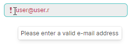
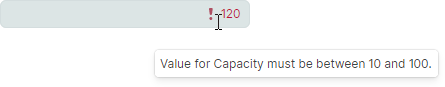

# Data Validation

Eremex editors support the following approaches to data validation, which maintain correct data input, value checking and displaying errors for invalid data:

- [Masks](masks/index.md) — Allow you to specify a pattern that restricts data input by users in text editors. 
- Data validation at the editor level, using the `BaseEditor.Validate` event.
- Data validation at the bound object level, using the `DataAnnotation` attributes and `INotifyDataErrorInfo` interface.

<!-- TODO
 and `IDataErrorInfo` interface. -->

This topic provides more details on data validation in Eremex editors.

To learn about data validation in container controls, see the following topic:

<!--TODO
 - [DataGrid - Data Validation](../datagrid/data-validation.md) -->
- [TreeList - Data Validation](../treelist/data-validation.md)

## Automatic Validation

Eremex editors support automatic validation of values that a user enters. The automatic validation checks an editor's value against a [mask](masks/index.md), if any. If the editor is bound to a property, the validation mechanism also does the following:

- Checks `DataAnnotation` valdation attributes applied to the property.
- Checks errors created with the `INotifyDataErrorInfo` interface.
- Checks whether the entered value can be converted to the data type of the bound property. 


Data validation is invoked in the following cases:

- An editor's value is updated in code.
- When an editor is about to lose focus.
- A user types any character, provided that the `BaseEdit.ValidateOnInput` property is set to `true` (default value).
- A user presses the `Enter` key, provided that the `BaseEdit.ValidateOnInput` option is set to `false`.


<!-- TODO
IsModified property is missing?
Why ValidateOnInput is true by default?
 -->

### Force Data Validation

In specific cases, you may want to forcibly invoke the validation mechanism for an editor. Use the `BaseEditor.DoValidate` method for this purpose.

## Data Validation at the Editor Level

### 'Validate' Event

The `BaseEditor.Validate` event allows you to perform data validation at the editor level in code-behind. The following event arguments are available:

- `ValidationEventArgs.Value` — Gets the current value.
- `ValidationEventArgs.ErrorContent` — Allows you to specify an error if the current value is invalid. If you leave the `ErrorContent` property set to `null`, the current value is considered valid.

#### Example - Verify that the entered value is a valid email address

The following example handles the `BaseEditor.Validate` event to check that the string entered in a Text Editor is a valid email address. The `ValidateOnInput` option set to `true` ensures that the validation is invoked whenever a character is pressed.



``` xml
<mxe:TextEditor x:Name="textEditor3" 
                ValidateOnInput="true"
                Validate="textEditorValidate"/>

```
``` csharp
private void textEditorValidate(object sender, Eremex.AvaloniaUI.Controls.Editors.ValidationEventArgs e)
{
    if(e.Value == null || !IsEmailAddress(e.Value.ToString()))
    {
        e.ErrorContent = "Please enter a valid e-mail address";
    }
}

bool IsEmailAddress(string email)
{
    Regex regex = new Regex(@"^([\w\.\-]+)@([\w\-]+)((\.(\w){2,3})+)$");
    Match match = regex.Match(email);
    return match.Success;
}
```

## Data Validation at the Bound Object Level


### Data Validation Using DataAnnotation Attributes

You can use `DataAnnotations` validation attributes (`System.ComponentModel.DataAnnotations.ValidationAttribute` descendants) to create a validation rule for a business object's property. When bound to this property, an Eremex editor automatically checks the data validity rule specified by this attribute.

The list below shows most common validation attributes:

- [`CompareAttribute`](https://learn.microsoft.com/en-us/dotnet/api/system.componentmodel.dataannotations.compareattribute?view=net-7.0) — Provides an attribute that compares two properties.
- [`CustomValidationAttribute`](https://learn.microsoft.com/en-us/dotnet/api/system.componentmodel.dataannotations.customvalidationattribute?view=net-7.0) — Specifies a custom validation method that is used to validate a property or class instance.
- [`MaxLengthAttribute`](https://learn.microsoft.com/en-us/dotnet/api/system.componentmodel.dataannotations.maxlengthattribute?view=net-8.0) — Specifies the maximum length of array or string data allowed in a property.
- [`MinLengthAttribute`](https://learn.microsoft.com/en-us/dotnet/api/system.componentmodel.dataannotations.minlengthattribute?view=net-8.0) — Specifies the minimum length of array or string data allowed in a property.
- [`RangeAttribute`](https://learn.microsoft.com/en-us/dotnet/api/system.componentmodel.dataannotations.rangeattribute?view=net-8.0) — Specifies the numeric range constraints for the value of a data field.
- [`RegularExpressionAttribute`](https://learn.microsoft.com/en-us/dotnet/api/system.componentmodel.dataannotations.regularexpressionattribute?view=net-8.0) — Specifies that a data field value must match the specified regular expression.
- [`RequiredAttribute`](https://learn.microsoft.com/en-us/dotnet/api/system.componentmodel.dataannotations.requiredattribute?view=net-8.0) — Specifies that a data field value is required.
- [`StringLengthAttribute`](https://learn.microsoft.com/en-us/dotnet/api/system.componentmodel.dataannotations.stringlengthattribute?view=net-8.0) — Specifies the minimum and maximum length of characters that are allowed in a data field.

#### Example - Validate using 'RangeAttribute'

The following example uses the `RangeAttribute` attribute to ensure that a property's value is in the range between 10 and 100. An editor displays an error if the value is out of this range.



``` xml
<mxe:TextEditor x:Name="textEditor1" 
    Grid.Row="1" 
    HorizontalContentAlignment="Right" 
    EditorValue="{Binding Capacity}" />
```
``` csharp
public partial class MyViewModel : ObservableObject
{
    [ObservableProperty]
    [property: Range(10, 100, ErrorMessage = "Value for {0} must be between {1} and {2}.")]
    int capacity;
}
```


### Data Validation Using 'INotifyDataErrorInfo' Interface

The `System.ComponentModel.INotifyDataErrorInfo` interface allows you to implement custom validation rules at the business object level. The interface supports synchronous and asynchronous validation, multiple errors per property, and cross-property errors.

#### Example - Implement 'INotifyDataErrorInfo' interface

The following example binds a Text Editor to the _NickName_ property defined in the _MainViewModel_ class. The _MainViewModel_ class implements the `INotifyDataErrorInfo` interface that defines three validation rules for the _NickName_ property. The Text Editor displays an error if the `INotifyDataErrorInfo.GetErrors` method returns an error(s) for the _NickName_ property.


``` xml
<mxe:TextEditor x:Name="textEditor2" EditorValue="{Binding NickName}"/>
```
``` csharp
public partial class MainViewModel : ObservableObject, INotifyDataErrorInfo
{
    private Dictionary<string, List<string>> propertyErrors = new Dictionary<string, List<string>>();

    [ObservableProperty]
    public string nickName;

    partial void OnNickNameChanged(string oldValue, string newValue)  => ValidateNickName();

    public bool HasErrors => propertyErrors.Any();

    public event EventHandler<DataErrorsChangedEventArgs> ErrorsChanged;

    public IEnumerable GetErrors(string propertyName)
    {
        if (propertyErrors.ContainsKey(propertyName))
            return propertyErrors[propertyName];
        else
            return null;
    }

    private void RaiseErrorsChanged(string propertyName)
    {
        ErrorsChanged?.Invoke(this, new DataErrorsChangedEventArgs(propertyName));
    }

    private void ValidateNickName()
    {
        ClearErrors(nameof(NickName));

        if (string.IsNullOrEmpty(NickName))
            AddError(nameof(NickName), "Nick Name cannot be empty.");
        if (string.Equals(NickName, "user", StringComparison.OrdinalIgnoreCase))
            AddError(nameof(NickName), "Invalid Nick Name: 'user'");
        if (NickName == null || NickName?.Length <= 5)
            AddError(nameof(NickName), "The string is too short");
    }

    private void AddError(string propertyName, string error)
    {
        if (!propertyErrors.ContainsKey(propertyName))
            propertyErrors[propertyName] = new List<string>();

        if (!propertyErrors[propertyName].Contains(error))
        {
            propertyErrors[propertyName].Add(error);
            RaiseErrorsChanged(propertyName);
        }
    }

    private void ClearErrors(string propertyName)
    {
        if (propertyErrors.ContainsKey(propertyName))
        {
            propertyErrors.Remove(propertyName);
            RaiseErrorsChanged(propertyName);
        }
    }

    public MainViewModel()
    {
        //...
        NickName = "user";
    }
}
```


## Indicate Errors

When an error occurs during data validation, the editor indicates the error as specified by the `BaseEditor.ErrorShowMode` property. Two error display modes are supported: 

### Show Built-in Error Icon and Tooltip

If the `ErrorShowMode` property is set to `Inplace`, an editor displays an error icon within the edit box. When a user hovers over the icon, a tooltip with an error description appears.


### Show Error Below Editor

Set the `ErrorShowMode` property to `Full` to display an error description below the edit box. The inplace error icon is hidden in this case.


### Set and Clear the Error Text

You can do one of the following to specify the error text:

- Handle the `BaseEditor.Validate` event and set the `ErrorContent` event argument. No error is applied if you leave the `ErrorContent` event argument set to `null`.

    To forcibly raise the `BaseEditor.Validate` event, call the `BaseEditor.DoValidate` method.

- Specify the error using the `BaseEditor.ValidationInfo` property.

    The following code sets an error for an editor if the editor's value is `null` or `0`.

    ``` csharp
    if(textEditor2.EditorValue == null || 
       Convert.ToInt32(textEditor2.EditorValue)==0)
    textEditor2.ValidationInfo = new ValidationInfo("Invalid value");

    ```

    Set the `BaseEditor.ValidationInfo` property to `null` to clear the error.


### Get the Error Text

Use the `BaseEditor.ErrorText` property to get the error text.


<!-- TODO
Tell about the BaseEditor.ValidationInfo property (ValidationInfo.ErrorText, Exception)
 -->

<!-- TODO
Validate Using IDataErrorInfo ?

https://docs.devexpress.com/WPF/7076/controls-and-libraries/data-editors/common-features/input-validation#validate-using-idataerrorinfo
 -->


