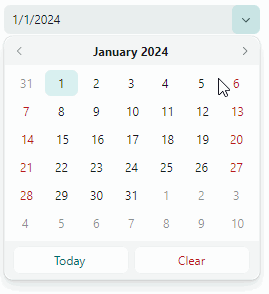

# DateEditor

The [`DateEditor`](../../API/Eremex.AvaloniaUI.Controls.Editors/DateEditor.md) control contains a dropdown calendar that allows users to select a date. The editor supports multiple display formats for the date value displayed in the edit box.


The dropdown calendar contains the navigation header used to browse through months and years. The Today and Clear buttons help users quickly select the Today's date and clear the current value, respectively.

The control's main features include:

- Date selection in the dropdown calendar with the mouse.
- Browsing through months and years using the navigation bar.
- Three calendar views: month view, year view, and year range view.
- Built-in Today and Clear buttons.
- Limiting the available date range.
- Numerous display formats for the selected date value in the edit box.


## Select a Date

A user can select a date by opening the dropdown window and picking a date in the calendar that appears.

The dropdown calendar's navigation header allows a user to browse through months and years:



In code, you can specify a date or read the currently selected date with the [`DateEditor.DateTime`](../../API/Eremex.AvaloniaUI.Controls.Editors/DateEditor/DateTime.md) or [`DateEditor.EditorValue`](../../API/Eremex.AvaloniaUI.Controls.Editors/BaseEditor/EditorValue.md) property. These properties are in sync. They differ in the value type: the [`DateTime`](../../API/Eremex.AvaloniaUI.Controls.Editors/DateEditor/DateTime.md) property is of the nullable `System.DateTime` type, while the [`EditorValue`](../../API/Eremex.AvaloniaUI.Controls.Editors/BaseEditor/EditorValue.md) property is of the `object` type as in all Eremex editors.

## Customize the Dropdown Calendar

The following properties allow you to set up a [`DateEditor`](../../API/Eremex.AvaloniaUI.Controls.Editors/DateEditor.md)'s calendar:

- [`ShowToday`](../../API/Eremex.AvaloniaUI.Controls.Editors/DateEditor/ShowToday.md) — Gets or sets whether to highlight the Today's date in the calendar. 
- [`NullValueButtonPosition`](../../API/Eremex.AvaloniaUI.Controls.Editors/ButtonEditor/NullValueButtonPosition.md) — Gets or sets whether the (_'x'_) (clear value) button is visible. 
- [`MinValue`](../../API/Eremex.AvaloniaUI.Controls.Editors/DateEditor/MinValue.md) — Specifies the minimum allowed date. The [`MinValue`](../../API/Eremex.AvaloniaUI.Controls.Editors/DateEditor/MinValue.md) and [`MaxValue`](../../API/Eremex.AvaloniaUI.Controls.Editors/DateEditor/MaxValue.md) properties allow you to specify the range of values displayed in the calendar.
- [`MaxValue`](../../API/Eremex.AvaloniaUI.Controls.Editors/DateEditor/MaxValue.md) — Specifies the maximum allowed date.

<!--TODO
[`ShowToday`](../../API/Eremex.AvaloniaUI.Controls.Editors/DateEditor/ShowToday.md) — `HighlightTodayDate`?
[`NullValueButtonPosition`](../../API/Eremex.AvaloniaUI.Controls.Editors/ButtonEditor/NullValueButtonPosition.md) — `ShowClearButton`? 
-->

You can also handle the [`PopupOpened`](../../API/Eremex.AvaloniaUI.Controls.Editors/PopupEditor/PopupOpened.md) event to perform additional customizations of the dropdown calendar. In a [`PopupOpened`](../../API/Eremex.AvaloniaUI.Controls.Editors/PopupEditor/PopupOpened.md) event handler, the calendar object can be accessed using the [`DateEditor.PopupContent`](../../API/Eremex.AvaloniaUI.Controls.Editors/PopupEditor/PopupContent.md) property. Typecast this property to a [`CalendarControl`](../../API/Eremex.AvaloniaUI.Controls.Editors/CalendarControl.md) class object to modify its properties. See the following example: [Example - Enable the Year View When the Calendar is Opened](#example-enable-the-year-view-when-the-calendar-is-opened)


### Example - How to create a DateEditor

The following example defines a DateEditor, sets the initial value and specifies the allowed date range.

``` xml
xmlns:mxe="https://schemas.eremexcontrols.net/avalonia/editors"

<Window.DataContext>
    <local:MainViewModel/>
</Window.DataContext>

<mxe:DateEditor 
    DateTime="{Binding SelectedDate, Mode=TwoWay}" 
    MinValue="{Binding MinimumDate}" 
    MaxValue="{Binding MaximumDate}" />
```
``` csharp
using CommunityToolkit.Mvvm.ComponentModel;
using System.Collections.ObjectModel;

[ObservableObject]
public partial class MainViewModel
{
    [ObservableProperty]
    DateTime selectedDate = DateTime.Now;
    [ObservableProperty]
    DateTime minimumDate = DateTime.Now.AddDays(-15);
    [ObservableProperty] 
    DateTime maximumDate = DateTime.Now.AddDays(15);
}
```

## Specify the Value's Display Format

Use the [`DisplayFormatString`](../../API/Eremex.AvaloniaUI.Controls.Editors/BaseEditor/DisplayFormatString.md) property to set the display format for the date/time value displayed in the edit box.

## Prevent Popups in Read-only Editors

In read-only mode, the default behavior of any popup editor is to allow users to open the editor's dropdown. However, they cannot modify values through either the edit box or dropdown. To disable popups for read-only editors, set the [`ShowPopupIfReadOnly`](../../API/Eremex.AvaloniaUI.Controls.Editors/PopupEditor/ShowPopupIfReadOnly.md) property to `false`.

## Prevent Popups From Opening and Closing

You can handle the following inherited events to cancel popup opening and closing operations:

- [`PopupEditor.PopupOpening`](../../API/Eremex.AvaloniaUI.Controls.Editors/PopupEditor/PopupOpening.md) — Fires when a popup is about to be created. 
- [`PopupEditor.PopupClosing`](../../API/Eremex.AvaloniaUI.Controls.Editors/PopupEditor/PopupClosing.md) — Fires when the popup is about to be closed. 

These events provide the `e.Cancel` parameter. Set it to `true` to cancel the current operation.

## Customize the Popup When It Appears

Handle the following inherited event to modify the popup or its nested controls:

- [`PopupEditor.PopupOpened`](../../API/Eremex.AvaloniaUI.Controls.Editors/PopupEditor/PopupOpened.md) — Fires after the popup has been created and immediately before it is displayed. This is a notification event. It does not allow you to cancel popup opening. Handle the [`PopupOpened`](../../API/Eremex.AvaloniaUI.Controls.Editors/PopupEditor/PopupOpened.md) event to customize the popup or its child controls.

When handling the [`PopupEditor.PopupOpened`](../../API/Eremex.AvaloniaUI.Controls.Editors/PopupEditor/PopupOpened.md) event, use the editor's [`PopupContent`](../../API/Eremex.AvaloniaUI.Controls.Editors/PopupEditor/PopupContent.md) property to safely access the control inside the editor's popup. The [`PopupOpened`](../../API/Eremex.AvaloniaUI.Controls.Editors/PopupEditor/PopupOpened.md) event ensures that the popup control exists when you access it. For the DateEditor control, the [`PopupContent`](../../API/Eremex.AvaloniaUI.Controls.Editors/PopupEditor/PopupContent.md) property returns an instance of the [`CalendarControl`](../../API/Eremex.AvaloniaUI.Controls.Editors/CalendarControl.md) class. 

### Example - Enable the Year View When the Calendar is Opened

This example shows how to set a DateEditor's dropdown calendar to the Year view on opening.


The [`DateEditor`](../../API/Eremex.AvaloniaUI.Controls.Editors/DateEditor.md) class does not provide a public property to change the current view of its calendar. However, the embedded calendar (a [`CalendarControl`](../../API/Eremex.AvaloniaUI.Controls.Editors/CalendarControl.md) object) exposes a public property called `DisplayMode`. This property specifies the calendar's view mode (`Month`, `Year`, or `Decade`).

This example handles the [`PopupOpened`](../../API/Eremex.AvaloniaUI.Controls.Editors/PopupEditor/PopupOpened.md) event to access the embedded calendar when it is created. The handler typecasts the [`DateEditor.PopupContent`](../../API/Eremex.AvaloniaUI.Controls.Editors/PopupEditor/PopupContent.md) property to a [`CalendarControl`](../../API/Eremex.AvaloniaUI.Controls.Editors/CalendarControl.md) object, and then sets the `CalendarControl.DisplayMode` property  to `Year`.

``` cs
using Eremex.AvaloniaUI.Controls.Editors;

dateEditor1.PopupOpened += DateEditor_PopupOpened;

private void DateEditor_PopupOpened(object sender, Avalonia.Interactivity.RoutedEventArgs e)
{
    DateEditor editor = sender as DateEditor;
    (editor.PopupContent as CalendarControl).DisplayMode = CalendarMode.Year;
}
```

## Respond to Popup Closing

Use the following inherited event to perform actions after the popup has been closed:

- [`PopupEditor.PopupClosed`](../../API/Eremex.AvaloniaUI.Controls.Editors/PopupEditor/PopupClosed.md) — Fires immediately after the popup has been closed. This is a notification event. It does not allow you to cancel popup closing.
