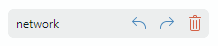
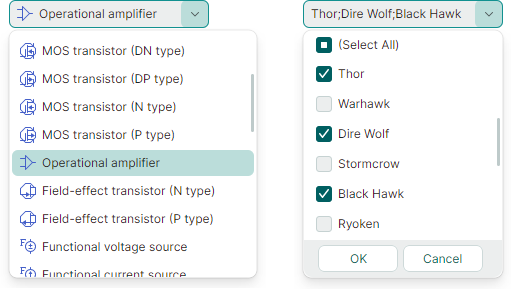
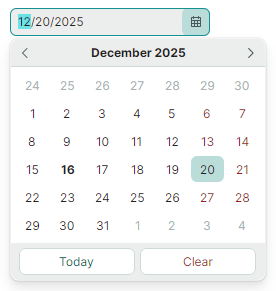
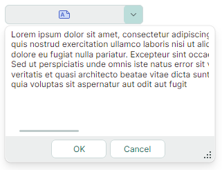

# Editors

The Eremex Controls library includes multiple editors that provide advanced data editing capabilities. The editors allow you to display and edit data of different data types (numeric, Boolean, date-time, enumerations, etc.). They support the data validation mechanism to inform users about errors during data input. 

You can embed the Eremex data editors in cells in container controls (DataGrid, TreeList, PropertyGrid, and ToolbarManager) to present and edit cell data. Although you can embed any custom control in cells, the use of Eremex data editors has many benefits from an application performance perspective.

 

- [ButtonEditor](buttoneditor.md) —  A text editor with built-in custom buttons.

    

    - Regular and toggle buttons.
    - Displaying text and images in buttons.
    - Aligning buttons to the left and right edges.
    - Tooltips.
    - Predefined 'x' button to clear the editor's value.
    - Watermarks.

 

- [CheckEditor](checkeditor.md) — Displays a check box which is toggled on a click.

    

    - Supports two or three check states (checked state, unchecked state and indeterminate state).
    - The validation mechanism modifies the appearance of the control to inform users about errors.

 

- [ComboBoxEditor](comboboxeditor.md) — Allows a user to select an item from an item list displayed in an associated popup window. 

    

   - Supported items sources: a list of strings, list of business objects, and an enumeration type.
   - Support for data templates used to render items in a custom manner.
   - Single and multiple item selection modes.
   - Built-in check boxes in multiple selection mode.
   - The text auto-completion feature predicts an item selection when a user starts typing text in the edit box in single selection mode.

 

- [DateEditor](dateeditor.md) — An editor with an embedded dropdown calendar that allows users to pick a date.

    

    - Built-in 'Today' and 'Clear' buttons.
    - Support for multiple date display formats.
    - Navigation bar in the dropdown calendar allows for browsing through months and years.
    - Three calendar views: month view, year view, and year range view.
    - An option to limit the available date range.

 

- [HyperlinkEditor](hyperlinkeditor.md) — Displays a clickable hyperlink.

    

    - Allows you to specify a command to handle clicks on a hyperlink.

 

- [MemoEditor](memoeditor.md)  — A dropdown text editor.

    
    - A text editor embedded in the dropdown window.
    - To indicate the presence of text in the dropdown editor, the edit box can display a special icon or the first line of the dropdown text. 

 

- [PopupColorEditor](popupcoloreditor.md) — Allows a user to select a color in a popup window.

    

    - Three color palettes — Default, Standard, Custom.
    - The Default color palette can be initialized in code.
    - The Standard color palette displays predefined standard colors.
    - The Custom color palette allows users to add and modify colors using the built-in Color Picker.
    - Ability to specify colors in the RGB and HSB formats.
    
 

- [`PopupEditor`](../../API/Eremex.AvaloniaUI.Controls.Editors/PopupEditor.md) — The base class for editors that have dropdown windows.

<!--TODO Describe PopupEditor
 -->

 

- [SegmentedEditor](segmentededitor.md) — Displays segments (items), one of which can be selected by a user.

    

    - Horizontal arrangement of segments.
    - A user can click a segment to select it and unselect other segments.
    - A Ctrl-click on a selected item clears the selection.
    - Supported items sources: a list of strings, list of business objects, and an enumeration type.
    - Use data templates to render items in a custom manner.

 

- [SpinEditor](spineditor.md) — Allows you to edit numeric values using spin buttons.

    

    - Built-in spin buttons allow a user to increase and decrease a value.
    - Limiting the available value range.
    - Custom increment value.
    - Displaying custom prefix and suffix in the edit box.

 

- [TextEditor](texteditor.md)  — A text editor featuring the base text editing functionality.

    

    - The ancestor of all text-based Eremex editors.
    - Masked input.
    - Support for the data validation mechanism used to show errors to users.

## Common Features

- [Masks](masks/index.md)
    - Text editors support masked input, which prevents users from entering invalid values.
    - Masks can be used to format cell text in container controls in display mode (when text editing is not active).
    - Supported mask types: Numeric and DateTime.
    - DateEditor uses a DateTime input mask by default.
    - SpinEditor uses a Numeric input mask by default.

 

- [Data Validation](data-validation.md)
    - The built-in value validation mechanism allows you to show errors to users in all text editors and CheckEditor.
    - Text editors can display validation errors within edit boxes or below them.

 

- [Eremex Application Themes](../themes/index.md)
    - Themes define the appearance of all Eremex controls.
    - They are automatically applied to a set of standard Avalonia UI Controls, ensuring a consistent appearance with Eremex controls.
    - Eremex editors support the primary and secondary color variants for each theme. These color variants allow you to give editors a different color accent by changing a single property.