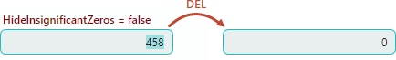

# Numeric Masks

The `Numeric` mask type allows users to enter numeric values (integer, real values, currency, percentage, etc.) in editors according to a specified input mask. The input mask can also be used to format numeric values in display mode (when text editing is not active). The [`SpinEditor`](../../../API/Eremex.AvaloniaUI.Controls.Editors/SpinEditor.md) control has the `Numeric` mask type enabled by default. To enable this mask type for other text editors, set the editor's [`TextEditor.MaskType`](../../../API/Eremex.AvaloniaUI.Controls.Editors/TextEditor/MaskType.md) property to `Numeric`.

Use the editor's [`Mask`](../../../API/Eremex.AvaloniaUI.Controls.Editors/TextEditor/Mask.md) property to specify an input mask. The input mask is a string that defines a pattern according to which a numeric value is entered or formatted.

The current culture affects most numeric masks. For example, the culture defines the currency symbol and the decimal separator. You can forcibly assign a specific culture to a mask using the [`TextEditor.MaskCulture`](../../../API/Eremex.AvaloniaUI.Controls.Editors/TextEditor/MaskCulture.md) property.

Eremex editors support standard and custom numeric masks.

## Standard Masks

Standard numeric masks supported by Eremex editors match the most common [standard numeric display formats](https://learn.microsoft.com/en-us/dotnet/standard/base-types/standard-numeric-format-strings) that you can use to format values in .NET. 

### Example

The following code applies the `p1` mask to [`SpinEditor`](../../../API/Eremex.AvaloniaUI.Controls.Editors/SpinEditor.md). The mask `p` formats the editor's value as percentage. The suffix `1` (precision specifier) defines the number of digits to the right of the decimal point.

``` xml
xmlns:mxe="https://schemas.eremexcontrols.net/avalonia/editors"

<mxe:SpinEditor x:Name="SpinEditor" Width="200" Value="0.3" Mask="p1" Increment="0.005"/>
```


### Standard Mask Specifiers

A standard numeric mask consists of one standard mask specifier, and an optional precision specifier (an integer value). The precision specifier affects the number of digits in the resulting string.

The table below shows available standard mask specifiers. 

| Mask specifier | Description | Example |
|---|---|---|
| `C` or `c` | Currency. <br><br>The precision specifier determines the number of decimal digits to the right of the decimal point. | 12.54("c",ru-RU)&rarr;"12,54 ₽" <br><br> 71.85("c0",zh-CN)&rarr;"￥72" |
| `D` or `d` | Decimal (integer) numbers. <br><br>The precision specifier determines the minimum number of digits. | 789("D")&rarr;"789" <br><br> -965("D5")&rarr;"-00965"|
| `F` or `f` <br><br>`G` or `g` | Fixed-point numbers. <br><br>The precision specifier determines the number of decimal digits. The default precision specifier is defined by `CultureInfo.NumberFormatInfo.NumberDecimalDigits`. | 1234.5678("F",ru-RU)&rarr;"1234,57" <br><br> 1234.56("F4",hi-IN)&rarr;"-1234.5600" |
| `N` or `n` | Real numbers with group separators. <br><br>The precision specifier determines the number of decimal digits. The default precision specifier is defined by `CultureInfo.NumberFormatInfo.NumberDecimalDigits`. | 1234.5678("N",ru-RU)&rarr;"1 234,57" <br><br> -1234.56("N3",en-US)&rarr;"-1,234.560" |
| `P` | Number displayed as is with a percent symbol according to the system pattern. <br><br>The system pattern is specified by the `CultureInfo.NumberFormatInfo.PercentNegativePattern` and `CultureInfo.NumberFormatInfo.PercentPositivePattern` properties.<br><br>The precision specifier determines the number of decimal digits. The default precision specifier is defined by `CultureInfo.NumberFormatInfo.PercentDecimalDigits`. | 12("P",zh-CN)&rarr;"12.00%" <br><br> -15.6("P0",ru-RU)&rarr;"-16 %" |
| `p` | When an underlying number is about to be displayed, it is multiplied by 100 and displayed with a percent symbol according to the system pattern. When a number is typed in the editor, backward conversion divides the number by 100, and stores it in the edit value.<br><br>The system pattern is specified by the `CultureInfo.NumberFormatInfo.PercentNegativePattern` and `CultureInfo.NumberFormatInfo.PercentPositivePattern` properties.<br><br>The precision specifier determines the number of decimal digits (the default precision specifier is defined by `CultureInfo.NumberFormatInfo.PercentDecimalDigits`). | 12("p",en-US)&rarr;"1,200.00%" <br><br> -0.2567("P0",ru-RU)&rarr;"-26 %"|


## Custom Masks

You can create custom masks if the standard masks do not meet your specific needs. A custom mask consists of one or more custom mask specifiers.

### Example

The following code applies the `#,##0.##` custom mask to [`SpinEditor`](../../../API/Eremex.AvaloniaUI.Controls.Editors/SpinEditor.md). The mask allows users to enter real numbers up in the range from -9999.99 to 9999.99. The editor's [`Minimum`](../../../API/Eremex.AvaloniaUI.Controls.Editors/SpinEditor/Minimum.md) and [`Maximum`](../../../API/Eremex.AvaloniaUI.Controls.Editors/SpinEditor/Maximum.md) properties limit the range to [0;5000].

The `,` mask specifier is used to insert localized separators between groups of three digits.


``` xml
xmlns:mxe="https://schemas.eremexcontrols.net/avalonia/editors"

<mxe:SpinEditor x:Name="SpinEditor" Value="1234.5" Mask="#,##0.##" Minimum="0" Maximum="5000" Increment="0.5"/>
```

### Custom Mask Specifiers

The following table shows supported custom mask specifiers.

| Mask specifier | Description | Example |
|---|---|---|
| `0` | A zero-placeholder for a digit (0-9). This placeholder displays "0" when there is no digit at this position.  | -12.345("0000")&rarr;"-0012"<br><br>78.97("000.0", ru-RU)&rarr;"079,0" |
| `#` | A digit placeholder. This placeholder displays nothing when there is no digit at this position. | 12.34("####")&rarr;"12"<br><br>-0.123("####.##",ru-RU)&rarr;"-,12" |
| `.` | Decimal point. Specifies the location of the decimal point in the resulting string.<br><br>The `CultureInfo.NumberFormatInfo.NumberDecimalSeparator` property determines the character used as the decimal separator in the current culture. | 0.9876("0.00",zh-CN)&rarr;0.99<br><br>0.01("####0.#")&rarr;"0" |
| `,` | Group separator. You can place the group separator at any position within the mask to separate groups of digits to the left of the decimal point with a localized group separator character.<br><br> The `CultureInfo.NumberFormatInfo.NumberGroupSeparator` property specifies the default group separator character. The `CultureInfo.NumberFormatInfo.NumberGroupSizes` property specifies the default number of digits in each group.<br><br> If the mask contains the "%" character (see below), the `CultureInfo.NumberFormatInfo.PercentGroupSeparator` and `CultureInfo.NumberFormatInfo.PercentGroupSizes` properties specify the group separator and group length, respectively.<br><br>If the mask contains the "$" character (see below), the `CultureInfo.NumberFormatInfo.CurrencyGroupSeparator` and `CultureInfo.NumberFormatInfo.CurrencyGroupSizes` properties are used instead.| 12345678.91("#,########.#",en-US)&rarr;"12,345,678.9" |
| `%` | Percentage. When an underlying number is about to be displayed, it is multiplied by 100 and displayed with a percent symbol. When a number is typed in the editor, backward conversion divides the number by 100, and stores it in the edit value. <br><br> The `%` specifier defines the position of the localized percent symbol (`CultureInfo.NumberFormat.PercentSymbol`) in the resulting string.| 0.31415("% ##0.00",en-US)&rarr;"% 31.41"<br><br>0.5567("##.0 %",ru-RU)&rarr;"55,7 %" |
| `%%` | Percentage character. Displays the value as is, and adds the localized percent symbol (`CultureInfo.NumberFormat.PercentSymbol`) to the resulting string at a specified position. |0.31415("%% ##0.00",en-US)&rarr;"% 0.31"<br><br>0.1256("#0.00 %%",ru-RU)&rarr;"0,13 %" |
| `\` | Escape character. The character that follows the escape character is interpreted as a literal rather than as a mask specifier. Use "&bsol;&bsol;" to insert a backslash character as a literal.  | 123456("&bsol;#########&bsol;#")&rarr;"#123456#" |
| `;` | Separator for sections that define masks for positive and negative numbers.<br><br>The section before the `;` character specifies the mask for positive numbers. The section after the `;` character specifies the mask for negative numbers. If the negative section is empty, a user cannot enter negative values. | 10.25("#0.##;(#0.##)", en-US)&rarr;"10.25"<br><br> -10.25("#0.##;(#0.##)", en-US)&rarr;"(10.25)" |
| `$` | Currency symbol. Inserts the currency symbol (`CultureInfo.NumberFormatInfo.CurrencySymbol`) at a specified position. | 35("###0 $",zh-CN)&rarr;"35 ￥" |
| All other characters | These characters are displayed as is, in read-only mode. They are not stored in an editor's edit value. | 36.6("#0.## °",hi-IN)&rarr;"36.6 °" |

## Numeric Mask Settings

You can customize numeric mask behavior with additional settings. These settings are available from attached properties exposed by the [`Eremex.AvaloniaUI.Controls.Editors.NumericMaskOptions`](../../../API/Eremex.AvaloniaUI.Controls.Editors/NumericMaskOptions.md) class.

### Automatically Hide Decimal Separator

The `NumericMaskOptions.AutoHideDecimalSeparator` property specifies whether to hide or show the decimal separator when the current number has no fractional part.


### Example

The following example prevents the decimal separator from being hidden.

``` xml
xmlns:mxe="https://schemas.eremexcontrols.net/avalonia/editors"

<mxe:TextEditor Name="textEditor1" MaskType="Numeric" Mask="####0.#" mxe:NumericMaskOptions.AutoHideDecimalSeparator="False"/>
```

The following code sets the `AutoHideDecimalSeparator` property in code-behind:

``` csharp
textEditor1.MaskType = Eremex.AvaloniaUI.Controls.Editors.MaskType.Numeric;
textEditor1.Mask = "##0.##";
textEditor1.SetValue(NumericMaskOptions.AutoHideDecimalSeparatorProperty, false);
```

### Show "0" or Nothing for Zero Values

The '#' mask specifier determines a placeholder that displays nothing when there is no digit at this position. When the mask only consists of '#' digit placeholders, and the editor's value is '0', the editor can display either the "0" string (default mode) or nothing.

The `NumericMaskOptions.HideInsignificantZeros` property allows you to choose rendering mode for '0' values when the mask consists of '#' characters.

- `HideInsignificantZeros` is set to `false` (default) — The editor displays "0" when the edit value is '0'.

    

- `HideInsignificantZeros` is set to `true` — The editor displays nothing when the edit value is '0'.

    

### Example

The following example sets the `HideInsignificantZeros` property to `true` to display nothing when the edit value is '0'.

``` xml
xmlns:mxe="https://schemas.eremexcontrols.net/avalonia/editors"

<mxe:TextEditor Name="textEditor1" MaskType="Numeric" Mask="#####.##" mxe:NumericMaskOptions.HideInsignificantZeros="True"/>
```

The following code sets the `HideInsignificantZeros` property in code-behind:

``` csharp
textEditor1.MaskType = Eremex.AvaloniaUI.Controls.Editors.MaskType.Numeric;
textEditor1.Mask = "#####.##";
textEditor1.SetValue(NumericMaskOptions.HideInsignificantZeros, true);
```