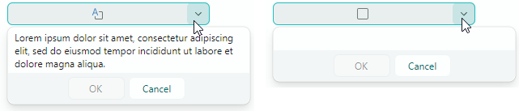

# MemoEditor

`MemoEditor` allows users to view and edit multi-line text in a dropdown window. The control's edit box does not provide text editing operations.


The control's main features include:

- A user can click the edit box or the built-in dropdown button to open the dropdown text editor.
- You can enable text wrapping in the dropdown editor.
- Controlling scrollbar visibility in the dropdown window.
- The edit box can display a special icon when the dropdown editor contains text. An empty icon is displayed when there is no text.
- The edit box can display a preview of the dropdown text (the first text line) instead of the special icon.

## Specify Text and Text Options

Use the `MemoEditor.EditorValue` property to get and set text in the dropdown editor. If the specified text contains _NewLine_ characters, the editor displays the text on multiple lines. 

### Text Wrapping

The `MemoEditor.TextWrapping` property allows you to activate automatic text wrapping at the editor's right edge. Set this property to the `Avalonia.Media.TextWrapping.Wrap` value to enable regular text wrapping mode.

### Accept _Tab_ and _Enter_ keys During Input

Users can press the _Tab_ and _Enter_ keys to insert _Tab_ and _Return_ characters in the text. You can use the following options to change this behavior:

- `MemoEditor.MemoAcceptsReturn` — Specifies whether the dropdown editor accepts pressing _Enter_. If the property is disabled, the dropdown editor ignores the _Enter_ key.
- `MemoEditor.MemoAcceptsTab`— Specifies whether the dropdown editor accepts pressing _Tab_. If the property is disabled, focus is moved to the next control in the tab order when the _Tab_ key is pressed.

### Example - How to enable text wrapping in a MemoEditor

``` xml
xmlns:mxe="https://schemas.eremexcontrols.net/avalonia/editors"
xmlns:mxtl="https://schemas.eremexcontrols.net/avalonia/treelist"

<mxe:MemoEditor x:Name="memoEditor" Grid.Row="1"  MemoTextWrapping="Wrap"/>
```

## Indicate the Presence of Text

The control's default behavior is to display a special icon to indicate the presence of text:



Disable the `MemoEditor.ShowIcon` property to hide the icon and display the first line of the text in the edit box:


## Open the Dropdown Editor

A user can invoke the dropdown editor with a click on the edit box or the built-in dropdown button.

The `MemoEditor.IsPopupOpen` property allows you to open and close the dropdown editor in code.

## Specify Visibility of Scrollbars

Use the following properties to manage visibility of scrollbars:

- `MemoEditor.MemoHorizontalScrollBarVisibility` — Gets or sets an `Avalonia.Controls.Primitives.ScrollBarVisibility` value that specifies the visibility of the horizontal scrollbar in the dropdown text editor.
- `MemoEditor.MemoVerticalScrollBarVisibility` — Gets or sets an `Avalonia.Controls.Primitives.ScrollBarVisibility` value that specifies the visibility of the vertical scrollbar in the dropdown text editor.

## Prevent Popups in Read-only Editors

In read-only mode, the default behavior of any popup editor is to allow users to open the editor's dropdown. However, they cannot modify values through either the edit box or dropdown. To disable popups for read-only editors, set the `ShowPopupIfReadOnly` property to `false`.

## Prevent Popups From Opening and Closing

You can handle the following inherited events to cancel popup opening and closing operations:

- `PopupEditor.PopupOpening` — Fires when a popup is about to be created. 
- `PopupEditor.PopupClosing` — Fires when the popup is about to be closed. 

These events provide the `e.Cancel` parameter. Set it to `true` to cancel the current operation.

## Customize the Popup When It Appears

Handle the following inherited event to modify the popup or its nested controls:

- `PopupEditor.PopupOpened` — Fires after the popup has been created and immediately before it is displayed. This is a notification event. It does not allow you to cancel popup opening. Handle the `PopupOpened` event to customize the popup or its child controls.

When handling the `PopupEditor.PopupOpened` event, use the editor's `PopupContent` property to safely access the control inside the editor's popup. The `PopupOpened` event ensures that the popup control exists when you access it. For the MemoEditor control, the `PopupContent` property returns an instance of the `TextBox` class. 

### Example - Select All Text When the Popup Opens

This example handles the `PopupOpened` event to select the entire text inside a MemoEditor's popup when it appears. The code accesses the text editor embedded in the popup using the `PopupContent` property, and then calls the `SelectAll` method to select all of its text.


``` cs
using Eremex.AvaloniaUI.Controls.Editors;

 private void MemoEditor_PopupOpened(object sender, Avalonia.Interactivity.RoutedEventArgs e)
 {
     MemoEditor memoEditor = sender as MemoEditor;
     (memoEditor.PopupContent as TextBox).SelectAll();
 }
```


## Respond to Popup Closing

Use the following inherited event to perform actions after the popup has been closed:

- `PopupEditor.PopupClosed` — Fires immediately after the popup has been closed. This is a notification event. It does not allow you to cancel popup closing.
