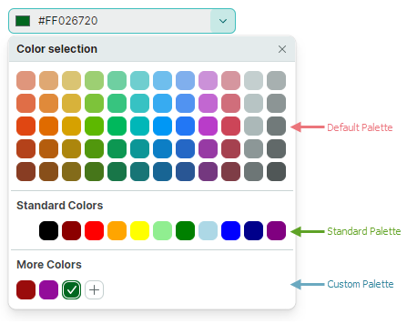
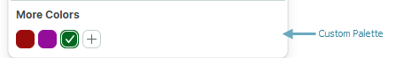

# PopupColorEditor

The Eremex Controls library includes the [`PopupColorEditor`](../../API/Eremex.AvaloniaUI.Controls.Editors/PopupColorEditor.md) control that allows you to display a color in the edit box, and pick a color from the associated popup window.


The control's main features include:

- Customizable default color pallete.
- Standard color palette.
- Custom color palette, which can be customized by users.
- Built-in dialog allows you to select colors using a color picker or by specifying individual color components in the RGB or HSB format.

## Select a Color

A user can pick a color using color palletes displayed in the dropdown window.

In code, you can specify a color or read the currently selected color with the [`PopupColorEditor.Color`](../../API/Eremex.AvaloniaUI.Controls.Editors/PopupColorEditor/Color.md) or [`PopupColorEditor.EditorValue`](../../API/Eremex.AvaloniaUI.Controls.Editors/BaseEditor/EditorValue.md) property. These properties are in sync. They differ in the value type: the [`Color`](../../API/Eremex.AvaloniaUI.Controls.Editors/PopupColorEditor/Color.md) property is of the nullable [`Color`](../../API/Eremex.AvaloniaUI.Controls.Editors/PopupColorEditor/Color.md) type, while the [`EditorValue`](../../API/Eremex.AvaloniaUI.Controls.Editors/BaseEditor/EditorValue.md) property is of the `object` type as in all Eremex editors.

## Palettes

The [`PopupColorEditor`](../../API/Eremex.AvaloniaUI.Controls.Editors/PopupColorEditor.md) supports three palettes: default, standard and custom. Use the [`PopupColorEditor.ColorsShowMode`](../../API/Eremex.AvaloniaUI.Controls.Editors/PopupColorEditor/ColorsShowMode.md) property to customize the visibility of individual palettes. The [`ColorsShowMode`](../../API/Eremex.AvaloniaUI.Controls.Editors/ColorsShowMode.md) property is defined as a set of flags.




## Default Color Palette

The default palette displays a set of predefined colors. 


You can replace these colors with a custom palette, using the following code:

``` cs
List<uint> fluentIntColors = new List<uint>() 
{
    0xffef6950, 0xffc30052, 0xff0063b1, 0xff881798, 0xff018574, 0xff515c6b, 0xff4c4a48, 0xff7e735f,
    0xffda3b01, 0xffea005e, 0xff0078d7, 0xffb146c2, 0xff00b294, 0xff68768a, 0xff767676, 0xff847545,
    0xffca5010, 0xffe81123, 0xff9a0089, 0xff744da9, 0xff038387, 0xff5d5a57, 0xff107c10, 0xff525e54,
    0xfff7630c, 0xffe74856, 0xffc239b3, 0xff8764b8, 0xff00b7c3, 0xff7a7574, 0xff498205, 0xff647c64
};

List<Color> fluentColors = new List<Color>();
fluentIntColors.ForEach(intColor => fluentColors.Add(Color.FromUInt32(intColor)));

ColorPalette colorPalette = new Eremex.AvaloniaUI.Controls.Editors.CustomPalette("myPalette", fluentColors);
popupColorEditor1.ThemePalette = colorPalette;
```


<!--TODO
..\Controls\Source\Eremex.Avalonia.Controls\Editors\ColorEditor\PalettesHelper.cs
-->


## Standard Color Palette

Enable the `StandardColors` flag in the [`ColorsShowMode`](../../API/Eremex.AvaloniaUI.Controls.Editors/ColorsShowMode.md) property value to display the 'Standard Colors' palette.


``` xml
<mxe:PopupColorEditor 
    Width="190" Height="30"
    Name="popupColorEditor1"
    ColorsShowMode="StandardColors,CustomColors"/>
```

## Custom Color Palette

Include the [`CustomColors`](../../API/Eremex.AvaloniaUI.Controls.Editors/PopupColorEditor/CustomColors.md) flag into the [`ColorsShowMode`](../../API/Eremex.AvaloniaUI.Controls.Editors/ColorsShowMode.md) property value to display the 'Custom Colors' palette. 



``` xml
<mxe:PopupColorEditor ColorsShowMode="CustomColors"/>
```

Users can add and customize colors in the Custom palette at runtime. Click the '+' button to add a color. 


Right-click an existing color to display the context menu that allows you to change and delete the color.


You can populate the 'Custom Colors' palette in code beforehand, using the [`CustomColors`](../../API/Eremex.AvaloniaUI.Controls.Editors/PopupColorEditor/CustomColors.md) property.

### Example - How to set up a custom palette

The following code enables the Custom Colors palette, and populates it from a _CustomColorCollection_ property defined in a ViewModel.

``` xml
xmlns:mxe="https://schemas.eremexcontrols.net/avalonia/editors"
xmlns:sys="clr-namespace:System;assembly=mscorlib"
xmlns:local="clr-namespace:ComboBoxTestSample"

<Window.DataContext>
    <local:MainViewModel/>
</Window.DataContext>

<mxe:PopupColorEditor ColorsShowMode="CustomColors" 
 CustomColors="{Binding CustomColorCollection}"/>
```

``` csharp
using Avalonia.Media;
using CommunityToolkit.Mvvm.ComponentModel;
using System.Collections.ObjectModel;

[ObservableObject]
public partial class MainViewModel 
{
    public MainViewModel()
    {
        CustomColorCollection = new ObservableCollection<Color>()
        {
            Color.FromRgb(0x7d, 0xd7, 0xab), 
            Color.FromRgb(0xc5, 0x94, 0x88), 
            Color.FromRgb(0x47, 0xfe, 0xff), 
            Color.FromRgb(0xe9, 0xbf, 0x3f),
        };
    }

    [ObservableProperty]
    ObservableCollection<Color> customColorCollection;
}
```

### Color Selection Dialog

When a user clicks the '+' button, or right-clicks an existing color box in the Custom palette, the editor activates the Color Picker dialog.


The dialog's UI contains the color picker and controls to specify components of a color in the RGB or HSB format.

#### Related API

- [`ShowAlphaChannel`](../../API/Eremex.AvaloniaUI.Controls.Editors/PopupColorEditor/ShowAlphaChannel.md) — Allows you to hide the controls used to specify the Alpha component of a color.
- [`PopupFooterButtons`](../../API/Eremex.AvaloniaUI.Controls.Editors/PopupFooterButtons.md) — Specifies whether to display the Apply and Cancel buttons in the Color Selection dialog. If the property is set to `OkCancel`, a user needs to press the Apply button to confirm a color selection. A click on the Back or Cancel button cancels the dialog. 

<!-- TODO 
rename PopupFooterButtons  to ShowConfirmationButtons
to sync the API with ColorEditor
 -->

## Prevent Popups in Read-only Editors

In read-only mode, the default behavior of any popup editor is to allow users to open the editor's dropdown. However, they cannot modify values through either the edit box or dropdown. To disable popups for read-only editors, set the [`ShowPopupIfReadOnly`](../../API/Eremex.AvaloniaUI.Controls.Editors/PopupEditor/ShowPopupIfReadOnly.md) property to `false`.

## Prevent Popups From Opening and Closing

You can handle the following inherited events to cancel popup opening and closing operations:

- [`PopupEditor.PopupOpening`](../../API/Eremex.AvaloniaUI.Controls.Editors/PopupEditor/PopupOpening.md) — Fires when a popup is about to be created. 
- [`PopupEditor.PopupClosing`](../../API/Eremex.AvaloniaUI.Controls.Editors/PopupEditor/PopupClosing.md) — Fires when the popup is about to be closed. 

These events provide the `e.Cancel` parameter. Set it to `true` to cancel the current operation.

## Customize the Popup When It Appears

Handle the following inherited event to modify the popup or its nested controls:

- [`PopupEditor.PopupOpened`](../../API/Eremex.AvaloniaUI.Controls.Editors/PopupEditor/PopupOpened.md) — Fires after the popup has been created and immediately before it is displayed. This is a notification event. It does not allow you to cancel popup opening. Handle the [`PopupOpened`](../../API/Eremex.AvaloniaUI.Controls.Editors/PopupEditor/PopupOpened.md) event to customize the popup or its child controls.

When handling the [`PopupEditor.PopupOpened`](../../API/Eremex.AvaloniaUI.Controls.Editors/PopupEditor/PopupOpened.md) event, use the editor's [`PopupContent`](../../API/Eremex.AvaloniaUI.Controls.Editors/PopupEditor/PopupContent.md) property to safely access the control inside the editor's popup. The [`PopupOpened`](../../API/Eremex.AvaloniaUI.Controls.Editors/PopupEditor/PopupOpened.md) event ensures that the popup control exists when you access it. For the PopupColorEditor control, the [`PopupContent`](../../API/Eremex.AvaloniaUI.Controls.Editors/PopupEditor/PopupContent.md) property returns an instance of the [`ColorEditor`](../../API/Eremex.AvaloniaUI.Controls.Editors/ColorEditor.md) class.

## Respond to Popup Closing

Use the following inherited event to perform actions after the popup has been closed:

- [`PopupEditor.PopupClosed`](../../API/Eremex.AvaloniaUI.Controls.Editors/PopupEditor/PopupClosed.md) — Fires immediately after the popup has been closed. This is a notification event. It does not allow you to cancel popup closing.
