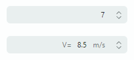

# SpinEditor

The [`SpinEditor`](../../API/Eremex.AvaloniaUI.Controls.Editors/SpinEditor.md) is a numeric value editor with built-in spin buttons used to increase and decrease a number by a specific value (increment). A user can increment and decrement the number by clicking these buttons, or by pressing the Up and Down Arrows on a keyboard.



The control's main features include:

- Built-in spin buttons allow a user to increase and decrease a value.
- Limiting the available value range.
- Custom increment value.
- Displaying custom value prefix and suffix in the edit box.

## Get and Set the Editor's Value

Use the [`SpinEditor.Value`](../../API/Eremex.AvaloniaUI.Controls.Editors/SpinEditor/Value.md) property to return and specify the editor's numeric value. You can also use the [`EditorValue`](../../API/Eremex.AvaloniaUI.Controls.Editors/BaseEditor/EditorValue.md) property for the same purpose. These properties are in sync. They differ in the value type: the [`Value`](../../API/Eremex.AvaloniaUI.Controls.Editors/SpinEditor/Value.md) property is of the decimal type, while the [`EditorValue`](../../API/Eremex.AvaloniaUI.Controls.Editors/BaseEditor/EditorValue.md) property is of the `object` type as in all Eremex editors.

See also: [Increase and Decrease a Value in Code](#increase-and-decrease-a-value-in-code).

## Set Up

The following main properties help you set up a [`SpinEditor`](../../API/Eremex.AvaloniaUI.Controls.Editors/SpinEditor.md) control:

- [`SpinEditor.Minimum`](../../API/Eremex.AvaloniaUI.Controls.Editors/SpinEditor/Minimum.md) — The minimum value for the editor.
- [`SpinEditor.Maximum`](../../API/Eremex.AvaloniaUI.Controls.Editors/SpinEditor/Maximum.md) — The maximum value for the editor.
- [`SpinEditor.Increment`](../../API/Eremex.AvaloniaUI.Controls.Editors/SpinEditor/Increment.md) — The value by which the editor's value is increased or decreased when a user clicks spin buttons, or presses the Up and Down Arrow keys.
- [`SpinEditor.ShowEditorButtons`](../../API/Eremex.AvaloniaUI.Controls.Editors/BaseEditor/ShowEditorButtons.md) — Specifies whether to display built-in spin buttons.

### Example - How to create a SpinEditor

The following example initializes a SpinEditor control.

``` xml
xmlns:mxe="https://schemas.eremexcontrols.net/avalonia/editors"

<mxe:SpinEditor x:Name="SpinEditor" Width="200" 
    Value="7"
    Maximum="15"
    Minimum="1"
    Increment="1"
    />
```


## Display Value Prefix and Suffix

Use the [`SpinEditor.Prefix`](../../API/Eremex.AvaloniaUI.Controls.Editors/SpinEditor/Prefix.md) and [`SpinEditor.Suffix`](../../API/Eremex.AvaloniaUI.Controls.Editors/SpinEditor/Suffix.md) properties to specify text displayed before and after the numeric value. Users cannot edit this text.

### Example - How to specify a prefix and suffix for a SpinEditor's value

The following example uses the [`SpinEditor.Prefix`](../../API/Eremex.AvaloniaUI.Controls.Editors/SpinEditor/Prefix.md) and [`SpinEditor.Suffix`](../../API/Eremex.AvaloniaUI.Controls.Editors/SpinEditor/Suffix.md) properties to display text before and after the editor's value.

``` xml
xmlns:mxe="https://schemas.eremexcontrols.net/avalonia/editors"

<mxe:SpinEditor x:Name="SpinEditor1" Width="200" 
    Value="8.5"
    Maximum="35"
    Minimum="2"
    Increment="0.5"
    Prefix="V=" Suffix="m/s"
    />
```

## Increase and Decrease a Value in Code

The [`SpinEditor.IncreaseCommand`](../../API/Eremex.AvaloniaUI.Controls.Editors/SpinEditor/IncreaseCommand.md) and [`SpinEditor.DecreaseCommand`](../../API/Eremex.AvaloniaUI.Controls.Editors/SpinEditor/DecreaseCommand.md) commands increase and decrease the editor's value by the increment value ([`SpinEditor.Increment`](../../API/Eremex.AvaloniaUI.Controls.Editors/SpinEditor/Increment.md)).

<!--TODO
Check:
The [`SpinEditor.IncreaseCommand`](../../API/Eremex.AvaloniaUI.Controls.Editors/SpinEditor/IncreaseCommand.md) and [`SpinEditor.DecreaseCommand`](../../API/Eremex.AvaloniaUI.Controls.Editors/SpinEditor/DecreaseCommand.md) commands increase and decrease the editor's value by the increment value ([`SpinEditor.Increment`](../../API/Eremex.AvaloniaUI.Controls.Editors/SpinEditor/Increment.md)).
-->

You can also change the editor's value directly using the [`SpinEditor.Value`](../../API/Eremex.AvaloniaUI.Controls.Editors/SpinEditor/Value.md) property.