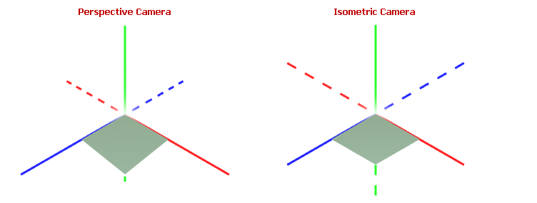
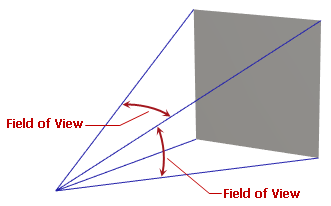
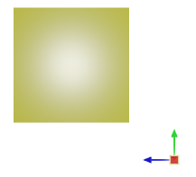
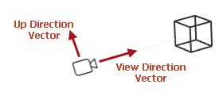
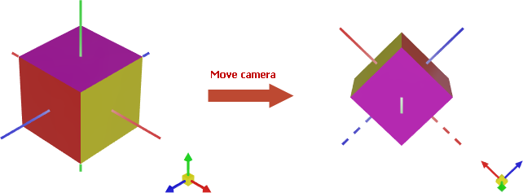

# Camera

A camera is a virtual representation of a viewpoint that defines how a 3D model is projected onto the 2D screen. The `Graphics3DControl` allows you to choose between an isometric and perspective camera, and manage the settings and position of the camera in code.



The default camera used by `Graphics3DControl` is perspective.

The `Graphics3DControl.Camera` property allows you to access the current camera object. However, initially this property returns `null`, which means that the `Graphics3DControl` uses the default camera (perspective).

To access and customize the camera object in code, you need to explicitly initialize the `Graphics3DControl.Camera` property with a `PerspectiveCamera` or `IsometricCamera` object.


## Perspective Camera

A perspective camera simulates realistic depth perception by projecting a 3D model onto a 2D plane, making objects appear smaller as they get farther away.

The perspective camera is default in the Graphics3DControl. To access the camera object and customize its settings, set the `Graphics3DControl.Camera` property to a `PerspectiveCamera` object.

``` xml
xmlns:mx3d="https://schemas.eremexcontrols.net/avalonia/controls3d"

<mx3d:Graphics3DControl Name="g3DControl" ShowAxes="True">
    <mx3d:Graphics3DControl.Camera>
        <mx3d:PerspectiveCamera FieldOfView="0.9" />
    </mx3d:Graphics3DControl.Camera>
</mx3d:Graphics3DControl>
```

The `PerspectiveCamera.FieldOfView` property allows you to specify the field-of-view angle of the perspective camera, expressed in radians. The property's default value is `MathF.PI/4`.



## Isometric Camera

An isometric camera maintains a consistent scale for all objects regardless of their distance from the camera. 

Set the `Graphics3DControl.Camera` property to an `IsometricCamera` object to switch to an isometric camera.

``` xml
xmlns:mx3d="https://schemas.eremexcontrols.net/avalonia/controls3d"

<mx3d:Graphics3DControl Name="g3DControl" ShowAxes="True">
    <mx3d:Graphics3DControl.Camera>
        <mx3d:IsometricCamera FarClipPlane="1000"/>
    </mx3d:Graphics3DControl.Camera>
</mx3d:Graphics3DControl>
```

<!-- TODO
Describe camera settings
 -->

## Look at Scenes

### View Predefined Scenes

The `Graphics3DControl` allows you to position the camera so it looks at the top, front, and other predefined sides of a 3D model.

The default scene is `IsoXYZ` (isometric). In the isometric scene, the _X_, _Y_, and _Z_ axes have equal proportions, and the angles between the axes are always 120 degrees:


To change the default scene, use the `Camera.DefaultCameraPosition` property of a `PerspectiveCamera` and `IsometricCamera` objects. You can set `Camera.DefaultCameraPosition` to the following `CameraPosition` enumeration values:

- `Down` — The bottom of the model. The camera is positioned along the negative direction of the _Y_ axis. 
- `Front` — The front of the model. The camera is positioned along the positive direction of the _Z_ axis. 
- `IsoXYZ` — An isometric scene, in which the _X_, _Y_, and _Z_ axes have equal proportions, and the angles between the axes are always 120 degrees.
- `Left` — The left side of the model. The camera is positioned along the negative direction of the _X_ axis. 
- `Rear` — The back of the model. The camera is positioned along the negative direction of the _Z_ axis. 
- `Right` — The right side of the model. The camera is positioned along the positive direction of the _X_ axis. 
- `Up` — The top of the model. The camera is positioned along the positive direction of the _Y_ axis. 

The following code sets the default camera position to view the right side of a model.



``` xml
<mx3d:Graphics3DControl.Camera>
    <mx3d:PerspectiveCamera DefaultCameraPosition="Right" />
</mx3d:Graphics3DControl.Camera>
```


At runtime, you can use the following members to view a specific scene of a 3D model:

- `Graphics3DControl.LookCameraAtScene` method
- `Camera.Position` property of a `PerspectiveCamera` and `IsometricCamera` objects.

``` cs
g3DControl.LookCameraAtScene(CameraPosition.Left);
```


<!-- TODO
What if I change the coordinate system ?
-->

Instead of using the `LookCameraAtScene` method, you can visualize predefined scenes with the `Graphics3DControl.LookCameraAtSceneCommand` command. Pass a `CameraPosition` enumeration value as a parameter to this command.

### View the Model Entirely From a Specific Angle

The following `Graphics3DControl.LookCameraAtScene` overload positions and directs the camera to show the model in its entirety from a specific angle.

```
public void LookCameraAtScene(Vector3 cameraViewDirection, Vector3 upDirection)
```

This overload automatically calculates an optimal camera position ensuring the entire model is visible. The method's parameters specify the camera's direction and orientation in 3D space:

- `cameraViewDirection` — A vector that specifies the direction the camera is pointing.
- `upDirection` — A vector that specifies the camera's upward direction. This parameter matches the `Camera.UpDirection` property.




## Position the Camera Manually

The `PerspectiveCamera` and `IsometricCamera` classes are derived from the base `Camera` class, which provides members to obtain and adjust the camera's position and orientation in 3D space:

- `Camera.Position` property — The _X_, _Y_ and _Z_ coordinates of the camera's position. 
  
    !!! tip
    
        When you set the `Position` property, ensure that the distance between the camera and its target (`Camera.Target`) is within the allowed range defined by `Camera.MinDistance` and `Camera.MaxDistance`. Otherwise, the model may become hidden.
  
- `Camera.Target` property — The _X_, _Y_ and _Z_ coordinates of the point the camera is aimed at. The default target is the origin of the coordinate system _(0, 0, 0)_. The target point automatically changes when you pan (shift) the model using the `Camera.MoveLeft`/`Camera.MoveUp` methods, and the [keyboard shortcuts and mouse gestures](user-interactions-with-3d-models.md).
- `Camera.UpDirection` property — A vector (a `Vector3` value) that specifies the camera's upward direction. For example, when `UpDirection` is set to _Vector3(0, 1, 0)_, the _Y_ axis is pointing up. 

- `Camera.LookAt` method — Sets the camera's target and up direction simultaneously.


Other camera settings specify the distance constraints and viewing frustum:

- `Camera.NearClipPlane` — The distance between the camera and the near clipping plane. Objects that are nearer this clipping plane are hidden. See also `FarClipPlane`.
- `Camera.FarClipPlane` — The distance between the camera and the far clipping plane. Objects beyond the far clipping plane are hidden. Graphics3DControl displays only those objects that are positioned between the near and far clipping planes.
- `Camera.MaxDistance` — The maximum allowed distance between the camera (`Camera.Position`) and the target point (`Camera.Target`). The `MaxDistance` and `MinDistance` properties specify how far the camera can be away from the target. These properties affect zoom operations performed using the `Camera.MoveForward` method, and [keyboard shortcuts and mouse gestures](user-interactions-with-3d-models.md).
- `Camera.MinDistance` — The minimum allowed distance of the camera (`Camera.Position`) and the target point (`Camera.Target`).


  


### Example - Place the camera at a custom position

The following code places the camera at the position _(X=40, Y=200, Z=40)_ and sets the `Target` property to _Vector3(0, 0, 0)_ to point downward at the origin of the coordinate system and view the top of the model. The `UpDirection` property is set to _Vector3(1, 0, 1)_, aligning the _X_ and _Z_ axes with the left-top and right-top corners of the screen, respectively.
The `MaxDistance` property is set to _300_ ensuring that the new distance between the camera and the target is within the range [`MinDistance`, `MaxDistance`].



``` cs
g3DControl.Camera.MaxDistance = 300;
g3DControl.Camera.Position = new Vector3(40, 200, 40);
g3DControl.Camera.Target = new Vector3(0, 0, 0);
g3DControl.Camera.UpDirection = new Vector3(1, 0, 1);

// or

g3DControl.Camera.MaxDistance = 300;
g3DControl.Camera.Position = new Vector3(40, 200, 40);
g3DControl.Camera.LookAt(new Vector3(0, 0, 0), new Vector3(1, 0, 1));
```

## Move and Rotate the Camera

Graphics3DControl supports [keyboard shortcuts and mouse gestures](user-interactions-with-3d-models.md) that allow users to move (pan), rotate, and zoom the model(s) at runtime. You can also perform these operations in code, using the following methods exposed by the `Camera` object: 

- `MoveForward` — Places the camera closer to (positive offset) or farther from (negative offset) the model.
- `MoveLeft` — Shifts the camera to the left (positive offset) or right (negative offset).
- `MoveUp` — Shifts the camera up (positive offset) or down (negative offset).
- `Rotate` — Rotates the camera around the horizontal and vertical axes of the **screen space**. The pivot point is the control's coordinate system origin _(0, 0, 0)_.

  

