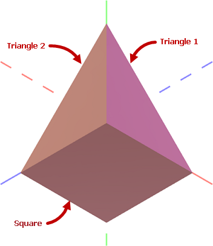

# Get Started with Graphics3DControl


This tutorial demonstrates how to create a 3D model and display it in a [`Graphics3DControl`](../../API/Eremex.AvaloniaUI.Controls3D/Graphics3DControl.md) control. The example uses the API exposed by the control to define meshes, vertices, and materials.

You can display multiple 3D models in a [`Graphics3DControl`](../../API/Eremex.AvaloniaUI.Controls3D/Graphics3DControl.md) simultaneously. This tutorial creates one 3D model. It consists of a square and two triangles positioned at right angles to each other. Each figure is painted using its own material.



## Prerequisites: Register the Paint Theme for the Graphics3DControl

Starting with version 1.3, common appearance settings for the [`Graphics3DControl`](../../API/Eremex.AvaloniaUI.Controls3D/Graphics3DControl.md) are specified by the `Controls3D` paint theme. These settings include the control's alignment, focusable state, background and border color, Gizmo settings, etc. The `Controls3D` paint theme is defined in the same assembly as the [`Graphics3DControl`](../../API/Eremex.AvaloniaUI.Controls3D/Graphics3DControl.md) control itself. To ensure correct rendering of the [`Graphics3DControl`](../../API/Eremex.AvaloniaUI.Controls3D/Graphics3DControl.md), you need to register this theme in the _App.xaml_ file as shown below:

- Open the _App.xaml_ file and add the following namespace to the `Application` object:

    ``` xml
    <!-- App.xaml file -->
    xmlns:theme3D="clr-namespace:Eremex.AvaloniaUI.Themes.Controls3D;assembly=Eremex.Avalonia.Controls3D"
    ```

- Include the <code>&lt;theme3D:Controls3DTheme/&gt;</code> item in the `Application.Styles` collection.

    ``` xml
    <!-- App.xaml file -->
    <Application xmlns="https://github.com/avaloniaui"
             xmlns:x="http://schemas.microsoft.com/winfx/2006/xaml"
             x:Class="MyEMXCameraApp.App"
             xmlns:theme="clr-namespace:Eremex.AvaloniaUI.Themes.DeltaDesign;assembly=Eremex.Avalonia.Themes.DeltaDesign"
             xmlns:theme3D="clr-namespace:Eremex.AvaloniaUI.Themes.Controls3D;assembly=Eremex.Avalonia.Controls3D"
             RequestedThemeVariant="Default">
        <Application.Styles>
            <theme:DeltaDesignTheme/>
            <theme3D:Controls3DTheme />
        </Application.Styles>
    </Application>
    ```

!!! note

    If the `Controls3D` paint theme is not registered, a [`Graphics3DControl`](../../API/Eremex.AvaloniaUI.Controls3D/Graphics3DControl.md) will appear blank.

## Create a Graphics3DControl

Create a [`Graphics3DControl`](../../API/Eremex.AvaloniaUI.Controls3D/Graphics3DControl.md) control in XAML using the following code:

``` xml
xmlns:mx3d="https://schemas.eremexcontrols.net/avalonia/controls3d"

<mx3d:Graphics3DControl Name="g3DControl" ShowAxes="True">
    <mx3d:Graphics3DControl.Camera>
        <mx3d:IsometricCamera/>
    </mx3d:Graphics3DControl.Camera>
</mx3d:Graphics3DControl>
```

This code displays axes and enables the isometric camera for the [`Graphics3DControl`](../../API/Eremex.AvaloniaUI.Controls3D/Graphics3DControl.md) control. You can also enable a perspective camera. For this purpose, set the [`Graphics3DControl.Camera`](../../API/Eremex.AvaloniaUI.Controls3D/Graphics3DControl/Camera.md) property to a [`PerspectiveCamera`](../../API/Eremex.AvaloniaUI.Controls3D/PerspectiveCamera.md) object.


## Define a 3D Model

The [`GeometryModel3D`](../../API/Eremex.AvaloniaUI.Controls3D/GeometryModel3D.md) class encapsulates a 3D model for a [`Graphics3DControl`](../../API/Eremex.AvaloniaUI.Controls3D/Graphics3DControl.md). To add 3D models to the control, add one or multiple [`GeometryModel3D`](../../API/Eremex.AvaloniaUI.Controls3D/GeometryModel3D.md) objects to the [`Graphics3DControl.Models`](../../API/Eremex.AvaloniaUI.Controls3D/Graphics3DControlBase/Models.md) collection.

``` cs
using Eremex.AvaloniaUI.Controls3D;

GeometryModel3D model = new GeometryModel3D();
g3DControl.Models.Add(model);
```

A 3D model consists of one or more meshes. A mesh is a part of the model painted using a specific material. 

The square and triangle figures in the 3D model are painted with their own materials. Thus three meshes need to be created.

### Add Meshes

Use the [`GeometryModel3D.Meshes`](../../API/Eremex.AvaloniaUI.Controls3D/GeometryModel3D/Meshes.md) collection to add meshes. Each mesh is encapsulated by a [`MeshGeometry3D`](../../API/Eremex.AvaloniaUI.Controls3D/MeshGeometry3D.md) object.

``` cs
using DynamicData;

MeshGeometry3D meshTriangle1 = new MeshGeometry3D();
MeshGeometry3D meshTriangle2 = new MeshGeometry3D();
MeshGeometry3D meshSquare = new MeshGeometry3D();
//...
model.Meshes.AddRange(new[] { meshTriangle1, meshTriangle2, meshSquare });
```

[`Graphics3DControl`](../../API/Eremex.AvaloniaUI.Controls3D/Graphics3DControl.md) supports three mesh types:

- Mesh defined by a collection of triangles (default, or when [`MeshGeometry3D.FillType`](../../API/Eremex.AvaloniaUI.Controls3D/MeshGeometry3D/FillType.md) is set to [`MeshFillType.Triangles`](../../API/Eremex.AvaloniaUI.Controls3D/MeshFillType.md))
- Mesh defined by a collection of lines (when [`MeshGeometry3D.FillType`](../../API/Eremex.AvaloniaUI.Controls3D/MeshGeometry3D/FillType.md) is set to [`MeshFillType.Lines`](../../API/Eremex.AvaloniaUI.Controls3D/MeshFillType.md))
- Mesh defined by a collection of points (when [`MeshGeometry3D.FillType`](../../API/Eremex.AvaloniaUI.Controls3D/MeshGeometry3D/FillType.md) is set to [`MeshFillType.Points`](../../API/Eremex.AvaloniaUI.Controls3D/MeshFillType.md))

In the current example, meshes are created from triangles. For this mesh type, you need to specify the following properties:

- [`MeshGeometry3D.Vertices`](../../API/Eremex.AvaloniaUI.Controls3D/MeshGeometry3D/Vertices.md) — An array of all vertices (`Vertex3D` objects) that make up the mesh. A `Vertex3D` object exposes the following main properties:

    - `Vertex3D.Position` — A `Vector3` object that specifies the coordinates of a vertex.
    - `Vertex3D.Normal` — A `Vector3` object that specifies the vertex normal. Vertex normals are directional vectors used to calculate light reflection for the vertices and triangle.
    - `Vertex3D.TextureCoord` — A `Vector2` object that specifies the coordinates of a texture for the current vertex.

- [`MeshGeometry3D.Indices`](../../API/Eremex.AvaloniaUI.Controls3D/MeshGeometry3D/Indices.md) — An array of indices of vertices in the [`Vertices`](../../API/Eremex.AvaloniaUI.Controls3D/MeshGeometry3D/Vertices.md) array that define individual mesh triangles. This array contains groups of three indices each. The first three indices in the array refer to the vertices of the first mesh triangle. The next three indices refer to the vertices of the second mesh triangle, and so on.
The order of the indices for each triangle is important because it determines the surface normal. The surface normal, in turn, identifies the front and back sides of the triangle, which is essential for operations like back-face and front-face culling.


#### Define Meshes for the Triangle 1 and Triangle 2 Figures

Meshes for the **Triangle 1** and **Triangle 2** figures are easy to define as these figures already represent triangles. 

First, let's identify all vertices in the created 3D model and their (x, y, z) coordinates.


In code, define the coordinates of all vertices using `Vector3` objects:

``` cs
Vector3 pt1 = new(1, 0, 0);
Vector3 pt2 = new(0, 0, 0);
Vector3 pt3 = new(0, 0, 1);
Vector3 pt4 = new(1, 0, 1);
Vector3 pt5 = new(0, 1, 0);
```

Initialize the vertices and indices for the **Triangle 1** figure:

``` cs
Vertex3D[] meshTriangle1Vertices = new Vertex3D[]
{
    new Vertex3D() { Position = pt2,  Normal = new Vector3(0, 0, 1) },
    new Vertex3D() { Position = pt5,  Normal = new Vector3(0, 0, 1) },
    new Vertex3D() { Position = pt1,  Normal = new Vector3(0, 0, 1) },
};

// Define a mesh triangle.
uint[] meshTriangle1Indices = new uint[] { 0, 1, 2 };

meshTriangle1.Vertices = meshTriangle1Vertices;
meshTriangle1.Indices = meshTriangle1Indices;
```

Here, the indices 0, 1 and 2 refer to the first, second and third vertices in the [`Vertices`](../../API/Eremex.AvaloniaUI.Controls3D/MeshGeometry3D/Vertices.md) array.

Similarly, initialize the vertices and indices for the **Triangle 2** figure:

``` cs
Vertex3D[] meshTriangle2Vertices = new Vertex3D[]
{
    new Vertex3D() { Position = pt2,  Normal = new Vector3(1, 0, 0) },
    new Vertex3D() { Position = pt5,  Normal = new Vector3(1, 0, 0) },
    new Vertex3D() { Position = pt3,  Normal = new Vector3(1, 0, 0) }
};

// Define a mesh triangle.
uint[] meshTriangle2Indices = new uint[] { 0, 1, 2 };

meshTriangle2.Vertices = meshTriangle2Vertices;
meshTriangle2.Indices = meshTriangle2Indices;
```

#### Define Meshes for the Square Figure

The **Square** figure can be divided into two mesh triangles. For example:


The [`Vertices`](../../API/Eremex.AvaloniaUI.Controls3D/MeshGeometry3D/Vertices.md) array for the **Square** mesh should contain four points. The [`Indices`](../../API/Eremex.AvaloniaUI.Controls3D/MeshGeometry3D/Indices.md) array should contain six indices that identify two mesh triangles. 

``` cs
Vertex3D[] meshSquareVertices = new Vertex3D[]
{
    new Vertex3D() { Position = pt1,  Normal = new Vector3(0, 1, 0) },
    new Vertex3D() { Position = pt2,  Normal = new Vector3(0, 1, 0) },
    new Vertex3D() { Position = pt3,  Normal = new Vector3(0, 1, 0) },
    new Vertex3D() { Position = pt4,  Normal = new Vector3(0, 1, 0) }
};

// Define two mesh triangles.
// The first mesh triangle is formed by points pt1, pt2 and pt4.
// The second mesh triangle is formed by points pt2, pt3 and pt4.
uint[] meshSquareIndices = new uint[] { 0, 1, 3, 1, 2, 3 };

meshSquare.Vertices = meshSquareVertices;
meshSquare.Indices = meshSquareIndices;

```


## Specify Materials

[`Graphics3DControl`](../../API/Eremex.AvaloniaUI.Controls3D/Graphics3DControl.md) control supports the following materials, derived from the [`Eremex.AvaloniaUI.Controls3D.Material`](../../API/Eremex.AvaloniaUI.Controls3D/Material.md) abstract class:

- [`SimplePbrMaterial`](../../API/Eremex.AvaloniaUI.Controls3D/SimplePbrMaterial.md) — A material that describes the visual properties of a surface as numeric values:

    - [`Albedo`](../../API/Eremex.AvaloniaUI.Controls3D/SimplePbrMaterial/Albedo.md) — Base color
    - [`Alpha`](../../API/Eremex.AvaloniaUI.Controls3D/SimplePbrMaterial/Alpha.md) — Transparency
    - [`Emission`](../../API/Eremex.AvaloniaUI.Controls3D/SimplePbrMaterial/Emission.md) — Intensity of light emitted from the surface
    - [`AmbientOcclusion`](../../API/Eremex.AvaloniaUI.Controls3D/SimplePbrMaterial/AmbientOcclusion.md) — Level of the shadowing caused by objects blocking the ambient light
    - [`Roughness`](../../API/Eremex.AvaloniaUI.Controls3D/SimplePbrMaterial/Roughness.md) — Smoothness of the surface
    - [`Metallic`](../../API/Eremex.AvaloniaUI.Controls3D/SimplePbrMaterial/Metallic.md) — Reflectivity of the surface.

- [`TexturedPbrMaterial`](../../API/Eremex.AvaloniaUI.Controls3D/TexturedPbrMaterial.md) — A textured material in PBR format. This material allows you to specify the visual properties (`Albedo`, `Alpha`, `Emission`, `AmbientOcclusion`, `Roughness`, `Metallic` and [`Normal`](../../API/Eremex.AvaloniaUI.Controls3D/TexturedPbrMaterial/Normal.md)) of a surface as bitmaps.

You need to assign unique keys (string values) to the materials using the [`Material.Key`](../../API/Eremex.AvaloniaUI.Controls3D/Material/Key.md) property. 
Then you can associate a material to a mesh from the [`MeshGeometry3D.MaterialKey`](../../API/Eremex.AvaloniaUI.Controls3D/MeshGeometry3D/MaterialKey.md) property.


The following code, adds three materials ([`SimplePbrMaterial`](../../API/Eremex.AvaloniaUI.Controls3D/SimplePbrMaterial.md) objects) with specific base colors (`Albedo`). Created meshes are associated with the materials using the [`MaterialKey`](../../API/Eremex.AvaloniaUI.Controls3D/MeshGeometry3D/MaterialKey.md) property.

``` cs
using DynamicData;

g3DControl.Materials.AddRange(
    new[] {
        new SimplePbrMaterial(Color.FromUInt32(0xFF822c2e), "BrownColor"),
        new SimplePbrMaterial(Color.FromUInt32(0xffeb523f), "TomatoColor"),
        new SimplePbrMaterial(Color.FromUInt32(0xFFea3699), "VioletColor")
    }
);

//...

meshTriangle1.MaterialKey = "VioletColor";
meshTriangle2.MaterialKey = "TomatoColor";
meshSquare.MaterialKey = "BrownColor";
```

## Run the Application

Now you can run the application. Use the mouse and keyboard to pan, zoom and rotate the created 3D model.


## Complete Code

``` xml
<mx:MxWindow xmlns="https://github.com/avaloniaui"
        xmlns:x="http://schemas.microsoft.com/winfx/2006/xaml"
        xmlns:vm="using:G3DControl_Get_Started.ViewModels"
        xmlns:d="http://schemas.microsoft.com/expression/blend/2008"
        xmlns:mc="http://schemas.openxmlformats.org/markup-compatibility/2006"
        xmlns:mx="https://schemas.eremexcontrols.net/avalonia"
        xmlns:mx3d="https://schemas.eremexcontrols.net/avalonia/controls3d"
        xmlns:mxe="https://schemas.eremexcontrols.net/avalonia/editors"
             
        mc:Ignorable="d" d:DesignWidth="800" d:DesignHeight="450"
        x:Class="G3DControl_Get_Started.Views.MainWindow"
        x:DataType="vm:MainWindowViewModel"
        Icon="/Assets/EMXControls.ico"
        Title="G3DControl_Get_Started">

    <Design.DataContext>
        <!-- This only sets the DataContext for the previewer in an IDE -->
        <vm:MainWindowViewModel/>
    </Design.DataContext>

    <mx3d:Graphics3DControl Name="g3DControl" ShowAxes="True">
        <mx3d:Graphics3DControl.Camera>
            <mx3d:IsometricCamera/>
        </mx3d:Graphics3DControl.Camera>
    </mx3d:Graphics3DControl>
</mx:MxWindow>
```

``` cs
using Avalonia.Controls;
using Avalonia.Media;
using DynamicData;
using Eremex.AvaloniaUI.Controls.Common;
using Eremex.AvaloniaUI.Controls3D;
using System;
using System.Numerics;

namespace G3DControl_Get_Started.Views;

public partial class MainWindow : MxWindow
{
    public MainWindow()
    {
        InitializeComponent();

        InitG3DControlMaterials();
        InitG3DControlMeshes();
    }

    private void InitG3DControlMaterials()
    {
        g3DControl.Materials.AddRange(
            new[] {
                new SimplePbrMaterial(Color.FromUInt32(0xFF822c2e), "BrownColor"),
                new SimplePbrMaterial(Color.FromUInt32(0xffeb523f), "TomatoColor"),
                new SimplePbrMaterial(Color.FromUInt32(0xFFea3699), "VioletColor")
            }
        );
    }

    private void InitG3DControlMeshes()
    {

        GeometryModel3D model = new GeometryModel3D();
        g3DControl.Models.Add(model);

        Vector3 pt1 = new(1, 0, 0);
        Vector3 pt2 = new(0, 0, 0);
        Vector3 pt3 = new(0, 0, 1);
        Vector3 pt4 = new(1, 0, 1);
        Vector3 pt5 = new(0, 1, 0);

        // Triangle 1
        MeshGeometry3D meshTriangle1 = new MeshGeometry3D();
        // Setting the FillType property to 'Triangles' is not required
        // as 'Triangles' is the default value of the FillType property.
        //meshTriangle1.FillType = MeshFillType.Triangles;
        Vertex3D[] meshTriangle1Vertices = new Vertex3D[]
        {
            new Vertex3D() { Position = pt2,  Normal = new Vector3(0, 0, 1) },
            new Vertex3D() { Position = pt5,  Normal = new Vector3(0, 0, 1) },
            new Vertex3D() { Position = pt1,  Normal = new Vector3(0, 0, 1) },
        };
        // Define a mesh triangle.
        uint[] meshTriangle1Indices = new uint[] { 0, 2, 1 };
        meshTriangle1.Vertices = meshTriangle1Vertices;
        meshTriangle1.Indices = meshTriangle1Indices;
        meshTriangle1.MaterialKey = "VioletColor";

        // Triangle 2
        MeshGeometry3D meshTriangle2 = new MeshGeometry3D();
        Vertex3D[] meshTriangle2Vertices = new Vertex3D[]
        {
            new Vertex3D() { Position = pt2,  Normal = new Vector3(1, 0, 0) },
            new Vertex3D() { Position = pt5,  Normal = new Vector3(1, 0, 0) },
            new Vertex3D() { Position = pt3,  Normal = new Vector3(1, 0, 0) }
        };
        // Define a mesh triangle.
        uint[] meshTriangle2Indices = new uint[] { 0, 2, 1 };
        meshTriangle2.Vertices = meshTriangle2Vertices;
        meshTriangle2.Indices = meshTriangle2Indices;
        meshTriangle2.MaterialKey = "TomatoColor";

        // Square
        MeshGeometry3D meshSquare = new MeshGeometry3D();
        Vertex3D[] meshSquareVertices = new Vertex3D[]
        {
            new Vertex3D() { Position = pt1,  Normal = new Vector3(0, 1, 0) },
            new Vertex3D() { Position = pt2,  Normal = new Vector3(0, 1, 0) },
            new Vertex3D() { Position = pt3,  Normal = new Vector3(0, 1, 0) },
            new Vertex3D() { Position = pt4,  Normal = new Vector3(0, 1, 0) }
        };
        // Define two mesh triangles.
        // The first mesh triangle is formed by points pt1, pt2 and pt4.
        // The second mesh triangle is formed by points pt2, pt3 and pt4.
        uint[] meshSquareIndices = new uint[] { 0, 1, 3, 1, 2, 3 };
        meshSquare.Vertices = meshSquareVertices;
        meshSquare.Indices = meshSquareIndices;
        meshSquare.MaterialKey = "BrownColor";

        model.Meshes.AddRange(new[] { meshTriangle1, meshTriangle2, meshSquare });
    }
}
```