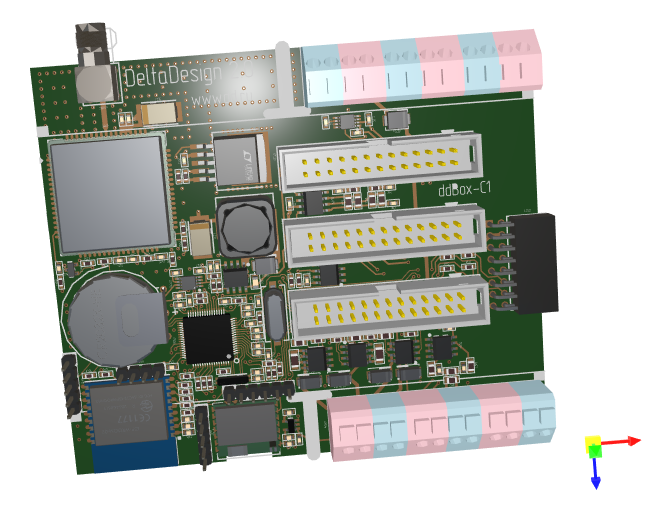
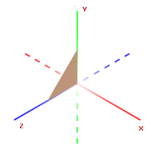
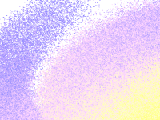
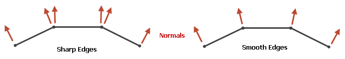
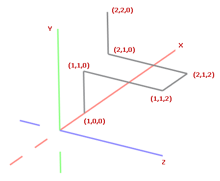
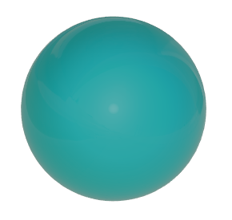
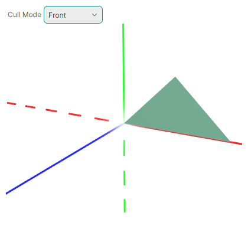

# Graphics3DControl Overview

The `Graphics3DControl` control allows you to embed 3D models in your Avalonia application. The control supports the rotate, pan and zoom operations using the mouse and keyboard, allowing a user to interact with the models at runtime. 



Any 3D model is composed of meshes painted using specified materials. The `Graphics3DControl` provides an API to define meshes, materials, camera and light settings. You can also utilize third-party libraries to load models in OBJ and STL formats to the `Graphics3DControl` control.

## Main Features

- API to specify 3D models
- Displaying multiple 3D models simultaneously
- Perspective and isometric cameras
- Supported meshes types: triangular, lines and points
- Simple and textured materials
- 3D model transformations
- Front- and back-culling
- Support for the MVVM design pattern to define 3D models
- Displaying axes and grids

### User Interactions

- Rotate, pan, and zoom the models using the mouse and keyboard
- Hints
- Element highlight and selection

See [User Interactions with 3D Models](user-interactions-with-3d-models.md)

## Get Started

- [Get Started with Graphics3DControl](get-started-with-graphics3dcontrol.md) — Demonstrates how to create a 3D model from scratch.

## Demos

Check out the [Eremex Avalonia Controls Demo](https://github.com/Eremex/controls-demo) application which contains examples demonstrating various features of the `Graphics3DControl`:

- Loading Wavefront (Obj) and Stl models from external files using third-party libraries, and creating 3D models from the loaded data.
- Creating 3D models from scratch.
- Showcasing the supported mesh types: triangular, lines and points.
- Using the MVVM design pattern to define 3D models, and more.


## Paint Theme for the Graphics3DControl

Starting with version 1.3, to use the `Graphics3DControl` you must register the `Controls3D` paint theme in the _App.xaml_ file.  This theme contains common appearance settings required to render the `Graphics3DControl`. See the following topic for more information:

- [Register the Paint Theme for the Graphics3DControl](get-started-with-graphics3dcontrol.md#prerequisites-register-the-paint-theme-for-the-graphics3dcontrol)


!!! note

    If the `Controls3D` paint theme is not registered, a `Graphics3DControl` will appear blank.


## Coordinate System, Axes and Grids

The `Graphics3DControl` supports right-handed (default) and left-handed coordinate systems. You can use the `Graphics3DControl.CoordinateSystem` property to enable the required option.

``` xml
<mx3d:Graphics3DControl Name="g3DControl" ShowAxes="True" CoordinateSystem="LeftHanded" ...>
```

### Right-Handed Coordinate System

The positive X, Y and Z axes point right, up and toward the viewer, respectively.



### Left-Handed Coordinate System

The positive X, Y and Z axes point right, up and away from the viewer, respectively.


<!-- TODO
перепутаны оси
 -->

### Axes

Enable the `Graphics3DControl.ShowAxes` property to display the X, Y and Z axes in the control.


``` xml
<mx3d:Graphics3DControl Name="g3DControl" ShowAxes="True"/>
```

#### Related Options

- `Graphics3DControl.AxisThickness` property — Specifies the thickness of the axes.


### Gizmo

`Graphics3DControl` can display a Gizmo. It is a separate widget that visually indicates the current orientation of the axes in 3D space.


To enable the Gizmo, initialize the `Graphics3DControl.Gizmo` property with an instance of the `Eremex.AvaloniaUI.Controls3D.Gizmo` class.

``` xml
<mx3d:Graphics3DControl Name="g3DControl" >
        <!-- ... -->
    <mx3d:Graphics3DControl.Gizmo>
        <mx3d:Gizmo Name="gizmo" />
    </mx3d:Graphics3DControl.Gizmo>
</mx3d:Graphics3DControl>
```

You can paint the Gizmo in a custom manner. To do this, use the `Gizmo.Models` or `Gizmo.ModelsSource` property to specify 3D model(s) to render the Gizmo. The process of populating these properties is identical to that of the `Graphics3dControl`, as both classes inherit from the same base class.

### Grids

The `Graphics3DControl.ShowGrid` property allows you to display grids on the XY, XZ, and YZ planes.

](../../images/g3d-grid.png)

``` xml
<mx3d:Graphics3DControl Name="g3DControl" ShowGrid="True"/>
```

#### Related Options

- `Graphics3DControl.GridThickness` property — Specifies the thickness of grid lines.

<!-- TODO
Option for grid spacing ?
 -->


## Models

To define 3D models for a `Graphics3DControl`, use the `Graphics3DControl`'s API to create objects that represent models, meshes, vertices, materials, cameras, etc.

###  Define 3D Models

The `GeometryModel3D` class encapsulates a single 3D Model in the `Graphics3DControl`. 
Use one of the following properties to add 3D models to the control:

- `Graphics3DControl.Models` — A collection of `GeometryModel3D` objects. 
- `Graphics3DControl.ModelsSource` — A source of business objects used to create 3D models (`GeometryModel3D` objects) according to the MVVM design pattern.

``` xml
xmlns:mx3d="https://schemas.eremexcontrols.net/avalonia/controls3d"

<mx3d:Graphics3DControl Name="g3DControl" ShowAxes="True"/>
```

``` cs
using Eremex.AvaloniaUI.Controls3D;

GeometryModel3D model = new GeometryModel3D();
g3DControl.Models.Add(model);
```


### Meshes

A 3D model represents a collection of meshes rendered using specific materials. Meshes define the shape and structure of a 3D object. 

The `MeshGeometry3D` class represents a mesh in the `Graphics3DControl`. The following properties allow you to specify meshes for the model:

- `GeometryModel3D.Meshes` — A collection of `MeshGeometry3D` objects.
- `GeometryModel3D.MeshesSource` — A source of business objects used to create meshes (`MeshGeometry3D` objects) according to the MVVM design pattern.

The control supports three mesh types, which you can choose with the `MeshGeometry3D.FillType` property.


- `MeshFillType.Triangles` (default) — A triangle mesh. Consists of triangular faces (flat areas enclosed by three edges). 

  

- `MeshFillType.Lines` — Line mesh. Vertices are connected with lines to form a wireframe.

  

- `MeshFillType.Points` — Point mesh (point cloud). Consists of vertices, which are not connected with lines.

  
  


``` cs
using DynamicData;

MeshGeometry3D meshTriangle1 = new MeshGeometry3D();
MeshGeometry3D meshSquare = new MeshGeometry3D();
MeshGeometry3D meshPoints = new MeshGeometry3D() { FillType = MeshFillType.Points };
//Define the meshes
//...
model.Meshes.AddRange(new[] { meshTriangle1, meshSquare, meshPoints });
```

When creating a mesh, use the following properties to define vertices and faces/lines:

- `MeshGeometry3D.Vertices` array — Specifies an array of all vertices that compose the mesh. 
- `MeshGeometry3D.Indices` array — Defines triangular faces (for a triangle mesh), or lines (for a line mesh).


#### Vertices

A vertex is a point in 3D space defined by its coordinates (x, y, z).

The `Vertex3D` type encapsulates a single vertex in the `Graphics3DControl`. Use the `MeshGeometry3D.Vertices` array to add vertices to a mesh.

The `Vertex3D` type exposes the following main properties that you need to initialize.

- `Vertex3D.Position` — A `Vector3` value that specifies the (x, y, z) coordinates of the vertex.
- `Vertex3D.Normal` — A `Vector3` value that specifies a vertex normal. A vertex normal is a vector that is perpendicular to the surface of a 3D model at that vertex. In 3D graphics, vertex normals are used to calculate lighting and shading for the mesh. The normals of neighboring triangles must be aligned to ensure smooth shading (edges).

  

- `Vertex3D.TextureCoord` — A `Vector2` value that specifies the (x, y) coordinates of the point in the textured material that is mapped to the current vertex.

#### Define a Triangle Mesh

To create a triangle mesh you need to divide a shape into triangles. Vertices specify the corners of the triangles. The `MeshGeometry3D.FillType` property needs to be set to its default value (`MeshFillType.Triangles`).

Consider an example in which a mesh has a quadrilateral shape. It can be triangulated by adding a single diagonal.


First, add all vertices to the `MeshGeometry3D.Vertices` array.

``` xml
<mx3d:Graphics3DControl Name="g3DControl" ShowAxes="True"/>
```

``` cs
using DynamicData;

GeometryModel3D model = new GeometryModel3D();
g3DControl.Models.Add(model);

Vector3 pt1 = new(2f, 0, 0);
Vector3 pt2 = new(0, 0, 0);
Vector3 pt3 = new(0, 0, 1);
Vector3 pt4 = new(2f, 0, 1);

MeshGeometry3D meshSquare = new MeshGeometry3D();
meshSquare.FillType = MeshFillType.Triangles;
Vertex3D[] meshSquareVertices = new Vertex3D[]
{
    new Vertex3D() { Position = pt1,  Normal = new Vector3(0, 1, 0) },
    new Vertex3D() { Position = pt2,  Normal = new Vector3(0, 1, 0) },
    new Vertex3D() { Position = pt3,  Normal = new Vector3(0, 1, 0) },
    new Vertex3D() { Position = pt4,  Normal = new Vector3(0, 1, 0) }
};
meshSquare.Vertices = meshSquareVertices;
//...
model.Meshes.AddRange(new[] { meshSquare });
```

Then use the `MeshGeometry3D.Indices` property to form triangle faces.

For a triangle mesh, the `MeshGeometry3D.Indices` property is an array of indices of vertices in the `MeshGeometry3D.Vertices` array that define individual mesh triangles. This array contains groups of **three** indices each. The first three indices in the array refer to the vertices of the first mesh triangle. The next three indices refer to the vertices of the second mesh triangle, and so on.
The order of the indices for each triangle is important because it determines the surface normal. The surface normal, in turn, identifies the front and back sides of the triangle, which is essential for operations like back-face and front-face culling.

For the quad mesh above, the `MeshGeometry3D.Indices` array should contain six indices. The first three indices refer to the vertices of the first triangle. The second three indices refer to the vertices of the second triangle.

``` cs
uint[] meshSquareIndices = new uint[] { 0, 1, 3, 1, 2, 3 };
meshSquare.Indices = meshSquareIndices;
```

#### Define a Line Mesh

In a line mesh, vertices are connected with lines. To define a line mesh, create a `MeshGeometry3D` object and set its `MeshGeometry3D.FillType` property to `MeshFillType.Lines`. Then use the `MeshGeometry3D.Vertices` property to specify all vertices, and the `MeshGeometry3D.Indices` property to connect the vertices with lines.

Consider the following 3D model composed of lines connecting six points.



First, add all vertices to the `MeshGeometry3D.Vertices` array.

``` xml
<mx3d:Graphics3DControl Name="g3DControl" ShowAxes="True"/>
```

``` cs
GeometryModel3D model = new GeometryModel3D();
g3DControl.Models.Add(model);

Vector3 p0 = new(1, 0, 0);
Vector3 p1 = new(1, 1, 0);
Vector3 p2 = new(1, 1, 2);
Vector3 p3 = new(2, 1, 2);
Vector3 p4 = new(2, 1, 0);
Vector3 p5 = new(2, 2, 0);

MeshGeometry3D meshLines = new MeshGeometry3D();
meshLines.PrimitiveSize = 3;
meshLines.FillType = MeshFillType.Lines;
Vertex3D[] meshLinesVertices = new Vertex3D[]
{
    new Vertex3D() { Position = p0,  Normal = new Vector3(0, 1, 0) },
    new Vertex3D() { Position = p1,  Normal = new Vector3(0, 1, 0) },
    new Vertex3D() { Position = p2,  Normal = new Vector3(0, 1, 0) },
    new Vertex3D() { Position = p3,  Normal = new Vector3(0, 1, 0) },
    new Vertex3D() { Position = p4,  Normal = new Vector3(0, 1, 0) },
    new Vertex3D() { Position = p5,  Normal = new Vector3(0, 1, 0) }
};
meshLines.Vertices = meshLinesVertices;
//...
model.Meshes.Add(meshLines);
```

<!-- TODO
Should I specify vertex Normals in a line and point meshes?
 -->


Use the `MeshGeometry3D.Indices` property to connect the vertices with lines. For a line mesh, the `MeshGeometry3D.Indices` property is an array of indices of vertices in the `MeshGeometry3D.Vertices` array that define individual lines.
This array contains pairs of indices. The first two indices in the array refer to the vertices of the first line. The next two indices refer to the vertices of the second line, and so on.

For the example above, the `MeshGeometry3D.Indices` array should contain 10 indices. The first pair of indices refers to the points that define the first line. The second pair of indices refers to the vertices of the second line, and so on.

``` cs
uint[] meshLinesIndices = new uint[] { 0, 1, 1, 2, 2, 3, 3, 4, 4, 5 };
meshLines.Indices = meshLinesIndices;
```

##### Thickness of Lines

In a line mesh, use the `PrimitiveSize` property to change the thickness of lines. 


#### Define a Point Mesh

In a point mesh, vertices are rendered as individual points. 

To define a point mesh, create a `MeshGeometry3D` object and set its `MeshGeometry3D.FillType` property to `MeshFillType.Points`. Then use the `MeshGeometry3D.Vertices` property to specify all vertices, and the `MeshGeometry3D.Indices` property to specify which vertices to render.

Let's create a point mesh that forms a spiral, in which points are arranged in the XY plane.


``` cs
int pointCount = 500;

GeometryModel3D model = new GeometryModel3D();
g3DControl.Models.Add(model);
var vertices = new Vertex3D[pointCount];
var indices = new uint[pointCount];
MeshGeometry3D meshPoints = new MeshGeometry3D();
meshPoints.PrimitiveSize = 3;
meshPoints.MaterialKey = "pointsMaterial";
meshPoints.FillType = MeshFillType.Points;
double radius = 0;
double angle = 0;
double radiusStep = 0.1;
double angleStep = 0.1;
for (uint i = 0; i < pointCount; i++)
{
    double x = radius * Math.Cos(angle);
    double y = radius * Math.Sin(angle);
    vertices[i] = new Vertex3D() { 
        // Vertex coordinates:
        Position = new Vector3((float)x, (float)y, 0), 
        // Normalized coordinates of a position in the texture mapped to the current vertex:
        TextureCoord= new Vector2((float)i/pointCount, 0) 
    };
    radius += radiusStep;
    angle += angleStep;
    indices[i] = i;
}
meshPoints.Vertices = vertices;
meshPoints.Indices = indices;
model.Meshes.Add(meshPoints);
```

<!-- TODO
Remove line:
meshPoints.MaterialKey = "pointsMaterial";

Display a non-colorlized image (intermediate stage)
Then colorlize the spiral
 -->


You can colorize vertices in a point mesh with different colors. For instance, vertices can be painted with colors determined by their positions or coordinates.

The code below shows how to use a textured material to colorize vertices. The index of a vertex determines its color (the position in the following color gradient).


1. Add a textured material (`TexturedPbrMaterial`) to the `Graphics3DControl.Materials` collection. A textured material represents a set of bitmaps that specify the following texture settings:
    - `Albedo` — Base color
    - `Alpha` — Transparency
    - `Emission` — Intensity of light emitted from the surface
    - `AmbientOcclusion` — Level of the shadowing caused by objects blocking the ambient light
    - `Roughness` — Smoothness of the surface
    - `Metallic` — Reflectivity of the surface settings 

    Vertices are later mapped to specific positions within these texture bitmaps.

    To ensure that the vertices display the realistic colors from the target color gradient, configure the texture bitmaps as follows:
    
    - Set `TexturedPbrMaterial.Emission` to the gradient bitmap that determines the real color of the vertices. 
    - Set `TexturedPbrMaterial.Albedo` to a bitmap filled with black.
    - Set `TexturedPbrMaterial.Roughness` and `TexturedPbrMaterial.AmbientOcclusion` to bitmaps that are filled with white.

    ``` cs
    using DynamicData;
    using Avalonia.Media;

    public void InitG3DControlMaterials()
    {
        g3DControl.Materials.AddRange(
            new[] {
                new TexturedPbrMaterial(){
                    Albedo = getSolidColorBitmap(Colors.Black),
                    Roughness = getSolidColorBitmap(Colors.White),
                    AmbientOcclusion = getSolidColorBitmap(Colors.White),
                    Emission = getGradientColorBitmap(Colors.DodgerBlue, Colors.Red), 
                    Key= "pointsMaterial"
                }
            }
        );
    }

    Bitmap getSolidColorBitmap(Color fillColor)
    {
        var bitmap = new RenderTargetBitmap(new PixelSize(pointCount, 1));
        using (var context = bitmap.CreateDrawingContext())
        {
            Brush brush = new SolidColorBrush(fillColor);
            context.FillRectangle(brush, new Rect(0, 0, pointCount, 1));
        }
        return bitmap;
    }

    Bitmap getGradientColorBitmap(Color fillColor1, Color fillColor2)
    {
        var bitmap = new RenderTargetBitmap(new PixelSize(pointCount, 1));
        using (var context = bitmap.CreateDrawingContext())
        {
            var gradientBrush = new LinearGradientBrush
            {
                StartPoint = new RelativePoint(0, 0, RelativeUnit.Relative),
                EndPoint = new RelativePoint(1, 1, RelativeUnit.Relative),
                GradientStops = {
                    new GradientStop(fillColor1, 0.0),
                    new GradientStop(fillColor2, 1.0)
                }
            };

            context.FillRectangle(gradientBrush, new Rect(0, 0, pointCount, 1));
        }
        return bitmap;
    }
    ```

    The material's `TexturedPbrMaterial.Key` property is set to a unique key (string). Unique keys allow identification of materials in the `Graphics3DControl.Materials` collection.

2. Assign the created material to the mesh using the `MeshGeometry3D.MaterialKey` property. The `MeshGeometry3D.MaterialKey` property should match the value of the `TexturedPbrMaterial.Key` setting.

    ``` cs
    meshPoints.MaterialKey = "pointsMaterial";
    ```

3. Use the `Vertex3D.TextureCoord` property to map vertices to specific positions in the texture. This property should specify normalized coordinates. The _TextureCoord.X_ and _TextureCoord.Y_ values should be in the range between 0 and 1, where 0 corresponds to the left or top edge of the texture bitmap, and 1 corresponds to the right or bottom edge of the texture bitmap.

    When vertices are created, specify the `Vertex3D.TextureCoord` property to address target positions in the texture. 

    ``` cs
    vertices[i] = new Vertex3D() { 
        // Vertex coordinates:
        Position = new Vector3((float)x, (float)y, 0), 
        // Normalized coordinates of a position in the texture mapped to the current vertex:
        TextureCoord= new Vector2((float)i/pointCount, 0) 
    };
    ```

    Now the vertices are colorized using the specified gradient.

    <!-- TODO
    Final image (with a different camera angle)
    -->

    <!-- TODO
    Check the phrase: where 0 corresponds to the left or ____top____ edge, 
    and 1 corresponds to the right or _____bottom_____
    -->

##### Thickness of Points

In a point mesh, use the `PrimitiveSize` property to change the thickness of points.


### Model Visibility

Use the `GeometryModel3D.Visible` property to temporarily hide and then restore a model.

``` cs
GeometryModel3D model = new GeometryModel3D();
g3DControl.Models.Add(model);
//...
model.Visible = !model.Visible;
```

### Model Transformations

The `Graphics3DControl` allows you to perform transformations on models. For this purpose, construct a transformation matrix that rotates, scales and/or translates the model. Once created, assign this matrix to the `GeometryModel3D.Transform` property.

To clear the current transformation, set the `GeometryModel3D.Transform` property to a `Matrix4x4.Identity` object.

The `Matrix4x4` class provides methods to generate transformation matrices for various types of transformations. Some of these methods include:

- `Matrix4x4.CreateRotationX` — Generates a transformation matrix that represents a rotation around the X-axis by a specified angle.
- `Matrix4x4.CreateRotationY` — Generates a transformation matrix that represents a rotation around the Y-axis by a specified angle.
- `Matrix4x4.CreateRotationZ` — Generates a transformation matrix that represents a rotation around the Z-axis by a specified angle.
- `Matrix4x4.CreateTranslation` —  Generates a transformation matrix that moves an object by a specified offset along the X, Y, and Z axes.
- `Matrix4x4.CreateScale` — Generates a transformation matrix that scales an object along the X, Y, and Z axes.


To apply multiple transformations at the same time, you can multiply matrices that preform individual transformations.

#### Example - Rotate a model

The following example creates an animation that rotates a 3D model (a spiral consisting of points). The `Matrix4x4.CreateRotationZ` method is called to generate a transformation matrix that rotates the model by a specified angle around the Z axis.
To apply the transformation, this matrix is assigned to the `GeometryModel3D.Transform` property.


``` cs
GeometryModel3D model;
//Init the model
//...
float angleStep = MathF.PI / 180;
float angle = 0;

private void BtnRotate_Click(object? sender, Avalonia.Interactivity.RoutedEventArgs e)
{
    for (int i = 0; i < 180; i++) 
    {
        angle += angleStep;
        Matrix4x4 rotationMatrix = Matrix4x4.CreateRotationZ(angle);
        model.Transform = rotationMatrix;
        // Update the UI
        Dispatcher.UIThread.RunJobs();
        Thread.Sleep(12);
    }
}
```

#### Example - Perform multiple transformations

The following example creates a 3D model that renders a triangle, and shows how to perform multiple transformations on the model.

The example combines scaling, rotation and translation operations into a single transformation matrix, and then assigns this matrix to the `GeometryModel3D.Transform` property to apply the transformations.

The example applies small incremental changes to the transformation matrices, creating a smooth animation effect.


``` xml
xmlns:mx3d="https://schemas.eremexcontrols.net/avalonia/controls3d"

<mx3d:Graphics3DControl Name="g3DControl" ShowAxes="True" Grid.Row="1"/>
```

``` cs
using DynamicData;

public MainWindow()
{
    InitG3dControl();
}

private void InitG3dControl()
{
    // Create a 3D model that renders a triangle.
    GeometryModel3D model = new GeometryModel3D();
    g3DControl.Models.Add(model);
    Vector3 pt1 = new(1f, 0, 0);
    Vector3 pt2 = new(0, 0, 0);
    Vector3 pt3 = new(0, 0, 1);
    MeshGeometry3D meshSquare = new MeshGeometry3D();
    meshSquare.FillType = MeshFillType.Triangles;
    Vertex3D[] meshSquareVertices = new Vertex3D[]
    {
        new Vertex3D() { Position = pt1,  Normal = new Vector3(0, 1, 0) },
        new Vertex3D() { Position = pt2,  Normal = new Vector3(0, 1, 0) },
        new Vertex3D() { Position = pt3,  Normal = new Vector3(0, 1, 0) }
    };
    uint[] meshSquareIndices = new uint[] { 0, 1, 2 };
    meshSquare.Indices = meshSquareIndices;
    meshSquare.Vertices = meshSquareVertices;
    model.Meshes.AddRange(new[] { meshSquare });
    this.model = model;
}

//Transform the model
private void BtnRotate_Click(object? sender, Avalonia.Interactivity.RoutedEventArgs e)
{
    int steps = 100;
    Vector3 stepTranslationVector = new Vector3(-0.5f, 0, 0)/steps;
    Vector3 stepScaleVector = new Vector3(-0.5f, 0, 0.1f)/steps;
    float stepRotationAngle = (MathF.PI/2)/steps;

    Vector3 translationVector = new Vector3(0,0,0), 
        scaleVector = new Vector3(1, 1, 1);
    float rotationAngle = 0;

    for (int i = 0; i < steps; i++)
    {
        rotationAngle += stepRotationAngle;
        translationVector += stepTranslationVector;
        scaleVector += stepScaleVector;

        // Translation Matrix (move by)
        Matrix4x4 translationMatrix = Matrix4x4.CreateTranslation(translationVector);
        // Scaling Matrix
        Matrix4x4 scalingMatrix = Matrix4x4.CreateScale(scaleVector);
        // Rotation Matrix
        Matrix4x4 rotationMatrix = Matrix4x4.CreateRotationY(rotationAngle);
        rotationMatrix *= Matrix4x4.CreateRotationX(rotationAngle);

        Matrix4x4 combinedMatrix = Matrix4x4.Identity;
        combinedMatrix *= scalingMatrix;
        combinedMatrix *= rotationMatrix;
        combinedMatrix *= translationMatrix;

        model.Transform = combinedMatrix;
        // Update the UI
        Dispatcher.UIThread.RunJobs();
        Thread.Sleep(12);
    }
}
```


### Multisampling (Anti-aliasing)

- `Graphics3DControl.MultisamplingMode` — Activates multisample anti-aliasing (MSAA) or disables it. 

The anti-aliasing feature is used to reduce visual artifacts, such as jagged edges (aliasing), in rendered graphics, producing smoother and more refined results. 


The `MultisamplingMode` property can be set to the following values: `None`, `X2`, `X4`, `X8`, `X16`, `X32`, `X64`. The `X2`...`X64` values determine the number of sample points per pixel to calculate the final color of a pixel. More samples lead to better results, however it is also more computationally expensive.

- The `MultisamplingMode` property's default value is `X8`.
- Not all MSAA modes may be supported by your GPU. If an unsupported MSAA mode is chosen, the system falls back to a lower available mode. You can use the `Graphics3DControl.AvailableMultisamplingModes` property to return a list of MSAA modes supported by your graphics driver.
- Multisampling for large 3D models increases memory usage and computational costs. To improve application performance in such cases, consider setting the `MultisamplingMode` to a lower value or disabling MSAA.


<!-- TODO

Демка с чайником:

- Слишком чувствительная реакция на события мыши

- Почему нельзя приблизить ближе ?

- можно ли попасть внутрь объекта?
 -->


## Materials

Each mesh in a `Graphics3DControl` control can be painted with its own material. A material specifies how surfaces interact with light, giving objects their visual appearance.

The `Graphics3DControl` control supports two material types:

- `SimplePbrMaterial` — A material that defines the visual properties of a surface using numeric values, such as colors (e.g., albedo and emission) and light interaction settings (e.g., metallic and roughness). For more information see [Simple Materials (SimplePbrMaterial)](#simple-materials-simplepbrmaterial)

- `TexturedPbrMaterial` — A textured material in PBR format. This material specifies the visual properties of a surface using textures (bitmaps). For more information see [Textured Materials (TexturedPbrMaterial)](#textured-materials-texturedpbrmaterial)

To apply materials to meshes, do the following:

1. Create and initialize materials.
1. Set the `Key` property for the materials to unique strings. The keys allow for material identification when assigning the materials to meshes.
1. Add the materials to the `Graphics3DControl.Materials` collection.
1. Use the `MeshGeometry3D.MaterialKey` property to associate a mesh with a specific material. For this purpose, set the `MeshGeometry3D.MaterialKey` property to the `Key` property of the target material.

### Example - Assign a material to a mesh

The following example creates three materials (`SimplePbrMaterial` objects), and applies one of these materials to a mesh. The materials created are identified by unique string keys ("BrownColor", "TomatoColor" and "VioletColor").

``` cs
using DynamicData;

g3DControl.Materials.AddRange(
    new[] {
        new SimplePbrMaterial(Color.FromUInt32(0xFF822c2e), "BrownColor"),
        new SimplePbrMaterial(Color.FromUInt32(0xffeb523f), "TomatoColor"),
        new SimplePbrMaterial(Color.FromUInt32(0xFFea3699), "VioletColor")
    }
);

//...

mesh1.MaterialKey = "VioletColor";
```

### Simple Materials (`SimplePbrMaterial`)

`SimplePbrMaterial` is a material that describes the visual properties of a surface as numeric values. It provides the following members to specify the visual settings:

- `Albedo` — The base color. 

    The property's value is a Vector3 object whose X, Y and Z members specify normalized values for the Red, Green and Blue color components. Normalized values fall in the range [0;1]. To convert a standard color component (0–255) to a normalized value, divide it by 255. You can also use the `SimplePbrMaterial` constructor to initialize the `Albedo` and `Alpha` properties from a specified `Color` object. This constructor automaticaly normalizes the color components.

- `Alpha` — The transparency level. 

    The property's value should be in the range [0;1], where `0` means fully transparent, and `1` means fully opaque.

- `Emission` — Intensity of light emitted from the surface.

    The property's value is a Vector3 object whose X, Y and Z members specify normalized values for the Red, Green and Blue color components. Normalized values fall in the range [0;1]. To convert a standard color component (0–255) to a normalized value, divide it by 255.

- `AmbientOcclusion` — Level of the shadowing caused by objects blocking the ambient light.

    The property's value should be in the range [0;1], where `0` means that the maximum effect of ambient occlusion is applied, and `1` means that no ambient occlusion is applied.

- `Roughness` — Smoothness of the surface.

    The property's value should be in the range [0;1], where `0` means a perfectly smooth and glossy surface, and `1` means a completely rough and matte surface.

- `Metallic` — Reflectivity of the surface.

    The property's value should be in the range [0;1], where `0` means a non-metallic surface, and `1` means a fully metallic material.

#### Demo

The `Simple Materials` example in the [demo application](../../index.md#demo-application) demonstrates a 3D model painted using a simple material. The demo allows you to adjust the material's settings in real time and instantly see the effects of your changes.


#### Example - Apply a simple material to a model

The following code creates a simple material (`SimplePbrMaterial` object) and applies it to the first mesh of a 3D model.
The `SimplePbrMaterial.Albedo` property is set to the base color (Teal), using normalized color coordinates.

``` cs
SimplePbrMaterial material = new SimplePbrMaterial();
material.Albedo = ToNormalizedVector3(Colors.Teal);
material.Emission = ToNormalizedVector3(Colors.Black);
material.Metallic = 0;
material.Roughness = 0.5f;
material.AmbientOcclusion = 1;
material.Key = "myFavMaterial";
g3DControl.Materials.Add(material);

// Apply the material to the first mesh of the model
g3DControl.Models[0].Meshes[0].MaterialKey = "myFavMaterial";


public static Vector3 ToNormalizedVector3(Color color)
{
    return new Vector3(color.R/255f, color.G/255f, color.B/255f);
}
```

This material, when applied to a sample 3D model, is shown below:




### Textured Materials (`TexturedPbrMaterial`)

`TexturedPbrMaterial` is a material that uses PBR textures (bitmaps) to define the visual properties of a surface. The `TexturedPbrMaterial` class provides the following members to configure the material's settings:

- `Albedo` — A bitmap that specifies the base color of the material. 

- `Alpha` — A bitmap that specifies the transparency level. 

- `Emission` — A bitmap that specifies the intensity of light emitted from the surface.

- `AmbientOcclusion` — A bitmap that specifies the level of the shadowing caused by objects blocking the ambient light.

- `Roughness` — A bitmap that specifies smoothness of the surface.

- `Metallic` — A bitmap that specifies reflectivity of the surface.

- `Normal` — A bitmap that specifies a Normal Map.

#### Demo

The `Textured Materials` example in the [demo application](../../index.md#demo-application) demonstrates a 3D model rendered using PBR textures. The textures are loaded from graphic files stored in the application's resources.


The following code snippet from the `Textured Materials` demo populates a View Model's `Materials` collection with materials (`TexturedPbrMaterial` objects). These materials are created for all textures that are stored as ZIP files in the application's resources, located in the `DemoCenter.Resources.Graphics3D.Materials` folder. For each material, if a ZIP file with a texture contains bitmaps for the `Albedo`, `AmbientOcclusion`, `Metallic`, `Roughness`, `Normal` and `Emission` settings, these bitmaps are loaded and applied to the material.

``` cs
public partial class Graphics3DControlTexturedMaterialsViewModel : Graphics3DControlViewModel
{
    [ObservableProperty] ObservableCollection<TexturedPbrMaterial> materials = new();
    [ObservableProperty] TexturedPbrMaterial selectedMaterial;

    public Graphics3DControlTexturedMaterialsViewModel()
    {
        var assembly = Assembly.GetAssembly(typeof(Graphics3DControlViewModel));
        var textureNames = assembly!.GetManifestResourceNames().Where(name => name.StartsWith("DemoCenter.Resources.Graphics3D.Materials."));
        foreach (var textureName in textureNames)
            materials.Add(LoadMaterial(assembly, textureName));
        selectedMaterial = Materials.First();
        //...
    }

    static TexturedPbrMaterial LoadMaterial(Assembly assembly, string resourceName)
    {
        var stream = assembly!.GetManifestResourceStream(resourceName);
        using var archive = new ZipArchive(stream!, ZipArchiveMode.Read);
        var material = new TexturedPbrMaterial { Key = resourceName.Split('.')[^2] };
        foreach (var entry in archive.Entries)
        {
            using var entryStream = entry.Open();
            using var memoryStream = new MemoryStream();
            entryStream.CopyTo(memoryStream);
            memoryStream.Seek(0, SeekOrigin.Begin);
            var bitmap = new Bitmap(memoryStream);
            if (entry.Name.StartsWith("Albedo"))
                material.Albedo = bitmap;
            else if (entry.Name.StartsWith("AO"))
                material.AmbientOcclusion = bitmap;
            else if (entry.Name.StartsWith("Metallic"))
                material.Metallic = bitmap;
            else if (entry.Name.StartsWith("Roughness"))
                material.Roughness = bitmap;
            else if (entry.Name.StartsWith("Normal"))
                material.Normal = bitmap;
            else if (entry.Name.StartsWith("Emissive"))
                material.Emission = bitmap;
        }
        return material;
    }
}
```

The XAML code below from the `Textured Materials` demo binds a `Graphics3DControl` control to the collection of materials in the View Model (`Graphics3DControlTexturedMaterialsViewModel.Materials`). The material currently applied is specified by the `Graphics3DControlTexturedMaterialsViewModel.SelectedMaterial` property.

``` xml
<mx3d:Graphics3DControl x:Name="DemoControl" MaterialsSource="{Binding Materials}">
    <mx3d:GeometryModel3D>
        <mx3d:MeshGeometry3D Vertices="{Binding Vertices}" Indices="{Binding Indices}" MaterialKey="{Binding SelectedMaterial.Key}" />
    </mx3d:GeometryModel3D>
</mx3d:Graphics3DControl>
```

#### Texture Coordinates

When you use a textured material, you need to map the texture to a surface. For this purpose, initialize the `Vertex3D.TextureCoord` property of vertices in your mesh. This property specifies texture coordinates (often referred to as UV coordinates). 

Texture coordinates are 2D coordinates `(x, y)` to which a vertice is mapped.

- `x` represents a horizontal coordinate in the texture, in the range [0; 1], where `0` represents the left edge, and `1` represents the right edge of the image. 

- `y` represents the vertical coordinate in the texture, in the range [0; 1], where `0` represents the top edge, and `1` represents the bottom edge of the image.

<!-- TODO
Check what's the meaning for 'y=1' and 'y=0'?
-->

For example, an `(x, y)` coordinate of `(0.5, 0.5)` would sample the pixel at the center of the texture.

##### Examples

Examples that demonstrate the use of the `Vertex3D.TextureCoord` property:

- `Textured Materials` demo.

- Example in the [Define a Point Mesh](#define-a-point-mesh) section in the current documentation.


## Back-face and Front-face Culling

The `Graphics3DControl.CullMode` property allows you to enable back-face and front-face culling for [triangle meshes](#meshes). Cull mode determines which faces of a 3D model should be drawn and which should be discarded. You can set the `Graphics3DControl.CullMode` property to the following values:

- `CullMode.Back` — Enables back-face culling, in which back faces of the triangles are not drawn.

- `CullMode.Front` — Enables front-face culling, in which front faces of the triangles are not drawn.

- `CullMode.None` — Front and back faces are drawn.

### Identify Back and Front of Faces

When you [define triangular faces](#define-a-triangle-mesh) for a mesh you use the `MeshGeometry3D.Indices` property to specify the indices of the vertices that form each triangle. 

The order of indices for each mesh triangle is important, as it determines the surface normal direction, and so the front and back of the triangle:

- If the indices of a triangle are enumerated counter-clockwise, the surface normal points toward the viewer, and the viewer is seeing the front of the triangle.

- If the indices of a triangle are enumerated clockwise, the surface normal points away from the viewer, and the viewer is seeing the back of the triangle.

 

### Example

This example demonstrates the face culling feature. 
In this example, a model that consists of two triangles is created. When displayed, the viewer is seeing the front of the first (left) triangle and back of the second (right) triangle.


``` xml
xmlns:mx3d="https://schemas.eremexcontrols.net/avalonia/controls3d"

<mx3d:Graphics3DControl Name="g3DControl" ShowAxes="True"/>
```

``` cs
using Avalonia.Media;
using DynamicData;

GeometryModel3D model = new GeometryModel3D();
g3DControl.Models.Add(model);

Vector3 pt1 = new(-1f, 0, 0);
Vector3 pt2 = new(-0.5f, 0.5f, 0);
Vector3 pt3 = new(0, 0, 0);
Vector3 pt4 = new(0, 0, 0);
Vector3 pt5 = new(0.5f, 0.5f, 0);
Vector3 pt6 = new(1f, 0, 0);

MeshGeometry3D mesh1 = new MeshGeometry3D();
mesh1.FillType = MeshFillType.Triangles;
Vertex3D[] meshVertices = new Vertex3D[]
{
    new Vertex3D() { Position = pt1,  Normal = new Vector3(0, 0, 1) },
    new Vertex3D() { Position = pt2,  Normal = new Vector3(0, 0, 1) },
    new Vertex3D() { Position = pt3,  Normal = new Vector3(0, 0, 1) },
    new Vertex3D() { Position = pt4,  Normal = new Vector3(0, 0, -1) },
    new Vertex3D() { Position = pt5,  Normal = new Vector3(0, 0, -1) },
    new Vertex3D() { Position = pt6,  Normal = new Vector3(0, 0, -1) }
};
mesh1.Vertices = meshVertices;
// Vertices of the first triangle are enumerated counter-clockwise (pt3->pt2->pt1),
// while vertices of the second triangle are enumerated clockwise (pt4->pt5->pt6):
uint[] meshIndices = new uint[] { 2, 1, 0, 3, 4, 5 };
mesh1.Indices = meshIndices;
model.Meshes.AddRange(new MeshGeometry3D[] { mesh1 });
g3DControl.Materials.Add(new SimplePbrMaterial(Colors.SeaGreen, "myMaterial"));
mesh1.MaterialKey = "myMaterial";
```

When you set the `Graphics3DControl.CullMode` property to `CullMode.Back`, back faces are not drawn. The second (right) triangle is facing away from the camera, so it is not drawn.


When `Graphics3DControl.CullMode` equals to `CullMode.Front`, front faces are not drawn. The first (left) triangle is facing toward the camera, so it is hidden:



## Gamma and Exposure Corrections

- `Graphics3DControl.Exposure` — Controls the exposure correction level, which adjusts the brightness of the rendered image. The default value is 4.5. The property can be set to a non-negative value.
- `Graphics3DControl.Gamma` — Controls gamma correction. The default value is 2.2, which is the standard gamma value for most displays. This property can be set to a non-negative value.