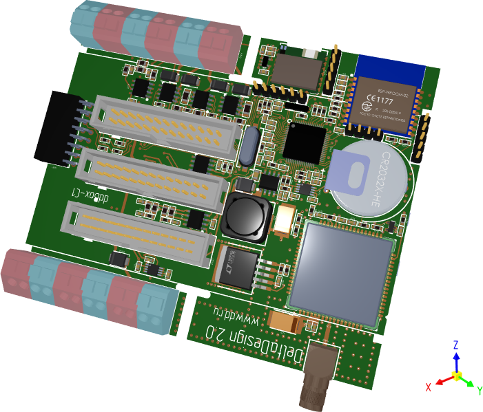

# Graphics 3D Control

[`Graphics3DControl`](../../API/Eremex.AvaloniaUI.Controls3D/Graphics3DControl.md) allows you to display one or more interactive 3D models in a window in your Avalonia UI application. The control's rendering engine is powered by the Vulkan API v1.1.

The control supports user interaction with the models, allowing users to rotate, pan, and zoom using mouse and keyboard actions.

To specify 3D models for the [`Graphics3DControl`](../../API/Eremex.AvaloniaUI.Controls3D/Graphics3DControl.md), use the control's API. This API includes classes and members to define vertices, meshes, materials (in PBR format), camera settings, model transformations, etc.

The control's main features include:

- Built on Vulkan SDK 1.1. See [System Requirements](system-requirements.md).
- GPU accelerated rendering with the Vulkan SDK
- Own API to specify 3D models
- Simple materials 
- Textured materials in PBR format
- Displaying multiple 3D models simultaneously
- Perspective and isometric camera modes
- Model rotation, panning and zooming with the mouse and keyboard at runtime
- Selection and highlight of model elements.
- Displaying hints for model elements.
- Model transformations
- MVVM pattern support for specifying 3D models

## Paint Theme for the Graphics3DControl

Starting with v1.3 of the EMX Controls library, you must register the `Controls3D` paint theme in the _App.xaml_ file to use the [`Graphics3DControl`](../../API/Eremex.AvaloniaUI.Controls3D/Graphics3DControl.md). This theme contains common appearance settings required to render the control correctly. See the following topic for more information:

- [Register the Paint Theme for the Graphics3DControl](get-started-with-graphics3dcontrol.md#prerequisites-register-the-paint-theme-for-the-graphics3dcontrol)

!!! note

    If the `Controls3D` paint theme is not registered, the [`Graphics3DControl`](../../API/Eremex.AvaloniaUI.Controls3D/Graphics3DControl.md) will appear blank.

## Demo

The following demo application contains examples that demonstrate the capabilities of the [`Graphics3DControl`](../../API/Eremex.AvaloniaUI.Controls3D/Graphics3DControl.md) component:

- [Eremex Avalonia Controls Demo](https://github.com/Eremex/controls-demo)

## Learn More

- [Get Started with Graphics3DControl](get-started-with-graphics3dcontrol.md)

- [Graphics3DControl Overview](graphics3dcontrol-overview.md)

- [System Requirements](system-requirements.md)
