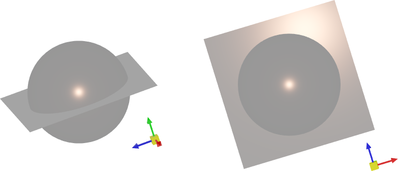

# Light

In Graphics3DControl, lights are used to illuminate 3D models. You can use the default light, or create custom light sources for your 3D scene.


## Default Light

The `Graphics3DControl` provides the default light out of the box. The default light represents a white point light linked to the camera. Its direction is always synced with the camera's direction.

The following image demonstrates the default light reflected from a metallic plane. 


The actual visual effect of any light is determined by [materials](graphics3dcontrol-overview.md#materials) applied to 3D models.


#### Related Options

- `Graphics3DControl.AllowDefaultLight` (default value is `true`) — Set this property to `false` to forcibly disable the default light.

    When you create custom lights, the default light is automatically disabled. 


## Custom Lights


To add custom lights to a 3D scene, create light sources and add them to the `Graphics3DControl.Lights` сollection. You can also use the `Graphics3DControl.LightsSource` and `Graphics3DControl.LightTemplate` property to add custom lights according to the MVVM design pattern.


`Graphics3DControl` supports the following light source types:

- Point Light (`PointLight`)
- Directional Light (`DirectionalLight`)
- Camera-related Point Light (`CameraPointLight`)
- Camera-related Directional Light (`CameraDirectionalLight`)

All these light sources have one ancestor, the `Light` abstract class.

### Point Light

Radiates in all directions (like a light bulb). 

#### Class

`PointLight`

#### Settings
    
- `Color` — The color of the light.
- `Position` — The position of the light emitter.
- `Radius` — The radius of the light emitter.

#### Example

The following example creates a Point Light of the Coral color. The image below demonstrates this light reflected from metallic plane and sphere.


``` xml
<mx3d:Graphics3DControl.Lights>
    <mx3d:PointLight Color="{Binding MyLightColor}" Position="{Binding MyLightPosition}" Radius="10"/>
</mx3d:Graphics3DControl.Lights>
```
``` cs
PointLight myLight = new PointLight();
myLight.Color = Avalonia.Media.Colors.Coral;
myLight.Position = new Vector3(0, 50, 0);
myLight.Radius = 10;
g3DControl.Lights.Add(myLight);
```

### Directional Light

Emits parallel rays in a specified direction, simulating distant illumination (like sunlight).


#### Class

`DirectionalLight`

#### Settings

- `Color` — The color of the light.
- `Direction` — A vector that specifies the direction of the light rays.

#### Example


The following example adds a Directional Light source pointed in the directon of the negative Y axis. The image below demonstrates this light reflected from metallic plane and sphere.


``` xml
<mx3d:Graphics3DControl.Lights>
    <mx3d:DirectionalLight Color="{Binding MyLightColor}" Direction="{Binding MyLightDirection}"/>
</mx3d:Graphics3DControl.Lights>
```
``` cs
using Eremex.AvaloniaUI.Controls3D;

DirectionalLight myLight = new DirectionalLight();
myLight.Direction = new System.Numerics.Vector3(0, -1, 0);
myLight.Color = Avalonia.Media.Colors.Coral;
g3DControl.Lights.Add(myLight);
```


### Camera-related Point Light

A point light emitted from the camera. The position and direction of this light are synced with those of the camera.

#### Class

`CameraPointLight`

#### Settings

- `Color` — The color of the light.
- `Radius` — The radius of the light emitter.

#### Example 

The following example creates a Point Light linked with the camera. The image below demonstrates this light reflected from metallic plane and sphere.



``` xml
<mx3d:Graphics3DControl.Lights>
    <mx3d:CameraPointLight Color="{Binding MyLightColor}" Radius="10"/>
</mx3d:Graphics3DControl.Lights>
```
``` cs
using Eremex.AvaloniaUI.Controls3D;

CameraPointLight myLight = new CameraPointLight();
myLight.Radius = 10;
myLight.Color = Avalonia.Media.Colors.Coral;
g3DControl.Lights.Add(myLight);
```


### Camera-related Directional Light

Emits parallel rays in the camera's direction, simulating distant illumination (like sunlight).

#### Class

`CameraDirectionalLight`

#### Settings

- `Color` — The color of the light.


#### Example 

The following example creates a Directional Light linked with the camera. The image below demonstrates this light reflected from metallic plane and sphere.


``` xml
<mx3d:Graphics3DControl.Lights>
    <mx3d:CameraDirectionalLight Color="{Binding MyLightColor}"/>
</mx3d:Graphics3DControl.Lights>
```
``` cs
using Eremex.AvaloniaUI.Controls3D;

CameraDirectionalLight myLight = new CameraDirectionalLight();
myLight.Color = Avalonia.Media.Colors.Coral;
g3DControl.Lights.Add(myLight);
```


<!-- TODO

### Add Lights Using the MVVM Approach

- `Graphics3DControl.LightsSource` — Supports the MVVM design patters. The `LightsSource` property is a collection of business objects  -->


