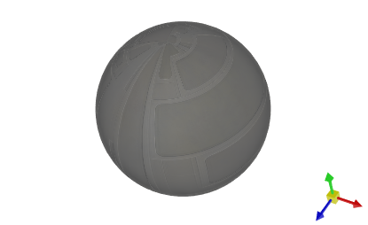

# Skybox

## What Is a Skybox?

[`Graphics3DControl`](../../API/Eremex.AvaloniaUI.Controls3D/Graphics3DControl.md) supports a skybox. A skybox is a technique used to create an immersive background around a 3D scene.

The skybox consists of a large cube surrounding the entire scene, with six textured faces (front, back, left, right, top, and bottom). These textures are mapped to the inner sides of the cube, giving the illusion of a distant sky, horizon, or other backdrop. The textures are designed to match perfectly at their edges, ensuring seamless visual continuity when viewed from inside the cube.

A skybox is hidden by default. However, if a model uses a metallic material, the skybox may appear in its reflections.

## Enable a Skybox

To make a skybox visible, initialize the [`Graphics3DControl.Skybox`](../../API/Eremex.AvaloniaUI.Controls3D/Graphics3DControl/Skybox.md) property with a [`Skybox`](../../API/Eremex.AvaloniaUI.Controls3D/Skybox.md) object, and set the [`Skybox.IsVisible`](../../API/Eremex.AvaloniaUI.Controls3D/Skybox/IsVisible.md) property to `true`.

``` xml
xmlns:mx3d="https://schemas.eremexcontrols.net/avalonia/controls3d"

<mx3d:Graphics3DControl Name="g3DControl1">
    <mx3d:Graphics3DControl.Skybox>
        <mx3d:Skybox IsVisible="True"/>
    </mx3d:Graphics3DControl.Skybox>
</mx3d:Graphics3DControl>
```

## Specify Custom Skybox Textures

To create a custom skybox, you need to specify six separate textures (bitmaps) that will be mapped to the front, back, left, right, top, and bottom faces of the skybox cube.


- All skybox textures must be the same size.
- Each texture should have a square aspect ratio (1:1) to prevent distortion when mapped to the cube faces.

Use the following properties of the [`Skybox`](../../API/Eremex.AvaloniaUI.Controls3D/Skybox.md) object to provide skybox textures for the cube faces:

 - [`Skybox.Top`](../../API/Eremex.AvaloniaUI.Controls3D/Skybox/Top.md)
 - [`Skybox.Bottom`](../../API/Eremex.AvaloniaUI.Controls3D/Skybox/Bottom.md)
 - [`Skybox.Left`](../../API/Eremex.AvaloniaUI.Controls3D/Skybox/Left.md)
 - [`Skybox.Right`](../../API/Eremex.AvaloniaUI.Controls3D/Skybox/Right.md)
 - [`Skybox.Front`](../../API/Eremex.AvaloniaUI.Controls3D/Skybox/Front.md)
 - [`Skybox.Rear`](../../API/Eremex.AvaloniaUI.Controls3D/Skybox/Rear.md)


### Example

The following code demonstrates how you can specify custom skybox textures in XAML. The textures are stored in the project's _G3dControlSample/Resources/Textures_ folder and they have their `Build Action` properties set to `AvaloniaResource`.

``` xml
xmlns:mx3d="https://schemas.eremexcontrols.net/avalonia/controls3d"

<mx3d:Graphics3DControl Name="g3DControl1"  ModelsSource="{Binding Models}">
    <mx3d:Graphics3DControl.Gizmo>
        <mx3d:Gizmo x:Name="Gizmo" />
    </mx3d:Graphics3DControl.Gizmo>
    <mx3d:Graphics3DControl.Skybox>
        <mx3d:Skybox IsVisible="True"
                     Top="avares://G3dControlSample/Resources/Textures/py.png"
                     Bottom="avares://G3dControlSample/Resources/Textures/ny.png"
                     Left="avares://G3dControlSample/Resources/Textures/nx.png"
                     Right="avares://G3dControlSample/Resources/Textures/px.png"
                     Front="avares://G3dControlSample/Resources/Textures/pz.png"
                     Rear="avares://G3dControlSample/Resources/Textures/nz.png"
                     />
    </mx3d:Graphics3DControl.Skybox>
    <mx3d:Graphics3DControl.Materials>
        <mx3d:SimplePbrMaterial Metallic="0.6" />
    </mx3d:Graphics3DControl.Materials>
</mx3d:Graphics3DControl>
```
The image below demonstrates a sample model with a custom skybox:


## Example - Disable Reflections for Metallic Materials 

When a 3D model uses a metallic material, the surface reflects the default light and skybox. To prevent these reflections for metallic materials, do the following:

- Disable the default light with the [`Graphics3DControl.AllowDefaultLight`](../../API/Eremex.AvaloniaUI.Controls3D/Graphics3DControl/AllowDefaultLight.md) property.
- Apply a white bitmap to all skybox cube faces.



The following code shows how you can prevent reflections in code-behind:

``` cs
g3DControl.Exposure = 4.5f;
g3DControl.AllowDefaultLight = false;
Skybox skybox = new Skybox();
skybox.IsVisible = false;
Bitmap whiteBitmap = getSolidColorBitmap(Colors.White);
skybox.Top = skybox.Bottom = whiteBitmap;
skybox.Left = skybox.Right = whiteBitmap;
skybox.Rear = skybox.Front = whiteBitmap;
g3DControl.Skybox = skybox;

Bitmap getSolidColorBitmap(Color fillColor)
{
    var bitmap = new RenderTargetBitmap(new PixelSize(100, 100));
    using (var context = bitmap.CreateDrawingContext())
    {
        Brush brush = new SolidColorBrush(fillColor);
        context.FillRectangle(brush, new Rect(0, 0, 100, 100));
    }
    return bitmap;
}
```