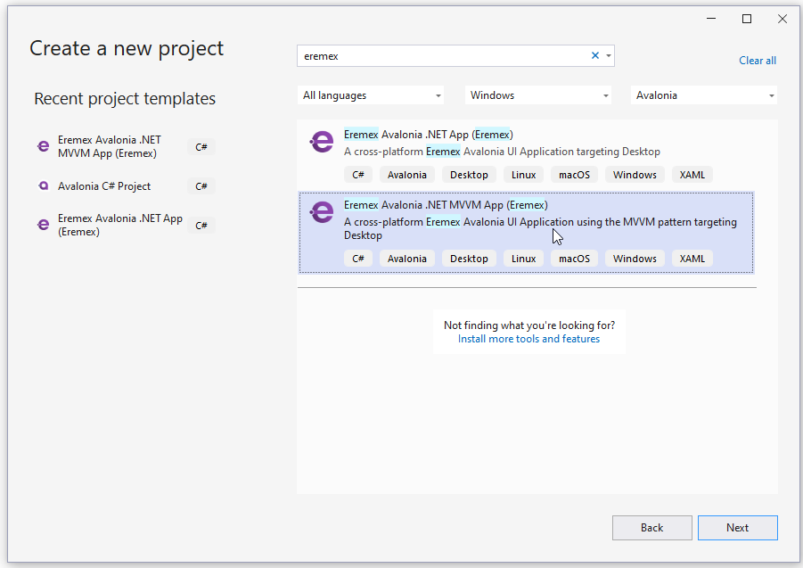

# Get Started With ListView Control

[ListViewControl](listview-overview.md)  allows you to display a list of items in a single or multiple columns. The control supports item sorting, grouping, filtering and multiple selection. 


<!-- TODO
Поставить точку останова в MainWindowViewModel на строке
focusedItem = value;
После этого, селекшн не снимается с предыдущего выделенного айтема при выборе нового айтема
 -->

This tutorial shows how to use the `ListViewControl` control to implement a list of items, and sort and group the items by item properties. 


The ListView control can be populated with items from an item source. To render bound items, you need to provide an item template. When using the ListView control, you can create complex item templates that consist of multiple fields.
This example creates an item template that defines a border with an SVG image and text blocks inside.

## Create a New Application
Create a new [Eremex Avalonia .NET MVVM Application](../../get-started/index.md). Name it _ListView-example_.



To display SVG images, add the `Avalonia.Svg.Skia` NuGet package to the project.

## Define an Item Source

In the _MainWindowViewModel.cs_ file, create the _ItemViewModel_ class, which encapsulates an item object. 

``` cs
public partial class ItemViewModel : ObservableObject
{
    [ObservableProperty] private int invoiceId;
    [ObservableProperty] private string shipCountry;
    [ObservableProperty] private DateTime date;
    [ObservableProperty] private IImage flag;

    public ItemViewModel(int id, string shipCountry, IImage flag)
    {
        InvoiceId = id;
        ShipCountry = shipCountry;
        Random random = new Random();
        Date = new DateTime(DateTime.Now.Year, random.Next(1, 12), random.Next(1, 28));
        Flag = flag;
    }
}
```

The _InvoiceId_, _Date_ and _Flag_ properties exposed by the _ItemViewModel_ class contain values to display in ListView items. The _ItemViewModel.ShipCountry_ property specifies a shipping country associated with an item. ListView items will be grouped by this property.

Create and initialize the _Items_ collection in the _MainWindowViewModel_ class, as demonstrated below. The following code populates the _Items_ collection with three sets of items. Each item set is associated with its own shipping country (_China_, _Brazil_ and _India_).

``` cs
using CommunityToolkit.Mvvm.ComponentModel;
using Avalonia.Svg.Skia;
using Eremex.AvaloniaUI.Controls.Utils;

public partial class MainWindowViewModel : ViewModelBase
{
    [ObservableProperty] 
    private List<ItemViewModel> items;

    public MainWindowViewModel()
    {
        SvgImage chinaFlag = ImageLoader.LoadSvgImage(Assembly.GetExecutingAssembly(), "Assets/china-flag.svg");
        SvgImage indiaFlag = ImageLoader.LoadSvgImage(Assembly.GetExecutingAssembly(), "Assets/india-flag.svg");
        SvgImage brazilFlag = ImageLoader.LoadSvgImage(Assembly.GetExecutingAssembly(), "Assets/brazil-flag.svg");

        Random random = new Random();
        Items = new List<ItemViewModel>();
        for (int i = 1; i < 10; i++)
        {
            Items.Add(new ItemViewModel(random.Next(500), "China", chinaFlag));
        }
        
        for (int i = 1; i < 5; i++)
        {
            Items.Add(new ItemViewModel(random.Next(500), "Brazil", brazilFlag));
        }

        for (int i = 1; i < 8; i++)
        {
            Items.Add(new ItemViewModel(random.Next(500), "India", indiaFlag));
        }
    }
}
```

The `Eremex.AvaloniaUI.Controls.Utils.ImageLoader.LoadSvgImage` method is used to load SVG images stored in a specific folder of the current project. It is assumed that the SVG images are placed in the _Assets_ folder, and they have their `Build Action` property set to `AvaloniaResource`. Ensure that the `Avalonia.Svg.Skia` package is included to the project.

## Create a ListView Control

Open the _MainWindow.axaml_ file, and define a `ListViewControl` component in XAML.

``` xml
xmlns:mxlv="https://schemas.eremexcontrols.net/avalonia/listview"

<mxlv:ListViewControl Name="listViewControl1">
</mxlv:ListViewControl>
```

## Bind the ListView to an Item Collection

Ensure that the Main Window's DataContext and thus the ListView's DataContext is set to a _MainWindowViewModel_ object. See the _App.axaml.cs_ file which assigns a DataContext to the Main Window.

Bind the ListView to a collection of items defined in the _MainWindowViewModel_ class using the `ListViewControl.ItemsSource` property.

``` xml
<mxlv:ListViewControl Name="listViewControl1" ItemsSource="{Binding Items}">
</mxlv:ListViewControl>
```

## Define an Item Template

There is no default rendering for items in the ListView control. To render items in a specific manner, specify an item template from the `ListViewControl.ItemTemplate` property.

In the code below, an item template defines a bordered Grid object with two text blocks and an image inside. The text blocks display values of the _ItemViewModel.InvoiceId_ and _ItemViewModel.Date_ properties, respectively. The Image control is bound to the __ItemViewModel.Flag_ property which stores an SVG image. 


``` xml
<mxlv:ListViewControl Name="listViewControl1" ItemsSource="{Binding Items}">
    <mxlv:ListViewControl.ItemTemplate>
        <DataTemplate DataType="vm:ItemViewModel">
            <Border BorderBrush="DarkGray" BorderThickness="1">
                <Grid RowDefinitions="2*, *" Margin="3">
                    <TextBlock Text="{Binding InvoiceId, StringFormat={}Invoice: {0}}" HorizontalAlignment="Center" VerticalAlignment="Center"/>
                    <DockPanel Grid.Row="1" VerticalAlignment="Center">
                        <TextBlock Text="{Binding Date, StringFormat=yyyy-MM-dd}" FontSize="8" DockPanel.Dock="Left"/>
                        <Image Width="20"  DockPanel.Dock="Right" Source="{Binding Flag}"/>
                    </DockPanel>
                </Grid>
            </Border>
        </DataTemplate>
    </mxlv:ListViewControl.ItemTemplate>
</mxlv:ListViewControl>
```

## Specify Item Size

The ListView control calculates the default item size from the first item and applies it to other items. Thus, all ListView items have the same display size.

If the default item size does not meet your needs, you can use the `ListViewControl.ItemWidth` and `ListViewControl.ItemHeight` properties to specify a custom item size. The code below applies a custom item size to ListView items.

``` xml
<mxlv:ListViewControl Name="listViewControl1" ItemsSource="{Binding Items}" 
    ItemHeight="70" ItemWidth="100">
```


## Group Items

You can sort and/or group ListView elements by an unlimited number of item properties. When you group by a property, 
group rows that combine items are created. Take note that group rows are automatically sorted by a group property. 


The `ListViewControl.SortInfo` collection defines item properties used to sort and group items. 
To group items, do the following:

- Add a `ListViewSortInfo` object(s) to the `ListViewControl.SortInfo` collection. Set the `ListViewSortInfo.FieldName` member to the item property by which to group items. Optionally, use the `ListViewSortInfo.SortDirection` property to choose between ascending and descending sort order, in which group rows are arranged.
- Set the `ListViewControl.GroupCount` property to the number of group levels (group properties). `ListViewControl.GroupCount` specifies how many `ListViewSortInfo` objects starting from the beginning of the `ListViewControl.SortInfo` collection are used to group data. If you group by one property, set `GroupCount` to `1`. If you group by two properties, set `GroupCount` to `2`, and so on.

The following code implements item grouping by the _ShipCountry_ property:

``` xml
<mxlv:ListViewControl Name="listViewControl1" ItemsSource="{Binding Items}" 
        ItemHeight="40" ItemWidth="60"
        GroupCount="1">
    <mxlv:ListViewControl.SortInfo>
        <mxlv:ListViewSortInfo FieldName="ShipCountry" SortDirection="Ascending" />
    </mxlv:ListViewControl.SortInfo>
    <!-- ... -->
</mxlv:ListViewControl>
```

## Sort Items

Let's sort items in each group by the _Date_ item property in descending order. For this purpose, add a new `ListViewSortInfo` object to the `ListViewControl.SortInfo` collection, and set its `ListViewSortInfo.FieldName` and `ListViewSortInfo.SortDirection` members to corresponding values.

``` xml
<mxlv:ListViewControl.SortInfo>
    <mxlv:ListViewSortInfo FieldName="ShipCountry" SortDirection="Ascending" />
    <mxlv:ListViewSortInfo FieldName="Date" SortDirection="Descending" />
</mxlv:ListViewControl.SortInfo>
```

Since the `ListViewControl.GroupCount` property is set to `1`, the first `ListViewSortInfo` object in the `ListViewControl.SortInfo` collection specifies the field used to group data. The second `ListViewSortInfo` object refers to the field used only to sort data.

## Select Item Arrangement Mode

ListView supports two item arrangement modes, which you can choose with the `ListViewControl.ItemLayoutMode` property:

- `ListViewItemLayoutMode.Wrap` (default) — Items are arranged across then down. They are automatically wrapped at the control's right edge, creating multiple lines.

    

- `ListViewItemLayoutMode.Stack` — Items are arranged in a vertical list. They are stretched to fit the LayoutView's width.

    

In this tutorial, we'll stick to the default `Wrap` layout mode.


## Obtain Focused (Selected) Item

When a user clicks a specific item with the mouse or keyboard in single item selection mode, the focused item changes. You can use the `ListViewControl.FocusedItem` or `ListViewControl.FocusedItemIndex` property to identify the focused item.

The following code defines the _FocusedItem_ property in the main View Model, and binds the `ListViewControl.FocusedItem` member to this property.

```cs
//MainWindowViewModel.cs
public partial class MainWindowViewModel : ViewModelBase
{
    //...
    ItemViewModel focusedItem;
    ItemViewModel FocusedItem {
        get {
            return focusedItem;
        }
        set
        {
            if (value != focusedItem)
            {
                focusedItem = value;
                // Perform actions when the focused item changes.
            }
        }
    }
}
```

```xml
<!-- MainWindow.axaml -->
<mxlv:ListViewControl Name="listViewControl1" ItemsSource="{Binding Items}"
                      ItemHeight="70" ItemWidth="100"
                      GroupCount="1"
                      FocusedItem="{Binding FocusedItem, Mode=TwoWay}"
                      >
```

To allow multiple items to be selected simultaneously, set the `ListViewControl.SelectionMode` property to `Multiple`. In this case, you can retrieve selected items from the `ListViewControl.SelectedItems` collection.

## Result

You can build and run the application to see the following result:


## Complete Code

_MainWindow.axaml_:

``` xml 
<mx:MxWindow xmlns="https://github.com/avaloniaui"
        xmlns:x="http://schemas.microsoft.com/winfx/2006/xaml"
        xmlns:vm="using:ListView_example.ViewModels"
        xmlns:d="http://schemas.microsoft.com/expression/blend/2008"
        xmlns:mc="http://schemas.openxmlformats.org/markup-compatibility/2006"
        xmlns:mx="https://schemas.eremexcontrols.net/avalonia"
        mc:Ignorable="d" d:DesignWidth="800" d:DesignHeight="450"
        x:Class="ListView_example.Views.MainWindow"
        x:DataType="vm:MainWindowViewModel"
        Icon="/Assets/EMXControls.ico"
        Title="ListView_example"
        xmlns:mxlv="https://schemas.eremexcontrols.net/avalonia/listview"
        >

    <Design.DataContext>
        <!-- This only sets the DataContext for the previewer in an IDE,
             to set the actual DataContext for runtime, set the DataContext property in code (look at App.axaml.cs) -->
        <vm:MainWindowViewModel/>
    </Design.DataContext>
    <Border BorderBrush="LightGray" BorderThickness="1" Margin="5">
        <mxlv:ListViewControl Name="listViewControl1" ItemsSource="{Binding Items}"
                              ItemHeight="70" ItemWidth="100"
                              GroupCount="1"
                              FocusedItem="{Binding FocusedItem, Mode=TwoWay}" SelectionMode="Multiple" SelectedItems=""
                              >
            <mxlv:ListViewControl.SortInfo>
                <mxlv:ListViewSortInfo FieldName="ShipCountry" SortDirection="Ascending" />
                <mxlv:ListViewSortInfo FieldName="Date" SortDirection="Descending" />
            </mxlv:ListViewControl.SortInfo>

            <mxlv:ListViewControl.ItemTemplate>
                <DataTemplate DataType="vm:ItemViewModel">
                    <Border BorderBrush="DarkGray" BorderThickness="1">
                        <Grid RowDefinitions="2*, *" Margin="3">
                            <TextBlock Text="{Binding InvoiceId, StringFormat={}Invoice: {0}}" HorizontalAlignment="Center" VerticalAlignment="Center"/>
                            <DockPanel Grid.Row="1" VerticalAlignment="Center">
                                <TextBlock Text="{Binding Date, StringFormat=yyyy-MM-dd}" FontSize="8" DockPanel.Dock="Left"/>
                                <Image Width="20"  DockPanel.Dock="Right" Source="{Binding Flag}"/>
                            </DockPanel>
                        </Grid>
                    </Border>
                </DataTemplate>
            </mxlv:ListViewControl.ItemTemplate>
        </mxlv:ListViewControl>
    </Border>
</mx:MxWindow>
```

_MainWindowViewModel.cs_:

``` cs
using Avalonia.Media;
using Avalonia.Svg.Skia;
using CommunityToolkit.Mvvm.ComponentModel;
using Eremex.AvaloniaUI.Controls.ListView;
using Eremex.AvaloniaUI.Controls.Utils;
using System;
using System.Collections.Generic;
using System.Reflection;
using System.Xml.Linq;

namespace ListView_example.ViewModels;

public partial class MainWindowViewModel : ViewModelBase
{
    [ObservableProperty] 
    private List<ItemViewModel> items;

    public MainWindowViewModel()
    {
        SvgImage chinaFlag = ImageLoader.LoadSvgImage(Assembly.GetExecutingAssembly(), "Assets/china-flag.svg");
        SvgImage indiaFlag = ImageLoader.LoadSvgImage(Assembly.GetExecutingAssembly(), "Assets/india-flag.svg");
        SvgImage brazilFlag = ImageLoader.LoadSvgImage(Assembly.GetExecutingAssembly(), "Assets/brazil-flag.svg");

        Random random = new Random();
        Items = new List<ItemViewModel>();
        for (int i = 1; i < 10; i++)
        {
            Items.Add(new ItemViewModel(random.Next(500), "China", chinaFlag));
        }

        for (int i = 1; i < 5; i++)
        {
            Items.Add(new ItemViewModel(random.Next(500), "Brazil", brazilFlag));
        }

        for (int i = 1; i < 8; i++)
        {
            Items.Add(new ItemViewModel(random.Next(500), "India", indiaFlag));
        }

        // Set focus to the first item in the item collection.
        focusedItem = Items[0];
    }

    ItemViewModel focusedItem;
    ItemViewModel FocusedItem {
        get {
            return focusedItem;
        }
        set
        {
            if (value != focusedItem)
            {
                focusedItem = value;
                // Perform actions when the focused item changes.
            }
        }
    }
}

public partial class ItemViewModel : ObservableObject
{
    [ObservableProperty] private int invoiceId;
    [ObservableProperty] private string shipCountry;
    [ObservableProperty] private DateTime date;
    [ObservableProperty] private IImage flag;

    public ItemViewModel(int id, string shipCountry, IImage flag)
    {
        InvoiceId = id;
        ShipCountry = shipCountry;
        Random random = new Random();
        Date = new DateTime(DateTime.Now.Year, random.Next(1, 12), random.Next(1, 28));
        Flag = flag;
    }
}
```

The _*.svg_ images used in this tutorial are placed in the _Assets_ folder of the project. They have their `Build Action` property set to `AvaloniaResource`.