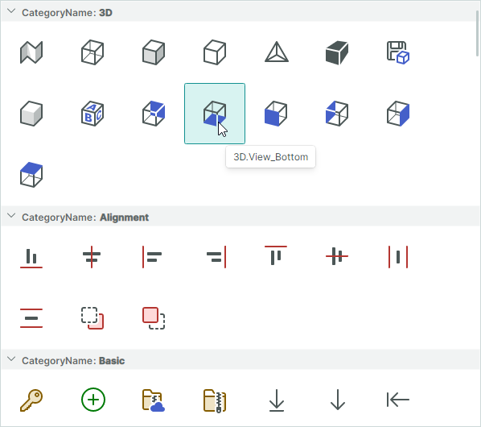

# ListView

`ListViewControl` is an item container that supports various item arrangement layouts, item sorting, grouping, filtering and selection. You can use `ListViewControl` to a create a UI found in the right pane of Microsoft Windows Explorer.

By specifying an item template, you can render ListView items in any custom manner. For instance, a template can tell the ListView to paint items as icons, icons with text, or just text.

The control's main features include:

- Item arrangement in a single column (vertical list) or in multiple columns (with wrapping enabled).
- Support for the MVVM design pattern — You can populate the control with items from an item source.
- Item templates allow you to render items in any custom manner.
- Item sorting — You can sort items against any number of item fields (properties).
- Item grouping — Items that have identical values of certain item fields (properties) are combined into the same groups. As with item sorting, you can group items by one or more fields (properties).
- Group expanding and collapsing.
- Item filtration — Handle a dedicated event to filter items.
- Two item selection modes: single and multiple.
- Using the keyboard to navigate and select items.

See the following topic for more information: [ListView Control Overview](listview-overview.md).