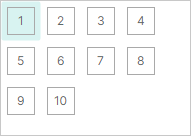
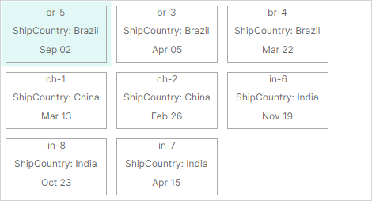
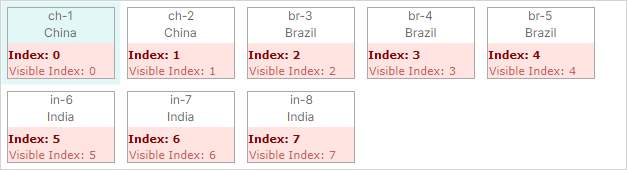

# ListView Control Overview

`ListViewControl` is an advanced control for displaying a list of items in either a single or multiple columns. The control supports various item arrangement layouts, item sorting, grouping, filtering and selection.
You can use ListView to emulate the user interface of Microsoft Windows Explorer's right pane. 

ListView supports the MVVM design pattern to render items. The control retrieves items from a bound item source and renders them using a specified item template. You need to define a template to paint items the way you want. For instance, a template can tell the ListView to paint items as icons, icons with text, or just text.


 

## Get Started

- [Get Started with ListView Control](get-started-with-listview.md)

## Supply Items to ListView

Use the `ListViewControl.ItemsSource` property to bind the control to a collection of objects that will be rendered as ListView items. 

### Item Template

To render items in a specific manner, specify an item template with the `ListViewControl.ItemTemplate` property. ListView does not render its items without this template.

**ItemTemplate's DataContext**: An item object from the `ListViewControl.ItemsSource` collection.

### Example 

The following example populates a ListView with items from the _SvgIconsBrowserViewModel.Categories_ collection and defines a template to render the items. See the _SVG Icons Browser_ module for the complete code of this example.


The _SvgIconCategoryViewModel_ class in the code below encapsulates items in the bound item collection. 
A ListView item template consists of a check box followed by a text field. The check and text boxes are bound to the _SvgIconCategoryViewModel.IsChecked_ and _SvgIconCategoryViewModel.DisplayName_ properties, respectively.


``` xml
<mxlv:ListViewControl ItemLayoutMode="Stack" ItemHeight="28" ItemsSource="{Binding Categories}" >
    <mxlv:ListViewControl.ItemTemplate>
        <DataTemplate DataType="vm:SvgIconCategoryViewModel">
            <Grid ColumnDefinitions="Auto, *">
                <CheckBox IsChecked="{Binding IsChecked}" Margin="0,0,4,0" VerticalAlignment="Center"/>
                <TextBlock Grid.Column="1" Text="{Binding DisplayName}" VerticalAlignment="Center"/>
            </Grid>
        </DataTemplate>
    </mxlv:ListViewControl.ItemTemplate>
</mxlv:ListViewControl>
```
``` cs
public partial class SvgIconsBrowserViewModel : PageViewModelBase
{
    [ObservableProperty] private List<SvgIconCategoryViewModel> categories;
    //...
}

public partial class SvgIconCategoryViewModel : ObservableObject, IComparable<SvgIconCategoryViewModel>, IComparable
{
    [ObservableProperty] private bool isChecked;
    [ObservableProperty] private string name;
    [ObservableProperty] private string displayName;
    [ObservableProperty] private bool isExpanded;
    //...
}
```

## Item Arrangement

The ListView control supports two item arrangement modes: `Wrap` (default) and `Stack`. Use the `ListViewControl.ItemLayoutMode` property to choose the required layout.

### _Wrap_ Layout

Set the `ListViewControl.ItemLayoutMode` property to `ListViewItemLayoutMode.Wrap` to arrange items across then down. Items are automatically wrapped at the control's right edge, creating multiple lines.




All items have one size. The default item size is calculated from the first item's data according to the specified template (`ListViewControl.ItemTemplate`).
You can use the `ListViewControl.ItemWidth` and `ListViewControl.ItemHeight` properties to specify custom item size for the ListView. 

### _Stack_ Layout

Set the `ListViewControl.ItemLayoutMode` property to `ListViewItemLayoutMode.Stack` to arrange items in a vertical list. Items are stretched to fit the LayoutView's width.


In `Stack` layout mode, you can use the `ListViewControl.ItemHeight` property to specify a custom item height.

## Sort Items

You can sort ListView items by one or more item properties in ascending or descending order. To sort items, add a `ListViewSortInfo` object(s) to the `ListViewControl.SortInfo` collection. This collection is also used to define item [grouping](#group-items).

A `ListViewSortInfo` object contains the following properties to customize sort settings:

- `ListViewSortInfo.FieldName` — Specifies an item's property by which ListView items are sorted.
- `ListViewSortInfo.SortDirection` — Specifies the order in which ListView items are sorted. The default sort order is ascending.

### Example - Sort Items

The following example sorts items by their _ShipCountry_ and _Date_ properties. The control first sorts the items by the _ShipCountry_ property in ascending order, organizing them into subsets with the same shipping country. Then, the control sorts the items within each item subset by the _Date_ property in descending order.



``` xml
<mxlv:ListViewControl Name="listViewControl1" ItemsSource="{Binding Items}" >
    <mxlv:ListViewControl.SortInfo>
        <mxlv:ListViewSortInfo FieldName="ShipCountry" SortDirection="Ascending" />
        <mxlv:ListViewSortInfo FieldName="Date" SortDirection="Descending"/>
    </mxlv:ListViewControl.SortInfo>
</mxlv:ListViewControl>
```

``` cs
public partial class MainWindowViewModel : ViewModelBase
{
    [ObservableProperty] 
    private List<ItemViewModel> items;
    //...
}

public partial class ItemViewModel : ObservableObject
{
    [ObservableProperty] private int invoiceId;
    [ObservableProperty] private string shipCountry;
    [ObservableProperty] private DateTime date;
    //...
}
```


## Group Items

Grouping allows you to combine items with identical values into the same expandable groups. 

For instance, if an item object contains the _ShipCountry_ property you can group by this property to get the following result:


A group row precedes each group of items. Group rows display group property names and values. A user can click a group row's collapse/expand button to hide/show the contents of the group.

Note that when you group by a property, the group rows are automatically sorted by the group property. In code, you can choose between ascending and descending order of group rows when you apply grouping.

To group by an item property or properties, do the following:

- Add a `ListViewSortInfo` object(s) at the beginning of the `ListViewControl.SortInfo` collection. 
Set `ListViewSortInfo.FieldName` to the item property by which to group items. Optionally, use `ListViewSortInfo.SortDirection` to choose between ascending and descending sort order, in which group rows are arranged.

- Set the `ListViewControl.GroupCount` property to the number of group levels (group properties). 
`ListViewControl.GroupCount` specifies how many `ListViewSortInfo` objects starting from the beginning of the `ListViewControl.SortInfo` collection are used to group data. If you group by a single item property, set `ListViewControl.GroupCount` to _1_. To group by two properties, set `ListViewControl.GroupCount` to 2, and so on.

The `ListViewControl.SortInfo` collection may contain more elements than `ListViewControl.GroupCount`. The first elements whose number is specified by `GroupCount` are used to group ListView items. The remaining elements are used to sort ListView items.

### Example - Group Items

Assume that an item object contains the _ShipCountry_ property. To group by this property, a `ListViewSortInfo` object that refers to the _ShipCountry_ property needs to be placed at the beginning of the `ListViewControl.SortInfo` collection. The `ListViewControl.GroupCount` property must be set to `1`.


``` xml
<mxlv:ListViewControl Name="lv" ItemsSource="{Binding Items}" ItemHeight="40" ItemWidth="40" 
                      ItemLayoutMode="Wrap"                        
                      GroupCount="1">
    <mxlv:ListViewControl.SortInfo>
        <mxlv:ListViewSortInfo FieldName="ShipCountry" SortDirection="Ascending" />
    </mxlv:ListViewControl.SortInfo>
</mxlv:ListViewControl>
```

``` cs
public partial class MainWindowViewModel : ViewModelBase
{
    [ObservableProperty] 
    private List<ItemViewModel> items;
}

public partial class ItemViewModel : ObservableObject
{
    [ObservableProperty] private int invoiceId;
    [ObservableProperty] private string shipCountry;
    [ObservableProperty] private DateTime date;
    [ObservableProperty] private IImage flag;
    //...
}
```


### Custom Group Row Template

If the default group row template does not meet your needs, you can use the `ListViewControl.GroupTemplate` property to specify a custom DataTemplate to paint group rows.  

**GroupTemplate's DataContext**: `Eremex.AvaloniaUI.Controls.ListView.Data.ListViewGroupData` object

A `ListViewGroupData` object stored in the template's DataContext exposes the following properties, which help you obtain information about group rows and set up the group row template:

- `ListViewGroupData.FieldName` — The name of the group property.
- `ListViewGroupData.GroupValue` — The value of the group property.
- `ListViewGroupData.GroupValueDisplayText` — The text representation of the group property's value. You can provide a custom display text for a group value by handling the `ListViewControl.CustomGroupValueDisplayText` event.
- `ListViewGroupData.IsExpanded` — Specifies whether the group is expanded or collapsed.
- `ListViewGroupData.Level` — The group level of the group. For group rows at the root level, the `ListViewGroupData.Level` property returns `0`. For group rows at the second level, the `ListViewGroupData.Level` property returns `1`, and so on.

A custom template may require a different group row height. You can set a custom group row height with the `ListViewControl.GroupHeight` property.

#### Example - Custom Group Row Template

The following example defines a custom group row template using the `ListViewControl.GroupTemplate` property. The template consists of a text block that displays a group value, and an image control that displays an SVG image associated with a group row.


The example assumes that the project contains the _brazil-flag.svg_ and _china-flag.svg_ images in the _Assets_ folder. All images should have the _Build Action_ property set to _AvaloniaResource_. To read images from the files, the code below uses the `Eremex.AvaloniaUI.Controls.Utils.ImageLoader` helper class.


``` xml
xmlns:mxlv="https://schemas.eremexcontrols.net/avalonia/listview"
xmlns:mxlvd="using:Eremex.AvaloniaUI.Controls.ListView.Data"
xmlns:vm="using:ListView_example.ViewModels"

<mxlv:ListViewControl Name="listViewControl1" ItemsSource="{Binding Items}" 
                      ItemHeight="70" ItemWidth="100"
                      GroupCount="1"
                      GroupHeight="40">
    <mxlv:ListViewControl.SortInfo>
        <mxlv:ListViewSortInfo FieldName="ShipCountry" SortDirection="Ascending" />
    </mxlv:ListViewControl.SortInfo>
    <mxlv:ListViewControl.GroupTemplate>
        <DataTemplate DataType="mxlvd:ListViewGroupData">
            <StackPanel Orientation="Horizontal" >
                <Image Height="20" 
                  Source="{Binding GroupValue, Converter={vm:CountryNameToFlagConverter}}}" 
                  Margin="0,0,5,0" VerticalAlignment="Center"/>
                <TextBlock Text="{Binding GroupValueDisplayText}" VerticalAlignment="Center"/>
            </StackPanel>
        </DataTemplate>
    </mxlv:ListViewControl.GroupTemplate>
```

``` cs
using Eremex.AvaloniaUI.Controls.Utils;

namespace ListView_example.ViewModels;

public class CountryNameToFlagConverter : MarkupExtension, IValueConverter
{
    public object? Convert(object? value, Type targetType, object? parameter, CultureInfo culture)
    {
        if (value == null)
            return null;
        string countryName = ((string)value).ToLower();
        return ImageLoader.LoadSvgImage(Assembly.GetExecutingAssembly(), $"Assets/{countryName}-flag.svg");
    }

    public object? ConvertBack(object? value, Type targetType, object? parameter, CultureInfo culture)
    {
        throw new NotImplementedException();
    }

    public override object ProvideValue(IServiceProvider serviceProvider)
    {
        return this;
    }
}
```


### Custom Group Value Text

Group rows display the text representation of group values, by default. You can handle the `ListViewControl.CustomGroupValueDisplayText` event to override the display text of group values. This event fires repeatedly for each group row.

### Identify Group Rows

ListView items and group rows can be identified by **indexes**. Group rows are assigned negative indexes, while items have non-negative indexes. Besides indexes, you can identify group rows by group values.


See the following section for more details: [Identify and Get Items and Group Rows](#identify-and-get-items-and-group-rows).


### Grouping Related API

- `ListViewControl.GroupHeight` — Specifies the group row height.
- `ListViewControl.GroupLevelIndent` — Specifies the indent before nested group rows (at the second and lower levels).
- `ListViewControl.AutoExpandAllGroups` — Allows you to disable automatic expansion of group rows on the control's load.
- `ListViewControl.CollapseAllGroups` — Collapses all group rows.
- `ListViewControl.CollapseGroup` — Collapses a specific group row.
- `ListViewControl.ExpandAllGroups` — Expands all group rows.
- `ListViewControl.ExpandGroup` — Expands a specific group row.
- `ListViewControl.IsGroupExpanded` — Returns whether a specific group is expanded.

See also: [Methods to Traverse Through Group Rows and Their Children](#methods-to-traverse-through-group-rows-and-their-children).


<!-- TODO
string GroupClass/ItemClass -->

## Filter Items

Handle the `ListViewControl.FilterItem` event to dynamically customize visibility of certain ListView items. This event fires repeatedly for each item in the `ListViewControl.ItemsSource` collection. To hide a specific item, set the `e.Visible` event parameter to `false`.

If item filtering rules are dynamically changed in your application, you may need to forcibly reinvoke the item filtering mechanism and thus the `ListViewControl.FilterItem` event. To do this, call the `ListViewControl.RefreshData` method.

### Example

The following example from the _SVG Icons Browser_ module hides items according to a specific condition.

``` xml
<mxlv:ListViewControl x:Name="IconsListControl" 
    FilterItem="ListViewControl_OnFilterItem">
```

``` cs
private void ListViewControl_OnFilterItem(object sender, ListViewFilterEventArgs e)
{
    ((SvgIconsBrowserViewModel)DataContext)?.OnCustomFilter(e);
}

public partial class SvgIconsBrowserViewModel : PageViewModelBase
{
    public void OnCustomFilter(ListViewFilterEventArgs e)
    {
        SvgIconViewModel vm = (SvgIconViewModel)e.Item;
        e.Visible = vm.Category.IsChecked && (string.IsNullOrEmpty(SearchText) || vm.Name.Contains(SearchText, StringComparison.OrdinalIgnoreCase));
    }
}
```

## Identify and Get Items and Group Rows

ListView assigns **indexes** to ListView items and group rows to allow their identification.


- Indexes reflect the order of items and group rows.
- Items are numbered using zero-based non-negative indexes. The topmost item has an index of **0**, the second item has an index of **1**, and so on.
- Group rows are numbered using negative indexes. The top group row has an index of **-1**, the second group row has an index of **-2**, and so on.
- Indexes are used to identify both visible and hidden (within collapsed groups) items.
- When the order of items changes (for example, when data is sorted or grouped), items are given new indexes according to their new positions.
- Indexes are not assigned to items that are hidden due to data filtering.

When items are not grouped, indexes match visible indexes:



When items are grouped, indexes and visible indexes do not match:


### Special Indexes

ListView reserves the following predefined index to identify invalid items:

- `ListViewControl.InvalidItemIndex` constant — Identifies an item that does not exist in the ListView control. This value may be returned by ListView methods used to obtain item indexes.

For instance, items at the root level have no parents. If you try to get a parent of a root item with the `ListViewControl.GetParentItemIndex` method, this method returns the `ListViewControl.InvalidItemIndex` constant.

### Source Items and Source Item Indexes

Each ListView item corresponds to a specific business object in the bound item source (`ListViewControl.ItemsSource`). An item's position in the item source is called **source item index**.

You can use the following methods to obtain an underlying source item and source item index. 

- `ListViewControl.GetSourceItemIndexByItemIndex`
- `ListViewControl.GetSourceItemIndexByVisibleItemIndex`

<!-- TODO
не хватает методов
- `GetSourceItemByRowIndex`
- `GetSourceItemByVisibleRowIndex` 
issue=MX-253
 -->

To perform the opposite conversion of indexes, see the following methods:

- `ListViewControl.GetItemIndexBySourceItemIndex`
- `ListViewControl.GetVisibleItemIndexBySourceItemIndex`


Source item indexes are zero-based. When you sort, group or filter items, their source item indexes do not change.

Group rows do not have corresponding items in the item source, so they cannot be addressed using source items and source item indexes.


### Related API

ListView provides the API members to retrieve items by indexes, and to convert between item indexes, visible item indexes and source item indexes. The following list summarizes this information:

- `ListViewControl.FocusedItemIndex` — Specifies the index of the focused item/group row. This property allows you to focus a specific item or group row.
- `ListViewControl.GetItemIndexBySourceItemIndex` — Returns an item's index by the source item index.
- `ListViewControl.GetItemIndexByVisibleItemIndex` — Returns an item's index by the item's visible index.
- `ListViewControl.GetSourceItemIndexByItemIndex` — Returns the source item index for the item with the specified index.
- `ListViewControl.GetSourceItemIndexByVisibleItemIndex` — Returns the source item index for the item with the specifies visible index.
- `ListViewControl.GetVisibleItemIndexByItemIndex` — Returns the item's visible index by the item's index.
- `ListViewControl.GetVisibleItemIndexBySourceItemIndex` — Returns the item's visible index by the source item index.

#### Methods to Traverse Through Group Rows and Their Children


- `ListViewControl.GetGroupChildItemIndex(int childIndex)` — Returns the index of a specific root group row. The `childIndex` parameter specifies a target root group row's zero-based order among its siblings. This parameter accepts values between `0` and `GetGroupChildrenCount() - 1`.
- `ListViewControl.GetGroupChildItemIndex(int itemIndex, int childIndex)` — Returns the index of a child item or nested group row. The `itemIndex` parameter specifies the parent group row's index. The `childIndex` parameter specified the zero-based order of a target child item or group row among its siblings. This parameter accepts values between `0` and `GetGroupChildrenCount(itemIndex) - 1`.
- `ListViewControl.GetGroupChildrenCount()` — This overload without parameters returns the number of group rows at the root level.
- `ListViewControl.GetGroupChildrenCount(int itemIndex)` — Returns the number of immediate children of a specific group row. The parent group row is identified by its index.

- `ListViewControl.GetGroupIndex` — Returns a group row's index by the row's field name and group value.
- `ListViewControl.GetGroupValue` — Returns a group row's value by the row' index.
- `ListViewControl.GetParentItemIndex` — Returns the index of the parent group row for a nested item or group row. 

!!! note

    The methods above are not in effect if items are not grouped.

## Item Focus 

When a user navigates to a specific item or group row using the keyboard or mouse click, the ListView moves focus to this item/group row. 


You can use the following properties to get/set the focused item/group row in code:

- `ListViewControl.FocusedItem` — Gets or sets a business object from the `ListViewControl.ItemsSource` collection that corresponds to the ListView's focused item. To move focus to a specific item you can assign an object from the `ItemsSource` collection to the `FocusedItem` property.

    !!! note
    
        The `FocusedItem` property returns `null` if a group row is focused. You cannot use this property to focus a group row.

- `ListViewControl.FocusedItemIndex` — Gets or sets the [index](#identify-and-get-items-and-group-rows) of the focused item/group row. You can use the `FocusedItemIndex` property to move focus to an item or group row.

The following code focuses the group row whose _ShipCountry_ field is set to "India".

``` cs
int groupRowindex = listViewControl1.GetGroupIndex("ShipCountry", "India");
if(groupRowindex != ListViewControl.InvalidItemIndex)
    listViewControl1.FocusedItemIndex = groupRowindex;
```


### Example - Respond to Focusing an Item 

The following example binds the `ListViewControl.FocusedItem` property to the _MainWindowViewModel.FocusedItem_ property. You can respond to changes to the focused item in the  _MainWindowViewModel.FocusedItem_ property setter.

``` xml
xmlns:mxlv="https://schemas.eremexcontrols.net/avalonia/listview"

<mxlv:ListViewControl Name="listViewControl1" ItemsSource="{Binding Items}" 
    FocusedItem="{Binding FocusedItem, Mode=TwoWay}">
</mxlv:ListViewControl>
```

``` cs
public partial class MainWindowViewModel : ViewModelBase
{
    ItemViewModel focusedItem;
    ItemViewModel FocusedItem {
        get {
            return focusedItem;
        }
        set
        {
            if (value != focusedItem)
            {
                focusedItem = value;
                // Perform actions when the focused item changes.
            }
        }
    }
}

public partial class ItemViewModel : ObservableObject
{
    //...
}
```


## Multiple Item Selection

ListView allows multiple items and group rows to be selected. To enable this selection mode, set the `ListViewControl.SelectionMode` property to `Multiple`. Selected items and group rows have highlighted background.


- A click on an item selects this item and deselects previously selected items.
- A CTRL-click on an item toggles the item's selected state. 
- A SHIFT-click on an item selects an item range (between the previously focused item and the clicked item).

<!-- TODO
I cannot select items using the keyboard.
 -->


When a user selects an item, this item is also focused (the `ListViewControl.FocusedItem` and `ListViewControl.FocusedItemIndex` properties are updated). 
A subsequent CTRL-click on this item deselects it, but retains focus.


Use the following API members to obtain selected items and group rows:

- `ListViewControl.SelectedItems` — A collection of business objects from the `ListViewControl.ItemsSource` source that correspond to the selected ListView items. The `SelectedItems` collection does not contain selected group rows, as group rows do not correspond to any business object in the `ListViewControl.ItemsSource` source.

- `ListViewControl.GetSelectedIndices` — This method returns an array of [indexes](#identify-and-get-items-and-group-rows) of currently selected items and group rows. Indexes of items are non-negative, while indexes of group rows are negative. See the following section for more details: [Identify and Get Items and Group Rows](#identify-and-get-items-and-group-rows).


The following properties and methods allow you to select items and group rows in code:

- `ListViewControl.SelectedItems` — You can assign your collection of business objects from the `ListViewControl.ItemsSource` source to the `SelectedItems` property to select corresponding ListView items.
- `ListViewControl.SelectAll` — Selects all items and group rows, if any.
- `ListViewControl.SetSelected` — Selects or deselects a specific item or group row.
- `ListViewControl.ToggleSelected` — Toggles the selected state for an item or group row.


To respond to changes to the selection, you can handle the `ListViewControl.SelectionChanged` event. 

<!-- TODO
GetSelectedIndices

selected group rows are not included in the selection
 -->


### Related API

- `ListViewControl.ClearSelection` — Clears the selection.
- `ListViewControl.GetIsSelected` — Returns whether an item is selected.
