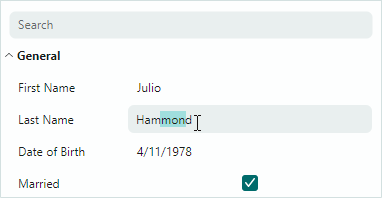

# Custom Editors

`PropertyGrid` supports [in-place editors](data-editing.md) in cells. They are used to display and edit cell values. You can embed custom editors in cells, thus replacing default editors.



Use the following approaches to specify custom editors:

- [Assign an editor directly to a specific row](#assign-an-editor-to-a-row-cell-directly)
- [Dynamically assign editors to rows based on the data type of the row's underlying object](#dynamically-assign-editors-based-on-row-data-type)

 
## Assign an Editor to a Row Cell Directly
 
Use the `PropertyGridRow.CellTemplate` property to assign an editor to a specific row. Do the following to accomplish this task:
 
- Create a DataTemplate object with an editor defined inside the template.
- Assign the DataTemplate to the `PropertyGridRow.CellTemplate` property.
- Bind the editor to the row's bound field explicitly, when required. 
 
The following example shows XAML code that initializes the `CellTemplate` property:
 
``` xml
xmlns:mxpg="https://schemas.eremexcontrols.net/avalonia/propertygrid"
...
<mxpg:PropertyGridControl x:Name="pGrid1" SelectedObject="{Binding}" Grid.Column="1">
    <mxpg:PropertyGridCategoryRow Caption="MyCategory1">
        <mxpg:PropertyGridRow FieldName="Number">
            <mxpg:PropertyGridRow.CellTemplate>
                <DataTemplate>
                    <TextBox Text="{Binding Value}"/>
                </DataTemplate>
            </mxpg:PropertyGridRow.CellTemplate>
        </mxpg:PropertyGridRow>
    </mxpg:PropertyGridCategoryRow>
</mxpg:PropertyGridControl>
```
 
### Implicit Data Binding for Eremex Editors
 
If you use an Eremex editor inside a template, you may omit explicit data binding to a row's bound field for the editor. Ensure that the Eremex editor has the `x:Name` property set to **"PART_Editor"**. In this case, PropertyGrid automatically binds the editor's `EditorValue` property to the row's field. Additionally, PropertyGrid starts to maintain the in-place editor's appearance settings (the borders' visibility and foreground colors in the active and inactive states).
 
``` xml
xmlns:mxpg="https://schemas.eremexcontrols.net/avalonia/propertygrid"
xmlns:mxe="https://schemas.eremexcontrols.net/avalonia/editors"
...
<mxpg:PropertyGridRow FieldName="Caption">
    <mxpg:PropertyGridRow.CellTemplate>
        <DataTemplate>
            <mxe:ButtonEditor x:Name="PART_Editor">
                <mxe:ButtonEditor.Buttons>
                    <mxe:ButtonSettings Content="..."/>
                </mxe:ButtonEditor.Buttons>
            </mxe:ButtonEditor>
        </DataTemplate>
    </mxpg:PropertyGridRow.CellTemplate>
</mxpg:PropertyGridRow>
```
 
### Explicit Data Binding
 
Explicit data binding is required in the following cases:

- You use an editor that is not an Eremex editor. Eremex editors all derive from the `Eremex.AvaloniaUI.Controls.Editors.BaseEditor` class.
- You need to specify a custom value converter in the data binding expression.
 
```xml
<DataTemplate DataType="pepa:Color">
    <mxe:PopupColorEditor x:Name="PART_Editor" 
     EditorValue="{Binding Value, Converter={ecadpg:EcadColorToAvaloniaColorConverter}}"/>
</DataTemplate>
```
 
## Dynamically Assign Editors Based on Row Data Type
 
The PropertyGrid control can automatically assign templates to row cells based on the data type of the row's bound field. Use the `PropertyGridControl.CellTemplate` property for this purpose.
 
The following example associates a TextEditor (paints values in green) with rows bound to Integer fields:
 
```xml
xmlns:sys="clr-namespace:System;assembly=mscorlib"
xmlns:mxpg="https://schemas.eremexcontrols.net/avalonia/propertygrid"
...
<mxpg:PropertyGridControl.CellTemplate>
    <DataTemplate DataType="sys:Int32">
        <mxe:TextEditor x:Name="PART_Editor1" EditorValue="{Binding Value}" Foreground="Green"/>
    </DataTemplate>
</mxpg:PropertyGridControl.CellTemplate>
```
 
Use the following approach if you have a list of DataTemplate objects associated with different data types, and want to assign this list to the PropertyGrid control:
 
- Create a custom class in code-behind that locates a DataTemplate based on the data type, and creates a control associated with this data type, as follows:
 
    ```csharp
    using Avalonia.Collections;
    using Avalonia.Controls.Templates;

    namespace AvaloniaApplication1.Views;

    public class CellTemplateLocator : AvaloniaList<IDataTemplate>, IDataTemplate
    {
        public Control Build(object? param)
        {
            return this.First(x => x.Match(param)).Build(param);
        }

        public bool Match(object? data)
        {
            return this.Any(x => x.Match(data));
        }
    }
    ```
    
    !!! tip
        The _data_ parameter of the `Match` method specifies a target cell template's value. The _data_ parameter's contains the bound property's value by default. You can handle the `CustomCellTemplateData` event to supply a custom object as the cell template's value. The specified custom object will be passed to the `Match` method.

- Initialize the `PropertyGridControl.CellTemplate` property with a *CellTemplateLocator* object.
- Populate the *CellTemplateLocator* object with DataTemplate objects associated with your data types.
 
The following example defines two DataTemplate objects associated with the String and Integer data types, respectively.

```xml
xmlns:sys="clr-namespace:System;assembly=mscorlib"
xmlns:local="clr-namespace:AvaloniaApplication1.Views"

<mxpg:PropertyGridControl.CellTemplate>
    <local:CellTemplateLocator>
        <DataTemplate DataType="sys:String">
            <mxe:TextEditor x:Name="PART_Editor" EditorValue="{Binding Value}" Foreground="Red"/>
        </DataTemplate>
        <DataTemplate DataType="sys:Int32">
            <mxe:TextEditor x:Name="PART_Editor1" EditorValue="{Binding Value}" Foreground="Green"/>
        </DataTemplate>
    </local:CellTemplateLocator>
</mxpg:PropertyGridControl.CellTemplate>
```

## See Also

- [Data Editing](data-editing.md)